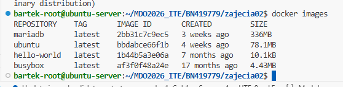
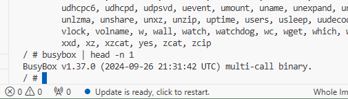
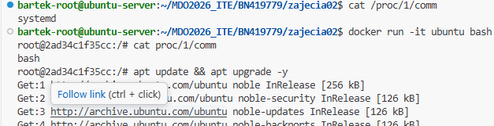
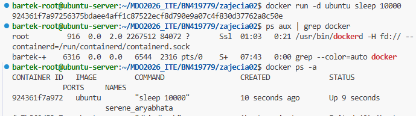
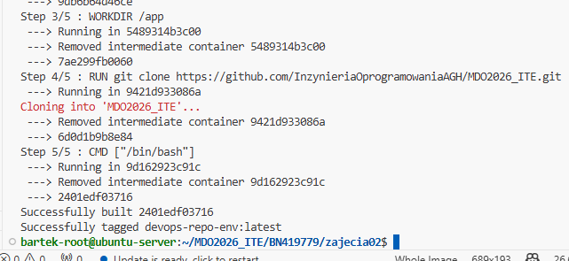
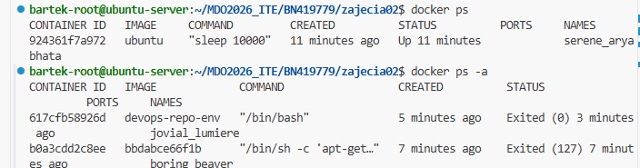

# Sprawozdanie 2
Bartłomiej Nosek 
---
### Cel ćwiczenia
Zapoznanie się z dockerem, tworzenie pierwszych obrazów i kontenerów  

### Przebieg laboratoriów
- instalacja dockera `sudo apt install docker.io -y`  
- pobieranie testowych obrazów  
- uruchamianie i budowania kontenerów `docker build -t devops-repo-env .` i `docker run -it devops-repo-env`
- system w kontenerze  
- utworzenie pliku dockerfile  
```console
FROM ubuntu

RUN apt-get update && \
 apt-get install -y git

WORKDIR /app

RUN git clone https://github.com/InzynieriaOprogramowaniaAGH/MDO2026_ITE.git

CMD ["/bin/bash"]
```
  ## Zrzuty ekranu:








