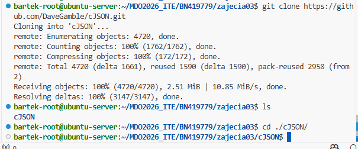
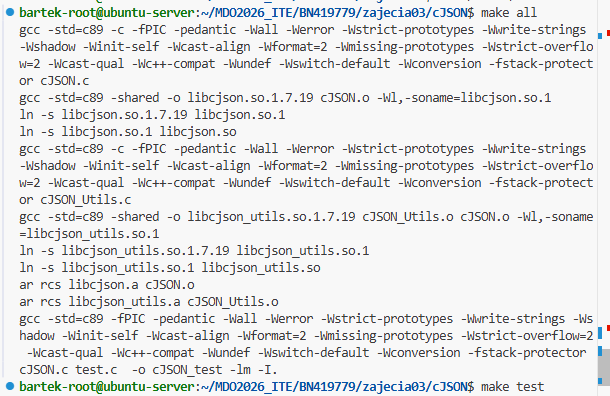
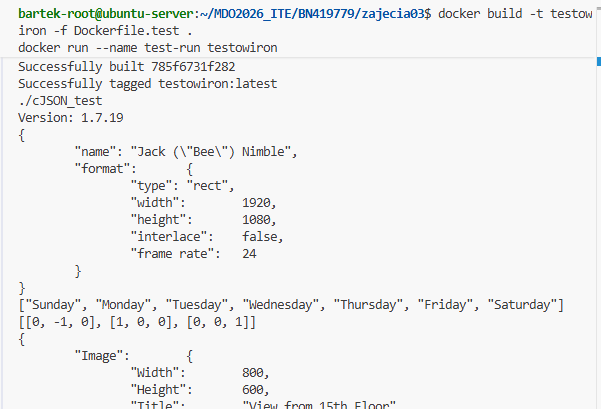
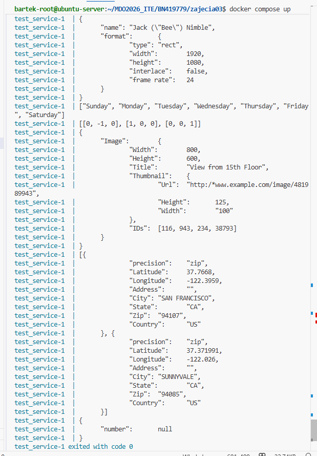

# Sprawozdanie 3
Bartłomiej Nosek 
---
### Cel ćwiczenia
Zapoznanie się z dockerem 2. Budowanie i uruchamianie programów w  kontenerach i docker compose  

### Przebieg laboratoriów
- instalacja make i gcc `sudo apt install -y git make gcc`  
- klonowanie repo (w moim przypadku cJSON) 'git clone https://github.com/DaveGamble/cJSON.git'   
- uruchamianie kontenerów `docker run -it ubuntu:24.04 bash`  
- utworzenie pliku dockerfile do budowy  
```console
FROM ubuntu

RUN apt-get update && apt-get install -y git make gcc && rm -rf /var/lib/apt/lists/*

WORKDIR /app

RUN git clone https://github.com/DaveGamble/cJSON.git .

RUN make all

```
- utworzenie pliku docker file do testów(nadbudowywuje dockerfile.build)
```console

FROM app-builder:latest
CMD ["make", "test"]

```
- tworzenie docker compose (do automatyzacji obsługi dockera)
``` console
version: '3.8'

services:
  test_service:
    build:
      context: .
      dockerfile: Dockerfile.test
    image: testowiron

```
 ## Dyskusje
1. Czy porgram nadaje się do ciaglego wdrażania?  
Nie, ponieważ cJSON to program narzędziowy, nie uruchamia servera, nie musi działac ciągle. Służy tylko do testów/ buildów. Moze jako api móglby byc użyteczny.  
2. Czy trzeba go oczyszczać po buildzie?  
Tak, ponieważ nasz kontener pobiera gita, make i gcc. Dużo danych więc i dużo podatności na ataki, włamania (zaleznośc od 3d-party aplikacji. Rozwiązaniem byłoby przerzucać tylko skompilowany plik binarny (korzystając np. z multi-stage buildów)  
3. Czy potrzeba *deploy-and-publish*?  
Mając an uwadze profesjonalne środowisko, tak z trzema etapami; dockerfile.build, dockerfile.test i dockerfile.deploy(tylko dal gotowej paczki)

  ## Zrzuty ekranu:







