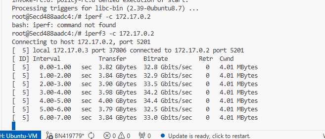

# Sprawozdanie 4
Bartłomiej Nosek
---

### Cel ćwiczenia
Celem było zapoznanie się z Jenkinsem, użytkowanie woluminów, eksponowanie portów  

### Przebieg laboratoriów
- utworzenie obrazu budującego bez Git `Dockerfile.nogit`

```console
FROM ubuntu:24.04
RUN apt-get update && apt-get install -y make gcc && rm -rf /var/lib/apt/lists/*
WORKDIR /input
``` 

- zbudowanie obrazu `build -t builder-nogit -f Dockerfile.nogit .`
- utworzenie 2 woluminów (in, out) `create vol_in oraz docker volume create vol_out`
- używanie kontenera pomocniczego alpine i klon cJSON z labów poprzednich `docker run --rm -v vol_in:/git alpine/git clone https://github.com/DaveGamble/cJSON.git /git/cJSON`
- sprawdzenie stanu na woluminie wyjsciowym `docker run --rm -v vol_out:/output ubuntu ls -la /output`
- używanie iperf3 i testowanie przepustowości (utworzenie sieci) `docker network create my_iperf_net`
- używanie ssh do wejścia do kontenera
- utworzenie sieci dla jenkinsa `docker network create jenkins`
- połaczenie jenkinsa przez port 8080 i wygenerowanie hasła

### Dyskusje
1. **W jaki sposób sklonowano repozytorium na wolumin wejściowy bez użycia Gita w kontenerze bazowym**  
Użyto helper containera bazującego na lekkim obrazie alpine/git. Zamontowano wolumin wejściowy do tego kontenera, wykonano klonowanie. Po zniszczeniu kod pozostał na woluminie. Jest to dobre podejście ponieważ w pełni izoluje pobieranie kodu od środowiska hosta.
2. **Dlaczego we własnej sieci mostkowej komunikacja iperf3 działała po nazwie kontenera**
Ponieważ stowrzenie dedykowanej sieci wirtualnej uruchamia własny DNS tłumaczący nazyw kontenerów.
3. **Zalety i wady zestawiania usługi SSHD**
*Wady:* łamie zasadę jeden kontener = jeden proces, ssh zwiększa wagę obrazu
*Zalety:* stosuje się gdy chcemy naśladować klasyczne maszyny wirtualne lub gdy testujemy coś co natywnie wymaga SSH.

### Zrzuty ekranu





