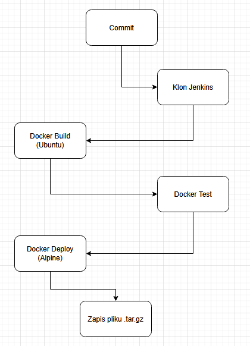
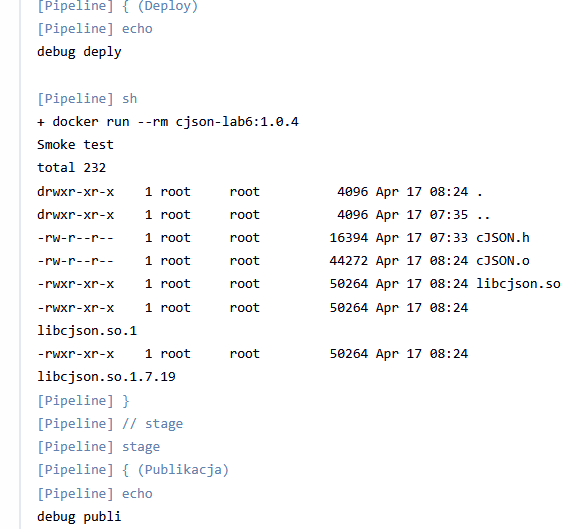
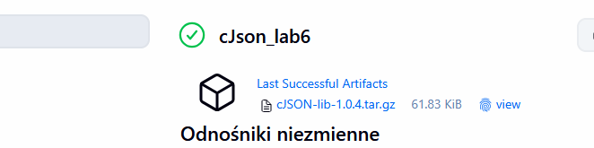

# Sprawozdanie 6
Bartłomiej Nosek
---

### Cel ćwiczenia
Celem było zaprojektowanie i wdrożenie pełnego potoku CI/CD (ścieżka krytyczna: clone -> build -> test -> deploy -> publish) przy użyciu narzędzia Jenkins

### Przebieg laboratoriów
- utworzenie forka repozytorium cJSON na własne konto GitHub.
- utworzenie pliku Dockerfile.ci realizującego izolację etapów (multi-stage build):

```Dockerfile
# build
# --- ETAP 1: BUILD ---
FROM ubuntu:24.04 AS builder
ENV DEBIAN_FRONTEND=noninteractive
RUN apt-get update && apt-get install -y --no-install-recommends gcc make git libc6-dev && rm -rf /var/lib/apt/lists/*
WORKDIR /workspace
COPY . .
RUN make all

# testowanie
FROM builder AS tester
RUN make test

# środowisko
FROM alpine:latest AS deploy
WORKDIR /app/lib
# tylko binarki z builda
COPY --from=builder /workspace/cJSON.o .
COPY --from=builder /workspace/libcjson.so* . 
COPY --from=builder /workspace/cJSON.h .

# Smoke test - sprawdzenie czy pliki tam są
CMD ["sh", "-c", "echo 'Smoke test' && ls -la /app/lib"]
```
 - 
- utworzenie potoku (pipeline) w Jenkinsie realizującego ścieżkę krytyczną:
```Groovy
pipeline{
    agent any
    
    environment{
        APP_VERSION="1.0.${env.BUILD_NUMBER}"
        IMAGE_NAME = "cjson-lab6"
    }
    
    stages{
        stage('Clone'){
        steps{
            echo "debug clone \n"
                git branch: 'master', url: 'https://github.com/Nbartek/cJSON.git'
        
        }
        }
        
        stage('Build i Testy'){
         steps{
             echo "debug build/test \n"
            //--target deploy, wymusza przejście przez etapy Build i Test
            sh 'docker build --target deploy -t ${IMAGE_NAME}:${APP_VERSION} -f Dockerfile.ci .'
         }
        }
        
        stage('Deploy'){
        steps{
            echo "debug deply \n"
            sh 'docker run --rm ${IMAGE_NAME}:${APP_VERSION}'
        }
        }
        stage('Publikacja'){
            steps{
                echo "debug publi \n"
                // Wyciągamy pliki z obrazu Dockera na zewnątrz do środowiska Jenkinsa
                sh '''
                    docker create --name extractor ${IMAGE_NAME}:${APP_VERSION}
                    docker cp extractor:/app/lib/. ./
                    docker rm extractor
                    
                    # Pakowanie do archiwum .tar.gz (Nasz oficjalny artefakt)
                    tar -czvf cJSON-lib-${APP_VERSION}.tar.gz *.o *.so* *.h
                '''
                
                // archiwizacja w Jenkinsie
                archiveArtifacts artifacts: '*.tar.gz', fingerprint: true
            }
        }
    }
    
        post {
        always {
            echo "Czyszczenie środ."
            sh 'docker image prune -f'
        }
    }
    
}
```
#### Potwierdzenie działania


### Lista kontrolna

**1. Wybór aplikacji, budowanie i testy:**
Wybrano lekką bibliotekę `cJSON`. Licencja MIT pozwala na swobodny obrót kodem. Program kompiluje się poleceniem `make all`, a dołączone testy przechodzą poprawnie po wywołaniu `make test`.

**2. Decyzja o forku własnej kopii:**
Zdecydowano sie na fork by dodać swój własny Dockerfile.ci

**3. Diagram procesu CI/CD (UML):**



**4. Konteneryzacja środowiska (Build i Test):**
Jako kontener bazowy wybrano `ubuntu:24.04`, wyposażając go w zależności runtime (gcc, make, libc6-dev).Nalezało też dodać flagi: `-o Acquire::ForceIPv4=tru` i `--no-install-recommends` z powodu bardzo długiego orginalnego czasu pobierania.  Proces *build* został wyizolowany w pierwszym etapie Dockera. Następnie zdefiniowano etap *test*, którego instrukcja zaczyna się od `FROM builder`. Gwarantuje to, że testy wykonują się na absolutnie identycznym, wcześniej skompilowanym kodzie.

**5. Zbieranie logów:**
Logi z całego procesu są automatycznie odkładane i trwale archiwizowane w środowisku Jenkins. 


**6. Kontener 'deploy' (Dlaczego buildowy się nie nadaje?):**
Kontener buildowy **nie nadaje się** do roli docelowego wdrożenia. Zajmuje za dużo miejsca co ładnie pokazuje czas budowania na zrzuce ekranu powyżej.

**7. Smoke Test (Weryfikacja):**
Gotowy, wersjonowany kontener *deploy* zostaje wdrożony do lokalnego demona Dockera. Potok weryfikuje jego poprawne działanie (*Smoke test*) poprzez wywołanie polecenia `docker run` który ma zwrócić listę plików.

**8. Definicja i wybór artefaktu:**
Jako finalny artefakt wybrano **archiwum tarball (`.tar.gz`)** zawierające pliki binarne (`.o`, `.so`) oraz nagłówkowe (`.h`). Ponieważ jest to biblioteka C.

**9. Wersjonowanie i publikacja artefaktu:**

