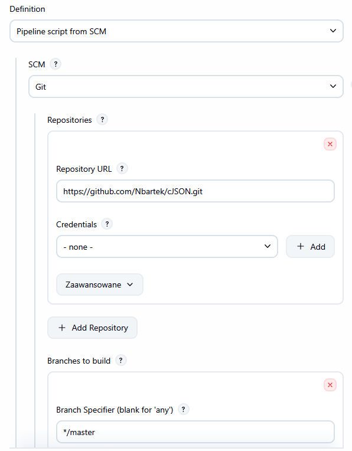

# Sprawozdanie 6
Bartłomiej Nosek
---

### Cel ćwiczenia
Celem było przerzucenie Pipeline do repozytorium i konfigiracja Jenkinsa.

### Lista kontrolna Jenkinsfile

*   **Przepis dostarczany z SCM:** Konfiguracja potoku w Jenkinsie została zmieniona z ręcznie wpisywanego skryptu na **"Pipeline script from SCM"**. Plik `Jenkinsfile` znajduje się w repozytorium GitHub i stamtąd jest pobierany.
*   **Skuteczne sprzątanie i praca na najnowszym kodzie:** W pierwszym etapie (*Czyszczenie i Clone*) dodano instrukcję `deleteDir()` która usuwa Workspace.
*   **Etap Build dysponuje repozytorium i plikami Dockerfile:** Dzięki pobraniu kodu z Git'a, silnik Dockera ma bezpośredni dostęp do kodu aplikacji `cJSON` oraz pliku definicji `Dockerfile.ci`.
*    **Etap Build tworzy obraz buildowy (BLDR):** W etapie *Build* wywołano komendę `docker build` z jawnym przełącznikiem `--target builder`, co skutkuje wygenerowaniem tymczasowego obrazu budującego z kompilatorem GCC.
*    **Etap Build przygotowuje artefakt:** `make all` generuje pliki binarne podczas etapu budowania.
*    **Etap Test przeprowadza testy:** W dedykowanym etapie *Test* polecenie `docker build --target tester ...` zmusza Dockera do przejścia przez instrukcję `RUN make test` zdefiniowaną w pliku `Dockerfile.ci`.
*    **Etap Deploy przygotowuje obraz pod wdrożenie:** Etap `deploy` tworzy nowy, docelowy obraz (oparty o czyste środowisko Alpine), w którym znajdują się wyłącznie skompilowane biblioteki.
*    **Etap Deploy przeprowadza wdrożenie:**  Weryfikowanie paczki odbywa się poprzez wykonanie polecenia `docker run --rm ...` (Smoke test). Kontener uruchamia się i zwraca liste plików, co dowodzi, że paczka nie jest uszkodzona.
*    **Etap Publish dodaje artefakt do historii builda:** W ostatnim etapie za pomocą polecenia `docker cp` skompilowane pliki biblioteki wydobywane są na zewnątrz kontenera. Następnie program `tar` tworzy archiwum `.tar.gz`, a dyrektywa Jenkinsa `archiveArtifacts` trwale dołącza je do logów danego uruchomienia.
*    **Ponowne uruchomienie potoku działa (brak konfliktów):** Potok został uruchomiony wielokrotnie z rzędu. Dzięki czyszczeniu Workspace'u na starcie oraz czyszczeniu śmieci z Dockera w bloku `post { always { sh 'docker image prune -f' } }`, środowisko pozostaje sterylne i powtarzalne. 

### Definition of Done (Kryteria Ukończenia)

Zbudowany proces CI jest w pełni skuteczny, co weryfikują poniższe założenia:

*   **Czy opublikowany obraz może być uruchomiony w Dockerze bez modyfikacji?** 
    **TAK.** Wygenerowany w procesie obraz kontenera docelowego (deploy) jest samowystarczalny. Posiada on środowisko Alpine i domyślny *CMD* realizujący smoke test. Może zostać przesłany do publicznego rejestru (np. Docker Hub) i uruchomiony na dowolnej innej maszynie przez `docker run` bez dodatkowych parametrów kompilacyjnych.
*   **Czy pobrany artefakt ma szansę zadziałać od razu na docelowej maszynie?**
    **TAK.** Artefaktem końcowym dostarczanym przez Jenkinsa jest archiwum `cJSON-lib-WERSJA.tar.gz`. Zawiera ono wyłącznie skompilowaną w niezależnym środowisku bibliotekę (`.o`, `.so`) oraz plik nagłówkowy (`.h`). Inny programista lub usługa może pobrać ten plik bezpośrednio z Jenkinsa, rozpakować w swoim środowisku Linux z architekturą amd64 i natychmiast używać w swoich projektach w języku C (bez instalacji Dockera na maszynie docelowej).

### Zruty ekranu

