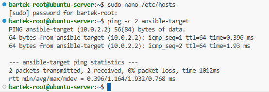
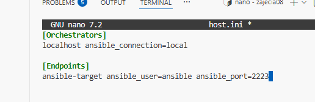
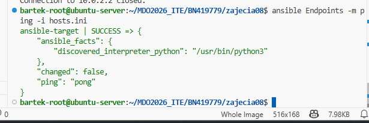
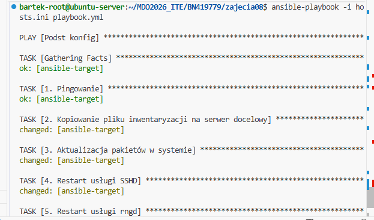
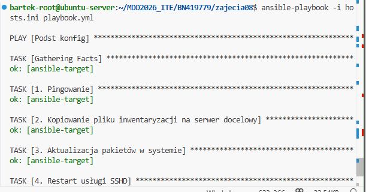
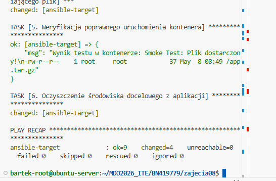
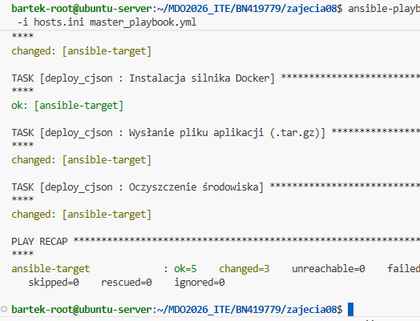

# Sprawozdanie 8
Bartłomiej Nosek
---

### Cel ćwiczenia
Automatyzacja zarządzania infrastrukturą IT oraz zdalne wykonywanie procedur przy użyciu narzędzia Ansible. Wdrożenie artefaktu pochodzącego z wcześniej przygotowanego laboratoria wcześniej.

### Przebieg laboratoriów
- **Przygotowanie maszyny docelowej:** Utworzono nową, lekką maszynę wirtualną bazującą na Ubuntu Server. Nadano jej nazwę za pomocą komendy `sudo hostnamectl set-hostname ansible-target` oraz dodano użytkownika `ansible` z uprawnieniami Sudo bez podawania hasła.
- **Konfiguracja łączności bezhasłowej (SSH):** Na maszynie głównej (Orchestratorze) zainstalowano oprogramowanie Ansible. Następnie przesłano klucz publiczny na maszynę docelową w celu uwierzytelnienia z pominięciem hasła:
  ```bash
  ssh-copy-id -p 2223 ansible@10.0.2.2
  ```
- **Rozwiązywanie nazw i inwentaryzacja:** Skonfigurowano plik `/etc/hosts` na maszynie głównej, dodając alias adresowy. Utworzono plik inwentarza `hosts.ini`:
  ```ini
  [Orchestrators]
  localhost ansible_connection=local

  [Endpoints]
  ansible-target ansible_host=10.0.2.2 ansible_port=2223 ansible_user=ansible
  ```
- Zweryfikowano łączność do wszystkich maszyn poleceniem: `ansible all -m ping -i hosts.ini`.
- **Utworzenie systemowego Playbooka (`system_playbook.yml`):**
  Zaimplementowano plik YAML realizujący podstawowe zadania administracyjne na węźle docelowym:
  ```yaml
  ---
  - name: Podstawowa konfiguracja i testy systemowe
    hosts: Endpoints
    become: yes

    tasks:
      - name: 1. Weryfikacja łączności (Ping)
        ping:

      - name: 2. Kopiowanie pliku inwentaryzacji na serwer docelowy
        copy:
          src: hosts.ini
          dest: /tmp/hosts.ini
          owner: ansible
          mode: '0644'

      - name: 3. Aktualizacja pakietów w systemie
        apt:
          update_cache: yes
          upgrade: dist

      - name: 4. Restart usługi SSHD
        service:
          name: ssh
          state: restarted

      - name: 5. Restart usługi rngd (Ignoruj błąd jeśli nie ma zainstalowanej)
        service:
          name: rng-tools
          state: restarted
        ignore_errors: yes
  ```
- **Zarządzanie artefaktem – Wdrożenie aplikacji:**
  Artefaktem z potoku CI/CD miał być plik binarny/paczka `.tar.gz` (biblioteka cJSON). Nie mogłem go jednak znaleźć więc wygenerwano zwykły `tar.gz` z prostym kodem wewnątrz. Utworzono playbook, który instaluje silnik Docker na czystej maszynie docelowej, przesyła artefakt, uruchamia kontener weryfikujący (Smoke Test), a następnie sprząta środowisko.
- **Szkieletowanie i utworzenie Roli Ansible:**
  Wydzielono logikę z playbooka wdrożeniowego do nowej Roli za pomocą polecenia `ansible-galaxy role init deploy_cjson`. Uzupełniono plik `meta/main.yml`, a same zadania wdrożeniowe przeniesiono do pliku `tasks/main.yml` wewnątrz wygenerowanej struktury.

---

### Dyskusje i realizacja zadań

**1. Zapewnienie łączności (Pingowanie maszyn)**
Ansible poprawnie komunikuje się ze wszystkimi maszynami zdefiniowanymi w inwentarzu. Po wykonaniu komendy ad-hoc `ansible all -m ping -i hosts.ini` otrzymano poprawną odpowiedź `"ping": "pong"` od maszyny docelowej, co świadczy o bezproblemowej konfiguracji połączenia przez SSH.

**2. Idempotentność systemu (Ponowne wykonanie operacji)**
Zgodnie z poleceniem, uruchomiono `system_playbook.yml` drugi raz z rzędu. Podczas pierwszego uruchomienia Ansible zainstalował brakujące pakiety i skopiował pliki (zwracając status w kolorze żółtym – `changed`). Przy ponownym uruchomieniu, wszystkie zadania zwróciły status zielony (`ok`). Oznacza to, że Ansible zachowuje idempotentność: zamiast ślepo wykonywać komendy, najpierw sprawdza stan docelowy serwera i pomija akcje, jeśli system znajduje się już w pożądanym stanie.

**3. Testy na maszynie "odpiętej od sieci"**
Przeprowadzono operację z wyłączonym serwerem SSH lub wirtualnie odpiętą kartą sieciową na nowej maszynie. Ansible po upływie określonego czasu oczekiwania na połączenie przerwał działanie dla tego konkretnego węzła (zwracając błąd typu `UNREACHABLE`), ale zasygnalizował to wyraźnie w podsumowaniu (tzw. *PLAY RECAP*), uniemożliwiając ciche przejście procesu do dalszych kroków bez świadomości administratora.

**4. Zarządzanie błędami (Sanity Check i usługa rngd)**
W zadaniach wdrożeniowych użyto dyrektyw takich jak `ignore_errors: yes` (dla usługi `rngd`, której z braku sprzętowego generatora mogło nie być w systemie) oraz `failed_when: false` przy testowaniu przestrzeni dyskowej. Dzięki temu, nawet jeśli dany element diagnostyczny (sanity check) zwraca nieoczekiwany kod błędu, cały potok wdrożeniowy nie ulega awarii (Crash), pozwalając na kontynuację pozostałych, krytycznych zadań.


---

### Zrzuty ekranu:









