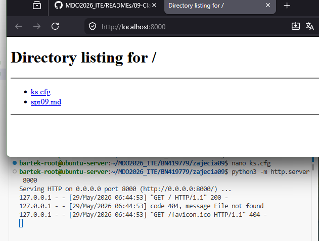
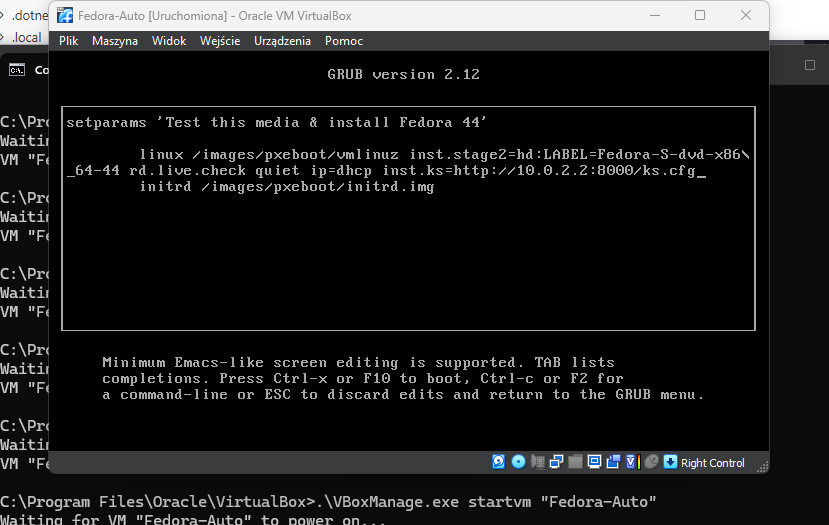
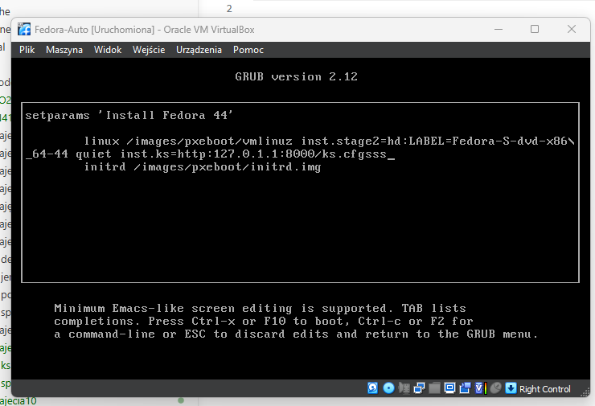
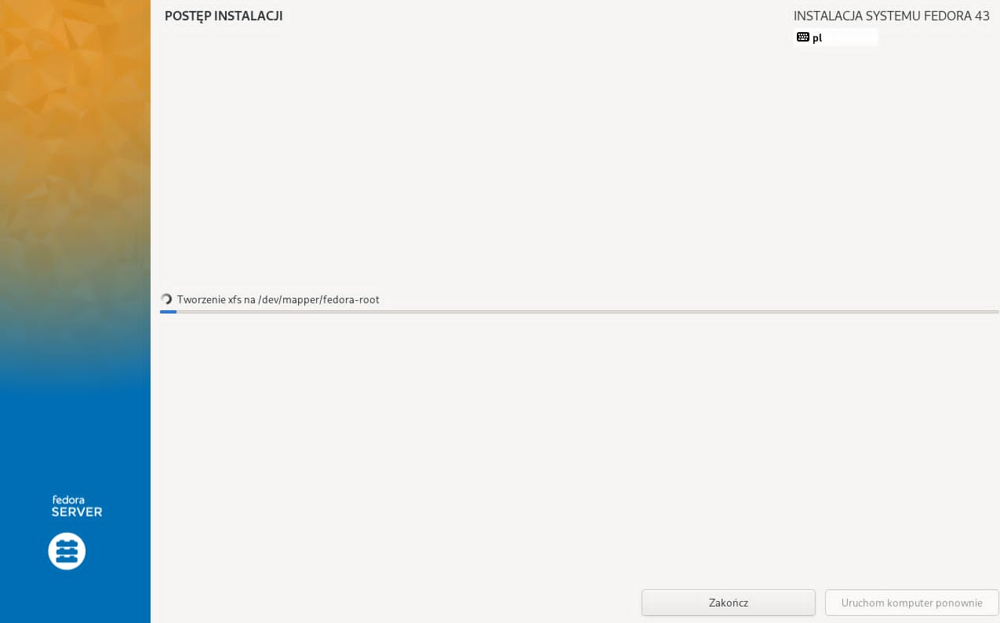

# Sprawozdanie 9
Bartłomiej Nosek
---

### Cel ćwiczenia
Automatyzacja procesu dostarczania infrastruktury na poziomie systemu operacyjnego (Bare-Metal Provisioning / Infrastructure as Code) przy użyciu mechanizmu plików odpowiedzi (Kickstart). Celem było przeprowadzenie w 100% nienadzorowanej instalacji systemu Fedora, a następnie zautomatyzowane pobranie i uruchomienie artefaktu zrealizowanego we wcześniejszym potoku CI/CD.

### Przebieg laboratoriów
- **Przygotowanie pliku odpowiedzi:** Na głównej maszynie przygotowano plik `ks.cfg`, definiujący parametry instalacji (układ klawiatury, strefę czasową, użytkowników, dyski i pakiety) oraz niestandardowy skrypt poinstalacyjny (`%post`).
- **Udostępnienie pliku instalatorowi:** Plik `ks.cfg` został wystawiony w sieci wirtualnej za pomocą serwera HTTP w języku Python:
  ```bash
  python3 -m http.server 8000 --bind 0.0.0.0
  ```
- **Automatyzacja tworzenia maszyny (Zakres rozszerzony):** Z poziomu gospodarza (Windows) zautomatyzowano proces tworzenia nowej maszyny wirtualnej, przydzielania zasobów (RAM/Dysk) oraz montowania obrazu ISO za pomocą narzędzia wiersza poleceń `VBoxManage`. Dodatkowo, w celu natychmiastowej aktywacji łącza, zmieniono typ wirtualnej karty sieciowej na `virtio-net`.
- **Uruchomienie instalacji nienadzorowanej:** Maszyna wirtualna została uruchomiona z instalatora sieciowego Fedora Netinstall. W menu GRUB (po wciśnięciu klawisza `e`) dopisano odpowiednie parametry bootowania, wymuszając włączenie sieci i wskazując lokalizację pliku z odpowiedziami (używając adresu NAT Windowsa jako bramy do serwera Python):
  ```text
  linux /vmlinuz [...] quiet rd.neednet=1 ip=dhcp inst.ks=http://10.0.2.2:8000/ks.cfg
  ```
- Po pobraniu pliku Kickstart system zainstalował się, pobrał brakujące pakiety (w tym środowisko Docker) i automatycznie zrestartował.

---

### Realizacja listy kontrolnej i dyskusje

**1. Repozytoria, sieć i partycjonowanie**
Ze względu na wykorzystanie instalatora wariantu sieciowego , w pliku Kickstart precyzyjnie wskazano listy serwerów lustrzanych dystrybucji Fedora 40 za pomocą dyrektyw `url` i `repo`. Zagwarantowano wymóg całkowitego formatowania dysku instrukcją `clearpart --all --initlabel` z jednoczesnym zignorowaniem wirtualnego dysku MBR (`zerombr`). Maszyna otrzymała przewidywalną nazwę w sieci dyrektywą `network --hostname=cjson-server.agh.local`.

**2. Oprogramowanie niezbędne do uruchomienia artefaktu**
Ponieważ docelowym środowiskiem uruchomieniowym jest kontener, w bloku `%packages` nakazano instalację silnika `docker` oraz narzędzi sieciowych (`wget`, `tar`). Docker jest fundamentem do postawienia testowego kontenera dla wygenerowanej wcześniej biblioteki.

**3. Skrypt poinstalacyjny (%post) i automatyczny start aplikacji**
Zgodnie z wymaganiami, niemożliwe jest uruchomienie komend `docker run` czy użycie `systemctl start` w sekcji `%post`, ponieważ odbywa się to w środowisku `chroot` instalatora, gdzie demon Dockera fizycznie jeszcze nie działa. 
Aby spełnić wymóg natychmiastowego uruchomienia oprogramowania przy pierwszym włączeniu systemu, użyto sekcji `%post` do wygenerowania jednorazowej usługi Systemd (`cjson-deploy.service`).

**4. Automatyczny restart na końcu instalacji**
Plik Kickstart rozpoczyna się od słów kluczowych `text` i `reboot` (z akceptacją licencji `eula --agreed`), co zapewnia, że po wygenerowaniu środowiska i wykonaniu chrootowanego skryptu `%post`, maszyna samodzielnie uruchamia się ponownie.

---

### Plik konfiguracyjny (ks.cfg)

Poniżej przedstawiono zawartość przygotowanego pliku odpowiedzi implementującego "Infrastrukturę jako Kod":

```text
text
reboot
eula --agreed

#jezyk,czas, klawiatura
keyboard --vckeymap=pl --xlayouts='pl'
lang pl_PL.UTF-8
timezone Europe/Warsaw --isUtc

#siec
network --bootproto=dhcp --device=link --hostname=cjson-server.agh.local --activate

#repozytoria
url --mirrorlist=http://mirrors.fedoraproject.org/mirrorlist?repo=fedora-40&arch=x86_64
repo --name=update --mirrorlist=http://mirrors.fedoraproject.org/mirrorlist?repo=updates-released-f40&arch=x86_64

#uzytkownicy
rootpw student
user --name=devops --password=student --groups=wheel

#dyski
zerombr
clearpart --all --initlabel
autopart

#pakiety
%packages
@core
docker
wget
tar
%end

# po instalacji(skrypt i logi)
%post --log=/root/ks-post.log
#!/bin/bash

# Zapewnienie uruchamiania demona Dockera
systemctl enable docker

# Utworzenie jednorazowej usługi pobierającej artefakt przy pierwszym uruchomieniu
cat << 'EOF' > /etc/systemd/system/cjson-deploy.service
[Unit]
Description=Pobranie i wdrożenie artefaktu cJSON
After=docker.service network-online.target
Requires=docker.service network-online.target

[Service]
Type=oneshot
ExecStartPre=/usr/bin/wget -O /tmp/cJSON.tar.gz https://github.com/DaveGamble/cJSON/archive/refs/tags/v1.7.18.tar.gz
ExecStart=/usr/bin/docker run --rm -v /tmp/cJSON.tar.gz:/app.tar.gz alpine sh -c "echo 'Wdrożenie nienadzorowane udane!' && ls -l /app.tar.gz"
ExecStartPost=/usr/bin/systemctl disable cjson-deploy.service

[Install]
WantedBy=multi-user.target
EOF

# Włączenie utworzonej usługi przed pierwszym restartem
systemctl enable cjson-deploy.service
%end
```

---

### Zrzuty ekranu:




