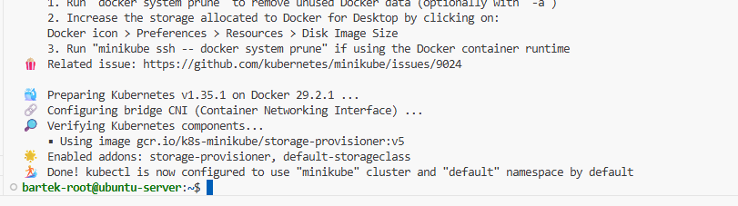
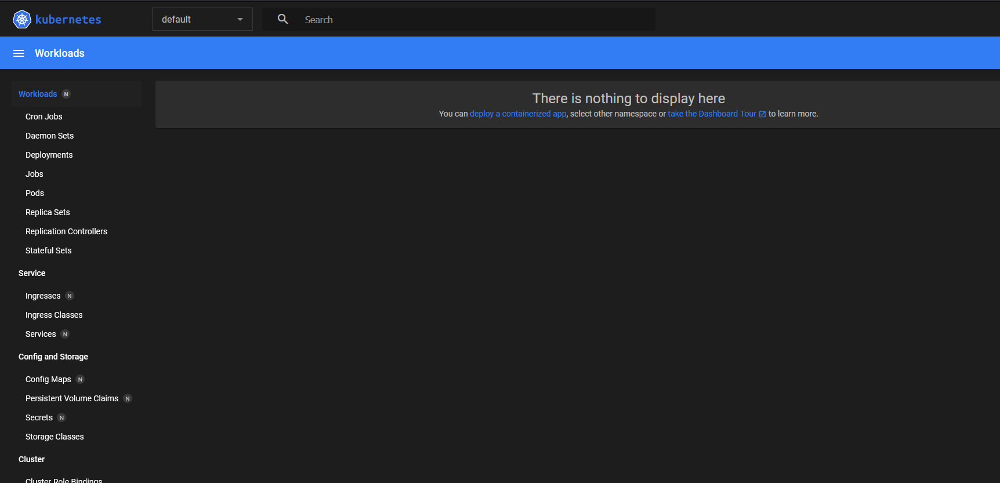
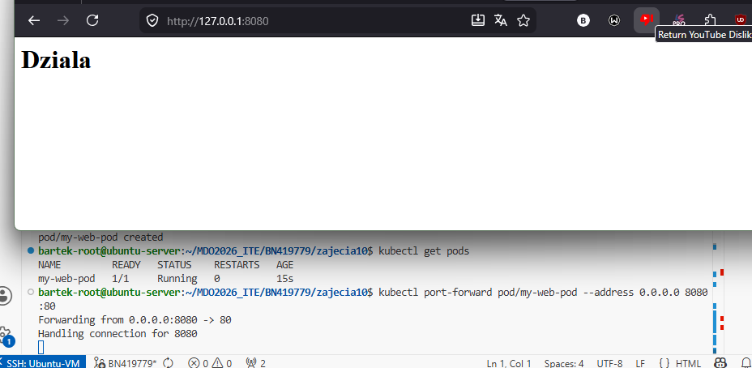
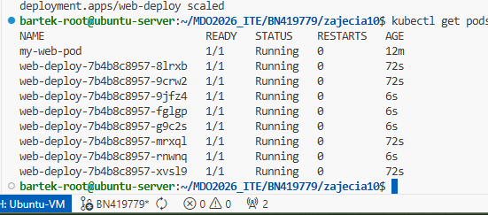

# Sprawozdanie 10
Bartłomiej Nosek
---

### Cel ćwiczenia
Wdrażanie aplikacji w środowisku zarządzalnych kontenerów za pomocą systemu Kubernetes (K8s). Poznanie koncepcji klastrów, podów, wdrożeń (Deployments), serwisów oraz strategii aktualizacji i utrzymania wysokiej dostępności.

### Przebieg laboratoriów
- **Instalacja Minikube:** Zainstalowano lokalny klaster `minikube` przy użyciu wbudowanego sterownika `docker`. Zainstalowano narzędzie klienckie `kubectl`. Po uruchomieniu klastra, wykazano działanie komponentów oraz uruchomiono Kubernetes Dashboard udostępniając go na zewnątrz przez polecenie `kubectl proxy`.
- **Przygotowanie obrazów (Zastąpienie cJSON):** cJSOn nie wystawia interfejsu sieciowego, więc na potrzeby wdrożeń w K8s utworzono własną prostą aplikację. Skonfigurowano 3 wersje obrazu opartego o serwer `nginx` (v1, v2 oraz v3 z celowo uszkodzonym plikiem konfiguracyjnym) i udostępniono je w rejestrze Docker Hub.
- **Ręczne wdrożenie (Pod):** Uruchomiono bezpośrednio jeden Pod z aplikacją.
  ```bash
  kubectl run my-web-pod --image=scornax/my-web-app:v1 --port=80 --labels=app=my-web-app
  ```
  Zestawiono tunel `kubectl port-forward` i zweryfikowano działanie strony.
- **Deklaratywne wdrożenie (Deployment):** Utworzono plik `deployment.yaml` i wdrożono aplikację z początkową liczbą 4 replik. Następnie wyeksponowano Deployment jako `Service` (NodePort), umożliwiając ruch sieciowy i zrównoważenie obciążenia (load balancing) pomiędzy replikami.

### Realizacja zadań i dyskusje

**1. Operacje na skali (Skalowanie poziome)**
Przetestowano elastyczność Kubernetesa poleceniem `kubectl scale`. Zwiększono liczbę replik do 8 (K8s błyskawicznie "dobudował" 4 nowe pody, ostatni zrzut ekranu), zredukowano do 1, następnie do 0 (całkowite wyłączenie aplikacji), by docelowo przywrócić pożądaną skalę wynoszącą 4 pody.

**2. Wdrażanie nowych wersji i ochrona przed awarią (Rollout & Undo)**
Zaktualizowano działający Deployment do nowej wersji (`v2`) poleceniem:
`kubectl set image deployment/web-deploy my-web-app=scornax/my-web-app:v2-fixed`( z powdu problemów z loginem)
Następnie zaimplementowano symulację awarii, wdrażając uszkodzony obraz `v3`. Kubernetes, korzystając z domyślnej strategii *Rolling Update*, podjął próbę wymiany, jednak zdiagnozował błąd (CrashLoopBackOff w nowych podach) i wstrzymał wdrożenie. Uchroniło to system przed całkowitym przestojem (Downtime). 
Szybko przywrócono stabilność klastra poleceniem powrotu do poprzedniej działającej rewizji:
`kubectl rollout undo deployment/web-deploy`.
Wykorzystano polecenie `kubectl rollout history` do skorelowania wykonanych czynności.

**3. Skrypt nadzorujący wdrożenie**
Napisano skrypt `check_deploy.sh`, realizujący wymaganie monitoringu. Wykorzystuje on natywną funkcję K8s do śledzenia statusu w czasie rzeczywistym i w przypadku nieosiągnięcia progu stabilności (np. z powodu błędnego obrazu) wycofuje zmiany i przerywa pipeline.
```bash
#!/bin/bash
if kubectl rollout status deployment/web-deploy --timeout=60s; then
    echo "Wdrożenie zakończone sukcesem!"
else
    echo "BŁĄD: Wdrożenie zablokowane (Timeout). Cofaam zmiany!"
    kubectl rollout undo deployment/web-deploy
    exit 1
fi
```

**4. Strategie wdrożeń (Deployment Strategies) - Opis różnic**
Podczas zarządzania kodem przetestowano i zbadano koncepcje wdrożeń:
*   **Recreate:** Najbardziej brutalna metoda. K8s najpierw usuwa wszystkie stare pody, a dopiero gdy znikną, tworzy nowe. **Różnica:** Generuje przerwę w dostępie do usługi (Downtime), ale zapobiega konfliktom wersji w bazie danych.
*   **Rolling Update:** Domyślna strategia. Użyto parametrów `maxUnavailable > 1` oraz `maxSurge > 20%`. K8s wymienia pody stopniowo – uruchamia kilka nowych (Surge) i dopiero gdy zaczną działać poprawnie, gasi kilka starych. **Różnica:** Gwarantuje brak przestojów, użytkownik końcowy nawet nie zauważy wymiany.
*   **Canary Deployment:** Specyficzna strategia wdrażania z użyciem etykiet (Labels) i serwisów. Polega na stworzeniu drugiego, małego Deploymentu (np. z 1 repliką) nowej wersji. Dzięki odpowiedniemu nałożeniu Etykiet (`app: web-app`), głowny Serwis losowo kieruje tylko mały ułamek (np. 10%) rzeczywistego ruchu klientów na nową wersję. Pozwala to przetestować nową funkcję na wąskiej grupie roboczej ("królikach doświadczalnych"), podczas gdy 90% ruchu nadal bezpiecznie trafia do starego wdrożenia.


### Zrzuty ekranu:




