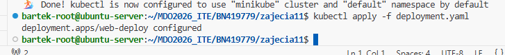
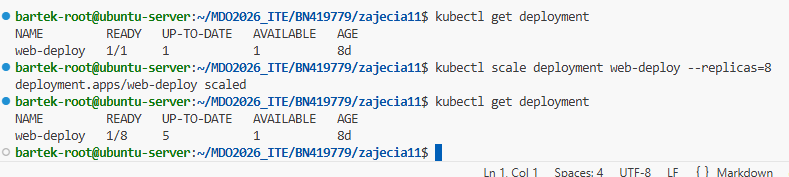
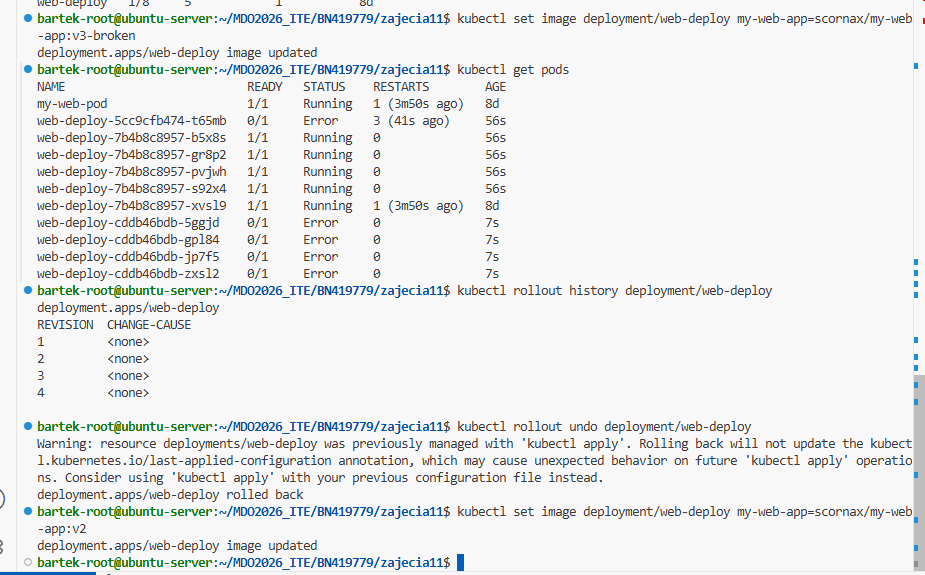
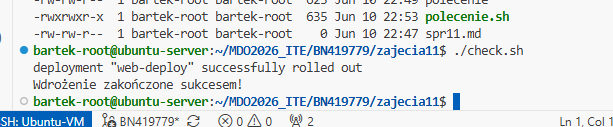
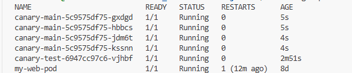

# Sprawozdanie 11
Bartłomiej Nosek
---

### Cel ćwiczenia
Zarządzanie cyklem życia aplikacji w klastrze Kubernetes. Zapoznanie się z zaawansowanymi metodami aktualizacji wdrożeń bez przerw w dostępie (Zero-Downtime Deployments), testowanie mechanizmów samonaprawy i wycofywania zmian (Rollback) oraz implementacja strategii wdrożeniowych: Recreate, Rolling Update i Canary.

### Przebieg laboratoriów
- **Przygotowanie obrazów wariantowych:** Na bazie serwera `nginx` utworzono i wysłano do rejestru (konta mego) trzy warianty kontenera: wersję bazową (`v1-fixed`(kontynuacja problemu z labów 10)), zaktualizowaną (`v2`) oraz wersję błędną konfiguracji (`v3-broken`).
- **Wdrożenie i skalowanie:** Wykonano wdrożenie (Deployment) w oparciu o manifest YAML. Poddano system testom skalowania poziomego (HPA), dynamicznie modyfikując liczbę replik: `8 -> 1 ->8` przy użyciu polecenia `kubectl scale deployment`.
- **Wycofywanie zmian i historia (Rollout & Undo):** 
  Przeprowadzono aktualizację (Update) wdrożenia do wadliwego obrazu `v3-broken` za pomocą komendy `kubectl set image`. Klaster zdiagnozował awarię kontenerów (stan *CrashLoopBackOff*). Używając komendy `kubectl rollout history` sprawdzono historię rewizji, a następnie wykonano powrót do stabilnej wersji za pomocą `kubectl rollout undo deployment/web-deploy`.

---

### Dyskusje i realizacja zadań

**1. Skrypt nadzorujący wdrożenie**
Napisano skrypt bashowy służący jako bramka jakości (Quality Gate) dla potoków CI/CD. Skrypt weryfikuje czy proces aktualizacji zakończył się poprawnie w zadanym czasie. Jeśli przekroczy próg 60 sekund (np. w wyniku awarii ImagePullBackOff), automatycznie wycofuje zmiany chroniąc środowisko produkcyjne:
```bash
#!/bin/bash
if kubectl rollout status deployment/web-deploy --timeout=60s; then
    echo "Wdrożenie zakończone sukcesem!"
else
    echo "BŁĄD: Wdrożenie zablokowane (Timeout)."
    kubectl rollout undo deployment/web-deploy
    exit 1
fi
```

**2. Różnice między strategiami wdrożeń**
Za pomocą osobnych manifestów YAML zasymulowano trzy odmienne strategie aktualizacji oprogramowania:

*   **Strategia Recreate:**
    Najprostsze i "najbardziej brutalne" podejście. Parametr `strategy.type: Recreate` powoduje natychmiastowe ubicie wszystkich starych podów, po czym uruchamiane są pody w nowej wersji.
    *Charakterystyka:* Powoduje przerwę w dostępie do usługi (Downtime). Stosowana głównie w środowiskach nie-produkcyjnych lub w przypadku aplikacji silnie zintegrowanych z bazą danych, gdzie dwie różne wersje nie mogą działać równolegle.

*   **Strategia Rolling Update (Domyślna w K8s):**
    Aplikacja jest aktualizowana "krokowo". Wdrożono ją z parametrami `maxSurge: 25%` (pozwala na tymczasowe przekroczenie docelowej liczby podów o 25%) oraz `maxUnavailable: 2` (maksymalnie dwa pody mogą być niedostępne w trakcie procesu).
    *Charakterystyka:* Brak przerw w działaniu usługi. Kubernetes powoli tworzy nowe kontenery i gasi stare dopiero, gdy nowe zaraportują pełną gotowość. Idealna dla bezstanowych (stateless) usług webowych.

*   **Strategia Canary Deployment:**
    Wdrożenie "kanarkowe" osiągnięto za pomocą architektury opartej na etykietach (Labels) i obiekcie `Service`. Wdrożono dwa osobne obiekty `Deployment`:
    1. *Główny* (4 repliki, obraz v1, etykieta `app: canary-app`).
    2. *Testowy/Canary* (1 replika, obraz v2, etykieta `app: canary-app`).
    *Charakterystyka:* Dzięki temu, że `Service` obejmuje ruchem wszystkie pody z tą samą etykietą aplikacji (niezależnie od ich wersji), system naturalnie przekierowuje tylko ok. 20% (1 z 5) ruchu na nową, testową wersję kodu. Jeśli "kanarek" (nowa wersja) działa poprawnie i nie generuje błędów, system powoli skaluje go zastępując główne wdrożenie.

---

### Zrzuty ekranu:





