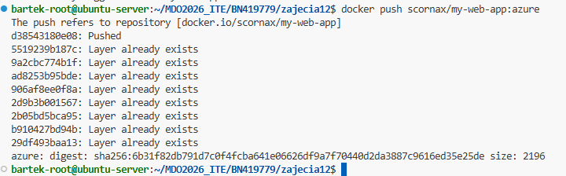
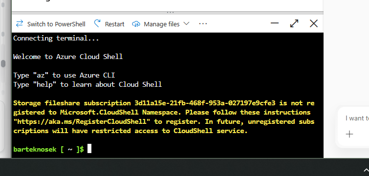
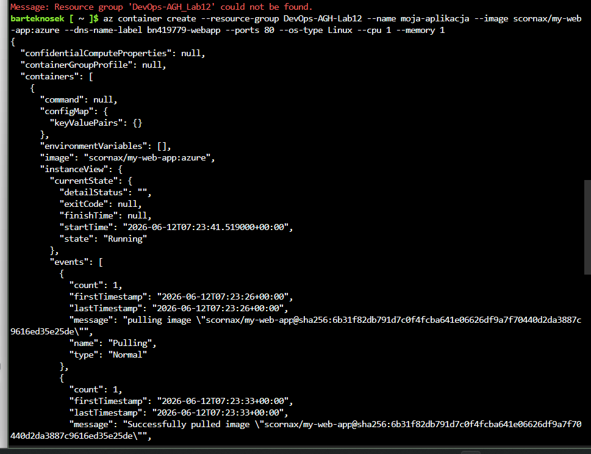
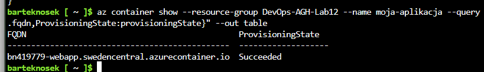
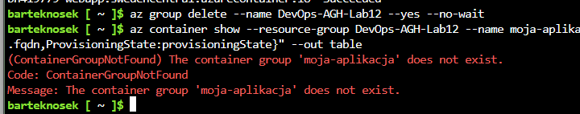

# Sprawozdanie 12
Bartłomiej Nosek
---

### Cel ćwiczenia
Praktyczne zapoznanie się z koncepcją chmury obliczeniowej w modelu CaaS (Container as a Service). Realizacja bezserwerowego wdrożenia własnej aplikacji internetowej na platformie Microsoft Azure, z wykorzystaniem narzędzia Azure Cloud Shell oraz publicznego rejestru obrazów (Docker Hub).

### Przebieg laboratoriów
- **Przygotowanie obrazu:** Lokalnie przygotowano nową wersję obrazu serwera Nginx ze zmodyfikowanym plikiem wejściowym. Obraz zbudowano i opublikowano w publicznym rejestrze (`docker push scornax/my-web-app:azure`). 
- **Zarządzanie infrastrukturą:** Zalogowano się do portalu Azure za pomocą konta studenckiego. Uruchomiono usługę *Azure Cloud Shell* (powłoka Bash).
- **Utworzenie Grupy Zasobów (Resource Group):** Zgrupowano infrastrukturę w logicznym pojemniku, co znacznie ułatwia późniejsze jej usunięcie i zarządzanie kosztami.
  ```bash
  az group create --name DevOps-AGH-Lab12 --location northeurope
  ```
- **Wdrożenie kontenera (Azure Container Instances - ACI):** Uruchomiono aplikację w chmurze bez konieczności stawiania serwera wirtualnego czy klastra Kubernetes. Użyto obrazu bezpośrednio z Docker Huba:
  ```bash
  az container create \
    --resource-group DevOps-AGH-Lab12 \
    --name moja-aplikacja \
    --image scornax/my-web-app:azure \
    --dns-name-label bn419779-webapp \
    --ports 80
  ```
- **Uzyskanie dostępu i logów:** Wydobyto przypisany adres w domenie Microsoftu (FQDN) i wykonano testowe połączenie przez przeglądarkę. Zweryfikowano sukces wdrożenia pobierając logi kontenera (`az container logs`).
- **Sprzątanie (De-provisioning):** Ze względu na model płatności chmurowej (pay-as-you-go), natychmiast po udanym wdrożeniu i zebraniu dowodów usunięto całą grupę zasobów:
  ```bash
  az group delete --name DevOps-AGH-Lab12 --yes --no-wait
  ```

---

### Dyskusje i realizacja zadań

**1. Wykorzystanie rejestru Docker Hub vs Azure Container Registry (ACR)**
Zgodnie z wytycznymi w instrukcji, odstąpiono od tworzenia prywatnego rejestru ACR wewnątrz ekosystemu Microsoft. Aplikacja wdrożeniowa została zaprogramowana tak, aby silnik ACI pobrał obraz bezpośrednio z publicznego konta na portalu Docker Hub (`scornax`). Dowodzi to dużej uniwersalności platformy Azure, która potrafi natywnie komunikować się z publicznymi i prywatnymi rejestrami z zewnątrz, nie wymuszając na developerze tzw. *Vendor Lock-in* (zablokowania się wyłącznie w rozwiązaniach jednego dostawcy chmury).

**2. Metoda dostępu do serwowanej usługi**
Dostęp do działającego kontenera HTTP został uzyskany poprzez w pełni kwalifikowaną nazwę domeny (FQDN). Używając flagi `--dns-name-label bn419779-webapp`, Azure z automatu podpiął tę etykietę pod regionalną domenę. W rezultacie po wywołaniu polecenia `az container show`, system zwrócił adres: `bn419779-webapp.northeurope.azurecontainer.io`. Wpisanie tego adresu w standardową przeglądarkę skutkowało nawiązaniem połączenia HTTP przez port 80 i wyświetleniem zmodyfikowanej strony powitalnej. 

**3. Uzasadnienie konieczności usuwania Grupy Zasobów**
Model rozliczeniowy platformy Azure zakłada pobieranie "kredytów" (bądź pieniędzy) z konta za każdą sekundę, w której zarezerwowane zasoby obliczeniowe (CPU/RAM w ACI) są aktywne. Usunięcie tylko samego kontenera mogłoby pozostawić w tle porzucone, płatne usługi powiązane (np. publiczne adresy IP). Z moich odświadczeń jest top najwazniejszy kork gdyż już raz mi się to przydażyło Komenda `az group delete` całkowicie niszczy cały "worek" logiczny, wykluczając ryzyko naliczenia niespodziewanych kosztów studenckich na koniec miesiąca. 

---

### Zrzuty ekranu:





