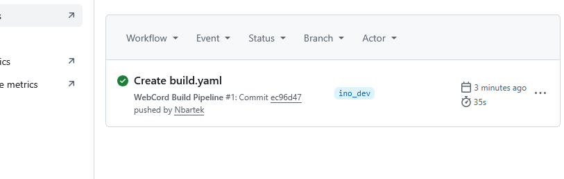
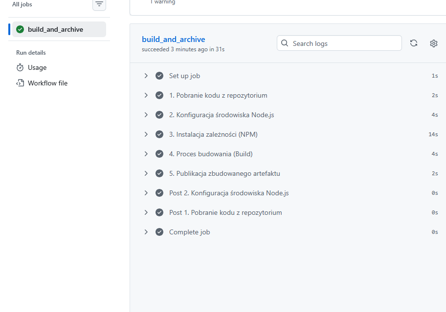

# Sprawozdanie 13 
**Imię i nazwisko:** Bartłomiej Nosek  
---

### Cel ćwiczenia
Praktyczne zapoznanie się z platformą GitHub Actions realizującą paradygmat "Shift-left". Przeniesienie infrastruktury budującej i testującej bezpośrednio do systemu kontroli wersji (SCM), co pozwala wyłapywać błędy na najwcześniejszym etapie dostarczania kodu, bez konieczności utrzymywania własnych serwerów (jak Jenkins).

### Przebieg laboratoriów
- **Fork i czyszczenie:** Wykonano kopię (fork) otwartoźródłowego repozytorium projektu `WebCord` (opartego na środowisku Node.js/Electron). Zgodnie z instrukcją, usunięto wszystkie domyślne pliki automatyzacji znajdujące się w ukrytym katalogu `.github/workflows/`, aby nie obciążać darmowych limitów.
- **Utworzenie środowiska roboczego:** Wykreowano nową gałąź o nazwie `ino_dev`.
- **Definicja potoku (Workflow):** Utworzono własny plik automatyzacji `.github/workflows/build.yml`, nasłuchujący wyłącznie na zmiany w obrębie wyznaczonej gałęzi deweloperskiej.
- **Wykonanie Akcji:** Dokonano commita testowego na gałęzi `ino_dev`, co poprawnie zainicjowało *trigger*. Akcja pobrała kod, zainstalowała zależności systemowe (NPM), przeprowadziła proces kompilacji i udostępniła paczkę za pomocą zintegrowanej akcji `upload-artifact`.

---

### Plik konfiguracyjny (GitHub Actions YAML)

Poniżej przedstawiono kod deklaratywnego potoku wdrożeniowego utworzonego na potrzeby laboratorium:

```yaml
name: WebCord Build Pipeline

on:
  push:
    branches:
      - ino_dev

jobs:
  build_and_archive:
    runs-on: ubuntu-latest

    steps:
      - name: 1. Pobranie kodu z repozytorium
        uses: actions/checkout@v4

      - name: 2. Konfiguracja środowiska Node.js
        uses: actions/setup-node@v4
        with:
          node-version: '20'

      - name: 3. Instalacja zależności (NPM)
        run: npm install

      - name: 4. Proces budowania (Build)
        run: npm run build

      - name: 5. Publikacja zbudowanego artefaktu
        uses: actions/upload-artifact@v4
        with:
          name: webcord-artifact
          path: app/
          retention-days: 5
```

---

### Analiza technologii, koncepcji i napotkanych problemów

*   **Charakterystyka i porównanie (GitHub Actions vs Jenkins):** 
    GitHub Actions reprezentuje nowoczesne podejście "Serverless CI/CD" (SaaS). W przeciwieństwie do Jenkinsa, z którym pracowano na poprzednich zajęciach, GitHub Actions nie wymaga utrzymywania, aktualizowania ani konfigurowania własnej maszyny wirtualnej z systemem Linux. Serwery budujące (Runners) są dostarczane i zarządzane dynamicznie przez Microsoft. Zaletą jest ogromna baza gotowych wtyczek (Actions Marketplace, np. `actions/checkout@v4`), a barierą są twarde limity czasowe (2000 minut miesięcznie dla prywatnych repozytoriów w darmowym planie; publiczne repozytoria pozostają bezpłatne).
*   **Paradygmat Shift-left:** Zjawisko to polega na radykalnym przesunięciu kontroli jakości w lewo na "osi czasu" dostarczania oprogramowania. Kiedyś kod był budowany i testowany dopiero przed wydaniem (na serwerach testowych). Dziś, dzięki triggerom (`on: push`), środowisko chmurowe reaguje natychmiast po zapisaniu linijki kodu przez dewelopera. Pozwala to na "tanio" i szybko wychwycić usterki kompilacji, drastycznie redukując koszty naprawy oprogramowania (Fix cost).
*   **Główne problemy techniczne:** Nie bylo tutaj problemów technicznych głownie z powodu korzystania w całości z UI githuba.

---

### Cennik i model rozliczeń GitHub Actions (Billing)

Analiza oficjalnej dokumentacji cennika GitHub Actions uwypukla kilka kluczowych mechanizmów, o których inżynier DevOps musi pamiętać, aby uniknąć niespodziewanych kosztów:

*   **Repozytoria publiczne vs prywatne:** Uruchamianie potoków CI/CD na serwerach dostarczanych przez GitHub (GitHub-hosted runners) w repozytoriach publicznych jest **całkowicie darmowe** i nielimitowane. Sytuacja zmienia się w repozytoriach prywatnych, gdzie obowiązuje model puli darmowych minut (w podstawowym planie GitHub Free jest to **2000 minut na miesiąc**).
*   **Mnożniki systemów operacyjnych (OS Multipliers):** Jest to największa pułapka kosztowa. Czas zużycia darmowej puli zależy od systemu, na którym działa Runner. System Linux posiada mnożnik `1x` (1 minuta pracy = 1 minuta z puli). Jednak użycie środowiska Windows pochłania minuty podwójnie (mnożnik `2x`), a uruchomienie builda na systemie macOS aż dziesięciokrotnie (mnożnik `10x`). Z tego powodu w laboratorium celowo zadeklarowano `runs-on: ubuntu-latest`.
*   **Magazynowanie artefaktów (Storage):** Oprócz czasu procesora, opłaty obejmują również miejsce zajmowane przez wygenerowane artefakty (np. paczki `.zip`) i pakiety (GitHub Packages). Plan Free oferuje zaledwie **500 MB** darmowej przestrzeni. Aby zapobiec zapchaniu tego limitu przez ciężkie buildy (jak w przypadku aplikacji WebCord), konieczne jest sterowanie retencją danych – np. poprzez ustawienie parametru `retention-days: 5` w akcji `upload-artifact`, co wymusza automatyczne usuwanie starych plików. Koszty naliczają się godzinowo.
*   **Limit wydatków (Spending Limit):** Zgodnie z dobrymi praktykami zabezpieczania infrastruktury chmurowej, najlepszą metodą zapobiegania "rachunkom grozy" (np. gdy zła pętla lub ciężki build pochłonie cały limit) jest ustawienie w ustawieniach konta (Billing & licensing) opcji *Action spending limit* na twarde **$0**. Wówczas po wyczerpaniu 2000 minut akcje po prostu przestaną się uruchamiać, nie obciążając środków użytkownika. To tłumaczy również, dlaczego w instrukcji do zadania nakazano usunięcie innych, domyślnych plików *workflows* w projekcie – aby zapobiec niepotrzebnemu "przepalaniu" studenckiego limitu.

### Zrzuty ekranu:



