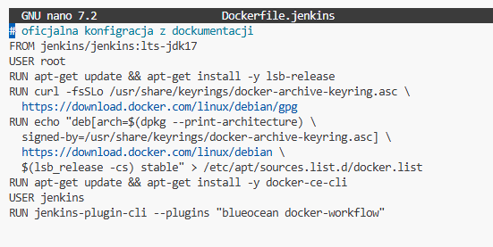
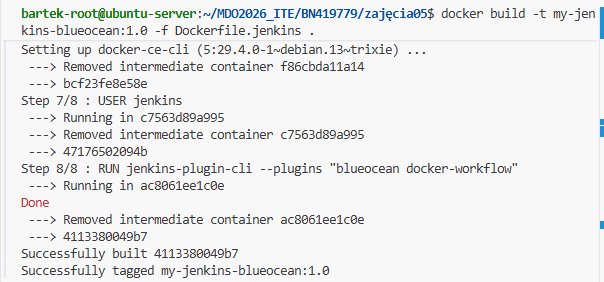
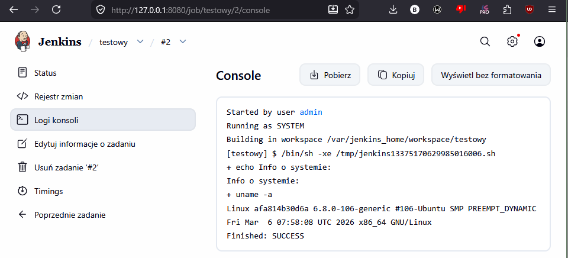
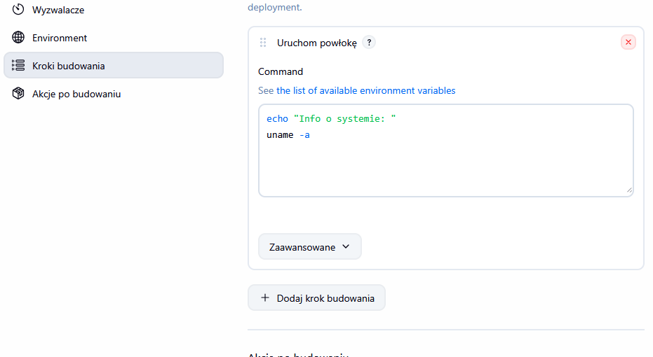
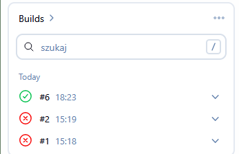
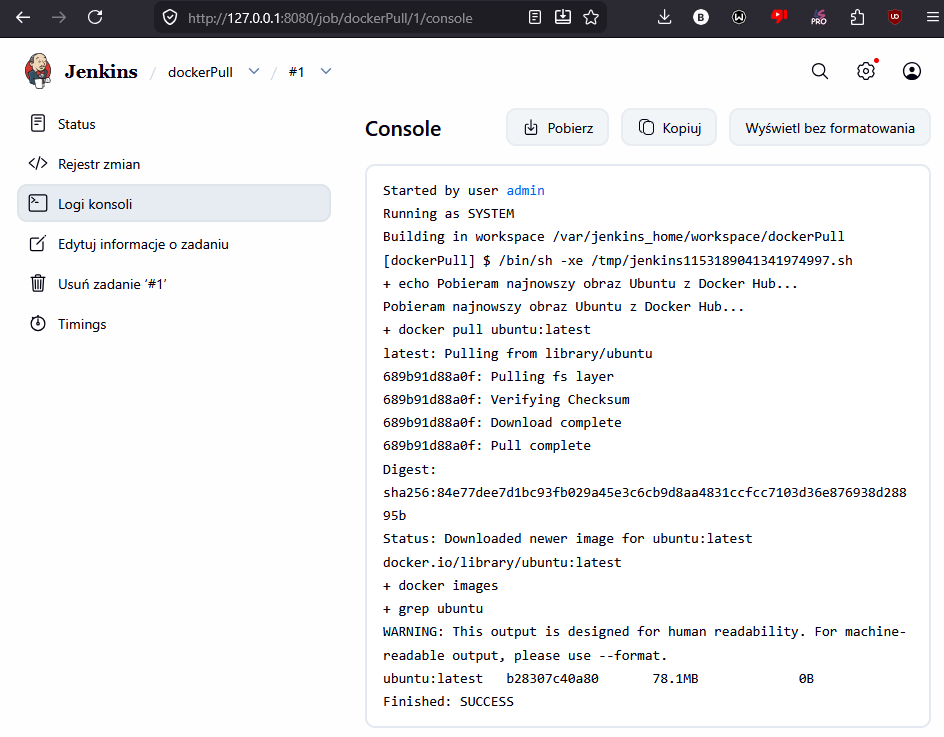
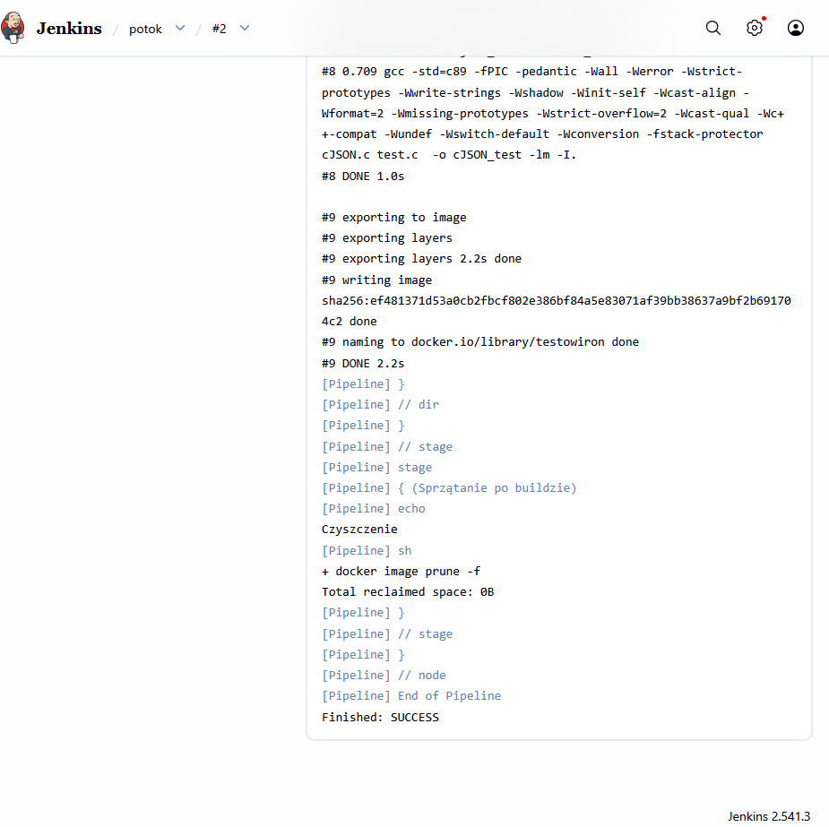

# Sprawozdanie 5
Bartłomiej Nosek
---

### Cel ćwiczenia
Celem było użytkowanie Jenkinsa, wstęp do pipeline'ów

### Przebieg laboratoriów
- utworzenie Dockerfile'a dla architektury DinD (z dokumentacji kod)

```console
FROM jenkins/jenkins:lts-jdk17
USER root
RUN apt-get update && apt-get install -y lsb-release
RUN curl -fsSLo /usr/share/keyrings/docker-archive-keyring.asc \
  https://download.docker.com/linux/debian/gpg
RUN echo "deb[arch=$(dpkg --print-architecture) \
  signed-by=/usr/share/keyrings/docker-archive-keyring.asc] \
  https://download.docker.com/linux/debian \
  $(lsb_release -cs) stable" > /etc/apt/sources.list.d/docker.list
RUN apt-get update && apt-get install -y docker-ce-cli
USER jenkins
RUN jenkins-plugin-cli --plugins "blueocean docker-workflow"
``` 

- zbudowanie obrazu `docker build -t my-jenkins-blueocean:1.0 -f Dockerfile.jenkins .`
- uruchomienie środowiska DinD i Jenkins
``` Dockerfile
docker run --name jenkins-blueocean --rm --detach \
  --network jenkins --env DOCKER_HOST=tcp://docker:2376 \
  --env DOCKER_CERT_PATH=/certs/client --env DOCKER_TLS_VERIFY=1 \
  --volume jenkins-data:/var/jenkins_home \
  --volume jenkins-docker-certs:/certs/client:ro \
  --publish 8080:8080 --publish 50000:50000 \
  my-jenkins-blueocean:1.0
```
- logi znajdują się na branch'u w pliku *txt*  
- stworzenie 3 projektów testowych:
- - *uname*
``` Bash
echo "Informacje o systemie:"
uname -a
```
- - *godzina nieparzysta*
```Bash
#!/bin/bash
HOUR=$(date +%H)
echo "Obecna godzina (UTC wewnątrz kontenera) to: $HOUR"

if [ $((10#$HOUR % 2)) -ne 0 ]; then
    echo "BŁĄD: Godzina jest nieparzysta! Zgłaszam awarię."
    exit 1
else
    echo "SUKCES: Godzina jest parzysta. Jedziemy dalej."
fi
```
- - *dockerPull*
```Bash
echo "Pobieram najnowszy obraz Ubuntu z Docker Hub..."
docker pull ubuntu:latest
docker images | grep ubuntu
```
- stworzenie pipeline do zaciągania obrazów z zajęć poprzednich
``` Groovy
pipeline {
    agent any

    stages {
        stage('Klonowanie repo') {
            steps {
                echo "pobieram z roepo"
                git branch: 'BN419779', url: 'https://github.com/InzynieriaOprogramowaniaAGH/MDO2026_ITE.git'
            }
        }
        
        stage('Weryfikacja plików') {
            steps {
                echo "Sprawdzam, co pobrano:"
                sh 'ls -la'
            }
        }

        stage('Zbudowanie Dockerfile') {
            steps {
                dir('BN419779/zajecia03') {
                    sh 'docker build -t testowiron -f Dockerfile.build .'
                }
            }
        }
        
        stage('Sprzątanie po buildzie') {
            steps {
                echo "Czyszczenie"
                sh 'docker image prune -f'
            }
        }
    }
}
```
### Dyskusje
1. **Blueocean a Jenkins**  
Oficjalny obraz Jenkins jest stary, posiada podstawowe wtyczki i przestarzały interfejs. obraz Blueocean jest nowocześniejsż, czytelniejszą wersją Jenkinsa
2. **Po co uruchamiać ponownie pipeline**
Służyło to pokazaniu działania *Cashe*. ostatni zrut ekranu pokazuje że 1 odpalenie zajmowało dużo dłużej niż nastepne. Pakiety Ubuntu lezą w *cashe* demona Dockera. 

### Zrzuty ekranu









