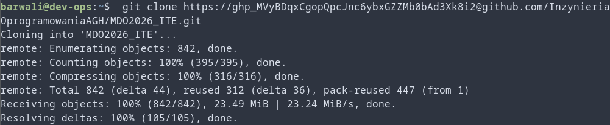
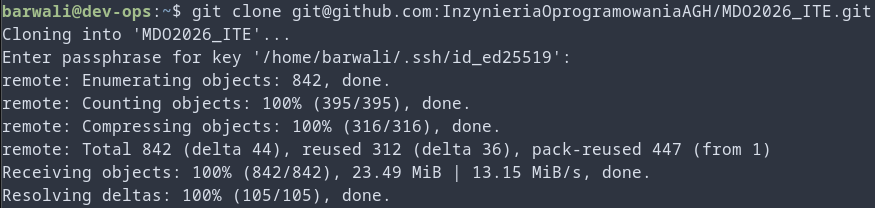
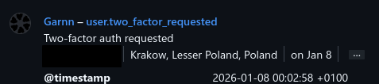
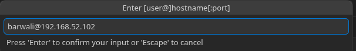
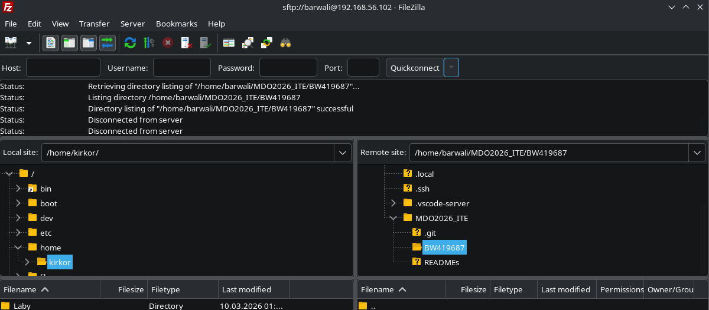
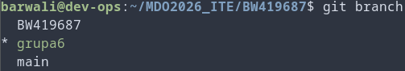
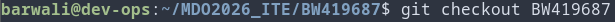
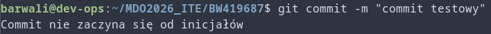
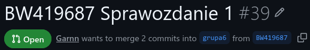

Wszystkie poniższe czynności jeśli nie jest wspomniane, że zostały wykonane na maszynie lokalnej, to zostały wykonane na maszynie wirtualnej za pomocą SSH.
# Git
1. Zainstalowany VM jest oparty na Ubuntu Server, więc klient Git i obsługa kluczy SSH już były zainstalowane
2. 
# SSH
1. Już posiadałem załączone w koncie Github klucze SSH 
2. 2FA też 
# Narzędzia
1. Korzystam z edytora VS Codium z rozszerzeniem Open Remote - SSH (wykonane na localhoscie)


2. Korzystam z Fillezilli do przesyłania plików (wykonane na localhoscie)

# Gałąź
1. 
2. 
3. Po sprawdzeniu przykładowych hooków, stworzyłem w nowym folderze "BW419687" nowy hook o nazwie commit-msg o treści:
```
#!/bin/bash

COMMIT_MSG="$1"
INICJALY="BW419687"

LINE=$(head -n 1 "$COMMIT_MSG")

if [[ "$LINE" != "$INICJALY"* ]]; then
	echo "Commit nie zaczyna się od inicjałów"
	exit 1
fi

exit 0
```
Następnie tak powstały hook skopiowałem do folderu .ssh/hooks i spróbowałem napisać niepoprawny commit:

Commit został przyjęty tylko przy poprawnych inicjałach:  \
Następnie wprowadziłem zmiany na zdalne źródło i przygotowałem pull request:


# Historia Bash
```
    1  ip a
    2  sudo nano /etc/ssh/sshd_config
    3  sudo systemctl restart ssh
    4  shutdown now
    5  ping 8.8.8.8
    6  ping www.google.com
    7  ls
    8  cd MDO2026_ITE/
    9  git checkout grupa6
    10  git branch
    11  git checkout BW419687
    12  cd BW419687/
    13  history
```