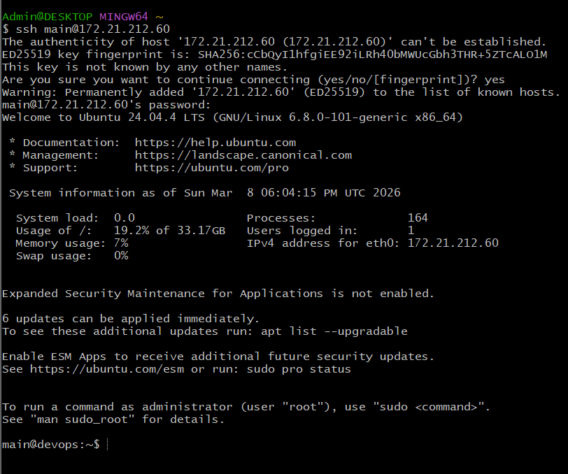
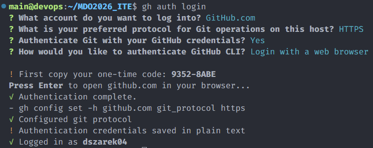
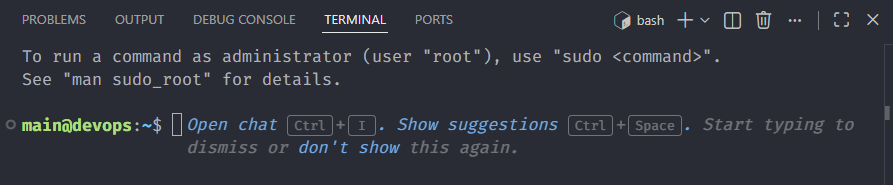
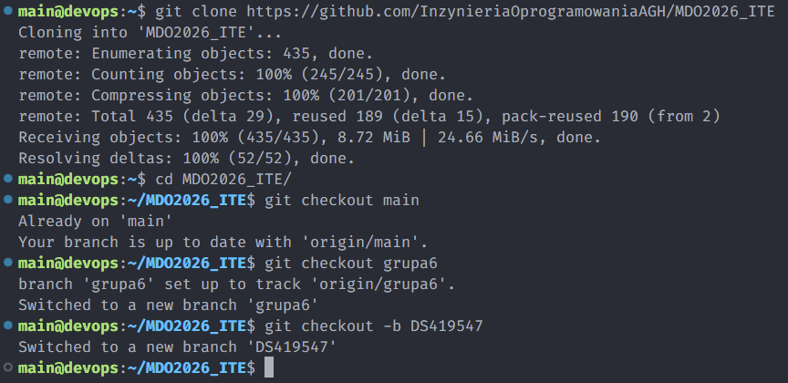
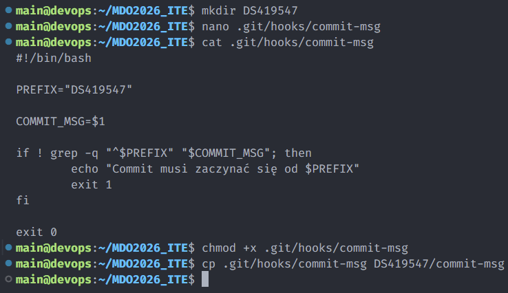
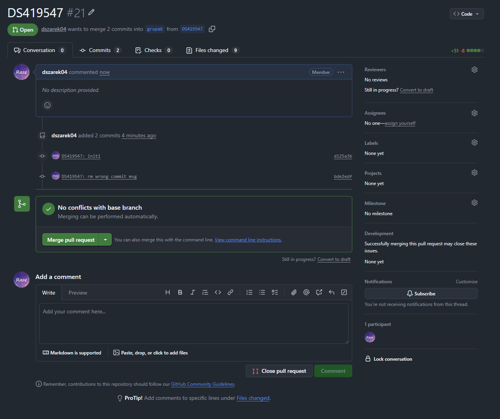

## 1. Dostęp do maszyny



## 2. Zainstalowany Git


## 3. Zalogowany Git



## 4. Konfiguracja VS Code Remote



## 5. Praca na gałęziach



## 6. Konfiguracja git hooka



Git hook o treści:
```bash
#!/bin/bash

PREFIX="DS419547"

COMMIT_MSG=$1

if ! grep -q "^$PREFIX" "$COMMIT_MSG"; then
        echo "Commit musi zaczynać się od $PREFIX"
        exit 1
fi

exit 0
```

## 7. Pull Request

