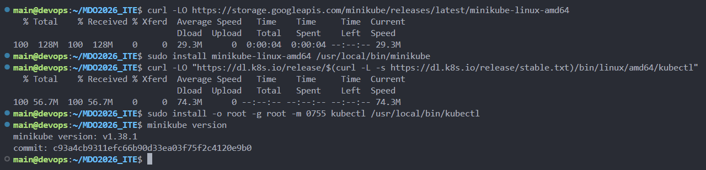
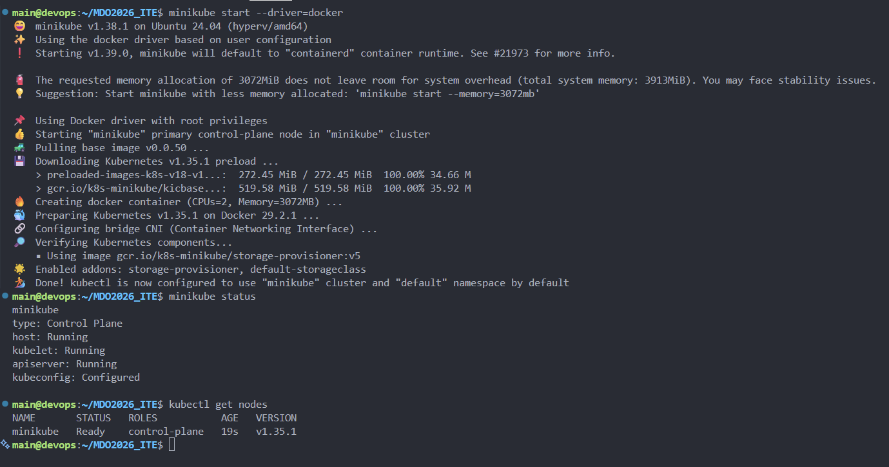
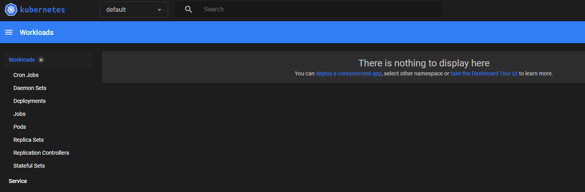
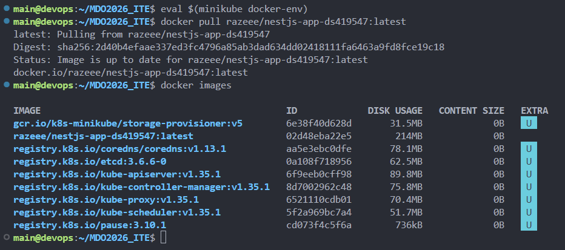
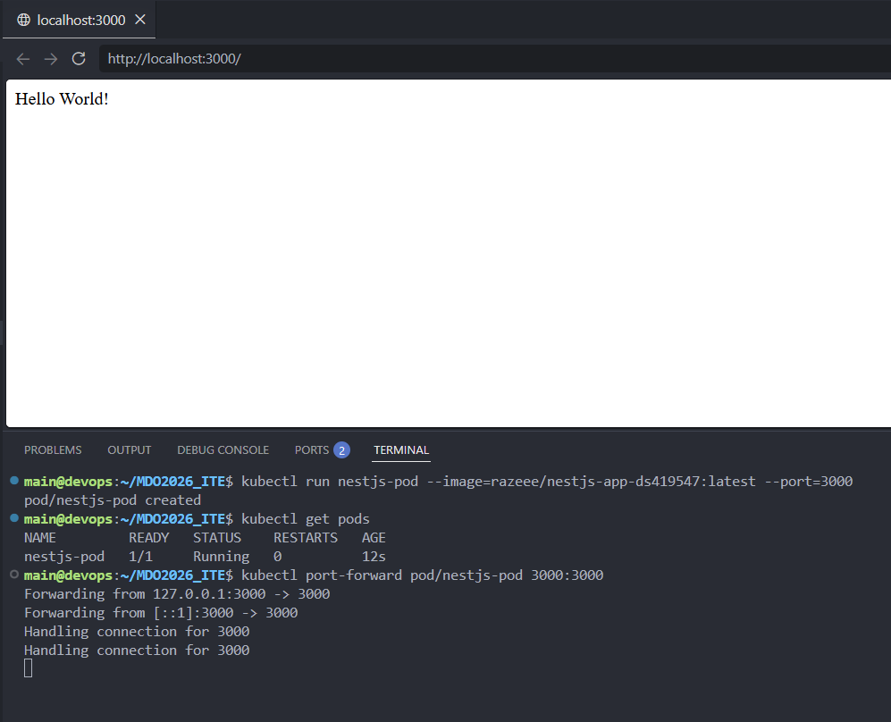
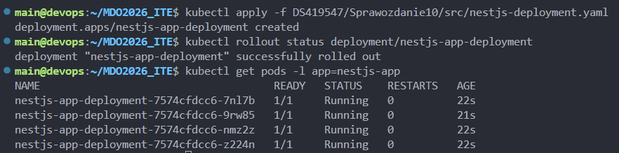
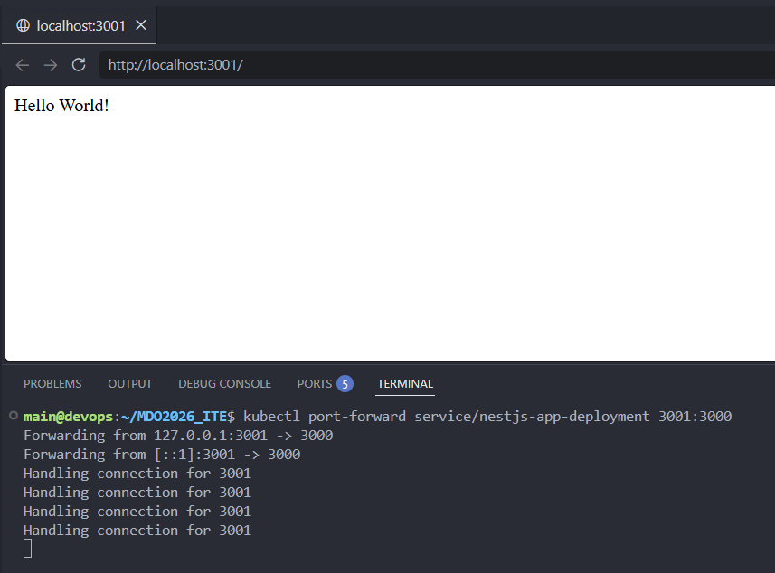

# Sprawozdanie 10

## Cel zajęć
Podczas ćwiczeń wdrażano aplikację na kontenery przy użyciu Kubernetes. Zrealizowano "Deploy to cloud" wykorzystując klaster lokalny minikube i przeprowadzono wdrożenie deklaratywne oparte na YAML.

## 1. Przygotowanie klastra Kubernetes
Pracę rozpoczęto od instalacji binarek minikube i kubectl, które umożliwiają zarządzanie zasobami klastra z poziomu terminala. Po konfiguracji narzędzi uruchomiono klaster poleceniem `minikube start --driver=docker`. Proces ten tworzy wirtualną maszynę wewnątrz kontenera Docker i konfiguruje lokalny węzeł. Poprawność łączności z API klastra potwierdzono przez weryfikację statusu węzła i pobranie informacji o klastrze komendą `kubectl cluster-info`. Na koniec uruchomiono interfejs graficzny, który pozwala na wizualizację stanu wdrożeń i diagnozę ewentualnych błędów w podach.

---




## 2. Analiza i przygotowanie kontenera
Do realizacji zadania wykorzystano aplikację NestJS przygotowaną w ramach poprzednich ćwiczeń. Obraz `razeee/nestjs-app-ds419547:latest` pobrano z rejestru zewnętrznego do lokalnego środowiska minikube. Aby operacje na obrazach były możliwe wewnątrz węzła klastra, przełączono kontekst Dockera za pomocą `eval $(minikube docker-env)`. Wykorzystanie `docker pull` w tym środowisku eliminuje potrzebę wypychania obrazu do zewnętrznego repozytorium przy każdej zmianie kodu. Dostępność obrazu sprawdzono poleceniem `docker images`, upewniając się, że Kubernetes może go uruchomić bez konieczności ponownego pobierania przez sieć zewnętrzną.

---


## 3. Manualne uruchomienie aplikacji
W ramach testów przeprowadzono ręczne uruchomienie pojedynczej instancji aplikacji (czyli Pod) celem weryfikacji konfiguracji sieciowej i poprawności obrazu. Pod został powołany do życia poleceniem `kubectl run` z mapowaniem portu 3000 i wykorzystaniem pobranego wcześniej obrazu. Ze względu na izolację sieciową sterownika docker zastosowano mechanizm port-forwardingu, co pozwoliło na uzyskanie łączności z aplikacją z poziomu hosta. Test w przeglądarce pod adresem `localhost:3000` potwierdził poprawny start serwera NestJS i jego zdolność do obsługi zapytań.

---


## 4. Wdrożenie deklaratywne (IaC) i skalowanie
Kolejny krok obejmował zdefiniowanie infrastruktury w pliku `nestjs-deployment.yaml`. W tym dokumencie opisano stan pożądany klastra i skonfigurowano wdrożenie na 4 repliki celem imitacji zapewnienia wysokiej dostępności aplikacji.

Fragment pliku `src/nestjs-deployment.yaml`:
```yaml
apiVersion: apps/v1
kind: Deployment
metadata:
  name: nestjs-app-deployment
spec:
  replicas: 4
  selector:
    matchLabels:
      app: nestjs-app
  template:
    metadata:
      labels:
        app: nestjs-app
    spec:
      containers:
      - name: nestjs-container
        image: razeee/nestjs-app-ds419547:latest
        ports:
        - containerPort: 3000
```

Konfigurację wdrożono poleceniem `kubectl apply -f src/nestjs-deployment.yaml`, co wymusiło na Kubernetesie powołanie brakujących instancji. Status operacji monitorowano przez `kubectl rollout status` do momentu, aż wszystkie 4 kontenery przeszły testy. Ostateczną liczbę uruchomionych jednostek sprawdzono komendą `kubectl get pods`, która potwierdziła poprawne rozłożenie obciążenia.

---


## 5. Ekspozycja aplikacji jako serwis
Ostatni etap polegał na utworzeniu obiektu typu Service, który zapewnia stały punkt dostępowy i równoważy obciążenie między pody. Wdrożenie wyeksponowano jako serwis typu NodePort, co przypisało mu konkretny port na wszystkich węzłach klastra. Celem bezpiecznego dostępu lokalnego ponownie wykorzystano przekierowanie portu poleceniem `kubectl port-forward service/nestjs-app-deployment 3001:3000`. Weryfikacja w przeglądarce potwierdziła stabilność połączenia i poprawne działanie wewnętrznego mechanizmu load balancera.

---


## Wnioski
Zastosowanie Kubernetesa pozwoliło na pełną separację definicji infrastruktury od procesu jej uruchamiania. Przejście z ręcznego zarządzania kontenerami na model deklaratywny YAML pozwala na automatyczne utrzymanie pożądanego stanu aplikacji. Orkiestrator sam dba o skalowanie i samonaprawę w przypadku awarii pojedynczych instancji, co znacząco zwiększa niezawodność całego systemu.
