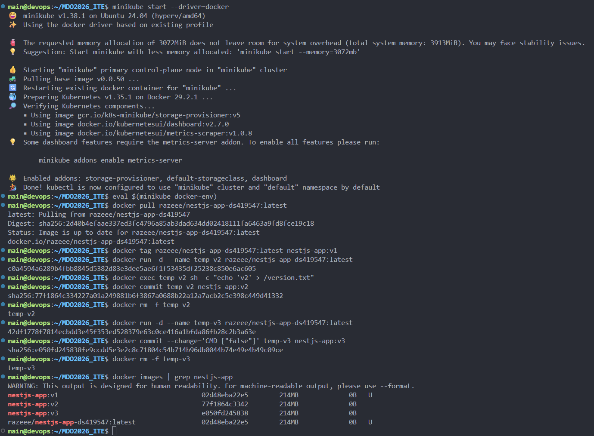
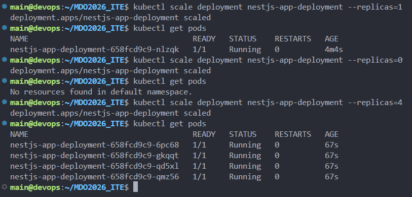
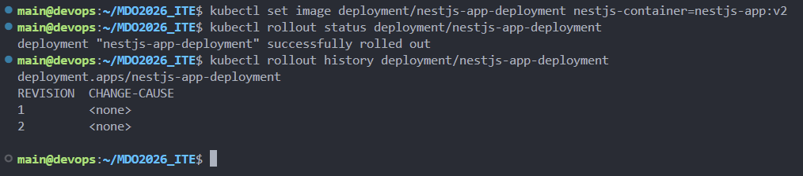
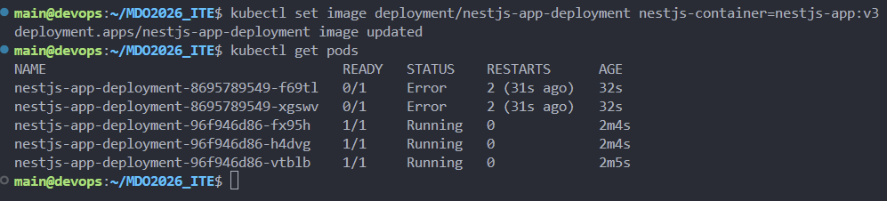
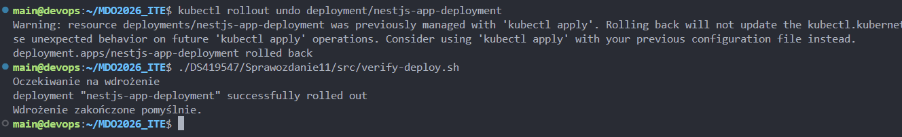
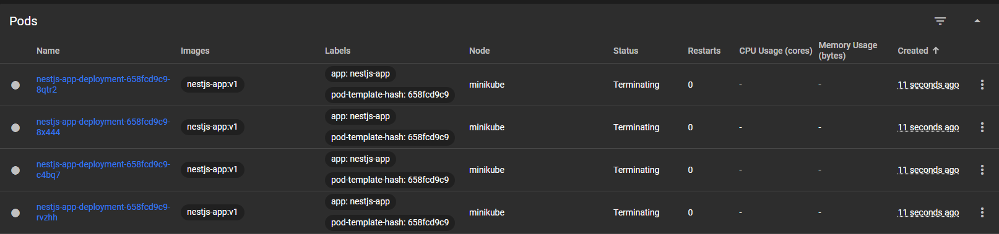
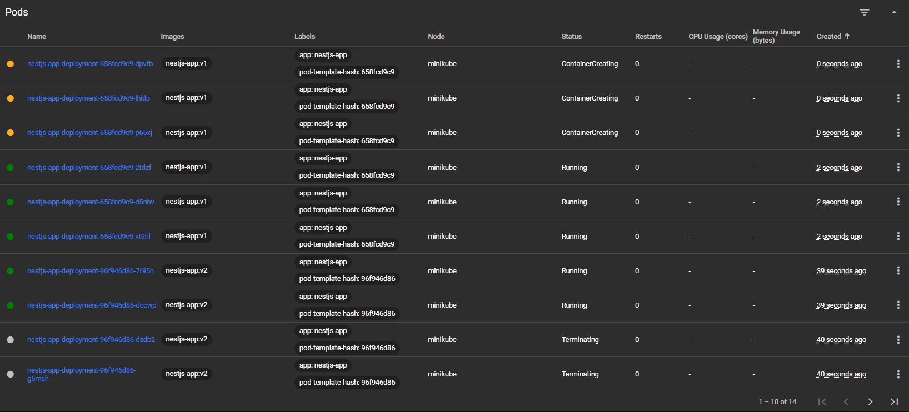
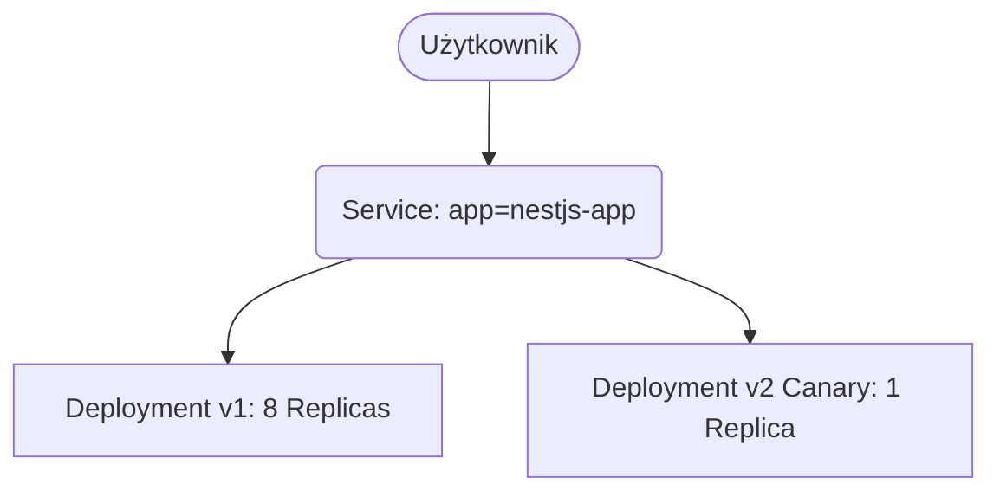
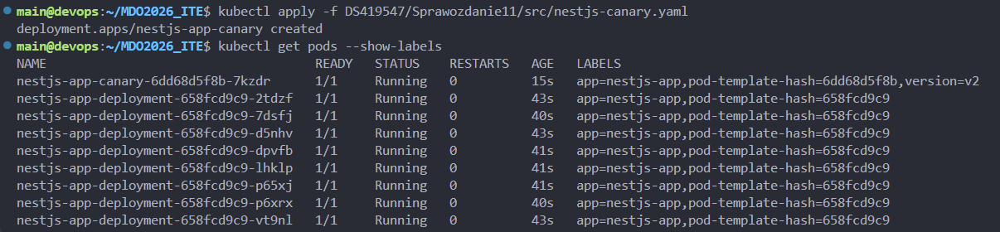

# Sprawozdanie 11

## Cel zajęć
Celem ćwiczenia było zapoznanie się z mechanizmami zarządzania wdrożeniami w Kubernetes. Zadanie wyjaśniało kontrolę cyklu życia, zarządzanie wersjami obrazów w minikube, procesy skalowania, rollbacki używając historii wdrożeń i implementację strategii aktualizacji (Recreate, Rolling Update, Canary).

## 1. Wersjonowanie i przygotowanie obrazów
Praca z klastrem lokalnym wymagała zapewnienia dostępu do wersji aplikacji wewnątrz węzła. Zamiast publikować obrazy w zewnętrznym rejestrze, wykorzystano mechanizm wstrzykiwania zmiennych środowiskowych Docker z minikube (`eval $(minikube docker-env)`).

Kroki:
- Pobrano bazowy obraz NestJS i oznaczono go jako `nestjs-app:v1`.
- Wykorzystując komendę `docker commit`, utworzono nową wersję `nestjs-app:v2` symulującą aktualizację kodu.
- Przygotowano wersję `nestjs-app:v3` z nadpisanym poleceniem startowym, aby sztucznie wywołać awarię typu CrashLoopBackOff.



## 2. Skalowanie i cykl życia wdrożenia
Plik wdrożenia został zmodyfikowany do korzystania z lokalnego obrazu wersji bazowej. Wykorzystano `kubectl apply`, co powołało do życia pożądany stan klastra.

Testy skalowania:
- Wykorzystano komendę `kubectl scale` do dynamicznej zmiany liczby replik.
- Zmiana liczby replik na 1 zredukowała klaster do pojedynczego poda.
- Przetestowano przeskalowanie klastra do zera podów, co spowodowało komunikat "No resources found" i całkowite zwolnienie zasobów aplikacji w przestrzeni nazw.
- Po testach przywrócono stan z czterema replikami.



## 3. Aktualizacje i mechanizmy obronne
Mechanizm Deployment w Kubernetes kontroluje tworzenie nowych obiektów ReplicaSet przy każdej zmianie konfiguracji obrazu.

Aktualizacja i błędy:
- Przejście na nową wersję odbyło się przez komendę `kubectl set image`. 
- Sprawdzono historię wdrożeń przez `kubectl rollout history`.
- Wykorzystano wersję `v3` do symulacji wadliwego kodu. Kubernetes wychwycił problem, wstrzymując aktualizację. Zrzut ekranu wykazuje obecność 2 nowych podów w stanie `Error` i 3 działających podów starszej wersji (`Running`), co zapobiegło całkowitej awarii systemu dla użytkowników.
- Wykonano operację `kubectl rollout undo`, która wycofała zepsute wdrożenie i przywróciła stabilną wersję aplikacji, co zostało potwierdzone skryptem weryfikującym.





## 4. Automatyzacja kontroli wdrożenia
Zaimplementowano skrypt Bash weryfikujący stan operacji rollout. 
Skrypt `verify-deploy.sh` wykorzystuje komendę `kubectl rollout status` z limitem czasu wynoszącym 60 sekund. Konstrukcja instrukcji warunkowej sprawdza kod wyjścia, przerywając działanie z kodem błędu, jeśli proces wdrażania ulegnie zawieszeniu lub nie powiedzie się w minutę. Wynik działania skryptu ("Wdrożenie zakończone pomyślnie") udokumentowano na wcześniejszym zrzucie z operacji rollback.

## 5. Strategie wdrażania

### Strategia Recreate
W podejściu Recreate wdrożenie najpierw kończy pracę wszystkich instancji starej wersji przed rozpoczęciem powoływania nowych. Strategia ta eliminuje problemy ze zgodnością dwóch pracujących równocześnie wersji kodu, ale powoduje czasową niedostępność systemu. Potwierdza to zrzut ekranu z panelu minikube Dashboard, na którym widać 4 pody znajdujące się jednocześnie w stanie `Terminating`.

Kluczowy fragment pliku `nestjs-recreate.yaml`:
```yaml
apiVersion: apps/v1
kind: Deployment
metadata:
  name: nestjs-app-deployment
spec:
  replicas: 4
  strategy:
    type: Recreate
  selector:
    matchLabels:
      app: nestjs-app
  template:
    metadata:
      labels:
        app: nestjs-app
    spec:
      containers:
      - name: nestjs-container
        image: nestjs-app:v1
        imagePullPolicy: IfNotPresent
        ports:
        - containerPort: 3000
```



### Strategia Rolling Update
Domyślna strategia w Kubernetes. Pody są podmieniane sekwencyjnie. Ustawiono parametry ograniczające niedostępność, co gwarantuje płynne przejęcie ruchu bez przerw w dostępie do usług. Zrzut ekranu z panelu Dashboard demonstruje jednoczesne współistnienie podów w trzech stanach operacyjnych: `ContainerCreating` (tworzenie nowych podów), `Running` (praca stabilna starej i nowej wersji) i `Terminating` (wygaszanie starych podów).

Kluczowy fragment pliku `nestjs-rolling.yaml`:
```yaml
apiVersion: apps/v1
kind: Deployment
metadata:
  name: nestjs-app-deployment
spec:
  replicas: 8
  strategy:
    type: RollingUpdate
    rollingUpdate:
      maxUnavailable: 1
      maxSurge: 25%
  selector:
    matchLabels:
      app: nestjs-app
  template:
    metadata:
      labels:
        app: nestjs-app
    spec:
      containers:
      - name: nestjs-container
        image: nestjs-app:v1
        imagePullPolicy: IfNotPresent
        ports:
        - containerPort: 3000
```



### Strategia Canary
Wdrożenie Canary polega na wprowadzeniu do klastra małej podgrupy podów z nową wersją, która pracuje równolegle z wersją główną. Pozwala to przetestować nową wersję na ograniczonym zbiorze użytkowników. Zrzut ekranu terminala wizualizuje istnienie 8 podów głównego wdrożenia i jednego dodatkowego poda z wdrożenia Canary, wyróżnionego etykietą `version=v2`. Oba wdrożenia współdzielą etykietę główną `app=nestjs-app`, co pozwala serwisom na kierowanie do nich ruchu.

Kluczowy fragment pliku `nestjs-canary.yaml`:
```yaml
apiVersion: apps/v1
kind: Deployment
metadata:
  name: nestjs-app-canary
spec:
  replicas: 1
  selector:
    matchLabels:
      app: nestjs-app
      version: v2
  template:
    metadata:
      labels:
        app: nestjs-app
        version: v2
    spec:
      containers:
      - name: nestjs-container
        image: nestjs-app:v2
        imagePullPolicy: IfNotPresent
        ports:
        - containerPort: 3000
```





## Wnioski
Wykorzystanie Kubernetes pozwala na zarządzanie cyklem życia oprogramowania. Obiekty typu Deployment zapewniają bezprzerwowe aktualizacje i wersjonowanie historii infrastruktury. Możliwość automatycznego wycofania zmian ratuje system przed skutkami wadliwych aktualizacji. Zastosowanie dedykowanych strategii, jak Rolling Update i Canary, zmniejsza ryzyko implementacyjne przy publikacji nowego kodu na środowiska produkcyjne.
