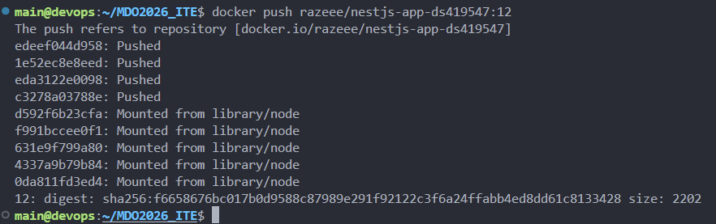
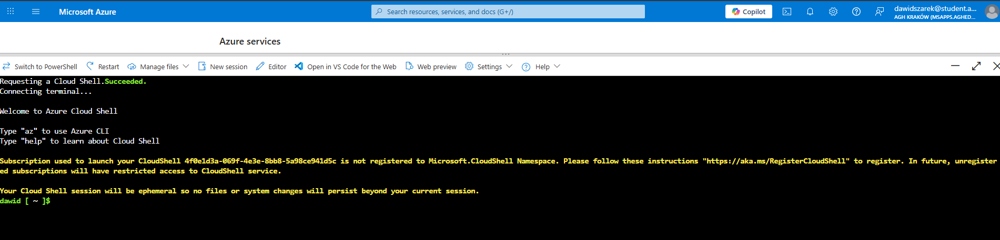
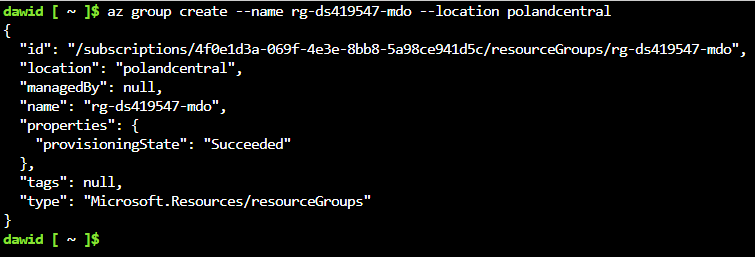
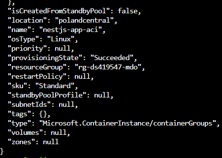
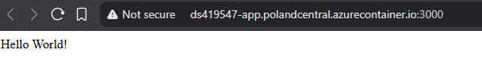
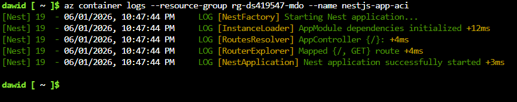
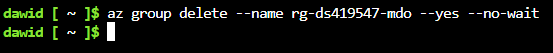

# Sprawozdanie 12

## Cel zajęć
Celem ćwiczenia było zapoznanie się z PaaS w Azure. Zadanie polegało na wdrożeniu aplikacji jako ACI, czyli Azure Container Instances. Ćwiczenie wymagało konfiguracji grupy zasobów, rejestracji dostawców usług i uruchomienia kontenera.

## 1. Przygotowanie obrazu
Pierwszym krokiem było przygotowanie obrazu aplikacji i przesłanie go do rejestru. Wykorzystano lokalnego Dockera do zbudowania obrazu na podstawie Dockerfile z poprzednich zajęć i otagowania go wersją `12`.

Kroki:
- Zbudowano obraz komendą `docker build`.
- Zalogowano się do Docker Hub.
- Wypchnięto obraz `razeee/nestjs-app-ds419547:12` do repozytorium.



## 2. Konfiguracja środowiska Azure
Praca w chmurze wymagała użycia Azure Cloud Shell. Ze względu na ograniczenia subskrypcji studenckiej, konieczne było wykonanie dodatkowych kroków.

Kroki:
- Uruchomiono Azure Cloud Shell w trybie Bash.
- Zarejestrowano dostawcę `Microsoft.ContainerInstance` za pomocą komendy `az provider register`, bo usługa nie była domyślnie aktywna.
- Stworzono grupę zasobów `rg-ds419547-mdo` w regionie `polandcentral`.




## 3. Wdrażanie kontenera na ACI
Wdrożenie zostało przeprowadzone za pomocą Azure CLI. Przy wdrażaniu napotkano na problemy z automatycznym rozpoznawaniem systemu operacyjnego i limitami zasobów, co wymusiło podanie parametrów w komendzie.

Polecenie wdrożeniowe:
```bash
az container create \
  --resource-group rg-ds419547-mdo \
  --name nestjs-app-aci \
  --image razeee/nestjs-app-ds419547:12 \
  --dns-name-label ds419547-app \
  --ports 3000 \
  --ip-address public \
  --location polandcentral \
  --os-type Linux \
  --cpu 1 \
  --memory 1.5
```



## 4. Weryfikacja i logi
Po zakończeniu procesu wdrażania ("provisioningState": "Succeeded"), sprawdzono dostępność aplikacji pod wygenerowanym adresem. Aplikacja serwowała treść na porcie 3000. Dodatkowo sprawdzono logi kontenera, żeby upewnić się, że proces wystartował bez błędów.

Status usługi:
FQDN: `ds419547-app.polandcentral.azurecontainer.io`
Stan instancji: `Running`




## 5. Sprzątanie zasobów
Ostatnim etapem było całkowite usunięcie grupy zasobów, żeby uniknąć naliczania kosztów po końcu ćwiczenia. Komenda `az group delete` usunęła jednocześnie kontener, adres IP i wszystkie powiązane metadane.



## Wnioski
Wdrażanie na Azure Container Instances jest znacznie szybsze niż konfiguracja pełnego klastra Kubernetes, ale wymaga zdefiniowania zasobów i uprawnień. Usługa ACI rzeczywiście upraszcza cykl życia aplikacji, pozwalając na szybkie uruchomienie kontenera bezpośrednio z Docker Hub bez zarządzania infrastrukturą serwerową.