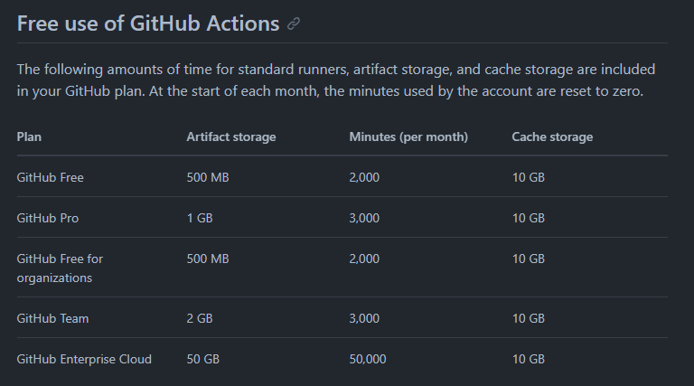
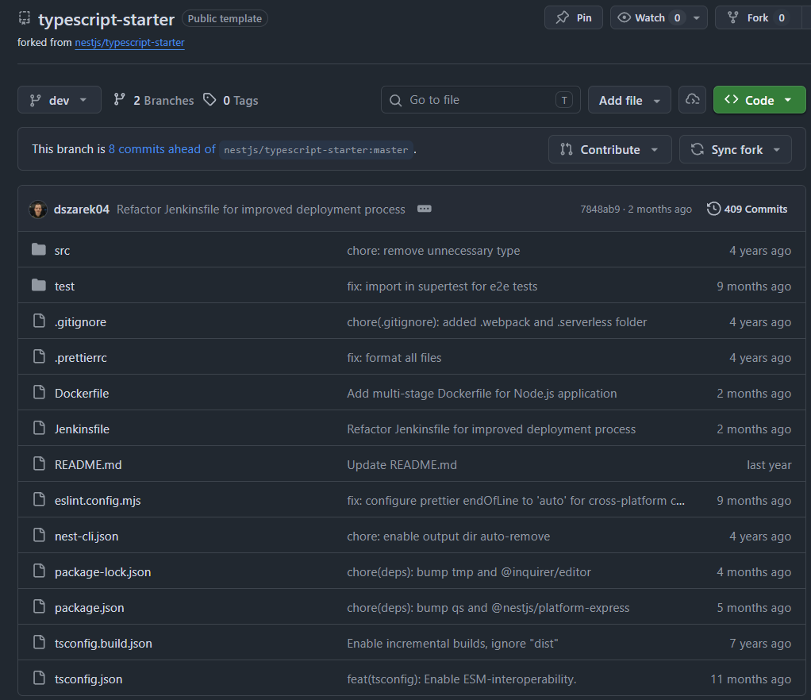
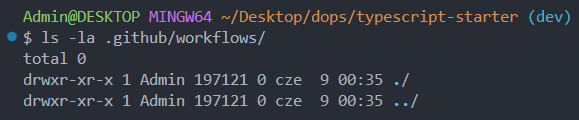
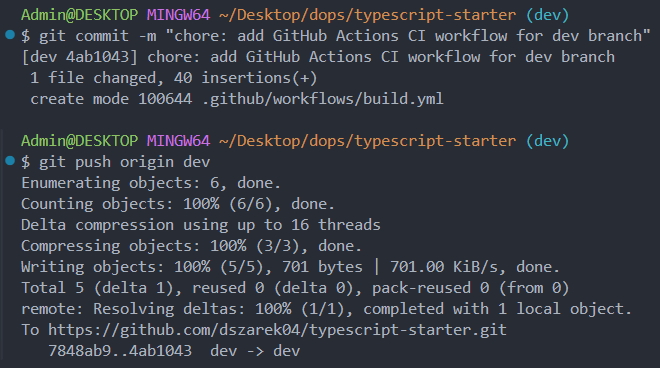
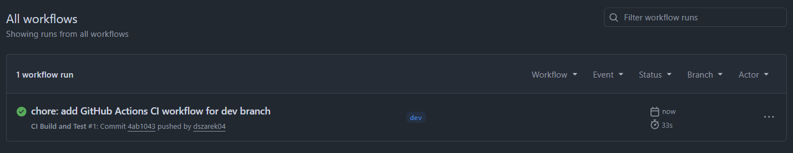
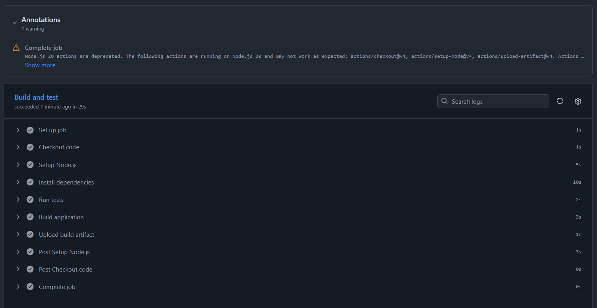
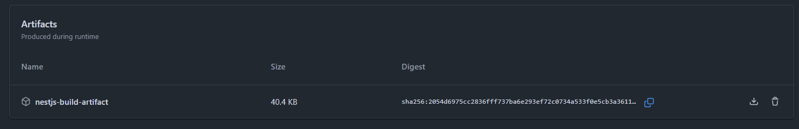

# Sprawozdanie 13

## Cel zajęć
Celem ćwiczenia było zapoznanie się z koncepcją *shift-left* i automatyzacją procesów integracyjnych za pomocą **GitHub Actions**. Zadanie polegało na wdrożeniu automatycznego budowania, testowania i publikacji artefaktów dla projektu.

## 1. Analiza cennika i limitów planu darmowego
Pierwszym krokiem było przeanalizowanie oficjalnego cennika i limitów dla darmowego planu GitHub Actions. 
- Dla planu **GitHub Free** limit przestrzeni na przechowywanie artefaktów wdrożeniowych wynosi **500 MB**.
- Limit darmowych minut maszynowych (Linux) wynosi **2000 minut** na miesiąc dla repozytoriów prywatnych (dla repozytoriów publicznych procesy GitHub Actions są całkowicie bezpłatne i nielimitowane).
- Współdzielona pamięć podręczna dla każdego z planów wynosi **10 GB**.



> [!NOTE]
> Jako że posiadam studenckie konto GitHub, to mam plan Pro, więc limity artefaktów wynoszą 1 GB, a limity minut 3000.

## 2. Konfiguracja gałęzi i czyszczenie środowiska
Jako bazę kodu wykorzystano sforkowane we wcześniejszych ćwiczeniach publiczne repozytorium szablonu NestJS:
- **Adres forka:** `https://github.com/dszarek04/typescript-starter`

W repozytorium wybrano gałąź **`dev`**.

Przed wdrożeniem nowego procesu sprawdzono stan workflow w lokalnym środowisku:
- Wykonano komendę `ls -la .github/workflows/` w celu weryfikacji, czy w projekcie nie znajdują się stare/domyślne konfiguracje.




## 3. Implementacja i wdrożenie pliku Workflow
W ścieżce `.github/workflows/` utworzono plik `build.yml` z konfiguracją CI. Wyzwalaczami potoku są `push` i `pull_request` skierowane na gałąź `dev`. 

```yml
name: CI Build and Test

on:
  push:
    branches:
      - dev
  pull_request:
    branches:
      - dev
...
```

Potok pobiera kod, konfiguruje środowisko Node.js 20 razem z cache'owaniem modułów npm, instaluje zależności przez czystą instalację `npm ci`, wykonuje testy jednostkowe `npm test` i w końcu buduje aplikację za pomocą `npm run build`. Na koniec spakowany katalog `dist/` jest eksportowany jako artefakt.

```yml
...
jobs:
  build-and-test:
    name: Build and test
    runs-on: ubuntu-latest

    steps:
      - name: Checkout code
        uses: actions/checkout@v4

      - name: Setup Node.js
        uses: actions/setup-node@v4
        with:
          node-version: 20
          cache: 'npm'

      - name: Install dependencies
        run: npm ci

      - name: Run tests
        run: npm test

      - name: Build application
        run: npm run build

      - name: Upload build artifact
        uses: actions/upload-artifact@v4
        with:
          name: nestjs-build-artifact
          path: dist/
          retention-days: 7
```

### Przebieg operacji Git w terminalu:
W lokalnym terminalu dodano pliki do indeksu, wykonano commit i wypchnięto zmiany:
```bash
$ git commit -m "chore: add GitHub Actions CI workflow for dev branch"
[dev 4ab1043] chore: add GitHub Actions CI workflow for dev branch
 1 file changed, 40 insertions(+)
 create mode 100644 .github/workflows/build.yml

$ git push origin dev
```
Wypychanie zakończyło się sukcesem, aktualizując zdalne repozytorium.



## 4. Przebieg i weryfikacja automatyzacji
Po wypchnięciu commita, GitHub automatycznie wykrył zmianę i wyzwolił pierwsze uruchomienie **CI Build and Test #1**. 
- Cały potok wdrożeniowy zakończył się pomyślnie (zielony status) i trwał **33 sekundy**.
- Samo zadanie **Build and test** na maszynie wirtualnej `ubuntu-latest` trwało **29 sekund**.

### Czasy wykonania poszczególnych kroków zadania:
- **Set up job:** 1s
- **Checkout code:** 1s (pobranie repozytorium przez `actions/checkout@v4`)
- **Setup Node.js:** 5s (konfiguracja środowiska v20 i cache'owania)
- **Install dependencies:** 10s (wykonanie `npm ci` instalującego pakiety z package-lock.json)
- **Run tests:** 2s (wykonanie testów jednostkowych za pomocą `npm test`)
- **Build application:** 3s (skompilowanie kodu TypeScript do JS w katalogu `dist/` za pomocą `npm run build`)
- **Upload build artifact:** 1s (przesłanie spakowanych plików za pomocą `actions/upload-artifact@v4`)

Podczas uruchomienia konsola GitHub Actions zgłosiła jedno ostrzeżenie informujące o planowanym wycofaniu środowiska wykonawczego opartego o Node.js 20 w oficjalnych akcjach na rzecz wersji Node.js 22.




## 5. Publikacja i weryfikacja artefaktów
W podsumowaniu wykonania potoku w sekcji **Artifacts** poprawnie opublikowano artefakt wdrożeniowy:
- **Nazwa:** `nestjs-build-artifact`
- **Rozmiar:** **`40.4 KB`**
- **Suma kontrolna:** `sha256:2054d6975cc2836fff737ba6e293ef72c0734a533f0e5cb3a3611...`

Mały rozmiar artefaktu wynika z faktu, że skopiowano tylko skompilowany katalog dystrybucyjny `dist/` zawierający wynikowe pliki JavaScript bez ważącego kilkadziesiąt megabajtów katalogu `node_modules`.



## Wnioski
Integracja **GitHub Actions** automatyzuje proces kontroli jakości kodu. Testy jednostkowe i poprawność kompilacji TypeScript są weryfikowane od razu po każdym commicie programisty na gałąź `dev`, co chroni gałąź przed uszkodzeniem. Zastosowanie chmurowego środowiska CI eliminuje narzut administracyjny związany z konfiguracją lokalnych serwerów (jak Jenkins) – cały proces dzieje się w bezpiecznej, izolowanej chmurze dostarczanej przez GitHuba. Krok `Setup Node.js` z obsługą pamięci podręcznej (`cache: 'npm'`) znacząco skraca czas budowania przy częstych commitach, optymalizując zużycie limitu darmowych minut. Publikacja wyjściowej wersji kompilacji jako artefaktu o wielkości **`40.4 KB`** (wyłączenie z archiwum folderu `node_modules`) to dobra praktyka pozwalająca na szybkie przesyłanie spakowanej aplikacji na serwer docelowy i instalowanie tylko zależności produkcyjnych na środowisku uruchomieniowym.
