# Sprawozdanie 2
**Autor:** Maciej Szewczyk (MS422035)  
**Kierunek:** ITE  
**Grupa:** G6  

## 1. Instalacja środowiska Docker
Zgodnie z instrukcją, dokonałem instalacji silnika Docker w systemie Linux. Wykorzystałem pakiety dystrybucyjne (`docker.io`).

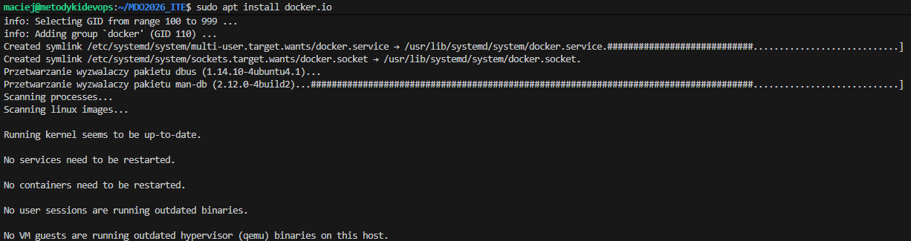

## 2. Testowanie i analiza obrazów
Pobrałem i uruchomiłem szereg obrazów w celu weryfikacji ich działania oraz analizy kodów wyjścia (Exit Code).

* **Exit Code 0:** Oznacza sukces – proces wewnątrz kontenera zakończył się pomyślnie (np. program wykonał swoje zadanie i zamknął się zgodnie z planem).
* **Exit Code 1:** Sygnalizuje błąd ogólny, np. błąd w kodzie aplikacji lub brak wymaganego pliku.

Podczas testów wszystkie analizowane obrazy zakończyły się kodem **0**.

### Przegląd uruchomionych obrazów:
**Hello-World:** Pierwszy test poprawności komunikacji z demonem Dockera.
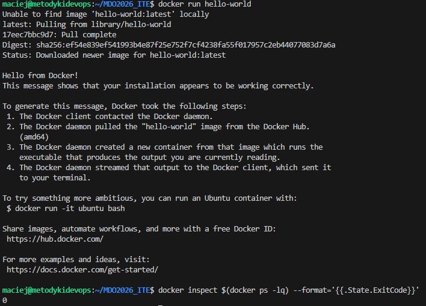

**Ubuntu:** Uruchomienie bazowego systemu Linux.
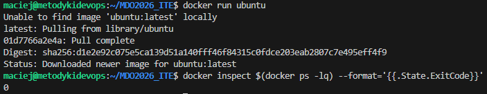

**MariaDB:** Weryfikacja pobierania i startu bazy danych.
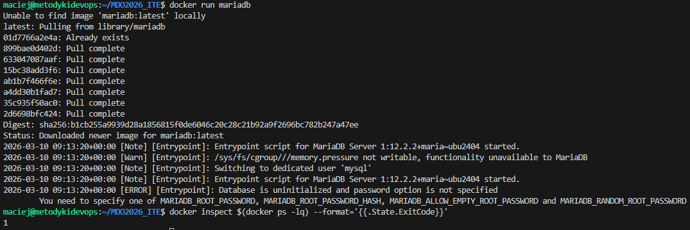

**Obrazy .NET (Microsoft):** Analiza środowisk o różnym przeznaczeniu.
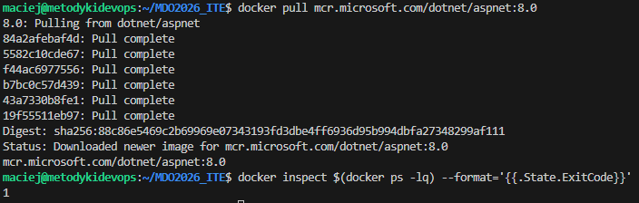
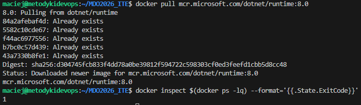
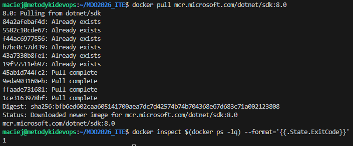

### Analiza rozmiarów
Użyłem komendy `docker images`, aby zestawić rozmiary obrazów. Widoczna jest znacząca różnica: obraz `sdk` (ponad 800MB) jest znacznie cięższy od `runtime`, ponieważ zawiera komplet narzędzi kompilacyjnych.

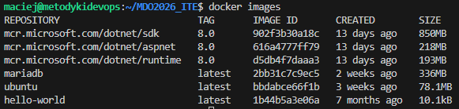

## 3. Praca z obrazem Busybox
Busybox, jako minimalistyczny zestaw narzędzi Unixowych, posłużył do testów interaktywnych.
* **Uruchomienie standardowe:**
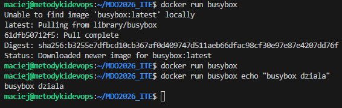
* **Wywołanie wersji w trybie interaktywnym (`-it`):**
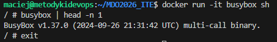

## 4. Izolacja procesów (Ubuntu)
Kluczowym elementem zadania było sprawdzenie mechanizmu izolacji PID. Po uruchomieniu bash w kontenerze:
* **Wewnątrz kontenera:** Bash zgłasza się jako **PID 1**.
* **Na hoście:** Ten sam proces posiada wysoki, systemowy numer PID.
Dowodzi to, że kontener posiada własną przestrzeń nazw procesów, niezależną od gospodarza.

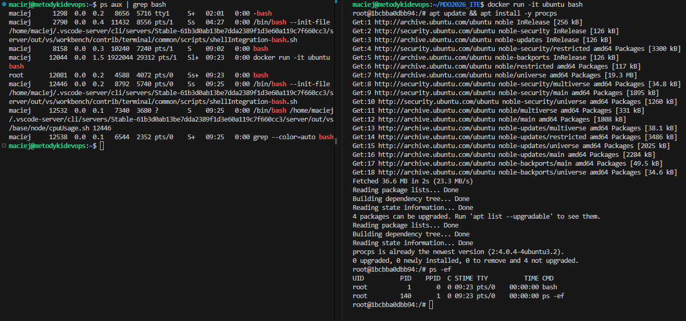

## 5. Budowa własnego obrazu (Dockerfile)
Przygotowałem plik `Dockerfile`, który automatyzuje przygotowanie środowiska pracy. Plik bazuje na Ubuntu 22.04, instaluje `git` (z czyszczeniem cache'u apt w celu optymalizacji rozmiaru) oraz klonuje nasze repozytorium.

**Kod pliku Dockerfile:**
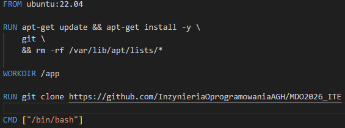

**Budowanie i weryfikacja:**
Po zbudowaniu obrazu uruchomiłem kontener, sprawdzając obecność plików repozytorium komendą `ls`.
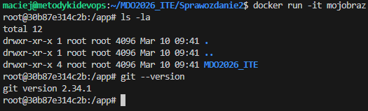

## 6. Zarządzanie zasobami i czyszczenie
Podczas realizacji zadań kontenery były usuwane na bieżąco po zakończeniu testów, co dokumentuje poniższa lista (pokazująca minimalną ilość aktywnych zasobów).

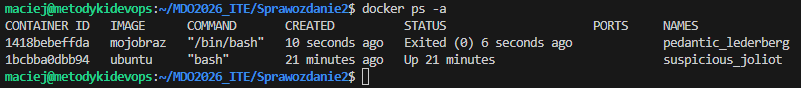

Na zakończenie wykonałem pełne czyszczenie lokalnego magazynu obrazów i kontenerów (`docker system prune -a`), aby zwolnić zasoby systemowe.

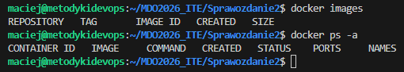
