# Sprawozdanie - Zajęcia 02

---

## Instalacja Docker

```bash
sudo apt update
sudo apt install docker.io docker-compose
sudo usermod -aG docker $USER
newgrp docker
docker --version
docker run hello-world
```

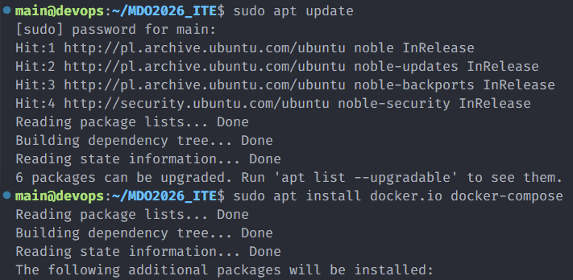
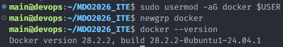

---

## Logowanie do Docker Hub

```bash
docker login
```

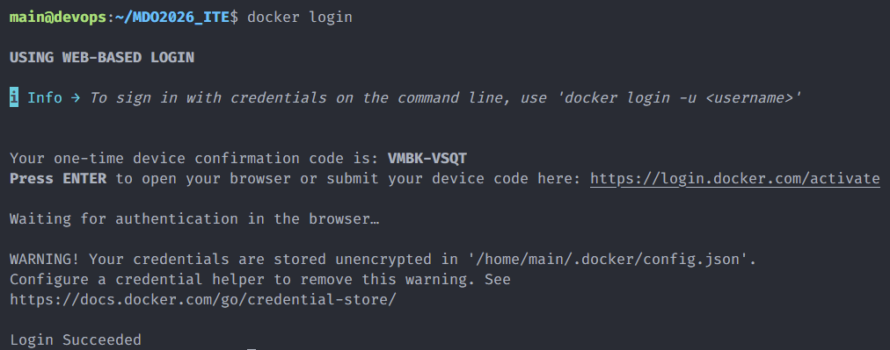

---

## Obrazy i kontenery

```bash
docker pull hello-world
```
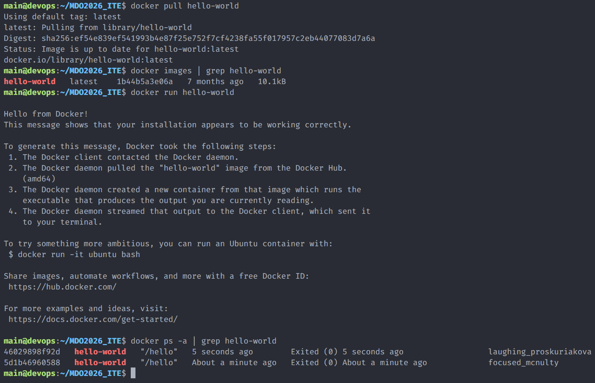

```bash
docker pull busybox
```
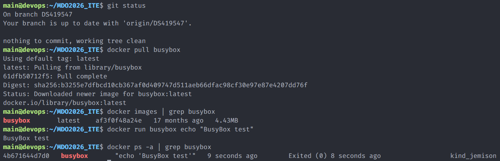

```bash
docker pull ubuntu
```
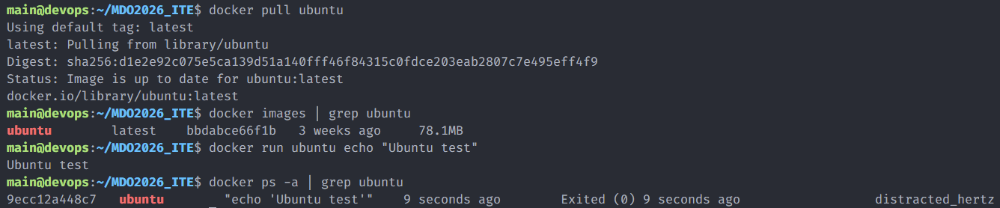

```bash
docker pull mariadb
```
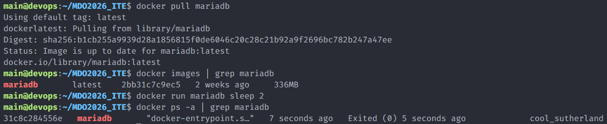

---

## Interaktywny busybox

```bash
docker run -it busybox /bin/sh
uname -a
exit
```
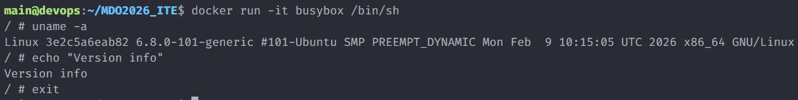

---

## System w kontenerze

```bash
docker run -it ubuntu /bin/bash
ps aux
apt update
exit
```
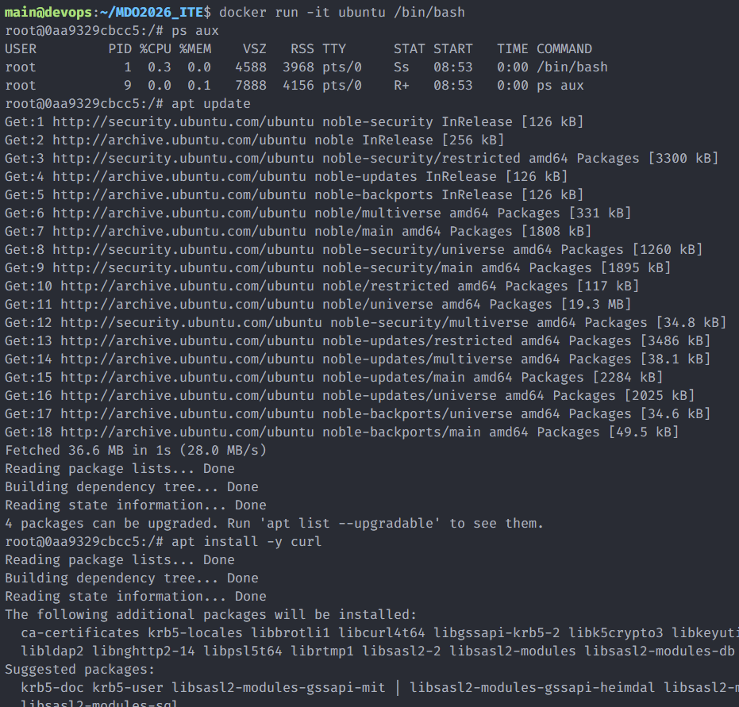

---

## Dockerfile

```dockerfile
FROM ubuntu:latest
RUN apt-get update && \
    apt-get install -y git curl && \
    apt-get clean && \
    rm -rf /var/lib/apt/lists/*
WORKDIR /workspace
RUN git clone https://github.com/InzynieriaOprogramowaniaAGH/MDO2026_ITE.git
CMD ["/bin/bash"]
```

```bash
docker build -t sprawozdanie2 .
docker run -it sprawozdanie2 /bin/bash
ls -la /workspace
```
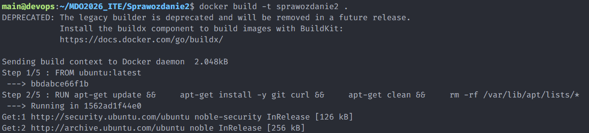
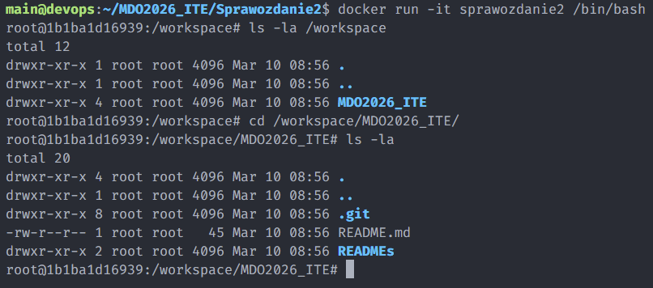

---

## Czyszczenie

```bash
docker ps -a
docker container prune -f
docker images
docker image prune -f
```
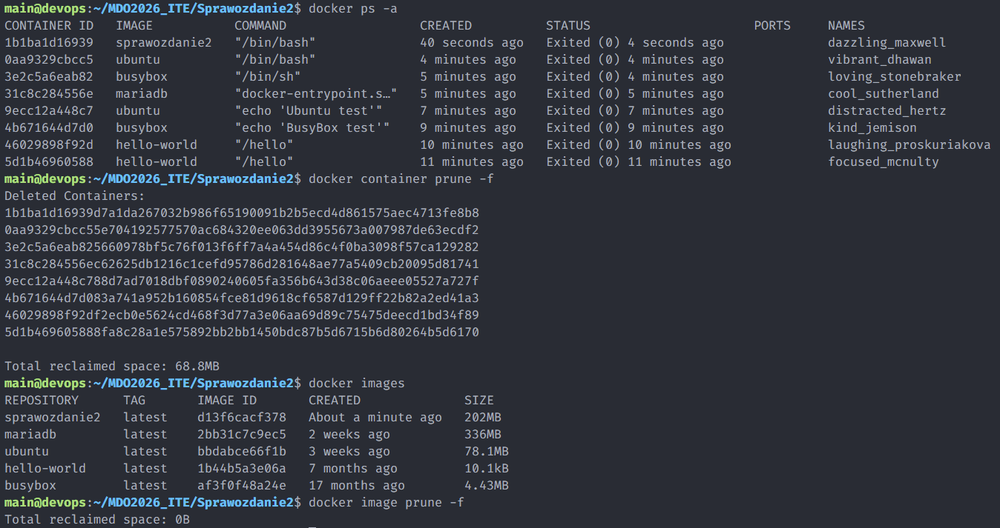