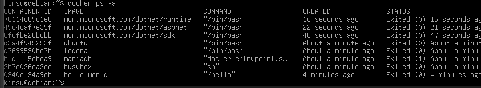
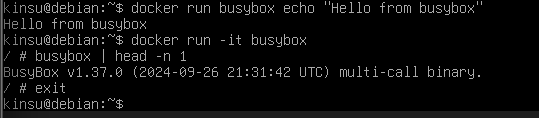
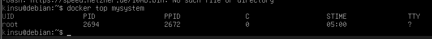
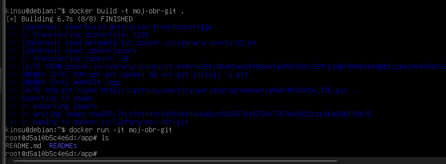
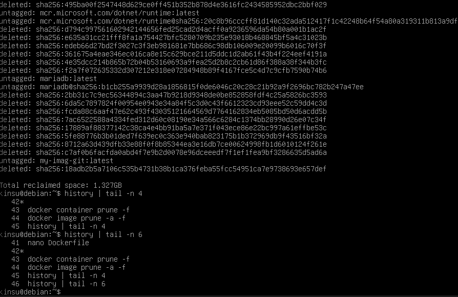

Metodyki DevOps – lab 2 
Kinga Sulej gr.6 
1. Instalacja dockera
   

2. Pobranie obrazów

3. Uruchomienie kontenerów i sprawdzenie kodu wyjścia
   

4. Busybox

5. System w kontenerze

Z drugiego terminala:

6. Dockerfile i klonowanie repo 

7. Czyszczenie kontenerów (dla kroku 6 z instrukcji nie udało się zrobić zrzutu w 
odpowiednim momencie, więc dodatkowo wrzucam „dowód” że było to 
zrobione”

 
 
 
