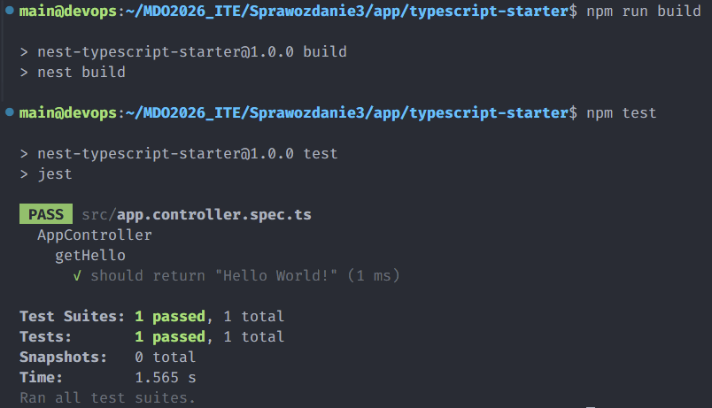
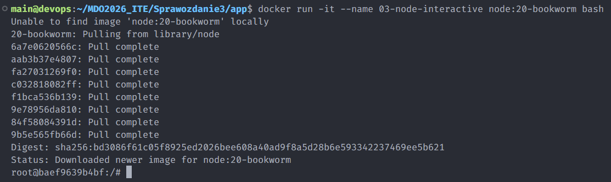
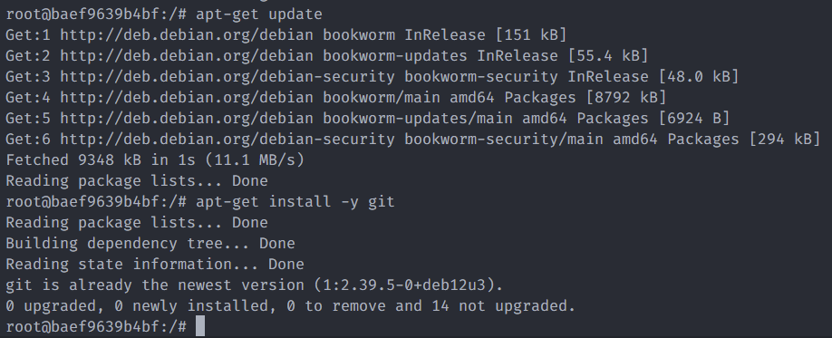
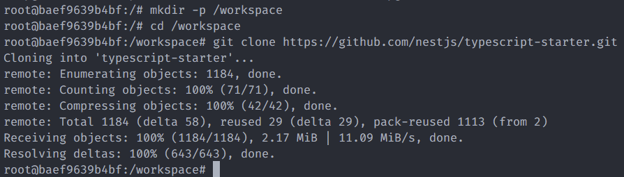
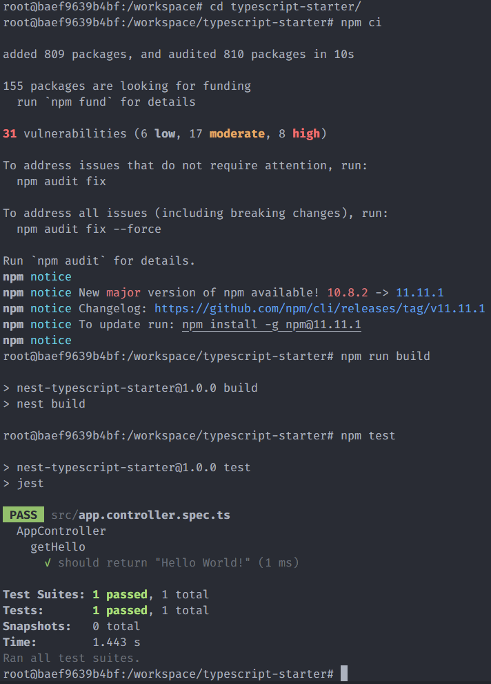
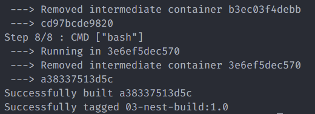
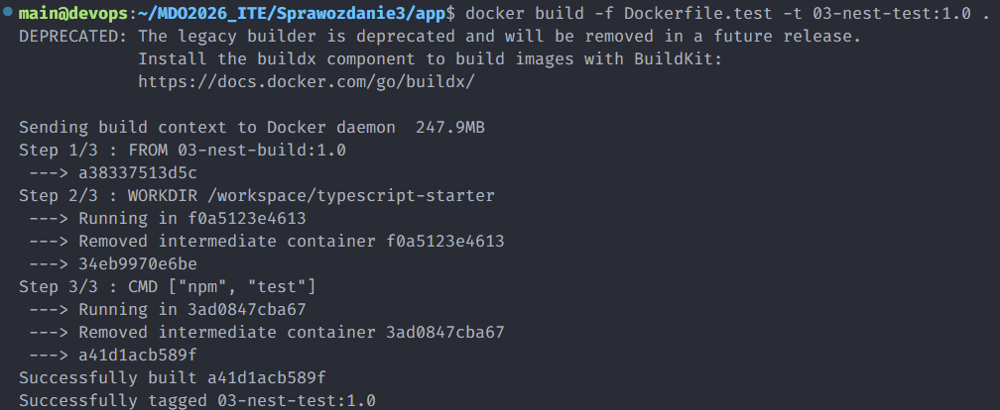
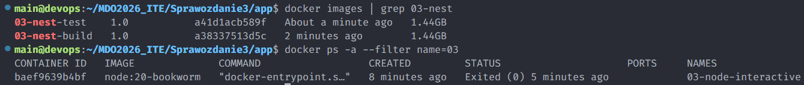
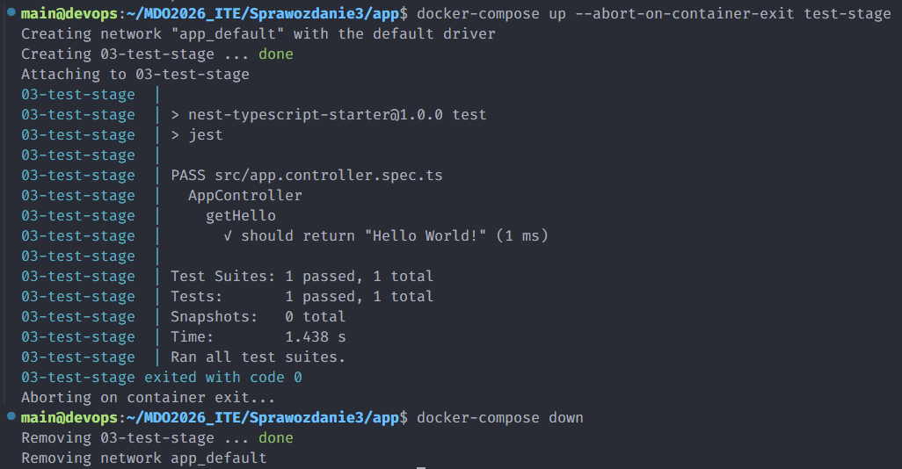

# Sprawozdanie - Zajecia 03

---

## Wybor aplikacji (Node.js)

Wybrano repozytorium: `nestjs/typescript-starter`.
Jest to niewielki, ale kompletny projekt startowy oparty o framework NestJS,
co pozwala szybko zweryfikowac caly przeplyw: instalacja zaleznosci, build i testy.

Powody wyboru:
- otwarta licencja (MIT),
- projekt Node.js z komendami `npm run build` i `npm test`,
- testy jednostkowe sa obecne i daja jednoznaczny wynik.

---

## Build i test lokalnie

Najpierw wykonano pelna walidacje poza Dockerem, aby miec punkt odniesienia
przed uruchamianiem tych samych krokow w kontenerze.

```bash
git clone https://github.com/nestjs/typescript-starter.git
cd typescript-starter
npm ci
npm run build
npm test
```

Polecenie `npm ci` instaluje dokladnie wersje z `package-lock.json`,
dzieki czemu wynik jest powtarzalny. Sukces etapu oznacza brak bledow
kompilacji i przejscie wszystkich testow.



---

## Build i test interaktywnie w kontenerze

W tym kroku srodowisko budowania odtworzono recznie w kontenerze,
aby potwierdzic, ze proces dziala tak samo jak lokalnie.

```bash
docker run -it --name 03-node-interactive node:20-bookworm bash
apt-get update
apt-get install -y git
mkdir -p /workspace
cd /workspace
git clone https://github.com/nestjs/typescript-starter.git
cd typescript-starter
npm ci
npm run build
npm test
```

Po uruchomieniu `docker run -it ... bash` pracujemy wewnatrz kontenera,
dlatego instalacja `git` i klonowanie repozytorium odbywa sie juz w izolacji.
Analogiczny wynik build/test jak lokalnie potwierdza poprawna przenoszalnosc procesu.






---

## Dockerfile etap 1 (do build)

Plik: `Dockerfile.build`

W tym obrazie przygotowano kompletne srodowisko do zbudowania aplikacji:
od instalacji narzedzi, przez pobranie kodu, po wykonanie `npm run build`.

```dockerfile
FROM node:20-bookworm
WORKDIR /workspace
RUN apt-get update && apt-get install -y git && rm -rf /var/lib/apt/lists/*
RUN git clone https://github.com/nestjs/typescript-starter.git
WORKDIR /workspace/typescript-starter
RUN npm ci
RUN npm run build
CMD ["bash"]
```

```bash
docker build -f Dockerfile.build -t 03-nest-build:1.0 .
```

Rezultatem jest obraz bazowy z gotowymi zaleznosciami i wykonanym buildem,
ktory mozna wykorzystac w kolejnych etapach (np. testowych).



---

## Dockerfile etap 2 (test, bez build)

Plik: `Dockerfile.test`

Drugi etap dziedziczy po obrazie build i uruchamia jedynie testy,
co celowo rozdziela odpowiedzialnosc miedzy etap kompilacji i etap weryfikacji.

```dockerfile
FROM 03-nest-build:1.0
WORKDIR /workspace/typescript-starter
CMD ["npm", "test"]
```

```bash
docker build -f Dockerfile.test -t 03-nest-test:1.0 .
docker run --rm --name 03-nest-test-run 03-nest-test:1.0
```

Flaga `--rm` usuwa kontener po zakonczeniu testow, dzieki czemu
srodowisko pozostaje czyste po kazdym uruchomieniu.




---

## Obraz vs kontener

Ten krok pokazuje roznice praktycznie: najpierw lista obrazow,
a potem lista kontenerow utworzonych i uruchamianych na ich podstawie.

```bash
docker images | grep 03-nest
docker ps -a --filter name=03
```

Wniosek:
- obraz to szablon (nieruchomy artefakt),
- kontener to uruchomiona instancja obrazu,
- w kontenerze pracuje proces glowny wskazany przez `CMD`.



---

## Docker Compose

Ze wzgledu na wersje narzedzia (`docker-compose` v1), uzyto komendy `docker-compose`.
Compose pozwala uruchomic caly scenariusz jednym poleceniem,
bez recznego wywolywania osobnych `docker build` i `docker run`.

```bash
docker-compose up --abort-on-container-exit test-stage
docker-compose down
```

Opcja `--abort-on-container-exit` konczy caly proces po zakonczeniu uslugi testowej,
co jest wygodne w zadaniach CI, gdzie liczy sie kod wyjscia testow.



---

## Krotka dyskusja (deploy)

Ten projekt nadaje sie do konteneryzacji na etapie CI (build i test), bo proces jest powtarzalny i izolowany. Do publikacji produkcyjnej lepiej przygotowac osobny obraz runtime (np. multi-stage build), bez narzedzi deweloperskich i bez cache po `npm ci`. Finalnym artefaktem moze byc lekki obraz kontenera albo paczka aplikacji (np. paczka Node.js z katalogiem `dist`), zaleznie od sposobu wdrozenia.
W praktyce taki podzial skraca czas analizy bledow: wiadomo, czy problem dotyczy
kompilacji, czy dopiero testow. Jednoczesnie mniejszy obraz runtime zwykle oznacza
szybsze pobieranie i mniejsza powierzchnie ataku w srodowisku produkcyjnym.
