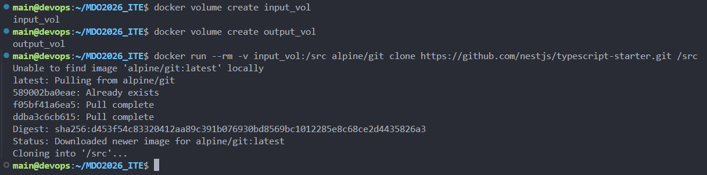
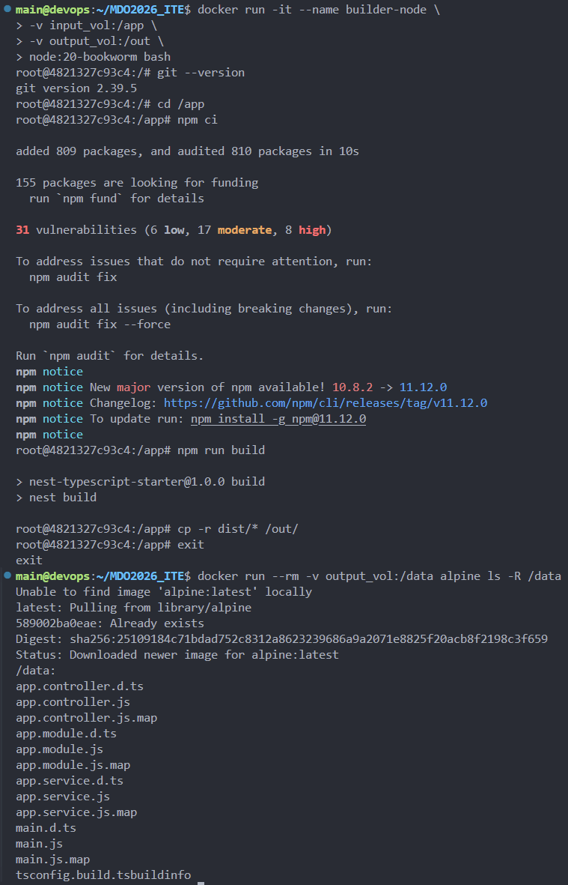
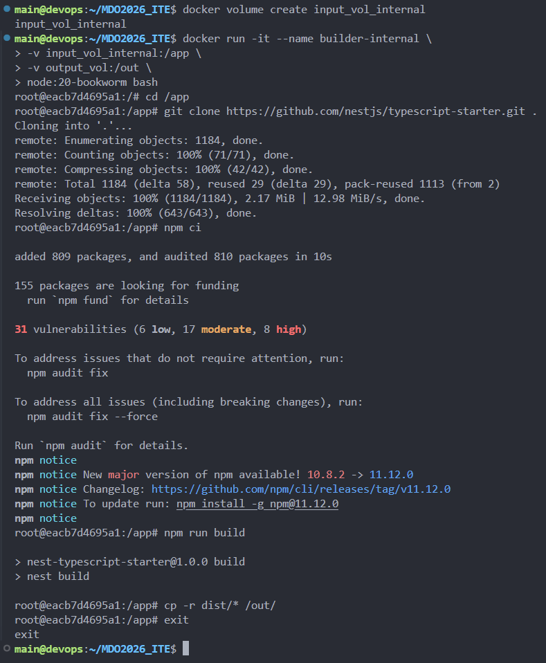
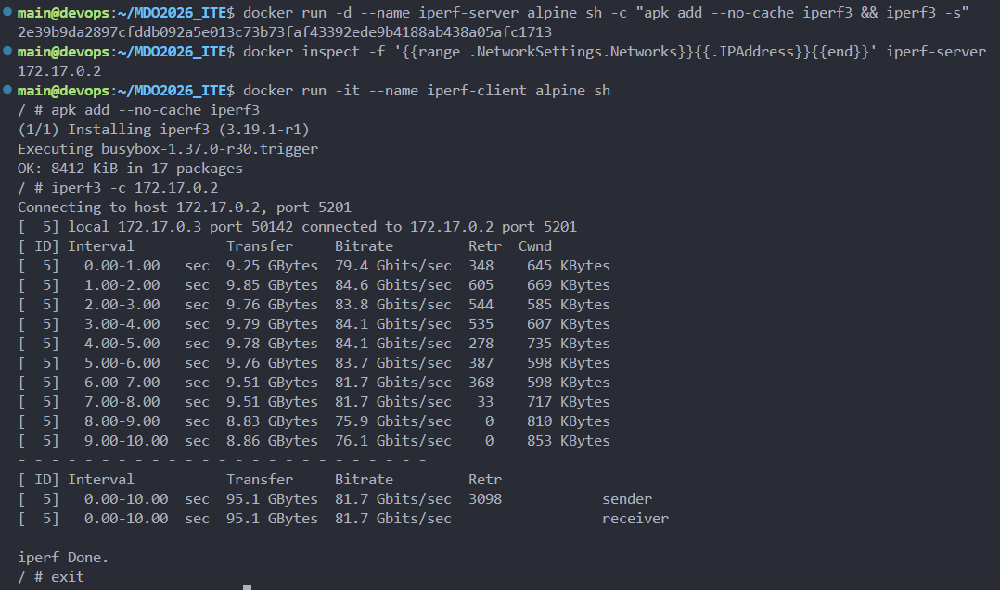
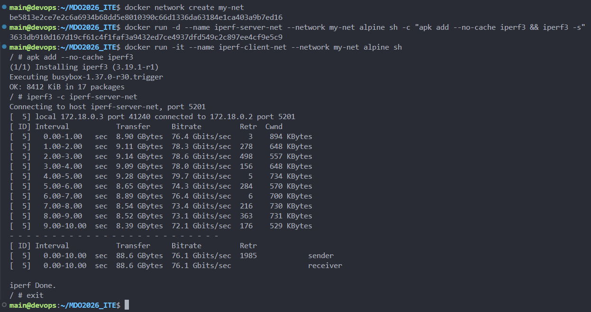
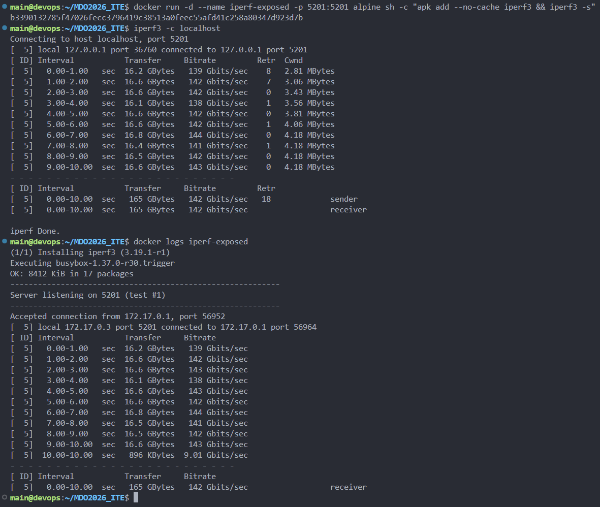
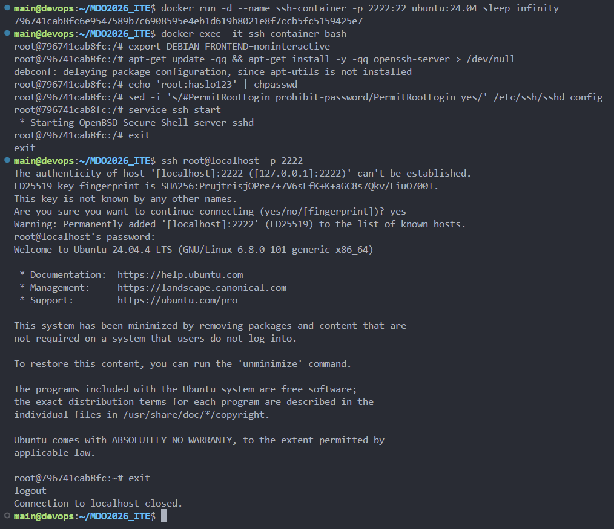
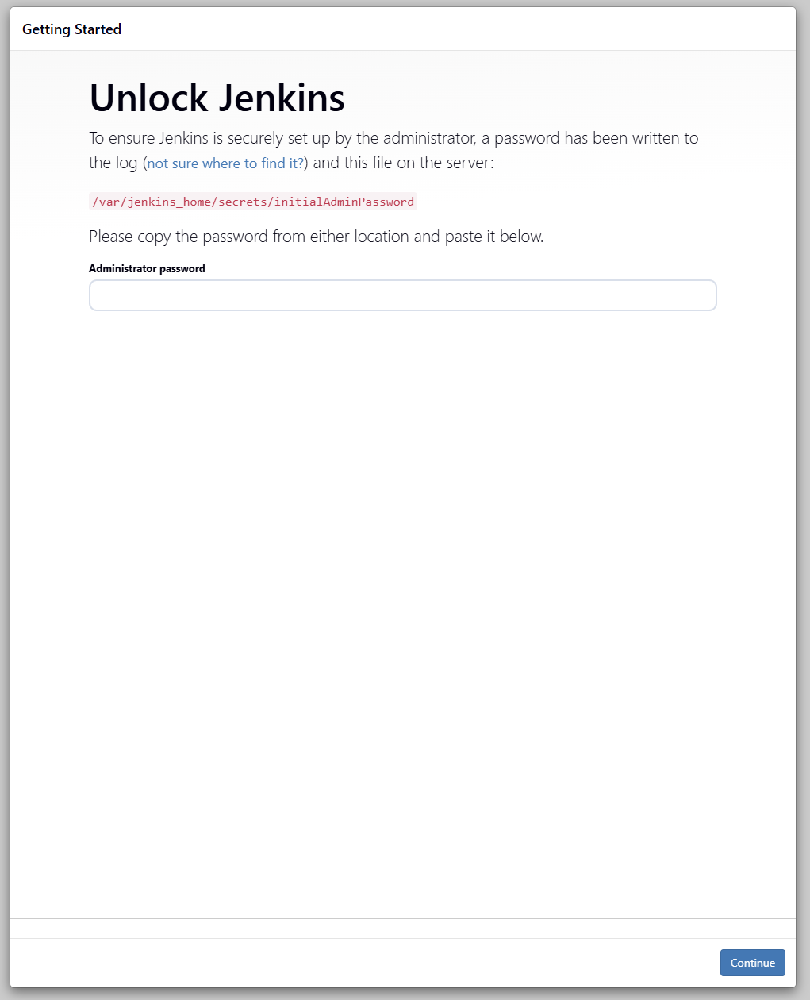

# Sprawozdanie - Zajęcia 04

## Zachowywanie stanu i woluminy

W tym zadaniu przygotowano woluminy, aby dane przetrwały po usunięciu kontenera. Zastosowano dwa podejścia do pobrania kodu projektu.

### Podejście 1: Klonowanie poza kontenerem

Najpierw utworzono woluminy `in` i `out`. Repozytorium sklonowano bezpośrednio do katalogu woluminu na hoście (`/var/lib/docker/volumes/in/_data`). Wybrano to rozwiązanie, ponieważ kontener bazowy miał spełniać rolę czystego środowiska budowania, bez zainstalowanego Gita.

```bash
docker volume create in
docker volume create out
# Klonowanie na hoście do katalogu woluminu
git clone https://github.com/nestjs/typescript-starter.git /var/lib/docker/volumes/in/_data/typescript-starter
```



Następnie uruchomiono kontener z podpiętymi woluminami. Proces budowania (`npm run build`) wykonano w środowisku bez Gita, korzystając z kodu dostarczonego przez wolumin. Zbudowane pliki skopiowano do woluminu `out`.

```bash
docker run --rm \
  -v in:/workspace/in \
  -v out:/workspace/out \
  03-node-interactive \
  bash -c "cd /workspace/in/typescript-starter && npm ci && npm run build && cp -r dist /workspace/out/"
```



### Podejście 2: Klonowanie wewnątrz kontenera

W drugim wariancie pozwolono na użycie Gita wewnątrz kontenera. Wolumin `in` został zamontowany, a proces pobierania kodu odbył się już w izolacji.

```bash
docker run -it --name 04-clone-inside -v in:/workspace/in 03-node-interactive bash
apt-get update && apt-get install -y git
cd /workspace/in
git clone https://github.com/nestjs/typescript-starter.git
```



**Dockerfile:**
Kroki te można zautomatyzować w `Dockerfile`, używając `RUN --mount=type=bind`. Pozwala to na podmontowanie kodu tylko na czas budowania, bez kopiowania go na stałe do warstw obrazu.

---

## Sieci i wydajność (IPerf)

Zbadano komunikację między kontenerami przy użyciu narzędzia `iperf3`.

### Sieć domyślna (Bridge)

Uruchomiono dwa kontenery w domyślnej sieci. Serwer nasłuchiwał na porcie 5201, a klient łączył się z nim przez adres IP.

```bash
# Kontener 1 (Serwer)
iperf3 -s
# Kontener 2 (Klient)
iperf3 -c 172.17.0.2
```



### Sieć dedykowana i rozwiązywanie nazw

Utworzono własną sieć mostkową, co pozwoliło na komunikację z użyciem nazw kontenerów zamiast adresów IP. Jest to wygodniejsze rozwiązanie, ponieważ adresy IP kontenerów mogą się zmieniać.

```bash
docker network create my-net
docker run -d --name server --network my-net iperf-image iperf3 -s
docker run -it --name client --network my-net iperf-image iperf3 -c server
```



### Połączenie z hosta

Sprawdzono możliwość połączenia z serwerem iperf spoza kontenerów. Wymagało to opublikowania portu (`-p 5201:5201`) przy uruchamianiu kontenera.



---

## Usługa SSH w kontenerze

Skonfigurowano serwer SSH (`sshd`) wewnątrz kontenera z Ubuntu. Pozwoliło to na zdalne logowanie się do środowiska za pomocą standardowego klienta SSH.

Rozwiązanie to umożliwiło użycie standardowych narzędzi do transferu plików (SCP/SFTP) i łatwą integrację ze starszymi systemami automatyzacji. Przyczyniło się natomiast do zwiększonego zużycia zasobów przez dodatkowy proces w kontenerze, większej powierzchni ataku i konieczności zarządzania kluczami oraz hasłami.



---

## Instancja Jenkins

Ostatnim etapem było uruchomienie Jenkinsa w Dockerze z użyciem mechanizmu Docker-in-Docker. Pozwala to Jenkinsowi na budowanie projektów w osobnych kontenerach.

```bash
# Uruchomienie pomocnika DIND i kontenera Jenkinsa
docker compose up -d
```


Po poprawnej inicjalizacji i odczytaniu hasła początkowego, Jenkins stał się dostępny przez przeglądarkę na porcie 8080.


