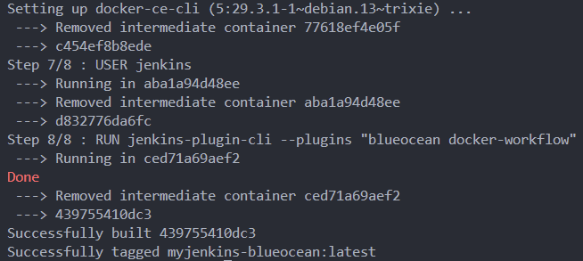
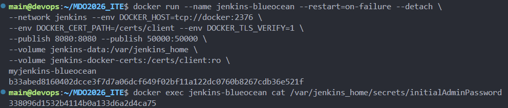
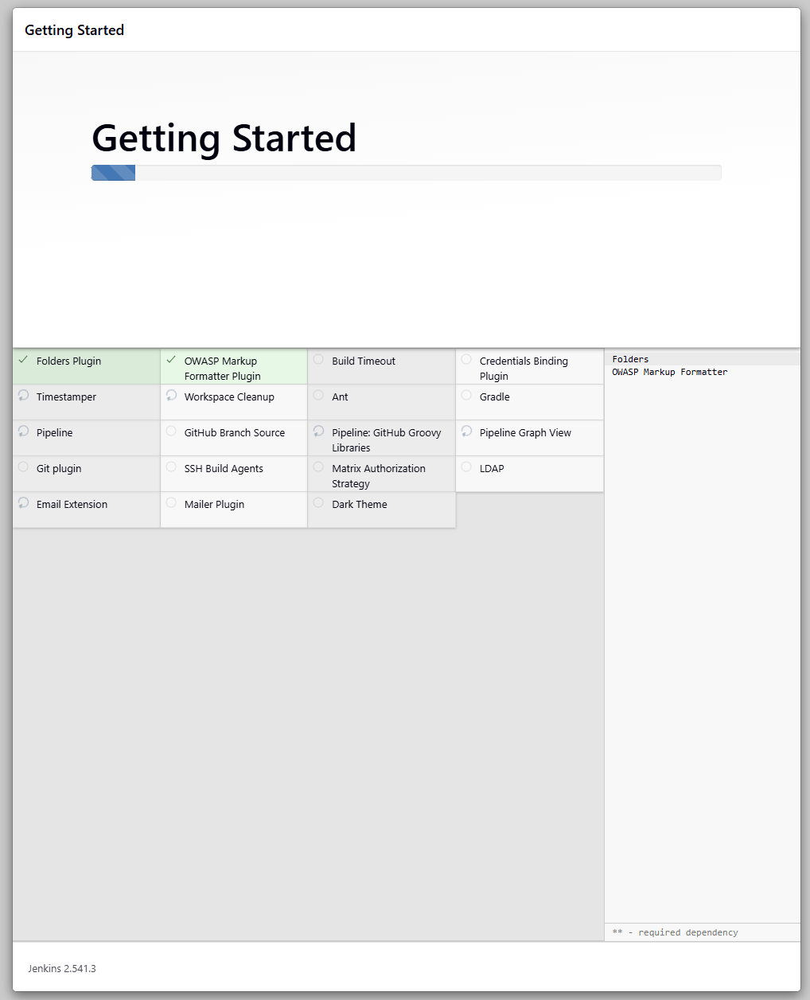
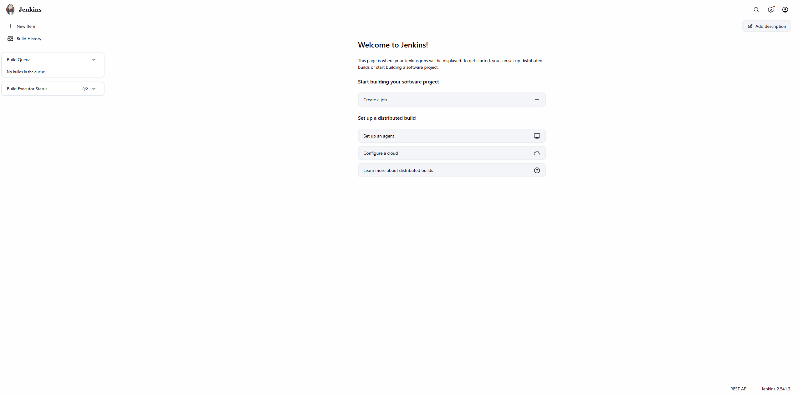
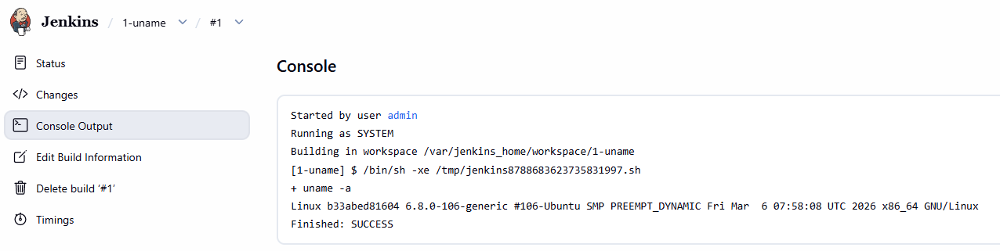
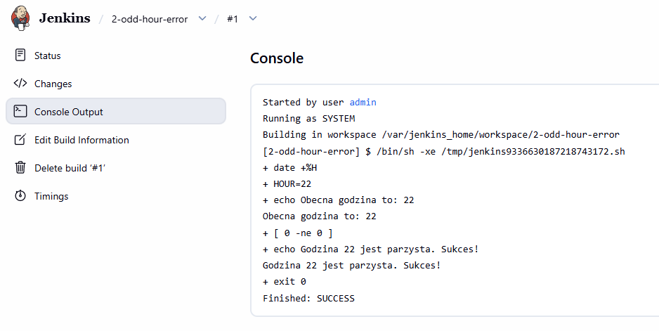
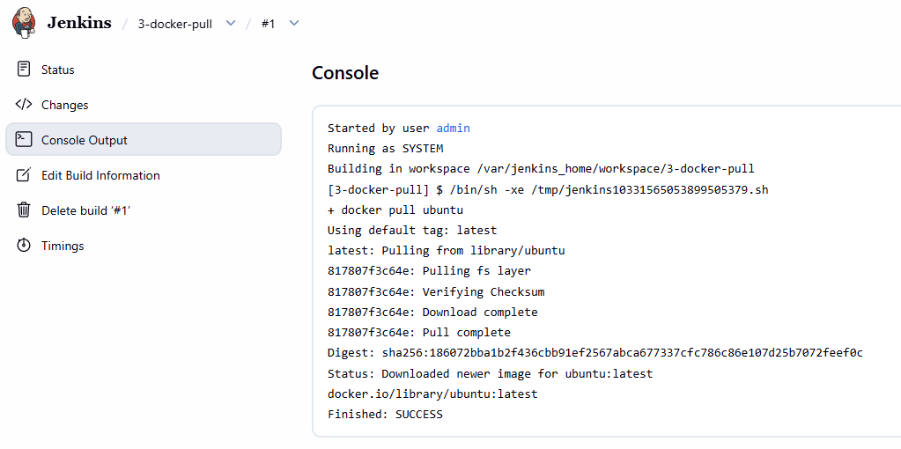
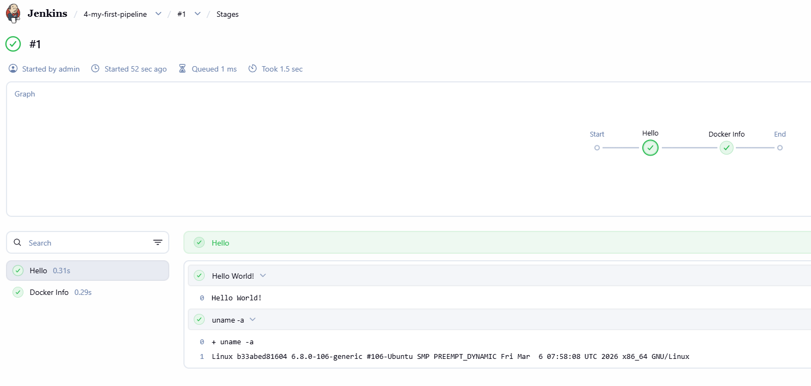
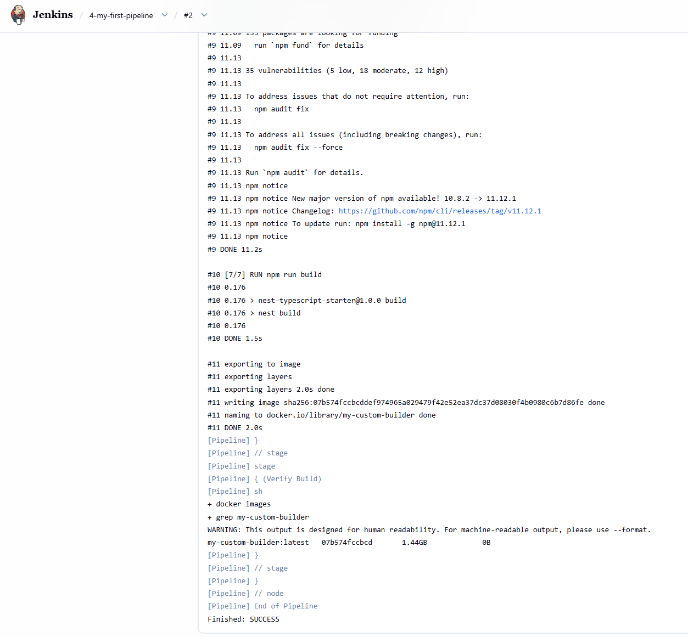
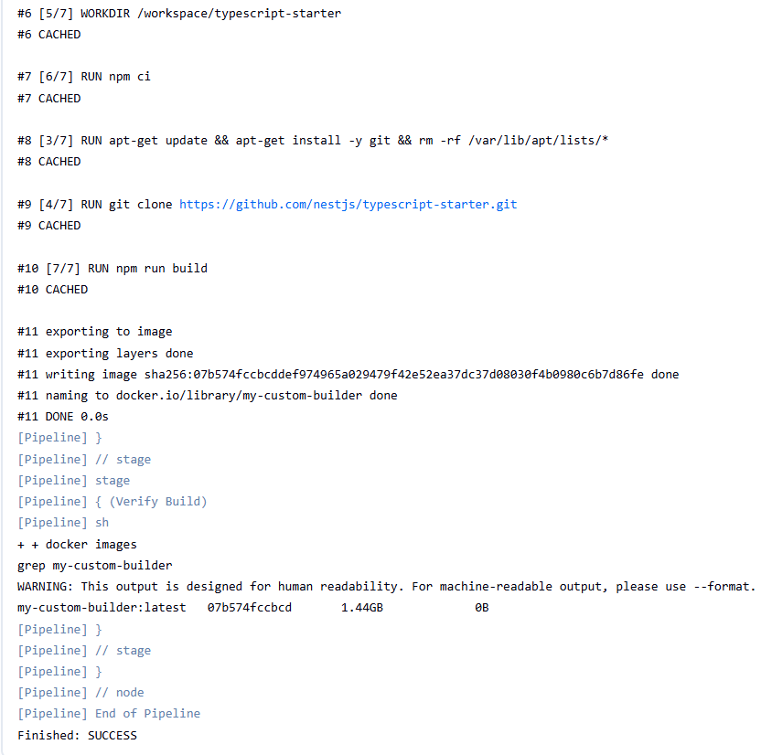

# Sprawozdanie - Zajęcia 05

## Przygotowanie instancji Jenkins (Blue Ocean)

W celu uruchomienia Jenkinsa w trybie Docker-in-Docker (DinD), przygotowano dedykowaną sieć `jenkins` oraz wolumeny dla danych i certyfikatów. Następnie przygotowano własny obraz Jenkinsa, doinstalowując klienta Dockera oraz wtyczkę Blue Ocean.

```bash
docker build -t myjenkins-blueocean -f DS419547/Sprawozdanie5/src/Dockerfile-jenkins DS419547/Sprawozdanie5/src/
```



## Konfiguracja i pierwsze logowanie

Po uruchomieniu kontenerów odczytano hasło początkowe z systemu plików kontenera, co pozwoliło na odblokowanie panelu administracyjnego i instalację sugerowanych wtyczek.

```bash
docker exec jenkins-blueocean cat /var/jenkins_home/secrets/initialAdminPassword
```





Po zakończeniu konfiguracji uzyskano dostęp do głównego pulpitu (Dashboard), który stanowi punkt wyjścia do tworzenia zadań.



---

## Zadania typu Freestyle Project

### Projekt uname
Utworzono proste zadanie wykonujące komendę `uname -a` w celu weryfikacji działania skryptów powłoki.



### Warunkowy błąd godziny
Skonfigurowano zadanie, które zwraca błąd (exit 1), jeśli godzina systemowa jest nieparzysta. Pozwoliło to na przetestowanie mechanizmu logowania niepowodzeń w Jenkinsie.

```bash
HOUR=$(date +%H)
if [ $((HOUR % 2)) -ne 0 ]; then
    exit 1
fi
```



### Pobranie obrazu ubuntu
Zweryfikowano komunikację Jenkinsa z demonem Dockera (DinD) poprzez wykonanie operacji `docker pull`.



---

## Obiekty typu Pipeline

### Pierwszy Pipeline
Wdrożono prosty proces typu Pipeline, dzieląc go na etapy: "Hello" oraz "Docker Info".



### Pipeline z klonowaniem i budowaniem obrazu
Stworzono nieco bardziej zaawansowany Pipeline, który klonuje konkretną gałąź (`DS419547`) z repozytorium przedmiotowego, a następnie buduje obraz na podstawie pliku `Dockerfile.build`.

```groovy
pipeline {
    agent any
    stages {
        stage('Clone Branch') {
            steps {
                git branch: 'DS419547', url: 'https://github.com/InzynieriaOprogramowaniaAGH/MDO2026_ITE.git'
            }
        }
        stage('Build Image') {
            steps {
                sh 'docker build -t my-app-builder -f DS419547/Sprawozdanie3/Dockerfile.build DS419547/Sprawozdanie3/'
            }
        }
    }
}
```



Uruchomiono Pipeline po raz drugi, dzięki cachowaniu bardzo zaoszczędzono na czasie, więc wykonanie zajęło tylko małą część czasu pierwszego wykonania.



---

## Podsumowanie
Uruchomienie Jenkinsa w trybie Docker-in-Docker pozwoliło na pełną izolację etapów budowania projektów. Mechanizm Pipeline (jako kod) umożliwia precyzyjne definiowanie cyklu życia aplikacji, co jest podstawą procesów CI. Poprawne wykonanie builda na podstawie plików z poprzednich zajęć potwierdza poprawność konfiguracji środowiska.
