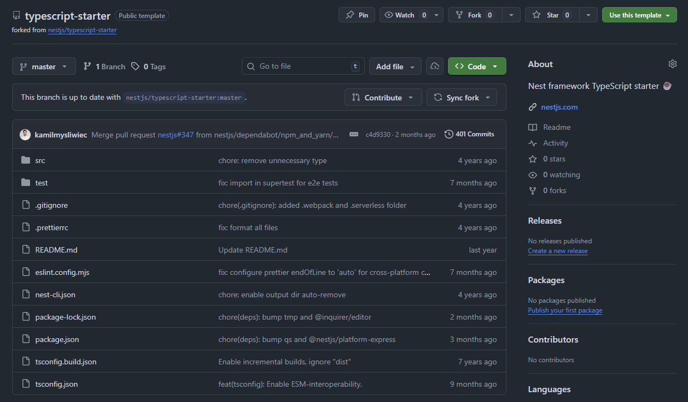
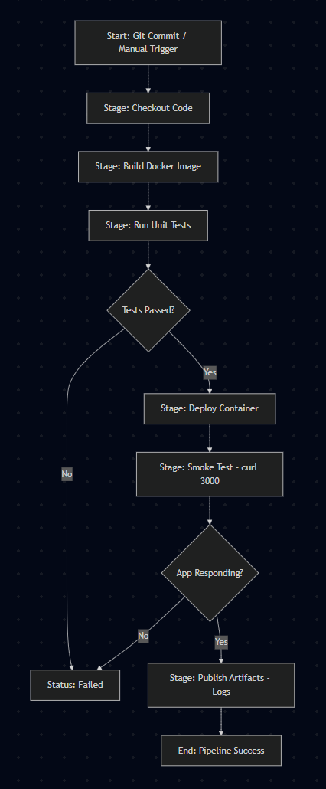
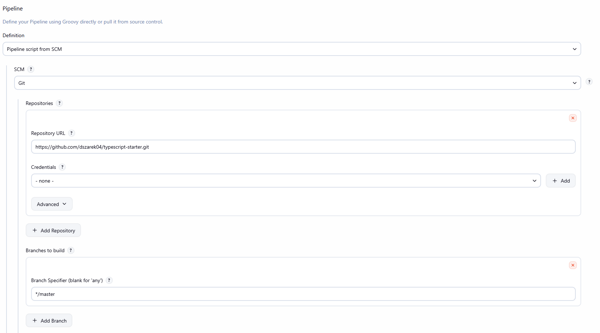
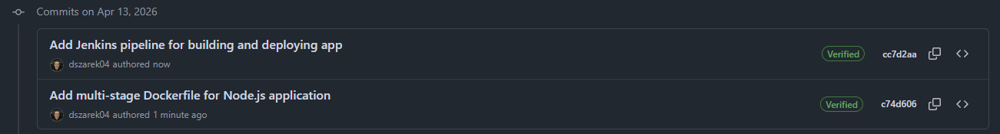
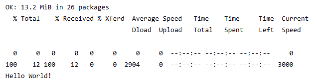
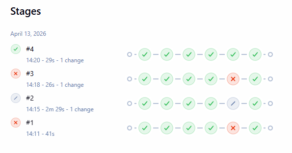
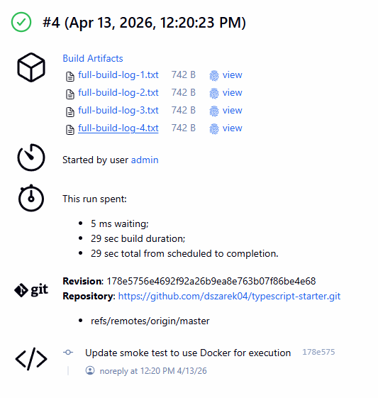

# Sprawozdanie 6 - Pipeline CI/CD

## 1. Wybór Aplikacji i Licencji
Wybranym projektem jest **`nestjs/typescript-starter`**, czyli oficjalny szablon frameworka NestJS, który ma gotową strukturę aplikacji w TypeScript i skonfigurowane testy jednostkowe (`jest`).
*   **Repozytorium:** `https://github.com/dszarek04/typescript-starter` (Fork)
*   **Licencja:** Projekt jest udostępniony na licencji **MIT**, więc pozwala na modyfikację i dystrybucję kodu na potrzeby zadania.



## 2. Projekt Procesu CI/CD (UML)
Proces jest zaprojektowany jako sekwencyjny pipeline składający się z pięciu etapów: pobranie kodu, budowa i testy w obrazie, wdrożenie integracyjne, smoke test i publikacja logów jako artefaktów.



## 3. Implementacja Kontenerów (Dockerfile)
Zastosowano **Multi-stage build**, żeby zoptymalizować proces. Kontener testowy bazuje bezpośrednio na kontenerze buildowym, a końcowy kontener runtime jest chudszą wersją produkcyjną.

**Kod Dockerfile:**
```dockerfile
# Build
FROM node:20-bookworm AS build
WORKDIR /app
COPY package*.json ./
RUN npm ci
COPY . .
RUN npm run build

# Test
FROM build AS test
RUN npm test

# Runtime
FROM node:20-bookworm-slim AS runtime
WORKDIR /app
# Kopiujemy tylko co potrzebne z etapu build
COPY --from=build /app/dist ./dist
COPY --from=build /app/package*.json ./
RUN npm ci --only=production
EXPOSE 3000
# Komenda startowa
CMD ["node", "dist/main"]
```

**Uzasadnienie:** Obraz buildowy zawiera kompilator i narzędzia deweloperskie, które nie są potrzebne w produkcji. Rozdzielenie tych etapów pozwala na stworzenie lżejszego kontenera typu 'deploy'.

## 4. Konfiguracja Pipeline w Jenkins (Jenkinsfile)
Zadanie jest skonfigurowane jako **Pipeline script from SCM**, co pozwala na wersjonowanie definicji pipeline'u razem z kodem aplikacji.

**Kod Jenkinsfile:**
```groovy
pipeline {
    agent any
    environment {
        IMAGE_NAME = "nestjs-app-ds419547"
        CONTAINER_NAME = "nestjs-instance"
    }
    stages {
        stage('Checkout') {
            steps {
                checkout scm
            }
        }
        stage('Build & Test Image') {
            steps {
                echo 'Building and testing image...'
                sh "docker build -t ${IMAGE_NAME}:${BUILD_NUMBER} ."
            }
        }
        stage('Deploy (Integration)') {
            steps {
                echo 'Deploying container for integration testing...'
                sh "docker stop ${CONTAINER_NAME} || true"
                sh "docker rm ${CONTAINER_NAME} || true"
                
                sh "docker run -d --name ${CONTAINER_NAME} --network host ${IMAGE_NAME}:${BUILD_NUMBER}"
            }
        }
        stage('Smoke Test') {
            steps {
                echo 'Performing smoke test via Docker...'
                sleep 10
                
                sh "docker run --rm --network host alpine sh -c 'apk add --no-cache curl && curl -f http://localhost:3000'"
            }
        }
    }
    post {
        always {
            echo 'Collecting logs as artifacts...'
            sh "docker logs ${CONTAINER_NAME} > full-build-log-${BUILD_NUMBER}.txt"
            archiveArtifacts artifacts: "*.txt", fingerprint: true
        }
    }
}
```




## 5. Przebieg Pipeline i Weryfikacja
Pipeline pomyślnie przechodzi przez wszystkie etapy:
1.  **Build & Test:** Docker buduje obraz, uruchamiając w trakcie `npm test`.
2.  **Deploy:** Kontener jest uruchamiany w sieci `host`.
3.  **Smoke Test:** Automatyczna weryfikacja dostępności aplikacji pod adresem `http://localhost:3000` za pomocą kontenera tymczasowego.




## 6. Publikacja i Wersjonowanie
Jako główny artefakt procesu publikowane są **logi z działania aplikacji** (`.txt`), co pozwala na diagnostykę po każdym buildzie. Dodatkowo, każdy zbudowany obraz Dockera jest wersjonowany za pomocą zmiennej `${BUILD_NUMBER}` dostarczanej przez Jenkinsa.

**Uzasadnienie wyboru artefaktu:** Wybrano logi tekstowe, bo w tym środowisku stanowią najlepszy dowód na poprawne działanie mechanizmów startowych aplikacji NestJS. Wykorzystano mechanizm `fingerprint: true` w Jenkinsie do identyfikacji pochodzenia artefaktu.



## 7. Weryfikacja zgodności z projektem
Ostateczny pipeline jest w pełni zgodny z zaplanowanym diagramem UML. Wszystkie etapy (Checkout --> Build --> Test --> Deploy --> Smoke Test --> Publish) zostały zrealizowane w Jenkinsie. Jedyną zmianą techniczną względem pierwotnych założeń było użycie sieci `--network host` oraz `docker run` dla Smoke Testu, co było podyktowane specyfiką środowiska Docker-in-Docker, ale nie zmieniło to logiki biznesowej procesu.

## 8. Podsumowanie
Pipeline spełnia wszystkie wymagania ścieżki krytycznej. Proces jest w pełni zautomatyzowany - od momentu wykrycia zmian w kodzie do weryfikacji działającej aplikacji na instancji Dockera.
