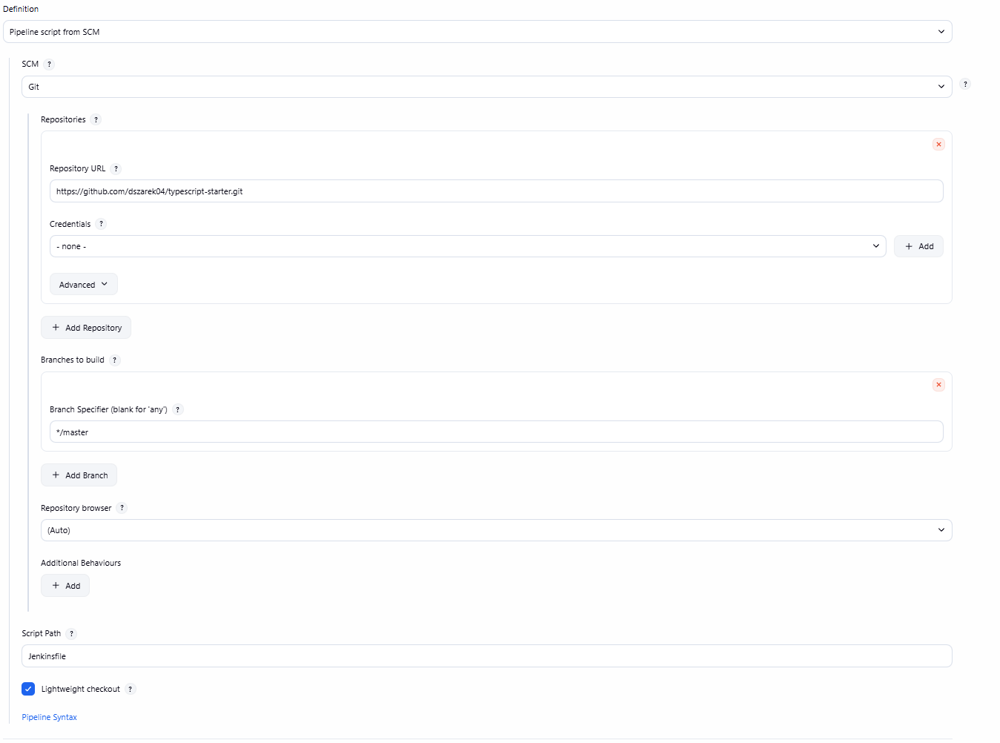
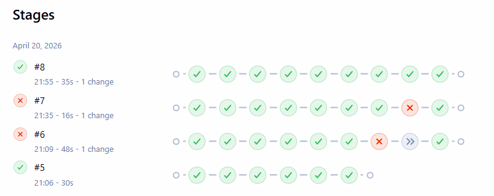
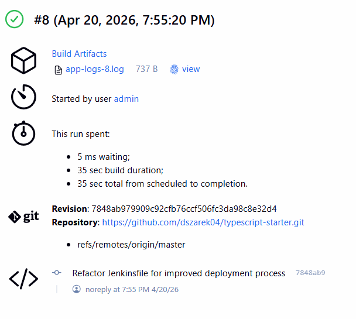
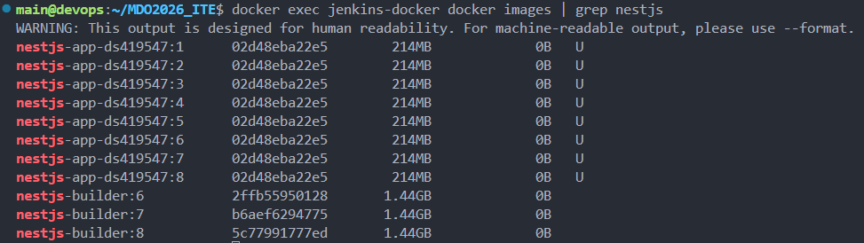

# Sprawozdanie 7 - Jenkinsfile i optymalizacja procesu CI/CD

## 1. Przeniesienie Pipeline do SCM
Zgodnie z wymogami, proces budowania został w pełni przeniesiony z ustawień Jenkinsa do repozytorium kodu. Wykorzystano mechanizm **Pipeline script from SCM**, co pozwala na wersjonowanie infrastruktury jako kodu (IaC).

*   **Repozytorium:** `https://github.com/dszarek04/typescript-starter`
*   **Plik:** `Jenkinsfile`



## 2. Lista kontrolna Jenkinsfile
Poniższa tabela weryfikuje spełnienie wymagań technicznych dla stworzonego pliku `Jenkinsfile`:

| Wymaganie | Implementacja |
| :--- | :--- |
| Przepis dostarczany z SCM | Definicja pobierana automatycznie przez `checkout scm`. |
| Skuteczne czyszczenie | Etap `Clean Workspace` z wykorzystaniem `deleteDir()`. |
| Etap Build (Dockerfile) | Wykorzystanie `docker build` na pliku z repozytorium. |
| Obraz budujący (BLDR) | Jawne tworzenie obrazu `nestjs-builder` (target: build). |
| Rozdzielenie BLDR od Deploy | Wykorzystano Multi-stage build; obraz runtime budowany oddzielnie. |
| Etap Test | Uruchomienie `npm test` wewnątrz kontenera budującego. |
| Etap Deploy (Sandbox) | Wdrożenie kontenera w sieci `--network host`. |
| Etap Publish (Artefakty) | Archiwizacja logów aplikacji (`app-logs-X.log`) w Jenkinsie. |
| Idempotentność | Mechanizm `docker stop && docker rm` zapewnia powtarzalność. |

## 3. Implementacja Kontenera (Dockerfile)
W celu optymalizacji procesu zastosowano **Multi-stage build**, który pozwala na odseparowanie środowiska kompilacji od środowiska uruchomieniowego.

```dockerfile
# Stage 1: Build & Test (BLDR)
FROM node:20-bookworm AS build
WORKDIR /app
COPY package*.json ./
RUN npm ci
COPY . .
RUN npm run build

# Stage 2: Runtime
FROM node:20-bookworm-slim AS runtime
WORKDIR /app
COPY --from=build /app/dist ./dist
COPY --from=build /app/package*.json ./
RUN npm ci --only=production
CMD ["node", "dist/main"]
```

## 4. Definicja Pipeline (Jenkinsfile)
Kluczowym elementem jest plik `Jenkinsfile`, który definiuje 7 etapów procesu:

```groovy
pipeline {
    agent any
    environment {
        IMAGE_NAME = "nestjs-app-ds419547"
        BUILDER_IMAGE = "nestjs-builder"
        CONTAINER_NAME = "nestjs-instance-7"
    }
    stages {
        stage('Clean Workspace') {
            steps {
                deleteDir()
            }
        }
        stage('Checkout') {
            steps {
                checkout scm
            }
        }
        stage('Build Builder Image') {
            steps {
                sh "docker build --target build -t ${BUILDER_IMAGE}:${BUILD_NUMBER} ."
            }
        }
        stage('Test') {
            steps {
                sh "docker run --rm ${BUILDER_IMAGE}:${BUILD_NUMBER} npm test"
            }
        }
        stage('Build Runtime Image') {
            steps {
                sh "docker build -t ${IMAGE_NAME}:${BUILD_NUMBER} ."
            }
        }
        stage('Deploy (Sandbox)') {
            steps {
                sh "docker stop nestjs-instance || true"
                sh "docker rm nestjs-instance || true"
                sh "docker stop ${CONTAINER_NAME} || true"
                sh "docker rm ${CONTAINER_NAME} || true"
                sh "docker run -d --name ${CONTAINER_NAME} --network host ${IMAGE_NAME}:${BUILD_NUMBER}"
            }
        }
        stage('Verification (Smoke Test)') {
            steps {
                sleep 10
                sh "docker run --rm --network host alpine sh -c 'apk add --no-cache curl && curl -f http://localhost:3000'"
            }
        }
    }
    post {
        always {
            sh "docker logs ${CONTAINER_NAME} > app-logs-${BUILD_NUMBER}.log"
            archiveArtifacts artifacts: "*.log", fingerprint: true
        }
    }
}
```

## 5. Przebieg i Weryfikacja
Pipeline pomyślnie przechodzi przez wszystkie zdefiniowane kroki. Widok etapów (Stage View) potwierdza poprawną sekwencję działań.



### Publikacja Artefaktów
Zgodnie z wymaganiami, po każdym buildzie publikowane są logi aplikacji, które służą jako dowód poprawnego wdrożenia ("deployable artifact").



### Weryfikacja obrazów Docker
Na maszynie Jenkinsa widoczne są oba typy obrazów: budujący (`builder`) oraz końcowy (`app`).



## 6. Podsumowanie
Pipeline jest w pełni zautomatyzowany, odporny na błędy (dzięki czyszczeniu środowiska) i zgodny z najlepszymi praktykami CI/CD. Rozdzielenie obrazu budującego od produkcyjnego pozwoliło na zmniejszenie rozmiaru artefaktu końcowego przy zachowaniu pełnej możliwości testowania kodu wewnątrz rurociągu.
