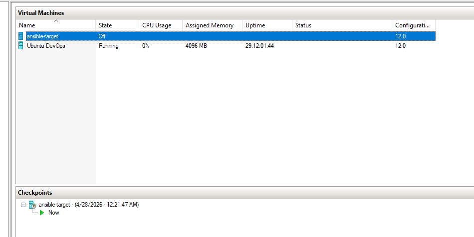
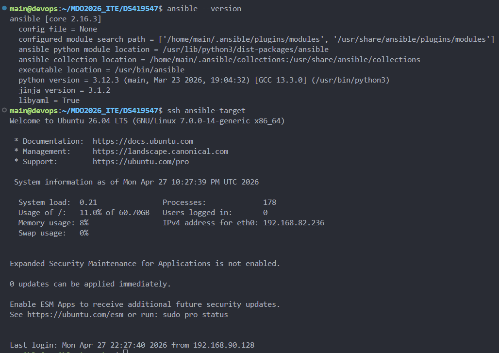
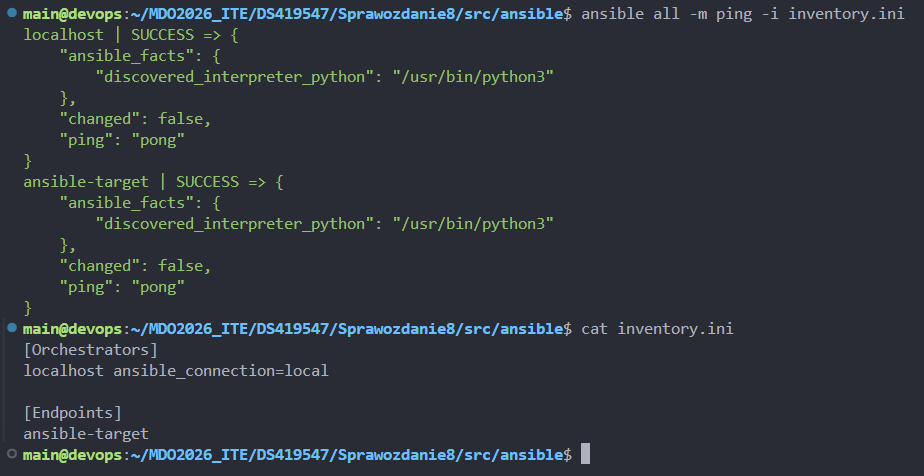
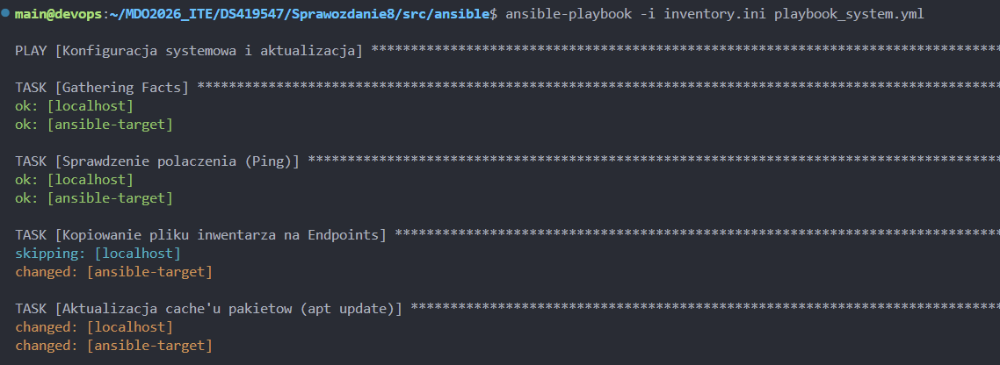
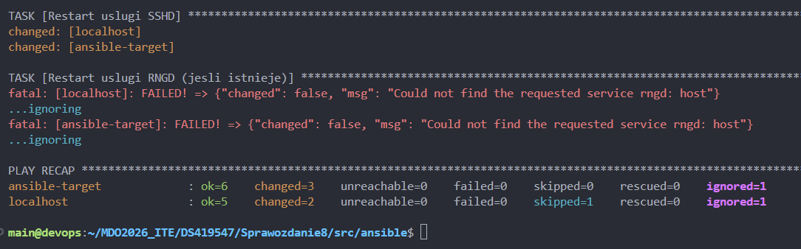
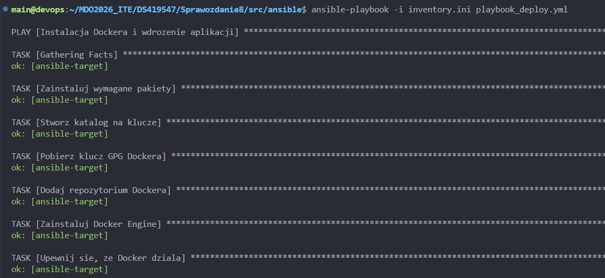
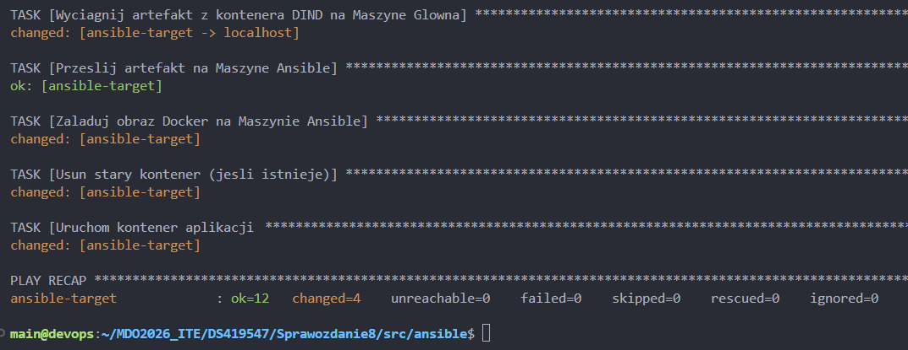
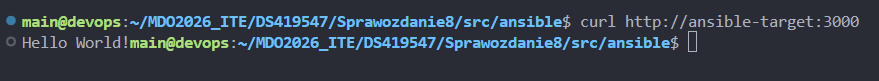
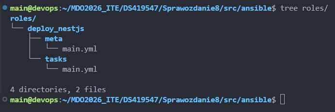
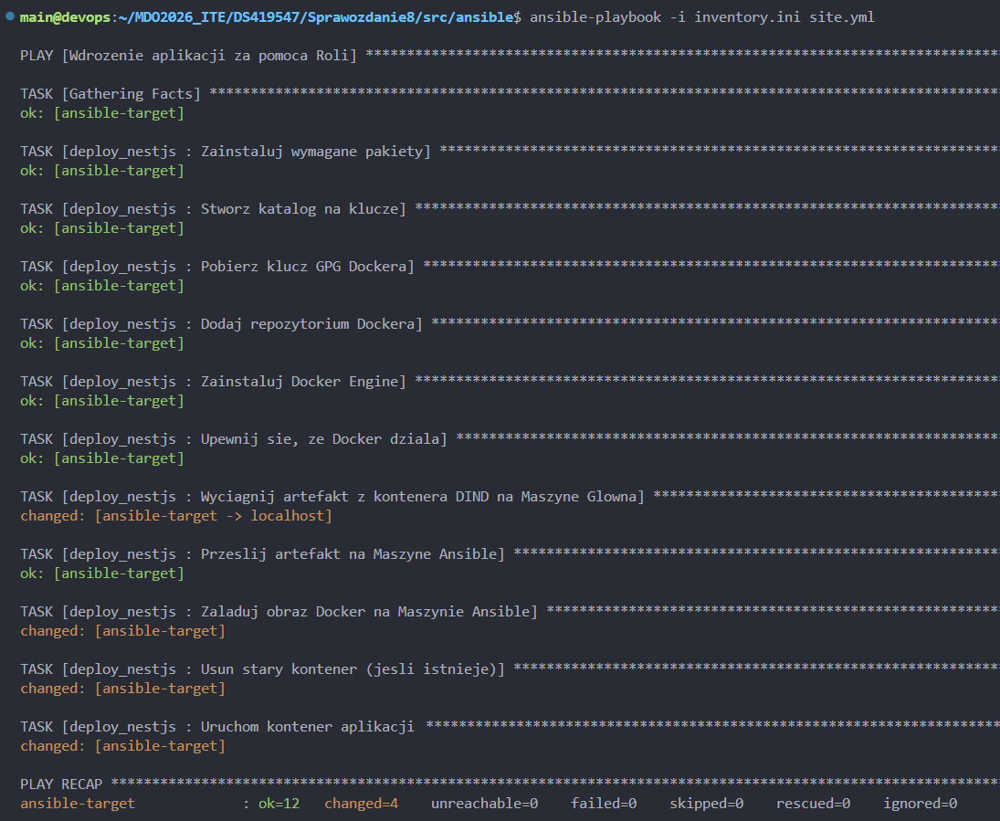

# Sprawozdanie 8

## Cel zajęć
Celem ćwiczenia była automatyzacja procesów konfiguracji i wdrożenia używając Ansible. Zadanie polegało na przygotowaniu infrastruktury, zabezpieczeniu komunikacji kluczami i stworzeniu playbooków, które automatycznie instalują Docker i wdrażają artefakt NestJS na zdalnym serwerze.

## 1. Konfiguracja architektury sterującej i SSH
Ansible pracuje w modelu bezagentowym, co oznacza, że do zarządzania systemem docelowym wykorzystuje tylko protokół SSH. Wymaga poprawnej konfiguracji zaufania między maszynami.

Kroki:

- Wykonano migawkę Maszyny Ansible w Hyper-V. Pozwaliło to później na rollback w przypadku złej konfiguracji usług systemowych.
- Na Głównej Maszynie zainstalowano Ansible, czyli silnik orkiestracii, który parsuje pliki YAML i przesyła tymczasowe moduły Pythona na węzły docelowe.
- Wygenerowano parę kluczy SSH.
- Klucz publiczny został wpisany do pliku `authorized_keys` na targecie używając `ssh-copy-id`. Dzięki temu Główna Maszyna może inicjować sesje SSH bez podawania hasła.
- Żeby Ansible mógł zarządzać pakietami i usługami, skonfigurowano regułę `NOPASSWD` w folderze `/etc/sudoers.d/`. Pozwaliło to na podnoszenie uprawnień (become: true) bez blokowania skryptu prośbą o hasło do sudo.




## 2. Inwentaryzacja i DNS
Inwentarz w Ansible to baza danych o hostach, którymi zarządzamy. Może mieć formę statycznych plików INI/YAML lub dynamicznych skryptów pobierających dane z chmury.

Kroki:

- Edytowano `/etc/hosts`, żeby przypisać statyczne IP (192.168.82.236) do nazwy `ansible-target`. Ułatwiło to pisanie playbooków, bo stały się niezależne od zmieniających się adresów fizycznych.
- Stworzono plik `inventory.ini`, w którym zdefiniowano dwie grupy. Zastosowanie `ansible_connection=local` dla localhosta omija stos SSH przy wykonywaniu zadań na maszynie sterującej.
```ini
[Orchestrators]
localhost ansible_connection=local

[Endpoints]
ansible-target
```
- Uruchomiono `ansible all -m ping`. Nie jest to zwykły ICMP ping, bo sprawdza zdolność Ansible do zalogowania się, wykonania skryptu Pythona i odebrania odpowiedzi w formacie JSON.



## 3. Deklaratywne Playbooki Systemowe
Playbooki to scenariusze zapisane w formacie YAML, które opisują pożądany stan systemu. Ansible dąży do osiągnięcia tego stanu. Ansible stosuje zasadę idempotentności, więc wielokrotne uruchomienie tego samego zadania nie zmienia systemu, jeśli jest on już w poprawnym stanie.

Kroki:

- Moduł Copy został wykorzystany do przesłania pliku inwentarza na węzły docelowe. Pozwaliło to na audyt konfiguracji bezpośrednio na maszynach końcowych.
- Zadanie `apt update` odświeża cache lokalnego managera pakietów. Jest to potrzebne, żeby uniknąć konfliktów wersji.
- Playbook wymusza restart usług `sshd` i `rngd`. Restart SSH jest często wymagany po zmianach w konfiguracji bezpieczeństwa, a moduł `service` zapewnia abstrakcję nad systemd/init.d.
- Zweryfikowano zachowanie playbooka w przypadku braku łączności (wyłączona karta sieciowa na targecie). Ansible poprawnie zgłasza błąd `unreachable`, nie przerywając pracy nad pozostałymi hostami w inwentarzu.




## 4. Zarządzanie artefaktem i wdrożenie kontenerowe
Wdrożenie aplikacji NestJS wymagało automatyzacji setupu Dockera. Ansible poradził sobie z tym używając kilku zadań sekwencyjnych.

Kroki:

- Przed wdrożeniem playbook weryfikuje obecność potrzebnych zależności systemowych i wolnego miejsca na dysku maszyny docelowej.
- Automatycznie dodano oficjalne repozytoria Dockera. Klucze GPG zostały zapisane w `/etc/apt/keyrings`.
- Zainstalowano `python3-docker`, bo Ansible potrzebuje tej biblioteki do komunikacji z Docker API przez moduły takie jak `docker_container`.
- Jako że obraz aplikacji `nestjs-app-ds419547:8` znajdował się tylko w Jenkins DIND, użyty został `docker exec` połączony z przekierowaniem strumienia do pliku `.tar`. Potem Ansible przesłał ten plik na zdalną maszynę i wykonał `docker load`, przywracając obraz z archiwum.
- Aplikacja została uruchomiona w kontenerze z mapowaniem portów (3000:3000) i polityką restartu `always`.
- Playbook zawiera zadania czyszczące stare kontenery (`docker rm -f`) i tymczasowe `.tar` po procesie ładowania obrazu.





## 5. Architektura Ról (ansible-galaxy)
Ostatnim etapem była migracja z monolitycznych playbooków do **Ansible Roles**. Struktura została zainicjalizowana komendą `ansible-galaxy role init roles/deploy_nestjs`.

Zalety i struktura:

- Zadania zostały przeniesione do `roles/deploy_nestjs/tasks/main.yml`.
- Plik `meta/main.yml` przechowuje informacje o autorze i zależnościach roli, co jest wymagane przy publikacji w Ansible Galaxy.
- Główny plik `site.yml` został spisem treści, który tylko wskazuje, jakie role mają być przypisane do konkretnych grup hostów.




## Wnioski

Wykorzystanie Ansible pozwala na przejście od manualnej konfiguracji serwerów do modelu IaC. Raz przygotowany playbook gwarantuje nam powtarzalność środowiska na wielu maszynach jednocześnie, co skraca czas potrzebny na wdrożenie i minimalizuje ryzyko błędów. Ansible, wykorzystując tylko SSH i Pythona, eliminuje potrzebę instalowania i aktualizowania dodatkowego oprogramowania sterującego na węzłach docelowych. Upraszcza to architekturę i obniża narzut zasobowy na zarządzanych maszynach. Jedną z najważniejszych cech Ansible jest idempotentność, czyli ta zdolność do wielokrotnego uruchamiania tego samego skryptu bez wprowadzania zmian, jeśli system jest już w dobrym stanie. Pozwala to na audytowanie konfiguracji bez obawy o przerwanie działania usług. Przejście z monolitycznych playbooków na strukturę ról (ansible-galaxy) poprawia czytelność i reusability kodu. Podział na zadania, zmienne i metadane pozwala na dzielenie się rozwiązaniami między różnymi projektami i zespołami. Ansible sprawdza się w orkiestracji kontenerów, automatyzując nie tylko sam proces uruchamiania obrazów, ale też przygotowanie środowiska systemowego (instalacja silnika Docker, zarządzanie repozytoriami APT, obsługa bibliotek Python-Docker). Jest to idealne uzupełnienie dla CI/CD (np. Jenkins), pozwala na przenoszenie artefaktów między środowiskami.