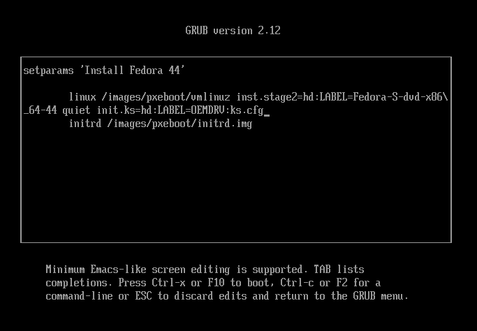
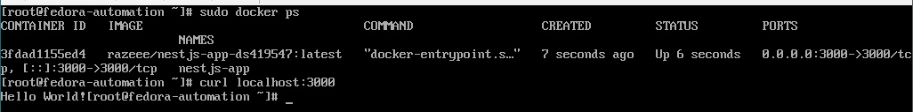
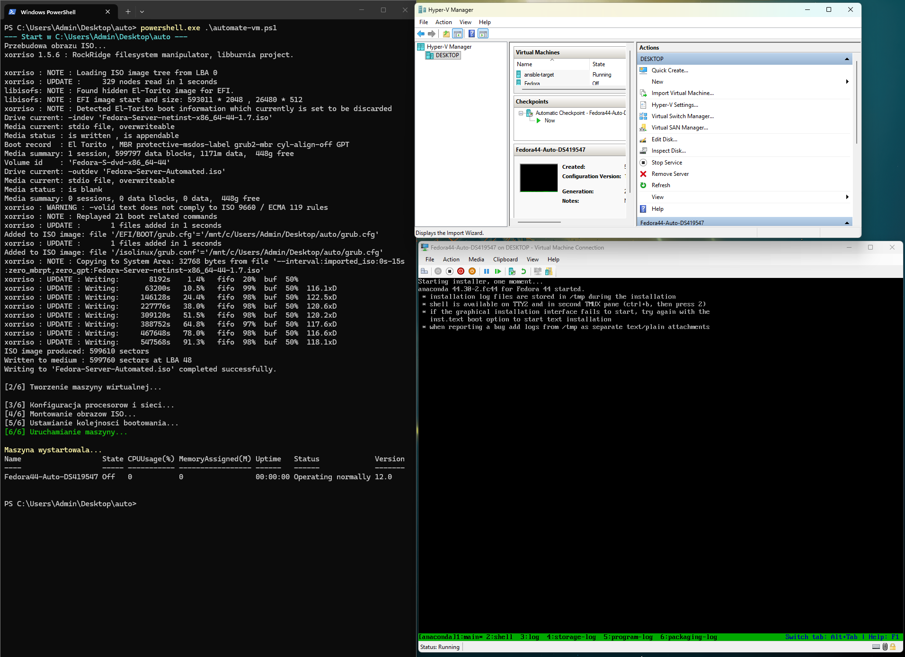

# Sprawozdanie 9

## Cel zajęć
Celem ćwiczenia było przygotowanie pliku kickstart (`ks.cfg`) do nienadzorowanej instalacji Fedory 44. System po automatycznej instalacji miał sam skonfigurować Dockera i uruchomić aplikację przygotowywaną na poprzednich ćwiczeniach. Całość ma dziać się bez klikania w instalatorze.

## 1. Przygotowanie pliku kickstart
Plik kickstart to skrypt odpowiedzi dla instalatora Anaconda. Zamiast ręcznie wybierać opcje w GUI, instalator czyta je z tego pliku. Bazą był domyślny plik `/root/anaconda-ks.cfg` generowany przez Fedorę.

Fragment konfiguracji:

```bash
# Adresy repozytoriów
url --mirrorlist=https://mirrors.fedoraproject.org/mirrorlist?repo=fedora-$releasever&arch=x86_64
repo --name=updates --mirrorlist=https://mirrors.fedoraproject.org/mirrorlist?repo=updates-released-f$releasever&arch=x86_64

# Klawiatura i język
keyboard --vckeymap=pl --xlayouts=pl
lang pl_PL.UTF-8

# Sieć i nazwa maszyny
network --bootproto=dhcp --device=link --hostname=fedora-automation --activate

# Partycjonowanie
clearpart --all --initlabel
autopart

# Pakiety
%packages
@core
moby-engine
curl
%end

# Sekcja post-install
%post --log=/dev/console
systemctl enable docker

# Tworzenie serwisu systemd
cat <<EOF > /etc/systemd/system/nestjs-app.service
[Unit]
Description=Run NestJS App Container
After=docker.service
Requires=docker.service

[Service]
Type=oneshot
ExecStart=/usr/local/bin/start-app.sh
RemainAfterExit=yes

[Install]
WantedBy=multi-user.target
EOF

# Skrypt uruchamiający dockera - pobiera obraz z Docker Huba
cat <<EOF > /usr/local/bin/start-app.sh
#!/bin/bash
sleep 10
docker pull razeee/nestjs-app-ds419547:latest
docker run -d --name nestjs-app -p 3000:3000 razeee/nestjs-app-ds419547:latest
EOF
chmod +x /usr/local/bin/start-app.sh

systemctl enable nestjs-app.service
%end

# Automatyczny restart
reboot
```

## 2. Przygotowanie środowiska i zasobów

### Konfiguracja w Hyper-V
Dla instalacji nienadzorowanej w Hyper-V stworzono obraz ISO o etykiecie `OEMDRV` z plikiem `ks.cfg` w środku. Anaconda automatycznie szuka napędów o tej nazwie, żeby pobrać plik odpowiedzi. Podpięto dwa napędy DVD:
1. `Fedora-Server-netinst.iso` - instalator sieciowy.
2. `config.iso` (etykieta `OEMDRV`) - plik `ks.cfg`.

Inną opcją dostarczania `ks.cfg` byłoby:
1. Użycie HTTP/FTP, gdzie plik byłby pobierany przez sieć (`inst.ks=http://...`). Jest to wygodniejsze przy aktualizacjach skryptu, ale wymaga działającej infrastruktury sieciowej przy bootowaniu.
2. Wbudowanie cfg w ISO, gdzie plik wstrzykiwany byłby do initrd, więc nie trzeba byłoby montować drugiego napędu.

Wyłączono opcję Secure Boot w ustawieniach VM, żeby umożliwić edycję parametrów startowych.

---


## 3. Przebieg instalacji
Przy starcie systemu z ISO Fedory, wybrano opcję "Install" i naciśnięto klawisz `e`, żeby edytować linię bootowania. Dopisano parametr `inst.ks=hd:LABEL=OEMDRV:/ks.cfg`. 
Dzięki `%post --log=/dev/console` w pliku kickstart, logi z instalacji aplikacji wyświetlały się na ekranie podczas kończenia pracy instalatora.

---


## 4. Weryfikacja działania aplikacji
Po restarcie system wstał, Docker się włączył, a serwis `nestjs-app` pobrał obraz z Docker Huba i wystartował kontener.

### Sprawdzenie statusu
Weryfikacja została wykonana na roocie:
- `docker ps` - pokazuje, że kontener `nestjs-app` działa i mapuje port 3000.
- `curl localhost:3000` - potwierdza, że aplikacja odpowiada poprawnie.

---


## Zakres rozszerzony
W ramach zakresu rozszerzonego zrealizowano automatyzację procesu wdrożenia, od modyfikacji instalatora po uruchomienie usługi. Całość logiki znajduje się w `src/`.

### 1. Modyfikacja Bootloadera (`grub.cfg`)
Zmodyfikowano plik `grub.cfg`, żeby instalator automatycznie startował z parametrem `inst.ks=hd:LABEL=OEMDRV:/ks.cfg`. Dzięki temu wyeliminowano konieczność ręcznej edycji linii komend w menu GRUB.

### 2. Skrypt automatyzujący (`automate-vm.ps1`)
Główny skrypt PowerShell orkiestruje cały proces:
- Wykorzystuje WSL i narzędzie `xorriso` do wstrzyknięcia zmodyfikowanego `grub.cfg` do oryginalnego obrazu Fedory. Komenda `xorriso` podmienia plik wewnątrz ISO:
  ```powershell
  wsl bash -c "xorriso -indev $isoOriginalName -outdev $isoCustomName -boot_image any replay -map $grubCfgName /EFI/BOOT/grub.cfg -map $grubCfgName /isolinux/grub.conf"
  ```
- Automatycznie usuwa starą maszynę o tej samej nazwie przed nowym wdrożeniem.
- Tworzy nową VM (Gen 2, 2 vCPU, 2GB RAM).
- Wyłącza Secure Boot i montuje dwa obrazy ISO: przebudowany instalator oraz `config.iso` z plikiem kickstart.
- Automatycznie startuje maszynę z odpowiednią kolejnością bootowania.

---


## Wnioski
Instalacja nienadzorowana używając kickstart bardzo skraca czas wdrożenia nowych serwerów. Połączenie plików kickstart z automatyzacją tworzenia VM oraz remasteringiem obrazów ISO pozwala na budowę powtarzalnej i zautomatyzowanej infrastruktury, a więc Infrastructure as Code.
