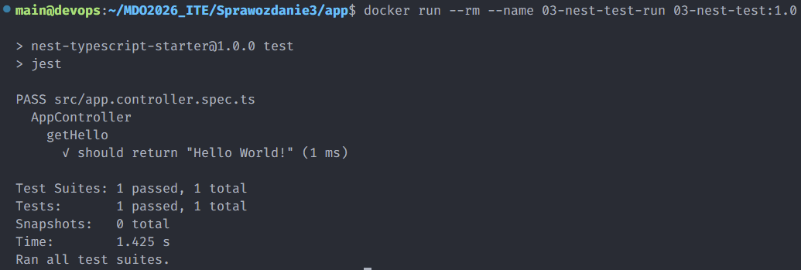
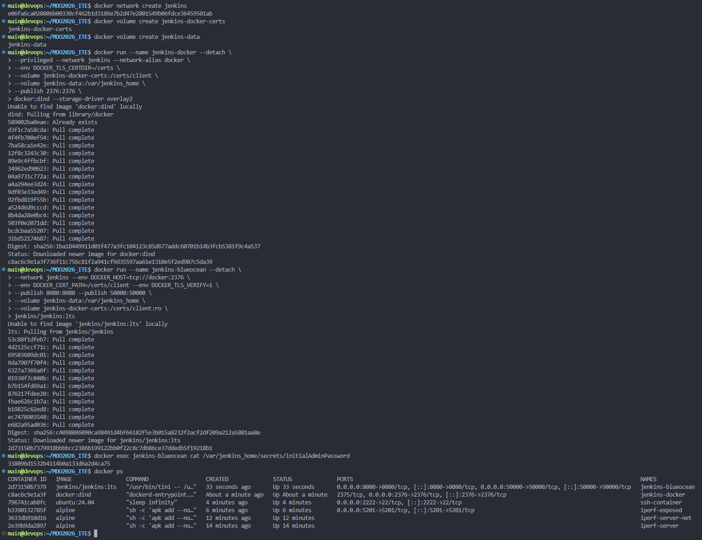

# Sprawozdanie Zbiorcze z Laboratoriów 1-4

### Wstęp
Pierwszy blok zajęć laboratoryjnych stanowił wprowadzenie w metody wytwarzania oprogramowania, gdzie nacisk kładziono nie na sam kod, ale przede na środowisko, w którym ten kod powstaje, jest testowany i uruchamiany. Rozpoczęliśmy od konfiguracji lokalnej maszyny, przez izolację procesów w kontenerach, aż po tworzenie całych środowisk i wstępną automatyzację typu CI/CD. Dążyliśmy do sytuacji, w której każdy etap pracy jest udokumentowany, powtarzalny i bezpieczny.

### Wprowadzenie, Git, Gałęzie, SSH (Lab 01)
Pierwszy etap skupił się na przygotowaniu bezpiecznego i ustandaryzowanego środowiska pracy. Pierwszym elementem była konfiguracja protokołu SSH do komunikacji z GitHubem.
Zainstalowaliśmy klienta Git, utworzyliśmy dwa klucze SSH oraz skonfigurowaliśmy je jako metodę dostępu do GitHuba używając GitHub CLI.

W celu wymuszenia spójności, przetestowaliśmy lokalny mechanizm automatyzacji w postaci Git hooka `pre-commit`. Skrypt ten weryfikuje, czy każda wiadomość commita zaczyna się od zdefiniowanego prefiksu (inicjały i numer indeksu), co znacząco, poza zaprezentowaniem działania Git hooków, ułatwia późniejszą analizę historii zmian w repozytorium.

**Zastosowane rozwiązania:**
*   **SSH**: Zapewnia bezpieczną i bezobsługową autoryzację w komunikacji z serwerem.
*   **Git Hooks**: Pozwalają na automatyczną walidację standardów przed wysłaniem kodu do zdalnego źródła.

### Git, Docker (Lab 02)
Kolejne zajęcia dotyczyły konteneryzacji procesów przy użyciu Dockera. Głównym celem było zrozumienie różnicy między kontenerem a maszyną wirtualną. Kontener, jako wyizolowany proces współdzielący jądro systemu z hostem, pozwala na znacznie szybsze uruchamianie usług przy minimalnym narzucie zasobów.

Przeprowadziliśmy testy na różnych obrazach systemowych (BusyBox, Ubuntu, MariaDB) oraz przygotowaliśmy własny plik Dockerfile. Pozwoliło to na stworzenie powtarzalnego środowiska, w którym repozytorium jest automatycznie klonowane do wnętrza obrazu, co eliminuje problemy z brakiem zależności na różnych maszynach deweloperskich.

**Zalety konteneryzacji w procesie DevOps:**
*   **Izolacja**: Środowisko uruchomieniowe jest niezależne od konfiguracji systemu hosta.
*   **Powtarzalność**: Każdy członek zespołu pracuje na dokładnie takim samym obrazie bazowym.
*   **Czystość systemu**: Zależności aplikacji nie muszą być instalowane bezpośrednio w systemie operacyjnym.

### Dockerfiles, kontener jako definicja etapu (Lab 03)
Na tym etapie wykorzystaliśmy kontenery jako definicje konkretnych kroków w budowaniu aplikacji (CI). Do testów posłużył projekt oparty na frameworku NestJS. Aby zapewnić stabilność procesu, użyliśmy komendy `npm ci`, która instaluje zależności ściśle według pliku `package-lock.json`, gwarantując zgodność wersji bibliotek.

Całość procesu została zautomatyzowana za pomocą Docker Compose. Pozwoliło to na zdefiniowanie wieloetapowego budowania (multi-stage build), gdzie jeden obraz odpowiada za kompilację kodu z TypeScriptu do JavaScriptu, a kolejny za uruchomienie testów jednostkowych w czystym środowisku.

**Kluczowe techniki budowania:**
*   **Multi-stage build**: Rozdzielenie etapu kompilacji od etapu testowania i uruchamiania w celu optymalizacji obrazów.
*   **Docker Compose**: Orkiestracja kontenerów za pomocą deklaratywnego pliku YAML, co upraszcza zarządzanie parametrami uruchomieniowymi.
*   **Integracja testów**: Automatyczne przerwanie procesu budowania w przypadku wykrycia błędów w testach jednostkowych.

### Dodatkowa terminologia w konteneryzacji, instancja Jenkins (Lab 04)
Ostatnie laboratorium poświęcono już bardziej zaawansowanym zagadnieniom infrastrukturalnym i uruchomieniu serwera Jenkins. Jednym z celów było zapewnienie trwałości danych przy użyciu woluminów Dockera, co zapobiega utracie konfiguracji Jenkinsa po restarcie kontenera.

Przeprowadziliśmy również testy wydajnościowe sieci narzędziem `iperf`, porównując domyślny sterownik `bridge` z trybem `host`. Pozwoliło to zrozumieć koszty wydajnościowe izolacji sieciowej. Na koniec skonfigurowaliśmy architekturę Master-Agent, gdzie główna instancja Jenkinsa zleca wykonywanie zadań budowania osobnym kontenerom-agentom.

**Wnioski z konfiguracji infrastruktury:**
*   **Woluminy**: Niezbędne do zachowania stanu aplikacji wewnątrz kontenerów.
*   **Wydajność sieci**: Wybór między izolacją a wydajnością zależy od specyfiki konkretnego wdrożenia.
*   **Skalowalność**: Podział na Mastera i Agenty pozwala na równoległe przetwarzanie zadań bez przeciążania serwera głównego.

### Podsumowanie i wyciągnięte wnioski
Realizacja czterech laboratoriów pozwoliła na zbudowanie kompletnego fundamentu pod nowoczesne podejście do inżynierii oprogramowania. Przejście od ręcznej konfiguracji do automatyzacji w Jenkinsie pokazało, jak duży wpływ na jakość i tempo prac ma odpowiedni dobór narzędzi.

Najważniejszą wyciągniętą wiedzą było zrozumienie, że powtarzalność środowiska jest głównym czynnikiem stabilnego procesu CI/CD. Dzięki zastosowaniu Dockera i Gita, proces wytwarzania oprogramowania staje się przewidywalny, a ewentualne błędy są wykrywane na wczesnym etapie, zanim trafią do środowiska produkcyjnego.
