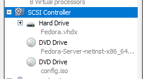
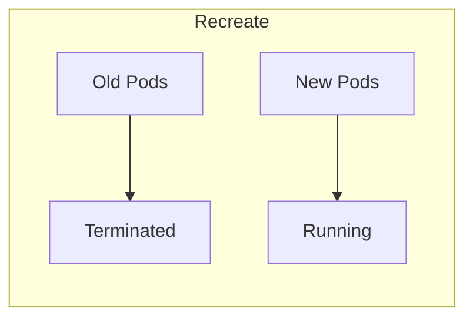
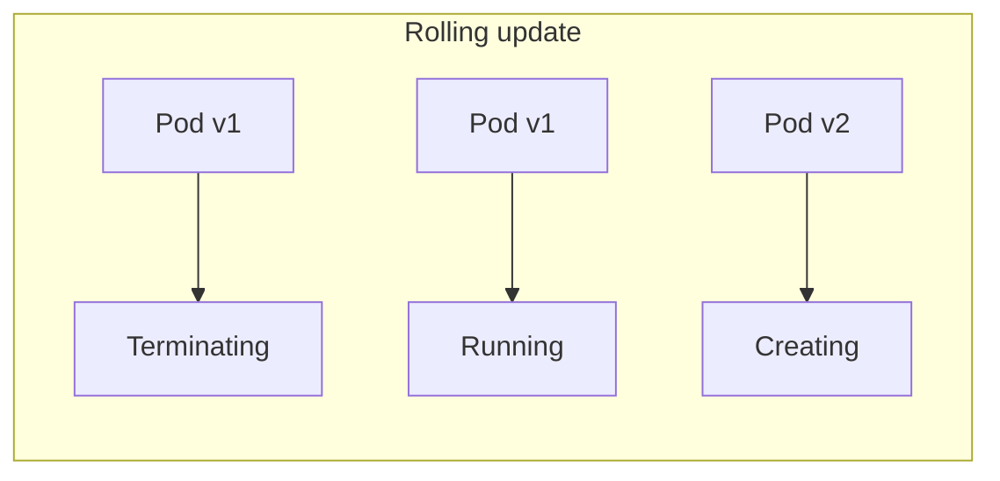
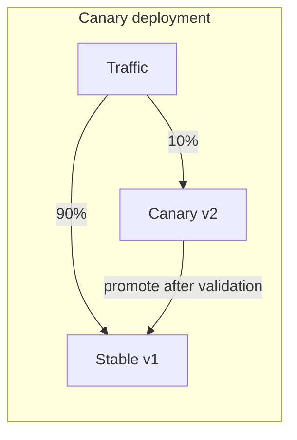

# Sprawozdanie zbiorcze z laboratoriów 8-12

### Wstęp
Trzeci blok zajęć laboratoryjnych poświęcono automatyzacji procesów wdrażania i zarządzania infrastrukturą. Przeszliśmy przez orkiestrację systemów operacyjnych przy użyciu Ansible, instalację środowisk hostujących, zarządzanie kontenerami w klastrach Kubernetes i chmurze Azure. Celem było wyeliminowanie manualnej konfiguracji i zastąpienie jej w pełni deklaratywnym podejściem Infrastructure as Code.

### Automatyzacja i orkiestracja - Ansible (Lab 08)
Pierwszy etap skupił się na wykorzystaniu Ansible jako narzędzia do zdalnego zarządzania konfiguracją. W przeciwieństwie do Jenkinsa, który skupiał się na budowaniu artefaktów, Ansible pozwolił na przygotowanie samych serwerów docelowych. Skonfigurowaliśmy architekturę sterującą, która bezagentowo (przez SSH) zarządza węzłami końcowymi.

Wprowadziliśmy inwentaryzację systemów i zdefiniowaliśmy playbooki odpowiedzialne za instalację silnika Docker oraz wdrożenie naszej aplikacji NestJS. Kluczowym osiągnięciem było ustrukturyzowanie kodu w postaci ról, co pozwoliło na odseparowanie zmiennych, zadań i metadanych, zwiększając czytelność i możliwość wielokrotnego wykorzystania skryptów.

Pozwoliło to na idempotentność, która oznacza, że wielokrotne uruchomienie skryptu gwarantuje ten sam stan systemu bez wprowadzania niepożądanych zmian. Ponadto, nie było konieczności instalowania dodatkowego oprogramowania na zarządzanych maszynach. Modularność takiego rozwiązania pozwala na łatwe dzielenie się logiką wdrożeniową między projektami.

### Instalacja nienadzorowana i pliki Kickstart (Lab 09)
Kolejne zajęcia dotyczyły automatyzacji na poziomie instalacji systemu operacyjnego. Wykorzystaliśmy pliki odpowiedzi Kickstart (`ks.cfg`) do przeprowadzenia automatycznej instalacji Fedory. Pozwoliło to na zdefiniowanie partycjonowania, pakietów oraz skryptów post-instalacyjnych bez interakcji użytkownika.

W sekcji `%post` zawarliśmy logikę konfiguracji Dockera i automatycznego pobrania obrazu aplikacji z rejestru. Dzięki temu, zaraz po pierwszym uruchomieniu, system staje się gotowym węzłem aplikacyjnym. Proces ten zintegrowaliśmy z automatyzacją tworzenia maszyn wirtualnych w Hyper-V przy użyciu PowerShella.

**Najważniejsze mechanizmy naszego Kickstart:**
*   Instalator systemu wykonuje wszystkie kroki na podstawie zdefiniowanego pliku odpowiedzi.
*   Możliwość wykonania dowolnych skryptów powłoki zaraz po zakończeniu kopiowania plików systemowych.
*   Integracja pliku odpowiedzi z nośnikiem instalacyjnym dla pełnej autonomii procesu.

### Orkiestracja kontenerów - Kubernetes (Lab 10)
Na tym etapie przenieśliśmy nasze kontenery do środowiska Kubernetes przy użyciu narzędzia minikube. Kubernetes, jako orkiestrator, przejmuje odpowiedzialność za cykl życia kontenerów, ich skalowanie i samonaprawę.

Zdefiniowaliśmy nasze pierwsze obiekty typu Deployment, które opisują pożądany stan aplikacji (np. liczbę replik). Wykorzystanie serwisu pozwoliło na stworzenie stabilnego punktu dostępowego do grupy podów, co umożliwiło load balancing ruchu przychodzącego.

Ważne było poznanie kilku kluczowych pojęć. Pod to najmniejsza jednostka obliczeniowa, zawierająca jeden lub więcej kontenerów. Deployment to kontroler zarządzający replikacją i aktualizacjami podów. Service to abstrakcja definiująca logiczny zestaw podów i politykę dostępu do nich.

### Zarządzanie cyklem życia i strategie wdrożeń (Lab 11)
Kolejne zajęcia z Kubernetesem poświęcono zaawansowanemu zarządzaniu wersjami i strategiami aktualizacji. Przetestowaliśmy mechanizm `rollout`, który pozwala na płynne przechodzenie między wersjami obrazów i wycofywanie zmian (takie undo) w przypadku wykrycia błędów.

Zaimplementowaliśmy trzy główne strategie wdrażania, dopasowując je do różnych wymagań dostępności i bezpieczeństwa. Wykorzystaliśmy również skrypty weryfikujące, które automatycznie sprawdzają status wdrożenia przed uznaniem go za udane.

*   **Recreate** powoduje, że wszystkie stare pody są usuwane przed stworzeniem nowych (krótki downtime, brak konfliktów wersji).
*   **Rolling update** powoduje, że pody są podmieniane sekwencyjnie (brak downtime'u, pody starej i nowej wersji działają równocześnie).
*   **Canary deployment** powoduje, że nowa wersja jest wdrażana jako osobny, mniejszy Deployment (testy na małej grupie użytkowników przed pełnym wdrożeniem).

### Kontenery w chmurze - Azure Container Instances (Lab 12)
Ostatnie laboratorium dotyczyło wdrożenia aplikacji w chmurze publicznej Azure przy użyciu usługi PaaS - Azure Container Instances. Pozwala ona na uruchamianie kontenerów bezpośrednio w infrastrukturze chmurowej bez konieczności zarządzania klastrem czy serwerami.

Proces objął konfigurację grup zasobów, rejestrację dostawców i samo wdrożenie przy użyciu Azure CLI. Wykorzystaliśmy obraz wypchnięty do Docker Hub, co udowodniło łatwość przenoszenia artefaktów między środowiskiem lokalnym a chmurą publiczną.

ACI jest serverless, co pozwala na brak konieczności zarządzania systemem operacyjnym hosta. Uruchomienie kontenera następuje w kilka sekund bezpośrednio z rejestru. Płacimy tylko za czas działania i zasoby przydzielone do kontenera.

### Komendium techniczne z ćwiczeń

Zestawienie stanowi podsumowanie najważniejszych narzędzi i poleceń użytych w ćwiczeniach 8-12.

#### 1. Ansible - Orkiestracja konfiguracji
Ansible pozwala na deklaratywne zarządzanie stanem systemów przez SSH.

*   `ansible all -m ping` – weryfikacja łączności z hostami w inwentarzu.
*   `ansible-playbook site.yml` – uruchomienie głównego scenariusza wdrożenia.
*   `ansible-galaxy role init <nazwa>` – inicjalizacja struktury nowej roli.
*   **Najważniejsze moduły**:
    *   `apt` / `yum`: Zarządzanie pakietami systemowymi.
    *   `copy`: Przesyłanie plików na serwer.
    *   `service`: Zarządzanie usługami (systemd).
    *   `docker_container`: Zarządzanie cyklem życia kontenerów przez Docker API.

#### 2. Kickstart - Automatyzacja instalacji OS
Plik `ks.cfg` definiuje parametry instalatora Anaconda dla dystrybucji opartych na Red Hat (przykładowo Fedora, CentOS).

*   `inst.ks=hd:LABEL=OEMDRV:/ks.cfg` – parametr bootowania wskazujący plik odpowiedzi.
*   **Sekcje pliku Kickstart**:
    *   `url`, `repo`: Definicja źródeł pakietów.
    *   `clearpart`, `autopart`: Automatyczna konfiguracja dysków.
    *   `%packages`: Lista oprogramowania do zainstalowania.
    *   `%post`: Skrypty wykonywane po instalacji systemu (np. konfiguracja Dockera).

#### 3. Kubernetes (kubectl i minikube)
Kubernetes to system do automatyzacji wdrożeń, skalowania i zarządzania aplikacjami w kontenerach.

*   `minikube start` – uruchomienie lokalnego klastra.
*   `kubectl apply -f <plik.yaml>` – wdrożenie zasobów zdefiniowanych w pliku.
*   `kubectl get pods` – lista uruchomionych jednostek (podów).
*   `kubectl scale deployment <nazwa> --replicas=<liczba>` – ręczna zmiana liczby replik.
*   `kubectl rollout status deployment/<nazwa>` – monitorowanie procesu aktualizacji.
*   `kubectl rollout undo deployment/<nazwa>` – powrót do poprzedniej wersji wdrożenia.
*   `kubectl port-forward <zasob> <port_lokalny>:<port_pod>` – tunelowanie portu do lokalnej maszyny.

#### 4. Azure CLI
Interfejs wiersza poleceń do zarządzania zasobami w chmurze Microsoft Azure.

*   `az group create --name <nazwa> --location <region>` – tworzenie grupy zasobów.
*   `az container create --resource-group <gr> --name <nazwa> --image <obraz>` – wdrożenie instancji kontenera.
*   `az container logs --resource-group <gr> --name <nazwa>` – pobieranie logów z kontenera w chmurze.
*   `az group delete --name <nazwa>` – usunięcie wszystkich zasobów w danej grupie.

### Podsumowanie i wnioski
Realizacja laboratoriów 8-12 zamknęła pełny cykl nowoczesnego procesu DevOps. Pracowaliśmy nad automatyzacją konfiguracji pojedynczych maszyn (Ansible), masową instalację systemów (Kickstart), aż po orkiestrację w klastrach (Kubernetes) i chmurze (Azure).

Najważniejszym wniosniem było zrozumienie, że w nowoczesnej inżynierii oprogramowania infrastruktura musi być traktowana tak samo jak kod źródłowy. Wykorzystanie podejścia **Infrastructure as Code** pozwala na budowanie powtarzalnych, bezpiecznych i łatwo skalowalnych środowisk. Przejście z modelu manualnego na deklaratywny eliminuje ryzyko błędu ludzkiego i pozwala zespołom deweloperskim skupić się na dostarczaniu funkcjonalności, mając pewność, że proces wdrożenia jest przewidywalny i w pełni zautomatyzowany.
