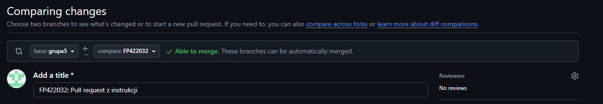
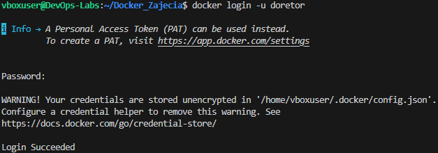
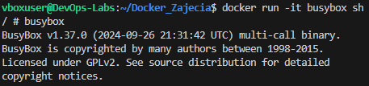
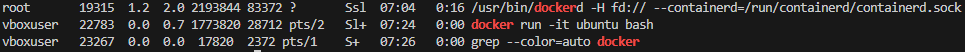
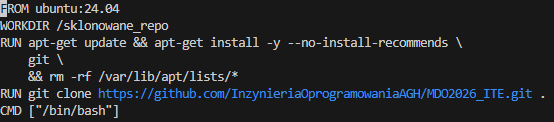
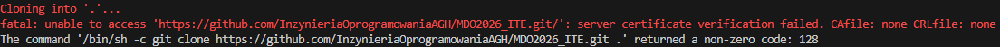
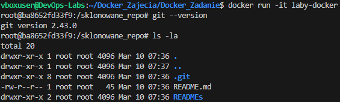
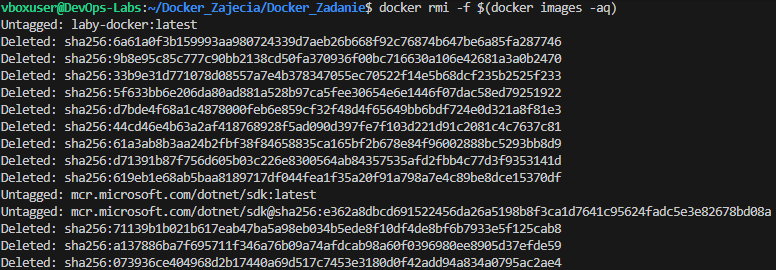
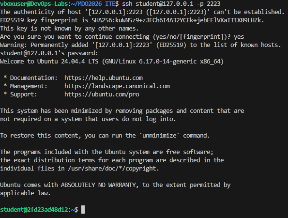

# Sprawozdanie zbiorcze: Laboratoria 1-4 (Git, Docker, Jenkins)
**Autor:** Filip Pyrek  
**Indeks:** 422032

---

## Laboratorium 1: Środowisko pracy, Git i SSH

### 1. Środowisko i połączenie
Pracę zacząłem od przygotowania maszyny wirtualnej z Ubuntu Server na VirtualBoxie. Żeby połączyć się z serwerem z Windowsa, ustawiłem przekierowanie portu 2222 na port 22 w ustawieniach sieci NAT.

Do pracy używałem Visual Studio Code z dodatkiem Remote-SSH, dzięki czemu mogłem pisać komendy i edytować pliki bezpośrednio na Ubuntu.

### 2. Instalacja Gita i pierwsze klonowanie
Na Ubuntu zainstalowałem niezbędne narzędzia: serwer SSH oraz klienta Git.

Pierwsze klonowanie repozytorium zrobiłem przez HTTPS, używając adresu z GitHub.

### 3. Konfiguracja kluczy SSH
Żeby bezpiecznie łączyć się z GitHubem bez wpisywania haseł, wygenerowałem dwa klucze ED25519 komendą `ssh-keygen`. Klucz `id_ed25519_nopass` zostawiłem bez hasła.

Następnie dodałem klucz publiczny do ustawień swojego konta na GitHubie, aby serwer mógł mnie rozpoznawać.

### 4. Rozwiązanie problemu z logowaniem (SSH Config)
W folderze `~/.ssh/` na Ubuntu stworzyłem plik o nazwie `config`. Wpisałem tam dane serwera oraz wskazałem ścieżkę do mojego klucza bez hasła, który wcześniej dodałem do GitHuba.

Dzięki temu plikowi oraz zmianie adresu zdalnego repozytorium na SSH, komenda `git push` zaczęła działać bez żadnych problemów.

### 5. Skrypt Git Hook i testy
W folderze `.git/hooks/` przygotowałem skrypt `commit-msg`. Jego zadaniem jest sprawdzanie, czy każda wiadomość w commit zaczyna się od mojego indeksu (422032). 

Na poniższym zrzucie widać test: pierwsza próba bez indeksu została zablokowana przez skrypt, a druga z poprawnym opisem "FP422032: ..." przeszła bez problemu.

### 6. Utworzenie Pull Requesta
Ostatnim etapem było wystawienie Pull Requesta z mojej gałęzi `FP422032` do gałęzi grupowej `grupa5`. GitHub potwierdził możliwość automatycznego scalenia zmian.

---

## Laboratorium 2: Wprowadzenie do Dockera

### 1. Instalacja środowiska skonteneryzowanego
Zainstalowałem Dockera w systemie Ubuntu bezpośrednio z repozytorium dystrybucji. Użyłem polecenia `sudo apt install docker.io`.

Następnie zalogowałem się do swojego konta na Docker Hub.

### 2. Analiza obrazów i kodów wyjścia
Pobrałem i uruchomiłem serię wskazanych obrazów: `hello-world`, `busybox`, `ubuntu`, `mariadb` oraz obrazy .NET (`runtime`, `aspnet`, `sdk`). 

Poleceniem `docker ps -a` zweryfikowałem kody wyjścia (STATUS). Kontenery narzędziowe i testowe zakończyły się poprawnie `Exited (0)`, natomiast `mariadb` zwróciła błąd `Exited (1)` ze względu na brak wymaganych zmiennych środowiskowych przy uruchomieniu.

Przetestowałem również interaktywne wejście do minimalistycznego kontenera `busybox` (wykorzystującego powłokę `sh`).

### 3. System w kontenerze i izolacja PID
Uruchomiłem kontener z obrazem `ubuntu` w trybie interaktywnym. Sprawdziłem procesy – główny proces powłoki bash otrzymał wewnątrz kontenera PID 1. Zaktualizowałem również pakiety systemowe.

Sprawdzenie tego samego procesu na maszynie hosta pokazywało, że ten proces posiadał standardowy numer PID 22783.

### 4. Budowa własnego obrazu (Dockerfile)
Stworzyłem `Dockerfile` bazujący na obrazie `ubuntu:24.04`, instalujący pakiet `git` i klonujący wskazane repozytorium z GitHuba.

Podczas budowania obrazu napotkałem na dwa błędy, które na bieżąco poprawiłem:
1. **Nazewnictwo:** Zmiana nazwy tagu z `LabyDocker` na małe litery `laby-docker`.
   
2. **Certyfikaty:** Kontener nie mógł zweryfikować połączenia z GitHubem (kod błędu 128). Dodałem instalację pakietu `ca-certificates`.
   

Po poprawkach obraz zbudował się pomyślnie, a repozytorium zostało pobrane do wewnątrz obrazu.

### 5. Przegląd historii kontenerów
Poleceniem `docker ps -a` wyświetliłem wszystkie uruchomione i zakończone kontenery. Widać tam m.in. błędy z etapu budowania (`Exited (128)`) oraz pomyślnie zakończone procesy własnego obrazu i testowanego wcześniej `busyboxa`.

### 6. Czyszczenie środowiska
Aby utrzymać porządek w systemie hosta, po zakończeniu pracy wyczyściłem zatrzymane kontenery oraz nieużywane obrazy pobrane do lokalnego magazynu.

Do usunięcia wszystkich nieaktywnych kontenerów (o statusie Exited) użyłem polecenia `docker container prune`. 

Następnie usunąłem obrazy przechowywane w lokalnym magazynie poleceniem `docker rmi <nazwy_obrazów>`, uwalniając miejsce na dysku.

---

## Laboratorium 3: Dockerfiles i kontener jako definicja etapu

### 1. Wybór oprogramowania i test lokalny
Pracę rozpocząłem od znalezienia odpowiedniego repozytorium z otwartą licencją i testami jednostkowymi. Wybrałem projekt kalkulatora w środowisku Node.js (`actionsdemos/calculator`). 

Sklonowałem repozytorium na maszynę wirtualną i przetestowałem je lokalnie. Po wykonaniu komendy `npm install` (pobranie zależności), uruchomiłem `npm test`. Na poniższym zrzucie widać, że testy we frameworku Mocha przeszły pomyślnie.

Następnie w celu sprawdzenia poprawności działania oprogramowania zdecydowałem się je uruchomić przy pomocy komendy `npm start`.

W celu połączenia z aplikacją kalkulatora musiałem stworzyć połączenie na odpowiedniem porcie (Port 3000 widoczny na poprzednim screenie).

### 2. Izolacja procesu w kontenerze interaktywnym
Powtórzyłem proces w czystym kontenerze. Uruchomiłem interaktywnie obraz bazowy komendą `docker run -it node bash`. 

Wewnątrz wyizolowanej powłoki ponownie sklonowałem repozytorium i wywołałem proces budowania oraz testowania. Zrzut ekranu potwierdza, że aplikacja zbudowała się i przeszła testy w środowisku niezależnym od systemu hosta.

### 3. Automatyzacja za pomocą plików Dockerfile
Kolejnym krokiem było zautomatyzowanie tego procesu poprzez dwa osobne pliki. 
W pliku `Dockerfile.build` oparłem się na obrazie `node:latest`, zdefiniowałem pobranie kodu i instalację zależności. Zbudowałem z niego obraz o nazwie `kalkulator-build:latest`.

Następnie przygotowałem `Dockerfile.test`, który bazował na utworzonym przed chwilą obrazie i wywoływał jedynie polecenie `npm test`.

Po zbudowaniu i uruchomieniu drugiego kontenera, testy wykonały się automatycznie, co widać na załączonym zrzucie.

### 4. Wdrożenie Docker Compose
Aby nie musieć ręcznie zarządzać nazwami obrazów i pilnować kolejności ich budowania, ująłem oba etapy w pliku `docker-compose.yml`. 

Zdefiniowałem tam usługę budującą oraz usługę testującą, do której dodałem warunek `depends_on`, aby czekała na zakończenie pierwszego etapu. Wywołanie komendy `docker compose up --build test-stage` automatycznie przeprowadziło cały proces i zwróciło wynik testów.

### 5. Dyskusja: Przygotowanie do wdrożenia
1. **Czy program nadaje się do publikowania jako kontener?**
   Tak, testowane oprogramowanie (REST API kalkulatora w Node.js) to typowa aplikacja sieciowa. Ze względu na braku interfejsu graficznego i oparcia komunikacji na protokole HTTP, idealnie nadaje się do wdrożenia w formie kontenera. Jedynym wymogiem do poprawnej interakcji z aplikacją jest odpowiednie udostępnienie i zmapowanie portów (w tym przypadku portu 3000).
2. **Oczyszczanie z pozostałości po buildzie i testach:**
   Gotowy obraz wymaga oczyszczenia. Po etapie testów w kontenerze znajdują się pakiety narzędziowe (np. framework Mocha), które niepotrzebnie zwiększają wagę finalnego obrazu.
3. **Osobna ścieżka deploy (np. Dockerfile.prod):**
   Żeby obraz docelowy był lekki i czysty, najlepiej zrobić dla niego osobną ścieżkę. Kopiujemy do niego tylko to, co niezbędne do działania, i odpalamy `npm install --production`. Dzięki temu nie ciągniemy ze sobą całego ciężkiego środowiska testowego.

---

## Laboratorium 4: Dodatkowa terminologia w konteneryzacji i Jenkins

### 1. Zachowywanie stanu między kontenerami (Woluminy)
W tej części zadania sprawdziłem mechanizm współdzielenia plików za pomocą woluminów, separując proces pobierania kodu od jego budowania.

Najpierw przygotowałem woluminy wejściowy i wyjściowy:

Zamiast instalować program Git w docelowym środowisku, użyłem kontenera pomocniczego, którego jedynym zadaniem było pobranie kodu na podmontowany wolumin i automatyczne usunięcie się po zakończeniu pracy (`--rm`).

Następnie uruchomiłem bazowy kontener `node:latest` w trybie interaktywnym, podmontowując oba woluminy. Ręcznie wykonałem proces budowania aplikacji (`npm install`) i skopiowałem gotowe pliki na wolumin wyjściowy. 

W ramach drugiego podejścia wykonałem to samo wewnątrz jednego kontenera, instalując system kontroli wersji Git bezpośrednio wewnątrz niego:

**Wniosek i dyskusja (Dockerfile):**
Podejście z kontenerem pomocniczym pozwala zachować czystość obrazu bazowego. Docelowo, w pliku `Dockerfile`, zamiast ręcznie kopiować pliki na woluminy, zastosowałbym instrukcję `RUN --mount=type=bind`. Pozwala ona zamontować kod źródłowy z hosta wyłącznie na czas trwania danej warstwy budowania, co drastycznie zmniejsza wagę finalnego wyniku.

### 2. Eksponowanie portu i łączność między kontenerami (IPerf)
Do zbadania łączności sieciowej użyłem narzędzia `iperf3`. Najpierw uruchomiłem serwer w tle i po odnalezieniu jego adresu IP (za pomocą polecenia `docker inspect`), połączyłem się z nim z drugiego kontenera-klienta.

Następnie utworzyłem własną dedykowaną sieć mostkową. Dzięki temu mogłem połączyć kontenery, używając ich nazw, co jest znacznie wygodniejsze niż wpisywanie adresów IP na sztywno.

Na koniec wyeksponowałem port serwera na hosta (`-p 5201:5201`) przygotowując odpowiednie przekierowanie portów i połączyłem się z usługą najpierw z poziomu systemu Ubuntu (host), a następnie spoza niego (system Windows).

**Analiza wyników przepustowości:**
Komunikacja wewnątrz odizolowanego środowiska linuksowego (między kontenerami w sieci domyślnej: ok. 27 Gbit/s, w sieci dedykowanej: ok. 25 Gbit/s, oraz z poziomu samego hosta Ubuntu: ok. 25 Gbit/s) osiąga gigantyczne prędkości. Wynika to z faktu, że ruch ten nie wychodzi na fizyczną kartę sieciową – odbywa się w pełni programowo przez wirtualne przełączniki wewnątrz jądra systemu operacyjnego i pamięć RAM.

Z kolei pomiar przeprowadzony spoza hosta (z macierzystego systemu Windows) wykazał drastyczny spadek prędkości do ok. 1.66 Gbit/s. Jest to spowodowane znacznym narzutem (tzw. overhead) na sieć. Pakiety musiały w tym przypadku pokonać warstwę wirtualizacji maszyny wirtualnej, przejść przez tunel port-forwardingu zestawiony przez środowisko VS Code oraz mechanizmy NAT, co naturalnie stało się wąskim gardłem mierzonego transferu.

### 3. Usługi w rozumieniu systemu (SSHD)
Uruchomiłem kontener bazujący na obrazie Ubuntu, a następnie zainstalowałem w nim i skonfigurowałem serwer SSH. Stworzyłem standardowego użytkownika z hasłem i uruchomiłem usługę `sshd`.

Następnie bez problemu połączyłem się z usługą zdalnie.

**Dyskusja - wady, zalety i przypadki użycia SSH:**
Komunikacja z kontenerem z wykorzystaniem protokołu SSH ma zdecydowanie więcej wad niż zalet. Największą wadą jest nie korzystanie z bezpiecznej komendy `docker exec`, więc instalowanie dodatkowego serwera SSH jest zbędne. Takie podejście niepotrzebnie zwiększa wagę kontenera i tworzy nową lukę w bezpieczeństwie, bo musimy martwić się o kolejne otwarte porty oraz hasła. Z drugiej strony, takie rozwiązanie ma swoje zalety. Sprawdza się głównie wtedy, gdy musimy przenieść do Dockera aplikacje, które bezwzględnie wymuszają połączenie po SSH do swojego działania.

### 4. Przygotowanie do uruchomienia serwera Jenkins
Proces instalacji skonteneryzowanego Jenkinsa z pomocnikiem DinD (Docker-in-Docker) przeprowadziłem w oparciu o oficjalną dokumentację twórców oprogramowania. Po stworzeniu wspólnej sieci, uruchomiłem dwa współdziałające kontenery.

Powyższy zrzut ekranu dodatkowo zawiera wynik polecenia `docker ps`, który potwierdza, że oba kontenery pracują poprawnie i mają prawidłowo zmapowane porty komunikacyjne.

Po odczekaniu na inicjalizację usługi i przekierowaniu portu `8080`, wszedłem na stronę konfiguracji Jenkinsa, co potwierdza udane wdrożenie usługi CI/CD.

---

## Informacja o użyciu AI

1. **Przekierowanie portów**:
   - **Zapytanie**: "Jak połączyć się z Ubuntu przez SSH z Windowsa, jeśli używam VirtualBox i sieci NAT?"
   - **Weryfikacja**: Ustawiłem regułę przekierowania portu 2222 w VirtualBox i sprawdziłem, czy terminal VS Code faktycznie połączy się z maszyną.

2. **Plik SSH config**:
   - **Zapytanie**: "Jak zrobić, żeby Git sam wiedział, którego klucza SSH użyć do logowania?"
   - **Weryfikacja**: Zrobiłem to, co zasugerowało AI (plik config) i sprawdziłem, że komenda `git push` przeszła od razu bez problemu, co było wcześniej niemożliwe.

3. **Brak konieczności używania `sudo` przy Dockerze**:
   - **Zapytanie**: "Jak skonfigurować system, żeby nie musieć pisać `sudo` przed każdą komendą Dockera?"
   - **Weryfikacja**: AI podpowiedziało użycie komendy `sudo usermod -aG docker $USER`, wyjaśniając, że dodaje ona aktualnie zalogowanego użytkownika (zmienna `$USER`) do grupy systemowej `docker`. Po zapoznaniu się z komendą usermod i wykonaniu jej. Zrestartowałem sesję i polecenia takie jak `docker ps` działały poprawnie z poziomu mojego zwykłego konta, bez wywoływania uprawnień roota.

4. **Rozwiązanie problemu z dostępem do aplikacji w przeglądarce**:
    - **Zapytanie**: "Jak uzyskać dostęp z Windowsa do aplikacji działającej na porcie 3000 na maszynie wirtualnej Ubuntu (VirtualBox NAT), jeśli łączę się przez VS Code Remote-SSH?"
    - **Weryfikacja**: AI zasugerowało wykorzystanie mechanizmu przekierowania portów (Port Forwarding) wbudowanego bezpośrednio w VS Code. Przeszedłem do zakładki "Ports" obok terminala i dodałem port 3000. Rozwiązanie zweryfikowałem w praktyce – tunel pominął ograniczenia VirtualBoxa i pozwolił mi pomyślnie wyświetlić działającą aplikację pod adresem `127.0.0.1:3000` w przeglądarce na Windowsie.