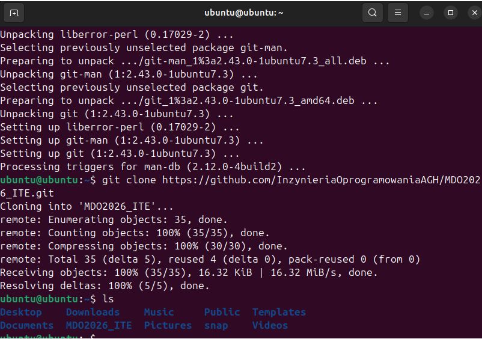
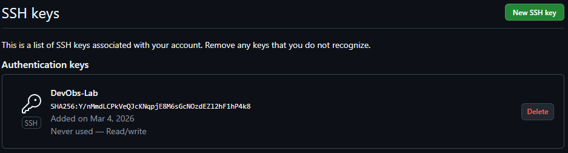
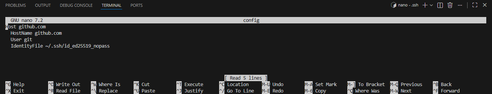
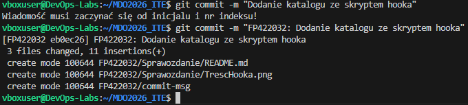

# Sprawozdanie 1
**Autor:** Filip Pyrek
**Indeks:** 422032

## 1. Środowisko i połączenie
Pracę zacząłem od przygotowania maszyny wirtualnej z Ubuntu Server na VirtualBoxie. Żeby połączyć się z serwerem z Windowsa, ustawiłem przekierowanie portu 2222 na port 22 w ustawieniach sieci NAT.

Do pracy używałem Visual Studio Code z dodatkiem Remote-SSH, dzięki czemu mogłem pisać komendy i edytować pliki bezpośrednio na Ubuntu.

## 2. Instalacja Gita i pierwsze klonowanie
Na Ubuntu zainstalowałem niezbędne narzędzia: serwer SSH oraz klienta Git.

Pierwsze klonowanie repozytorium zrobiłem przez HTTPS, używając adresu z GitHub.

## 3. Konfiguracja kluczy SSH
Żeby bezpiecznie łączyć się z GitHubem bez wpisywania haseł, wygenerowałem dwa klucze ED25519 komendą `ssh-keygen`. Klucz `id_ed25519_nopass` zostawiłem bez hasła.

Następnie dodałem klucz publiczny do ustawień swojego konta na GitHubie, aby serwer mógł mnie rozpoznawać.

## 4. Rozwiązanie problemu z logowaniem (SSH Config)
W folderze `~/.ssh/` na Ubuntu stworzyłem plik o nazwie `config`. Wpisałem tam dane serwera oraz wskazałem ścieżkę do mojego klucza bez hasła, który wcześniej dodałem do GitHuba.

Dzięki temu plikowi oraz zmianie adresu zdalnego repozytorium na SSH, komenda `git push` zaczęła działać bez żadnych problemów.

## 5. Skrypt Git Hook i testy
W folderze `.git/hooks/` przygotowałem skrypt `commit-msg`. Jego zadaniem jest sprawdzanie, czy każda wiadomość w commit zaczyna się od mojego indeksu (422032). 

Na poniższym zrzucie widać test: pierwsza próba bez indeksu została zablokowana przez skrypt, a druga z poprawnym opisem "FP422032: ..." przeszła bez problemu.

## Informacja o użyciu AI

1. **Przekierowanie portów**:
   - **Zapytanie**: "Jak połączyć się z Ubuntu przez SSH z Windowsa, jeśli używam VirtualBox i sieci NAT?"
   - **Weryfikacja**: Ustawiłem regułę przekierowania portu 2222 w VirtualBox i sprawdziłem, czy terminal VS Code faktycznie połączy się z maszyną.
2. **Plik SSH config**:
   - **Zapytanie**: "Jak zrobić, żeby Git sam wiedział, którego klucza SSH użyć do logowania?"
   - **Weryfikacja**: Zrobiłem to, co zasugerowało AI (plik config) i sprawdziłem, że komenda `git push` przeszła od razu bez problemu, co było wcześniej niemożliwe.

## Historia poleceń z terminala Windows

1  ssh-keygen -t ed25519 -f ~/.ssh/id_ed25519_nopass -N ""
2  ssh-keygen -t ed25519 -f ~/.ssh/id_ed25519_withpass
3  ls -s ~/.ssh
4  cat ~/.ssh/id_ed25519_nopass.pub
5  ssh -T git@github.com -i ~/.ssh/id_ed25519_nopass
6  cat ~/.ssh/id_ed25519_nopass.pub
7  ssh -T git@github.com -i ~/.ssh/id_ed25519_nopass
8  git config --global user.name "Doretor FP"
9  sudo apt install git
10  git config --global user.name "Doretor FP"
11  git config --global user.name "Filip Pyrek"
12  git config --global user.email "filippyrek60@gmail.com"
13  git clone https://github.com/InzynieriaOprogramowaniaAGH/MDO2026_ITE.git
14  cd MDO2026_ITE/
15  ls
16  cd MDO2026_ITE/
17  ls
18  git push origin FP422032
19  ls
20  cd ..
21  ls
22  cd MDO2026_ITE/
23  git checkout main
24  git checkout grupa5
25  git checkout -b FP422032
26  mkdir FP422032 
27  cd .git/hooks
28  ls
29  cd ..
30  cd FP422032/
31  cd ..
32  cp FP422032/commit-msg .git/hooks/commit-msg
33  chmod +x .git/hooks/commit-msg
34  git push origin FP422032
35  git remote set-url origin git@github.com:InzynieriaOprogramowaniaAGH/MDO2026_ITE.git
36  git push origin FP422032
37  ssh -T git@github.com -i ~/.ssh/id_ed25519_nopass
38  git push origin FP422032
39  .ssh/
40  cd .ssh
41  cd ..
42  cd .ssh
43  ls
44  cd config
45  nano config
46  ls
47  cd ..
48  cd MDO2026_ITE/
49  ls
50  git push origin FP422032
51  git status
52  git add FP422032/
53  git commit -m "Dodanie katalogu ze skryptem hooka"
54  git commit -m "FP422032: Dodanie katalogu ze skryptem hooka"
55  git push origin FP422032
56  git status
57  cd ..
58  ls
59  cd .ssh
60  ls
61  nano config
62  cd ..
63  cd MDO2026_ITE/
64  cd .git
65  ls
66  cd hooks
67  ls
68  cd ..
69  ls
70  cd .ssh
71  ls
72  cd config
73  nano config
74  cd ..
75  ls
76  cd MDO
77  cd MDO2026_ITE/
78  ls
79  history

## Historia poleceń z terminala Ubuntu

1  sudo systemctl status ssh
2  sudo apt update
3  sudo apt install openssh-server
4  sudo systemctl status ssh
5  sudo system start ssh
6  sudo systemctl start ssh
7  sudo systemctl status ssh
8  ls
9  cd MDO2026_ITE/
10  ls
11  cd ..
12  history

