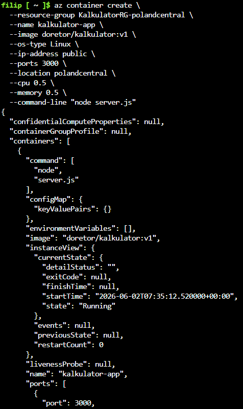
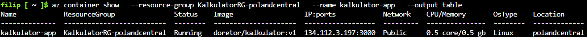
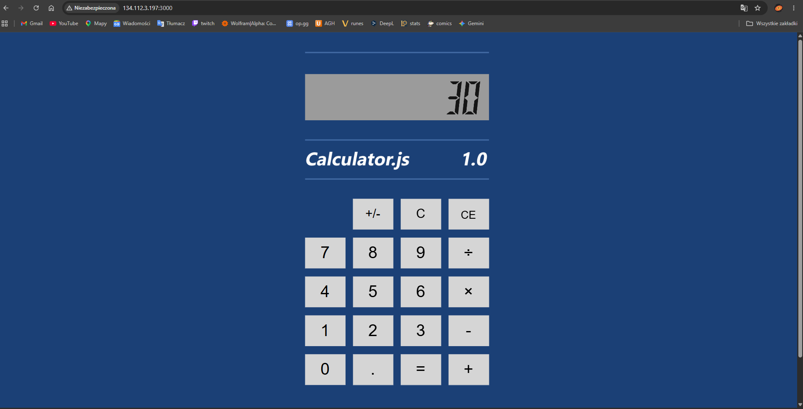
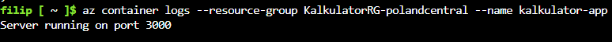
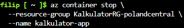
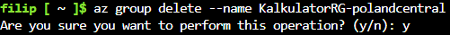

# Sprawozdanie 12: Wdrażanie na zarządzalne kontenery w chmurze (Azure)
**Autor:** Filip Pyrek
**Indeks:** 422032

## 1. Przygotowanie środowiska i problemy z limitami
Pracę rozpocząłem w środowisku Azure Cloud Shell od przygotowania grupy zasobów, która posłużyła jako logiczny kontener na usługi.


Podczas próby wdrożenia w domyślnych regionach napotkałem restrykcje nałożone na darmową subskrypcję studencką – chmura blokowała alokację ze względu na przeciążenie serwerowni (błąd `RequestDisallowedByAzure`). Wymusiło to na mnie poszukiwanie odblokowanego regionu, którym ostatecznie okazał się `polandcentral`.


---

## 2. Wdrożenie kontenera z aplikacją
Po zlokalizowaniu właściwego regionu, wdrożyłem kontener z obrazem kalkulatora. Wymagało to dostosowania polecenia do limitów studenckich: obniżyłem przydział zasobów do absolutnego minimum (0.5 vCPU, 0.5 GiB RAM), wymusiłem typ systemu operacyjnego na Linuksa i wstrzyknąłem komendę startową chroniącą aplikację w Node.js przed wyłączeniem się po starcie.

```bash
az container create \
  --resource-group KalkulatorRG-polandcentral \
  --name kalkulator-app \
  --image doretor/kalkulator:v1 \
  --os-type Linux \
  --ip-address public \
  --ports 3000 \
  --location polandcentral \
  --cpu 0.5 \
  --memory 0.5 \
  --command-line "node server.js"
```

Powyższa operacja zakończyła się sukcesem.




---

## 3. Weryfikacja dostępności usługi
Aplikacji przypisano publiczny adres IP na wyznaczonym porcie `3000`. Nawiązanie przeze mnie połączenia z poziomu przeglądarki internetowej potwierdziło, że skonteneryzowany kalkulator działa poprawnie.



Dla administracyjnego potwierdzenia stabilności środowiska uruchomieniowego, wyciągnąłem logi z poziomu serwera Node.js działającego wewnątrz kontenera.



---

## 4. Zarządzanie stanem kontenera
W ramach testowania elastyczności chmury, przeprowadziłem pomyślną operację wstrzymania działania usługi. Po wpisaniu polecenia zatrzymania, status kontenera odpowiednio się zaktualizował.



---

## 5. Zniszczenie infrastruktury (Sprzątanie)
Zgodnie z dobrymi praktykami zarządzania chmurą, w ostatnim kroku całkowicie usunąłem grupę zasobów. Operacja ta trwale zniszczyła kontener oraz adres IP, co zapobiegło ewentualnemu naliczaniu nieprzewidzianych opłat na koncie mojej subskrypcji.



---

## Informacja o użyciu AI

1. **Automatyzacja wyszukiwania dostępnego regionu Azure**:
   - **Zapytanie**: "Jak skutecznie pozbyć się błędu `RequestDisallowedByAzure` i znaleźć region, który nie jest zablokowany dla konta studenckiego, bez konieczności ręcznego zgadywania?"
   - **Weryfikacja**: AI podpowiedziało napisanie prostego skryptu w powłoce Bash, który zautomatyzował ten proces. Zamiast ręcznego sprawdzania, skrypt wykorzystał pętlę `for` do iteracji po tablicy potencjalnych regionów (np. `polandcentral`, `swedencentral`, `northeurope`), w każdym z nich próbując utworzyć grupę zasobów i wdrożyć kontener. Po przeanalizowaniu działania kodu, uruchomiłem skrypt w Cloud Shell. Algorytm pomyślnie zidentyfikował pierwszy wolny region (`polandcentral`).