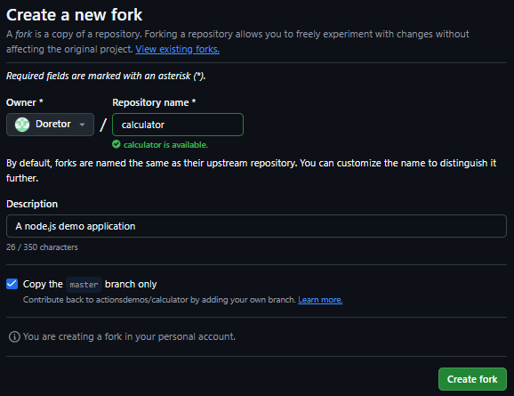
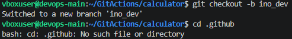
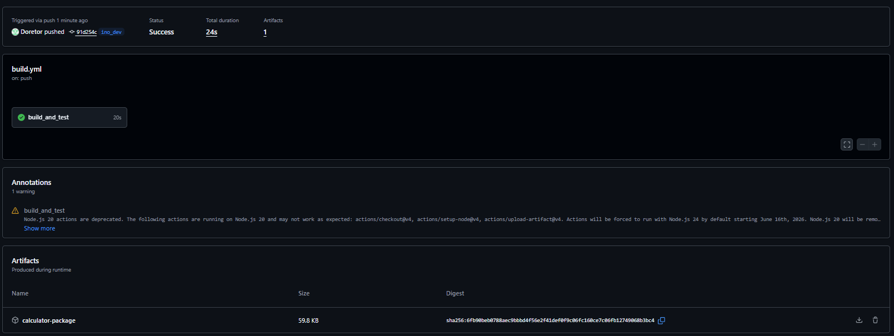

# Sprawozdanie: Wprowadzenie do GitHub Actions (Shift-left)
**Autor:** Filip Pyrek
**Indeks:** 422032

## 1. Sforkowanie repozytorium i przygotowanie środowiska
Pracę nad laboratorium rozpocząłem od zapoznania się z koncepcją GitHub Actions oraz cennikiem (plan darmowy jest w pełni wystarczający dla publicznych repozytoriów oraz małych projektów). Następnie, zgodnie z wytycznymi, sforkowałem wybrane repozytorium `actionsdemos/calculator` na swoje prywatne konto, aby móc niezależnie pracować nad potokami CI/CD, bez modyfikowania głównego projektu.



Kolejnym krokiem było pobranie sklonowanego repozytorium na dysk lokalny i utworzenie dedykowanej gałęzi o nazwie `ino_dev`.



## 2. Konfiguracja potoku CI (Workflow)
Upewniwszy się, że w repozytorium nie ma żadnych starych plików konfiguracyjnych dla akcji, utworzyłem odpowiednią strukturę katalogów (`.github/workflows`) i przygotowałem własny plik definicji potoku `build.yml`.

Zgodnie z poleceniem, zwróciłem szczególną uwagę na konfigurację wyzwalacza (triggera). Akcję skonfigurowałem w taki sposób, aby uruchamiała się **wyłącznie** po wykryciu zdarzenia `push` na gałąź `ino_dev`. Zdefiniowałem kroki odpowiedzialne za pobranie kodu, przygotowanie środowiska Node.js w wersji 18, instalację zależności (`npm install`), uruchomienie testów (`npm test`) oraz spakowanie aplikacji (`npm pack`).

```yaml
name: Node.js Calculator Build

on:
  push:
    branches: [ "ino_dev" ]

jobs:
  build_and_test:
    runs-on: ubuntu-latest

    steps:
      - name: Checkout repository
        uses: actions/checkout@v4

      - name: Setup Node.js
        uses: actions/setup-node@v4
        with:
          node-version: '18'
          
      - name: Install dependencies
        run: npm install

      - name: Run tests
        run: npm test
        
      - name: Pack the application
        run: npm pack

      - name: Upload Build Artifact
        uses: actions/upload-artifact@v4
        with:
          name: calculator-package
          path: '*.tgz'
```

## 3. Weryfikacja działania i archiwizacja artefaktu
Po zacommitowaniu i wypchnięciu plików na serwer (zdarzenie push), usługa GitHub Actions poprawnie wykryła zmianę i automatycznie uruchomiła zdefiniowany potok.

Weryfikacja w interfejsie graficznym GitHub Actions potwierdziła, że wszystkie zdefiniowane kroki (od instalacji po testy) zakończyły się sukcesem. Ponieważ wybrany program (kalkulator w Node.js) buduje się bardzo szybko i ma mały rozmiar, nie przekroczył on darmowych limitów obciążenia. W związku z tym nie było konieczności modyfikowania akcji, jednak potok ten jest w pełni gotowy na ewentualne dodanie kroku np. sprawdzającego podatności w kodzie.



Ostatnim etapem było potwierdzenie, że aplikacja została poprawnie spakowana. Zgodnie z instrukcją, użyłem dedykowanej wtyczki `actions/upload-artifact@v4`. Wygenerowany artefakt w postaci archiwum (`.tgz`) poprawnie załączył się do podsumowania Workflow i był dostępny do bezpośredniego pobrania.