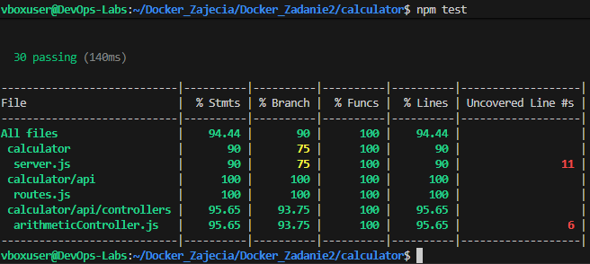
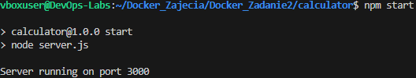
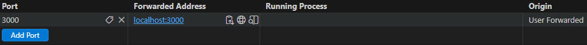
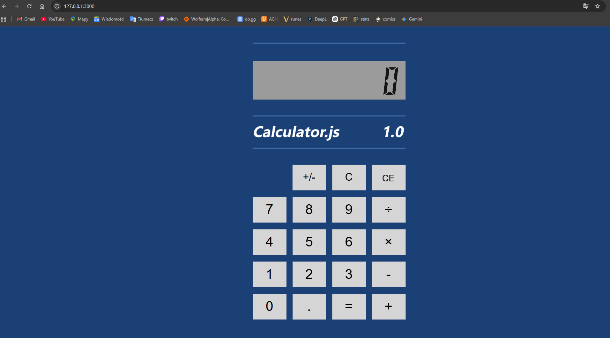
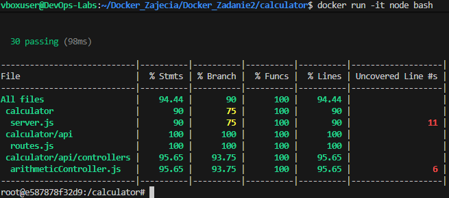
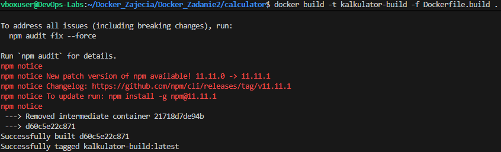
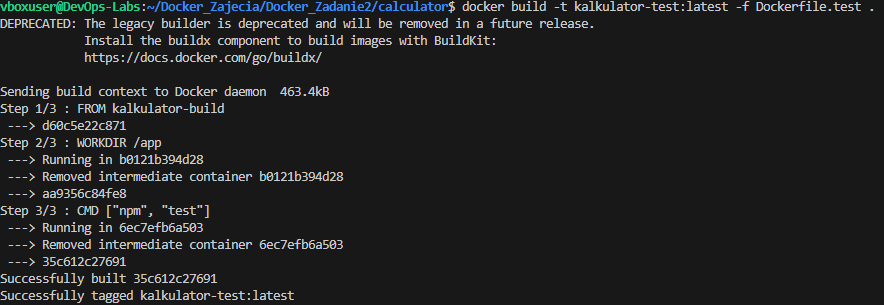
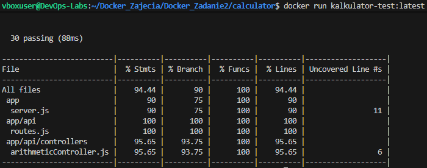
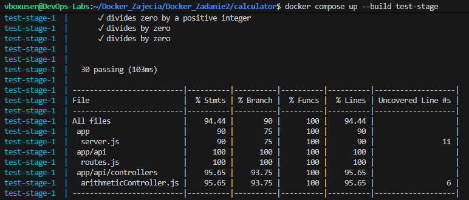

# Sprawozdanie 3: Dockerfiles, kontener jako definicja etapu

**Autor:** Filip Pyrek **Indeks:** 422032

## 1. Wybór oprogramowania i test lokalny

Pracę rozpocząłem od znalezienia odpowiedniego repozytorium z otwartą licencją i testami jednostkowymi. Wybrałem projekt kalkulatora w środowisku Node.js (`actionsdemos/calculator`). 

Sklonowałem repozytorium na maszynę wirtualną i przetestowałem je lokalnie. Po wykonaniu komendy `npm install` (pobranie zależności), uruchomiłem `npm test`. Na poniższym zrzucie widać, że testy we frameworku Mocha przeszły pomyślnie.

Następnie w celu sprawdzenia poprawności działania oprogramowania zdecydowałem się je uruchomić przy pomocy komendy `npm start`.

W celu połączenia z aplikacją kalkulatora musiałem stworzyć połączenie na odpowiedniem porcie (Port 3000 widoczny na poprzednim screenie)

## 2. Izolacja procesu w kontenerze interaktywnym

Powtórzyłem proces w czystym kontenerze. Uruchomiłem interaktywnie obraz bazowy komendą `docker run -it node bash`. 

Wewnątrz wyizolowanej powłoki ponownie sklonowałem repozytorium i wywołałem proces budowania oraz testowania. Zrzut ekranu potwierdza, że aplikacja zbudowała się i przeszła testy w środowisku niezależnym od systemu hosta.

## 3. Automatyzacja za pomocą plików Dockerfile

Kolejnym krokiem było zautomatyzowanie tego procesu poprzez dwa osobne pliki. 
W pliku `Dockerfile.build` oparłem się na obrazie `node:latest`, zdefiniowałem pobranie kodu i instalację zależności. Zbudowałem z niego obraz o nazwie `kalkulator-build:latest`.

Następnie przygotowałem `Dockerfile.test`, który bazował na utworzonym przed chwilą obrazie i wywoływał jedynie polecenie `npm test`.

Po zbudowaniu i uruchomieniu drugiego kontenera, testy wykonały się automatycznie, co widać na załączonym zrzucie.

## 4. Wdrożenie Docker Compose

Aby nie musieć ręcznie zarządzać nazwami obrazów i pilnować kolejności ich budowania, ująłem oba etapy w pliku `docker-compose.yml`. 

Zdefiniowałem tam usługę budującą oraz usługę testującą, do której dodałem warunek `depends_on`, aby czekała na zakończenie pierwszego etapu. Wywołanie komendy `docker compose up --build test-stage` automatycznie przeprowadziło cały proces i zwróciło wynik testów.

## 5. Dyskusja: Przygotowanie do wdrożenia

1. **Czy program nadaje się do publikowania jako kontener?**
   Tak, testowane oprogramowanie (REST API kalkulatora w Node.js) to typowa aplikacja sieciowa. Ze względu na braku interfejsu graficznego i oparcia komunikacji na protokole HTTP, idealnie nadaje się do wdrożenia w formie kontenera. Jedynym wymogiem do poprawnej interakcji z aplikacją jest odpowiednie udostępnienie i zmapowanie portów (w tym przypadku portu 3000).

2. **Oczyszczanie z pozostałości po buildzie i testach:**
   Gotowy obraz wymaga oczyszczenia. Po etapie testów w kontenerze znajdują się pakiety narzędziowe (np. framework Mocha), które niepotrzebnie zwiększają wagę finalnego obrazu.

3. **Osobna ścieżka deploy (np. Dockerfile.prod):**
   Żeby obraz docelowy był lekki i czysty, najlepiej zrobić dla niego osobną ścieżkę. Kopiujemy do niego tylko to, co niezbędne do działania, i odpalamy `npm install --production`. Dzięki temu nie ciągniemy ze sobą całego ciężkiego środowiska testowego.

## Informacja o użyciu AI

1. **Rozwiązanie problemu z dostępem do aplikacji w przeglądarce**:
    - **Zapytanie**: "Jak uzyskać dostęp z Windowsa do aplikacji działającej na porcie 3000 na maszynie wirtualnej Ubuntu (VirtualBox NAT), jeśli łączę się przez VS Code Remote-SSH?"
    - **Weryfikacja**: AI zasugerowało wykorzystanie mechanizmu przekierowania portów (Port Forwarding) wbudowanego bezpośrednio w VS Code. Przeszedłem do zakładki "Ports" obok terminala i dodałem port 3000. Rozwiązanie zweryfikowałem w praktyce – tunel pominął ograniczenia VirtualBoxa i pozwolił mi pomyślnie wyświetlić działającą aplikację pod adresem `127.0.0.1:3000` w przeglądarce na Windowsie.
