# Sprawozdanie: Zajęcia 04 – Dodatkowa terminologia w konteneryzacji i Jenkins

## 1. Zachowywanie stanu między kontenerami (Woluminy)

W tej części zadania sprawdziłem mechanizm współdzielenia plików za pomocą woluminów, separując proces pobierania kodu od jego budowania.

Najpierw przygotowałem woluminy wejściowy i wyjściowy:
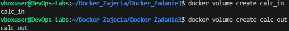

Zamiast instalować program Git w docelowym środowisku, użyłem kontenera pomocniczego, którego jedynym zadaniem było pobranie kodu na podmontowany wolumin i automatyczne usunięcie się po zakończeniu pracy (`--rm`).

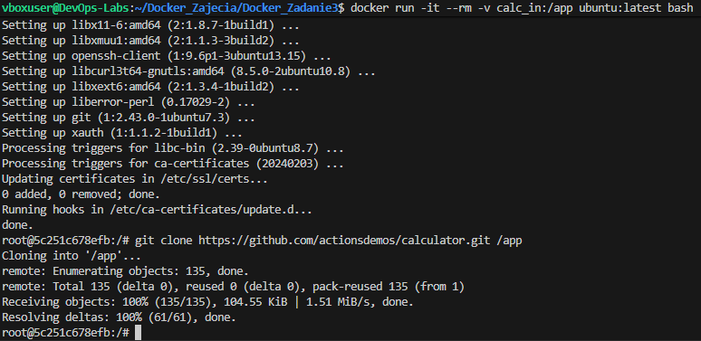

Następnie uruchomiłem bazowy kontener `node:latest` w trybie interaktywnym, podmontowując oba woluminy. Ręcznie wykonałem proces budowania aplikacji (`npm install`) i skopiowałem gotowe pliki na wolumin wyjściowy. 

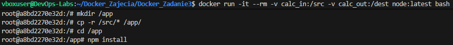
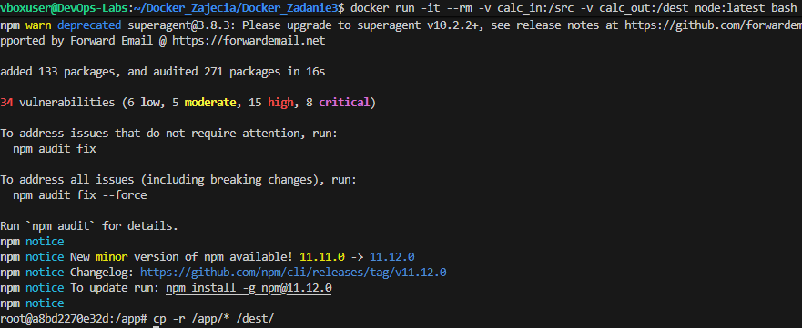

W ramach drugiego podejścia wykonałem to samo wewnątrz jednego kontenera, instalując system kontroli wersji Git bezpośrednio wewnątrz niego:

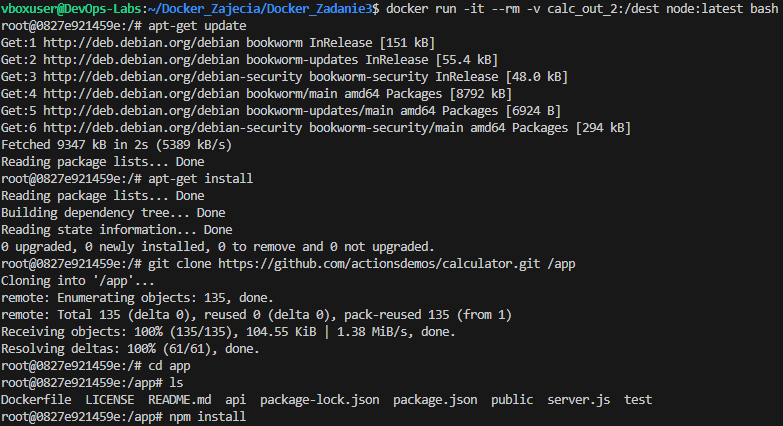
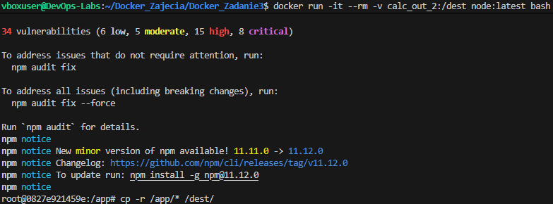

**Wniosek i dyskusja (Dockerfile):**
Podejście z kontenerem pomocniczym pozwala zachować czystość obrazu bazowego. Docelowo, w pliku `Dockerfile`, zamiast ręcznie kopiować pliki na woluminy, zastosowałbym instrukcję `RUN --mount=type=bind`. Pozwala ona zamontować kod źródłowy z hosta wyłącznie na czas trwania danej warstwy budowania, co drastycznie zmniejsza wagę finalnego wyniku.

---

## 2. Eksponowanie portu i łączność między kontenerami (IPerf)

Do zbadania łączności sieciowej użyłem narzędzia `iperf3`. Najpierw uruchomiłem serwer w tle i po odnalezieniu jego adresu IP (za pomocą polecenia `docker inspect`), połączyłem się z nim z drugiego kontenera-klienta.

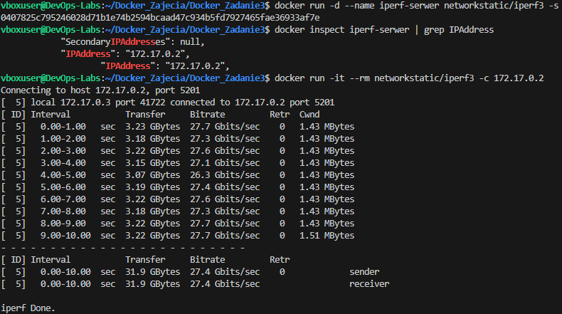

Następnie utworzyłem własną dedykowaną sieć mostkową. Dzięki temu mogłem połączyć kontenery, używając ich nazw, co jest znacznie wygodniejsze niż wpisywanie adresów IP na sztywno.

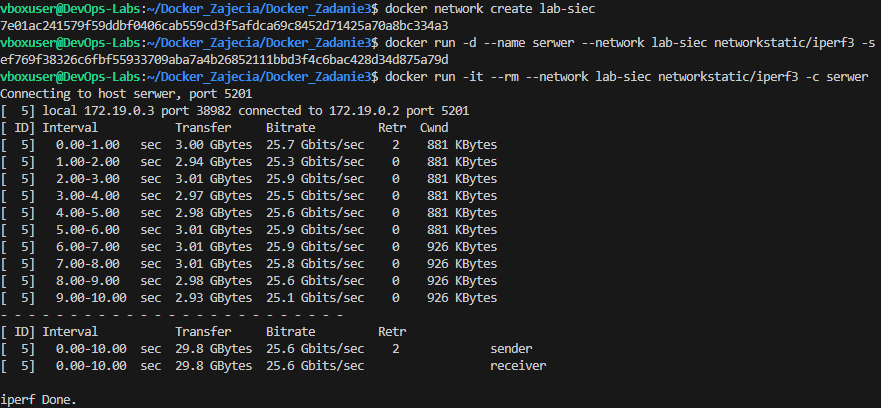

Na koniec wyeksponowałem port serwera na hosta (`-p 5201:5201`) przygotowując odpowiednie przekierowanie portów i połączyłem się z usługą najpierw z poziomu systemu Ubuntu (host), a następnie spoza niego (system Windows).

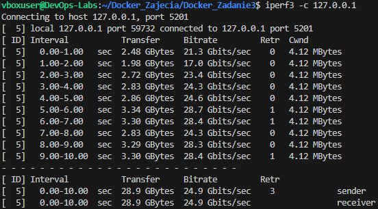

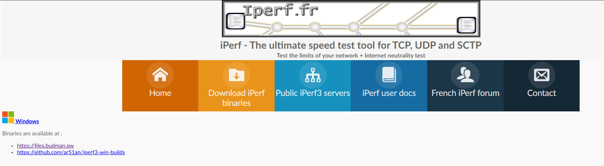
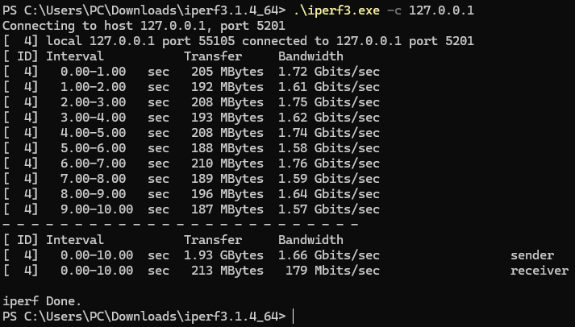

**Analiza wyników przepustowości:**

Komunikacja wewnątrz odizolowanego środowiska linuksowego (między kontenerami w sieci domyślnej: ok. 27 Gbit/s, w sieci dedykowanej: ok. 25 Gbit/s, oraz z poziomu samego hosta Ubuntu: ok. 25 Gbit/s) osiąga gigantyczne prędkości. Wynika to z faktu, że ruch ten nie wychodzi na fizyczną kartę sieciową – odbywa się w pełni programowo przez wirtualne przełączniki wewnątrz jądra systemu operacyjnego i pamięć RAM.

Z kolei pomiar przeprowadzony spoza hosta (z macierzystego systemu Windows) wykazał drastyczny spadek prędkości do ok. 1.66 Gbit/s. Jest to spowodowane znacznym narzutem (tzw. overhead) na sieć. Pakiety musiały w tym przypadku pokonać warstwę wirtualizacji maszyny wirtualnej, przejść przez tunel port-forwardingu zestawiony przez środowisko VS Code oraz mechanizmy NAT, co naturalnie stało się wąskim gardłem mierzonego transferu.

---

## 3. Usługi w rozumieniu systemu (SSHD)

Uruchomiłem kontener bazujący na obrazie Ubuntu, a następnie zainstalowałem w nim i skonfigurowałem serwer SSH. Stworzyłem standardowego użytkownika z hasłem i uruchomiłem usługę `sshd`.

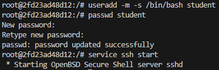

Następnie bez problemu połączyłem się z usługą zdalnie.

**Dyskusja - wady, zalety i przypadki użycia SSH:**

Komunikacja z kontenerem z wykorzystaniem protokołu SSH ma zdecydowanie więcej wad niż zalet. Największą wadą jest nie korzystanie z bezpiecznej komendy `docker exec`, więc instalowanie dodatkowego serwera SSH jest zbędne. Takie podejście niepotrzebnie zwiększa wagę kontenera i tworzy nową lukę w bezpieczeństwie, bo musimy martwić się o kolejne otwarte porty oraz hasła. Z drugiej strony, takie rozwiązanie ma swoje zalety. Sprawdza się głównie wtedy, gdy musimy przenieść do Dockera aplikacje, które bezwzględnie wymuszają połączenie po SSH do swojego działania.

---

## 4. Przygotowanie do uruchomienia serwera Jenkins

Proces instalacji skonteneryzowanego Jenkinsa z pomocnikiem DinD (Docker-in-Docker) przeprowadziłem w oparciu o oficjalną dokumentację twórców oprogramowania. Po stworzeniu wspólnej sieci, uruchomiłem dwa współdziałające kontenery.

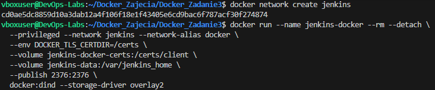

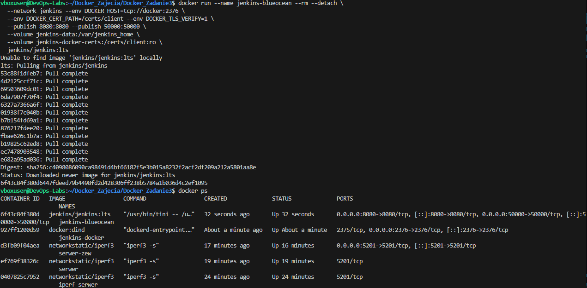

Powyższy zrzut ekranu dodatkowo zawiera wynik polecenia `docker ps`, który potwierdza, że oba kontenery pracują poprawnie i mają prawidłowo zmapowane porty komunikacyjne:

Po odczekaniu na inicjalizację usługi i przekierowaniu portu `8080`, wszedłem na stronę konfiguracji Jenkinsa, co potwierdza udane wdrożenie usługi CI/CD.

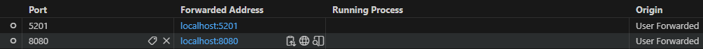
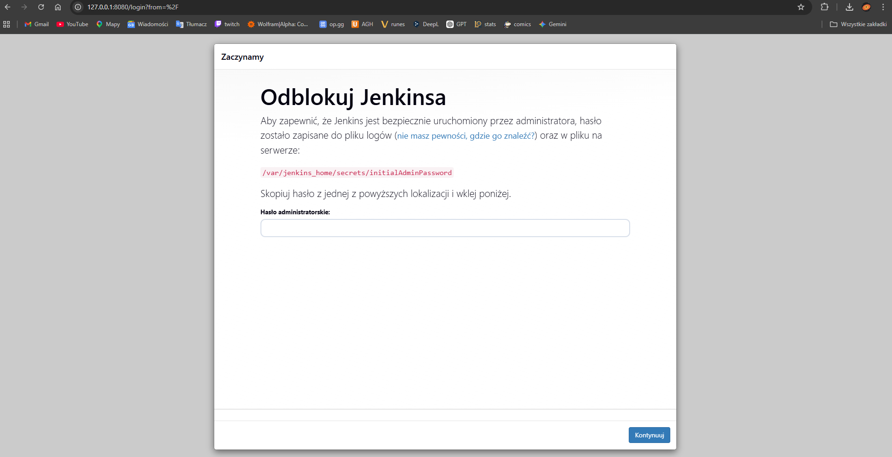