# Sprawozdanie zbiorcze: Laboratoria 5-7 (Jenkins i Automatyzacja CI/CD)
**Autor:** Filip Pyrek  
**Indeks:** 422032

---

## Laboratorium 5: Instalacja i konfiguracja środowiska CI/CD (Jenkins)

### 1. Utworzenie instancji Jenkins i przygotowanie środowiska
Pracę rozpocząłem od weryfikacji, czy kontenery z poprzedniego zadania działają poprawnie. Następnie, opierając się na oficjalnej dokumentacji, przygotowałem środowisko zagnieżdżone (Docker-in-Docker) przy pomocy pliku `docker-compose.yml` oraz własnego pliku `Dockerfile`.

**Dyskusja - Różnica między obrazami:**
Zamiast gotowego rozwiązania, przygotowałem własny obraz `blueocean` na podstawie bazowego obrazu `jenkins/jenkins`. Główna różnica polega na tym, że oficjalny obraz to surowy serwer CI/CD. W moim pliku `Dockerfile` doinstalowałem do niego klienta CLI Dockera (umożliwiającego komunikację Jenkinsa z pomocniczym kontenerem DinD) oraz pakiet wtyczek Blue Ocean, który diametralnie zmienia i unowocześnia interfejs graficzny potoków.

**Zabezpieczenie logów:**
Aby spełnić wymóg archiwizacji i zabezpieczenia logów przed wysyceniem miejsca na dysku, w pliku `docker-compose.yml` dodałem dla obu usług sekcję `logging` z parametrami `max-size: "10m"` i `max-file: "3"`.

Po uruchomieniu środowiska, wyciągnąłem wygenerowane hasło inicjalizacyjne z wnętrza kontenera i przeszedłem przez proces wstępnej konfiguracji w przeglądarce.

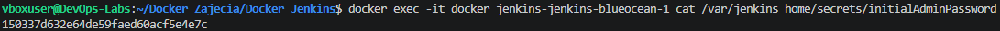

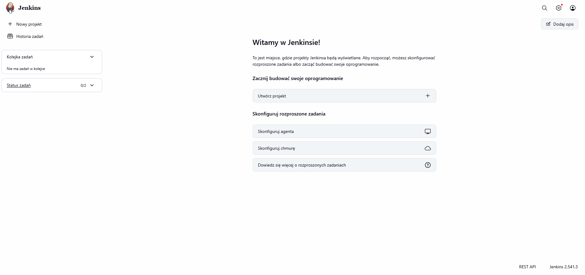

### 2. Zadanie wstępne: Uruchomienie (Freestyle Projects)
W celu sprawdzenia poprawnego działania powłoki wewnątrz Jenkinsa oraz jego integracji z demonem Dockera, utworzyłem trzy projekty typu "Ogólny projekt" (Freestyle project).

**Wyświetlenie `uname`:**
Skonfigurowałem zadanie wykonujące proste polecenie systemowe `uname -a`. Po uruchomieniu w logach konsoli wyświetliły się informacje o jądrze systemu Linux działającym wewnątrz kontenera.
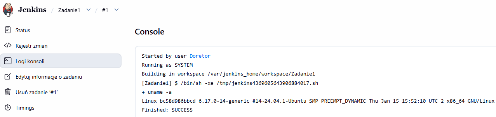

**Zwracanie błędu dla nieparzystej godziny:**
Napisałem skrypt w powłoce Bash, który pobiera obecną godzinę i weryfikuje jej parzystość, zwracając błąd (`exit 1`) lub sukces (`exit 0`). Zauważyłem, że skrypt pobrał godzinę 6:00, podczas gdy na moim fizycznym systemie była godzina 8:00 (wynika to z domyślnej strefy UTC w kontenerze).
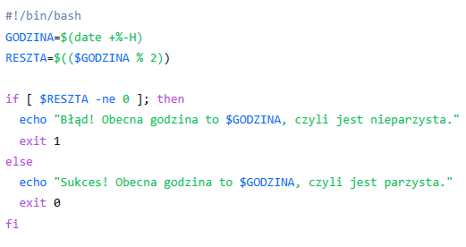
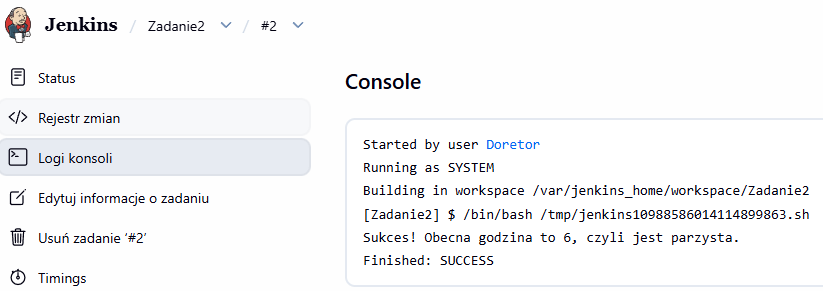

**Pobranie obrazu kontenera `ubuntu`:**
Aby potwierdzić łączność z DinD, wywołałem komendę `docker pull ubuntu:latest`. Proces zakończył się sukcesem.
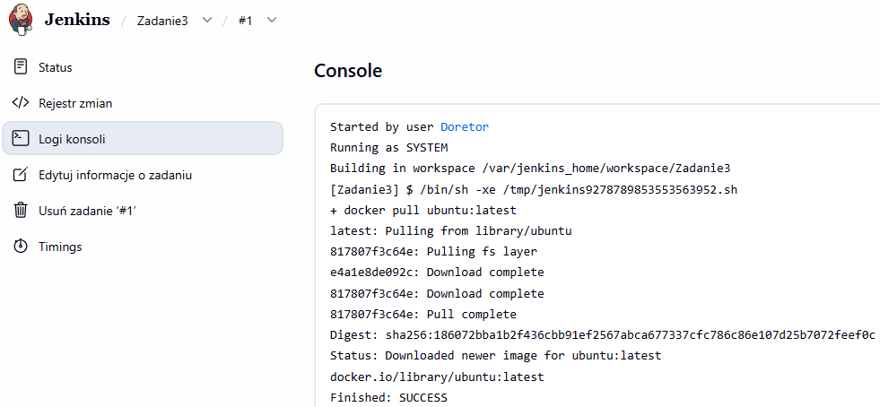

### 3. Zadanie wstępne: Obiekt typu Pipeline
Ostatnim etapem było utworzenie zadania typu Pipeline (język Groovy). Jego zadaniem było sklonowanie repozytorium z mojej osobistej gałęzi i zbudowanie obrazu Dockera na podstawie pliku `Dockerfile.build`.

**Drugie uruchomienie i wnioski z działania pamięci podręcznej:**
Zgodnie z instrukcją, kliknąłem przycisk budowania po raz drugi.
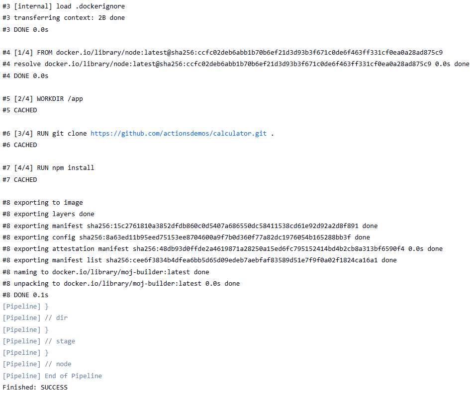

**Wniosek:** Drugie uruchomienie zajęło ułamek czasu pierwszego. W logach pojawiły się komunikaty `CACHED`. Jest to dowód na to, że kontener DinD zachowuje stan na woluminie, co optymalizuje czas budowania w systemach CI/CD.

---

## Laboratorium 6: Automatyzacja Pipeline CI/CD

### 1. Wybór aplikacji i przygotowanie kodu
Jako program testowy wybrałem kalkulator w Node.js na licencji MIT. Przed wdrożeniem sprawdziłem aplikację ręcznie w konsoli. Pakiety zainstalowały się pomyślnie (`npm install`), a testy jednostkowe przeszły na zielono.


**Decyzja o forku:** Zdecydowałem się nie robić forka. Pobranie kodu do folderu `Zaj6/files` na gałęzi `FP422032` pozwoliło na swobodne dodanie plików konfiguracyjnych bez tworzenia dodatkowego repozytorium.

### 2. Konteneryzacja (Multi-stage build)
Zastosowałem 3 etapy w jednym pliku `Dockerfile`: `builder`, `tester` oraz `deploy`.
* **Uzasadnienie:** Do etapu budowania użyłem `node:20`, a jako finalny kontener produkcyjny `node:20-slim`. Dzięki temu obraz docelowy jest pozbawiony zbędnych narzędzi programistycznych, co czyni go lżejszym i bezpieczniejszym.


### 3. Konfiguracja i Smoke Test
Podłączyłem nowo stworzone zadanie w Jenkinsie. Proces pomyślnie przeszedł przez etapy budowania i testy jednostkowe.


**Weryfikacja (Smoke Test):** Potok zakończył się uruchomieniem kontenera docelowego i weryfikacją komendą `curl`. Udowadnia to, że aplikacja faktycznie działa i odpowiada na zapytania sieciowe.


### 4. Publikacja Artefaktów i Wersjonowanie
Jako artefakt wybrałem gotowy obraz Dockera. Został on oznaczony tagiem `${APP_VERSION}-${GIT_COMMIT}`. Wstrzyknięcie hasha commitu pozwala jednoznacznie zidentyfikować, z jakiej wersji kodu został zbudowany dany kontener.


---

## Laboratorium 7: Zaawansowana Automatyzacja Pipeline

### 1. Konfiguracja SCM i przygotowanie środowiska
Całą logikę budowania przeniosłem do pliku `Jenkinsfile`. Zrezygnowałem z przechowywania kodu aplikacji w repozytorium infrastruktury – jest on pobierany dynamicznie w etapie `Clean & Setup`. Dzięki `deleteDir()` zapewniłem czysty start każdego buildu.
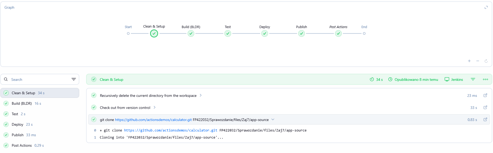
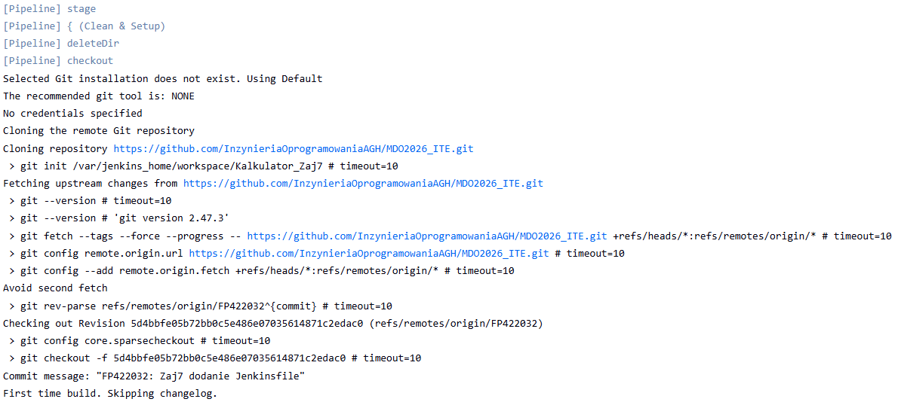

### 2. Ścieżka krytyczna: Build i Testy
Wykorzystałem Multi-stage build w Dockerze. Etap `Build (BLDR)` tworzy obraz budujący, a etap `Test` uruchamia testy jednostkowe Mocha. Potwierdzono przejście 30 testów. Sukces tego etapu jest warunkiem koniecznym do dalszego tworzenia artefaktu.
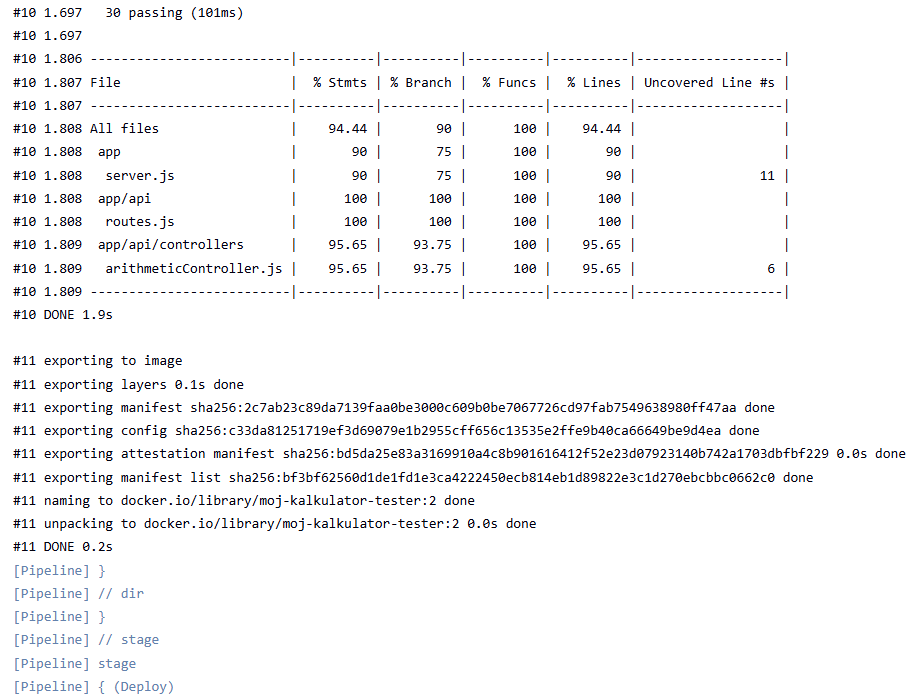

### 3. Wdrażanie i Smoke Test (Definition of Done)
Po testach budowany jest obraz produkcyjny (`slim`). Poprawność wdrożenia weryfikuje `Smoke Test`, który za pomocą komendy `curl` sprawdza, czy kontener serwuje stronę HTML kalkulatora. Uzyskanie tytułu strony potwierdza, że artefakt jest "deployable".
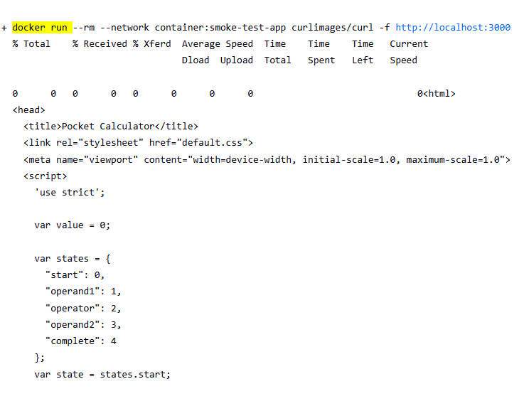

### 4. Publikacja artefaktów
Zapewniłem powtarzalność potoku poprzez automatyczne usuwanie starych kontenerów (`docker rm -f`). Potwierdzają to trzy pomyślne buildy z rzędu. Pliki `Dockerfile` i `Jenkinsfile` zostały opublikowane jako artefakty zadania.
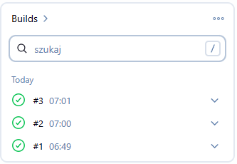
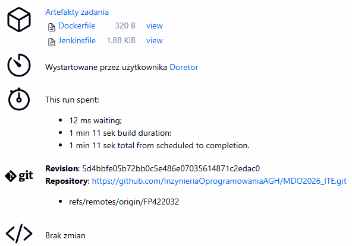

---

## Informacja o użyciu AI (Laby 5-7)

1. **Ominięcie izolacji sieciowej (Smoke Test)**:
   * **Problem**: Etap testu "zawieszał się" na `curl http://localhost:3000`.
   * **Wsparcie AI**: Wyjaśnienie mechanizmu sieciowego w DinD i doradzenie uruchomienia kontenera testowego ("sidecar") z flagą `--network container:smoke-test-app`. Pozwoliło to poprawnie zamknąć Pipeline.

2. **Ręczne zarządzanie SCM w Pipeline**:
   * **Zapytanie**: "Jak wyłączyć automatyczne pobieranie repozytorium na starcie?"
   * **Weryfikacja**: AI wskazało opcję `options { skipDefaultCheckout(true) }`. Dzięki temu Jenkins nie klonuje plików przed etapem czyszczenia, co zapobiega błędom.

---

### Załączniki - Kody Źródłowe

**Zastosowany `Dockerfile`:**
```dockerfile
# Kontener build
FROM node:20 AS builder
WORKDIR /app
COPY package*.json ./
RUN npm install
COPY . .

# Kontener test
FROM builder AS tester
RUN npm test

# Kontener deploy
FROM node:20-slim AS deploy
WORKDIR /app
COPY package*.json ./
RUN npm install --omit=dev
COPY --from=builder /app .
EXPOSE 3000
CMD ["npm", "start"]

**Zastosowany `Jenkinsfile`:**
```jenkinsfile
pipeline {
    agent any
    
    environment {
        APP_VERSION = "1.0.${BUILD_NUMBER}"
        IMAGE_NAME = "moj-kalkulator"
        APP_REPO_URL = "https://github.com/actionsdemos/calculator.git"
        MY_DIR = "FP422032/Sprawozdanie/files/Zaj7"
    }

    options {
        skipDefaultCheckout(true)
    }

    stages {
        stage('Clean & Setup') {
            steps {
                deleteDir()
                checkout scm
                sh "git clone ${APP_REPO_URL} ${MY_DIR}/app-source"
            }
        }
        
        stage('Build (BLDR)') {
            steps {
                dir("${MY_DIR}") {
                    sh "docker build --no-cache --target builder -t ${IMAGE_NAME}-bldr:${BUILD_NUMBER} -f Dockerfile app-source/."
                }
            }
        }

        stage('Test') {
            steps {
                dir("${MY_DIR}") {
                    sh "docker build --target tester -t ${IMAGE_NAME}-tester:${BUILD_NUMBER} -f Dockerfile app-source/."
                }
            }
        }
        
        stage('Deploy') {
            steps {
                sh "docker rm -f smoke-test-app || true"
                
                dir("${MY_DIR}") {
                    sh "docker build --target deploy -t ${IMAGE_NAME}:${APP_VERSION} -f Dockerfile app-source/."
                }
                
                sh "docker run -d --name smoke-test-app -p 3000:3000 ${IMAGE_NAME}:${APP_VERSION}"
                sleep 5
                sh 'docker run --rm --network container:smoke-test-app curlimages/curl -f http://localhost:3000'
            }
        }
        
        stage('Publish') {
            steps {
                archiveArtifacts artifacts: "${MY_DIR}/Dockerfile, ${MY_DIR}/Jenkinsfile", allowEmptyArchive: false
            }
        }
    }
    
    post {
        always {
            sh "docker rm -f smoke-test-app || true"
        }
    }
}