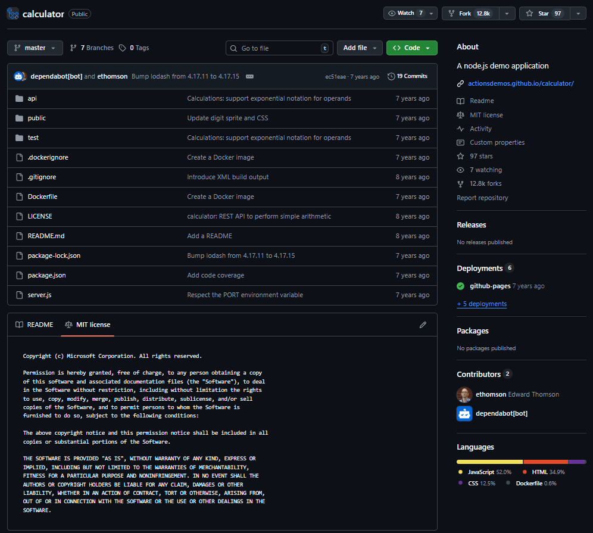
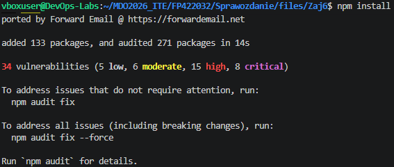
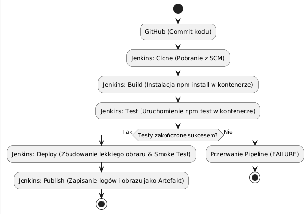
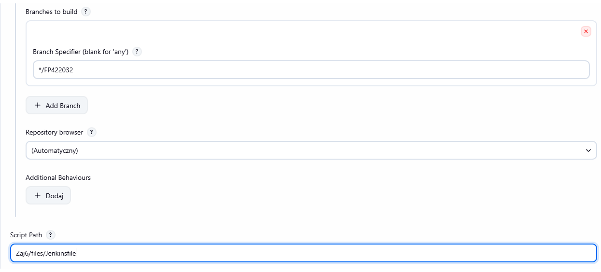
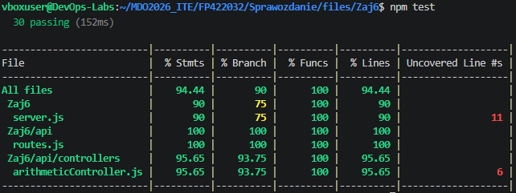
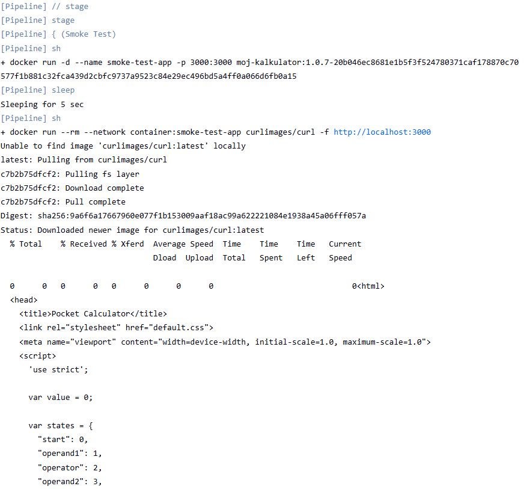
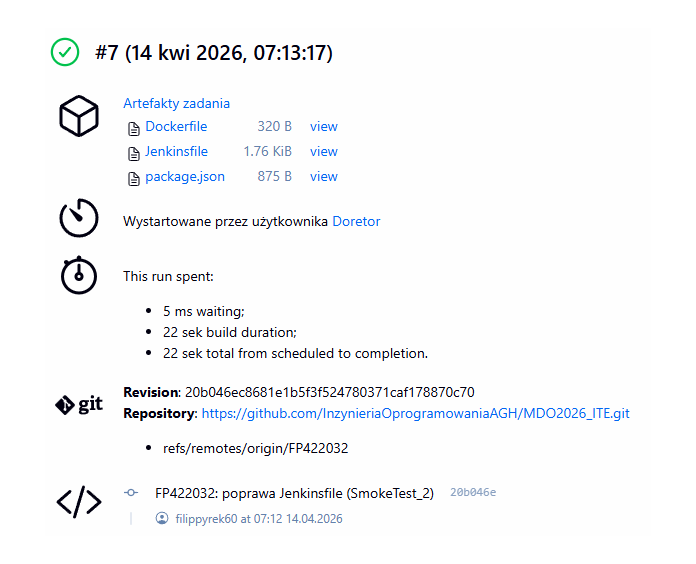
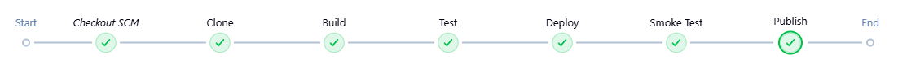

# Sprawozdanie 6 – Automatyzacja Pipeline CI/CD

**Autor:** Filip Pyrek  
**Indeks:** 422032  

## 1. Wybór aplikacji i przygotowanie kodu
Jako program testowy wybrałem kalkulator w Node.js. Sprawdziłem, że posiada on licencję MIT, więc mogłem legalnie użyć go do modyfikacji w ramach zajęć.


Przed wdrożeniem do Jenkinsa, sprawdziłem aplikację ręcznie w konsoli. Pakiety zainstalowały się pomyślnie (`npm install`), a testy jednostkowe przeszły na zielono.


**Decyzja o forku:** Zdecydowałem się **nie robić** forka oryginalnego repozytorium na swoje konto. 
*Dlaczego tak zrobiłem?* Pobranie kodu do własnego, odizolowanego folderu `Zaj6/files` na gałęzi `FP422032` pozwoliło mi na swobodne dodanie własnych plików konfiguracyjnych (CI/CD) bez tworzenia dodatkowego, zbędnego repozytorium.

Aby zaplanować pracę, stworzyłem diagram UML przedstawiający docelowy przebieg Pipeline'u:


## 2. Konteneryzacja (Multi-stage build)
Aby uruchomić budowanie i testy w osobnych kontenerach, w jednym pliku `Dockerfile` zastosowałem 3 etapy: `builder`, `tester` oraz `deploy`.

**Uzasadnienie wyboru obrazów:** Do etapu budowania i testów użyłem pełnego obrazu `node:20`. Natomiast jako finalny kontener produkcyjny (`deploy`) zdefiniowałem `node:20-slim`. 
*Dlaczego tak zrobiłem?* Pełen obraz jest potrzebny tylko na chwilę, by zainstalować pakiety testowe. Obraz docelowy (`slim`) pozbawiony jest narzędzi programistycznych, co sprawia, że jest znacznie lżejszy i bezpieczniejszy.

## 3. Konfiguracja w Jenkinsie
Podłączyłem nowo stworzone zadanie w Jenkinsie, wskazując ścieżkę do mojego skryptu.


Jenkins pomyślnie przeszedł przez etapy budowania, a w logach z odizolowanego kontenera testowego widać, że aplikacja zaliczyła wszystkie testy.


**Weryfikacja (Smoke Test):** Potok zakończył się uruchomieniem kontenera docelowego i weryfikacją komendą `curl`. 
*Dlaczego tak zrobiłem?* Udowadnia to, że aplikacja nie tylko się zbudowała, ale faktycznie działa i odpowiada na zapytania sieciowe.


## 4. Publikacja Artefaktów i Wersjonowanie
W etapie Publish, Jenkins zarchiwizował pliki konfiguracyjne, a na serwer trafił obraz aplikacji.

**Wybór formatu:** Jako artefakt wybrałem gotowy obraz Dockera.
*Dlaczego tak zrobiłem?* W przeciwieństwie do archiwów zip czy tar.gz, obraz Dockera to paczka, która zawiera aplikację od razu połączoną z jej własnym systemem operacyjnym. Daje to 100% gwarancji, że uruchomi się ona wszędzie tak samo.

**Wersjonowanie i pochodzenie:** Obraz został oznaczony tagiem `${APP_VERSION}-${GIT_COMMIT}`.
*Dlaczego tak zrobiłem?* Wstrzyknięcie hasha commitu z systemu Git pozwala jednoznacznie zidentyfikować, z jakiej dokładnie wersji kodu na GitHubie został zbudowany ten konkretny kontener.



## 5. Podsumowanie
Porównując logi z Jenkinsa z początkowym planem, widać, że wdrożony potok Pipeline krok po kroku zrealizował wszystkie założenia z diagramu UML.

## Informacja o użyciu AI
1. **Ominięcie izolacji sieciowej (Smoke Test)**:
   - **Problem**: Etap testu w Jenkinsie "zawieszał się" na komendzie `curl http://localhost:3000`, mimo że kontener działał poprawnie.
   - **Wsparcie AI**: AI wyjaśniło mechanizm sieciowy w środowisku Docker-in-Docker i doradziło uruchomienie tymczasowego kontenera testowego ("sidecar") z flagą `--network container:smoke-test-app`.
   - **Wynik**: Test błyskawicznie połączył się z aplikacją z pominięciem blokad sieciowych hosta, co pozwoliło poprawnie zamknąć Pipeline.

---
### Załączniki - Kody Źródłowe

**Zastosowany `Dockerfile`:**
```dockerfile

#Kontener build
FROM node:20 AS builder
WORKDIR /app
COPY package*.json ./
RUN npm install
COPY . .

#Kontener test
FROM builder AS tester
RUN npm test

#Kontener deploy
FROM node:20-slim AS deploy
WORKDIR /app
COPY package*.json ./
RUN npm install --omit=dev
COPY --from=builder /app .
EXPOSE 3000
CMD ["npm", "start"]

```Jenkinsfile

pipeline {
    agent any
    
    environment {
        APP_VERSION = "1.0.${BUILD_NUMBER}"
        IMAGE_NAME = "moj-kalkulator"
    }

    stages {
        stage('Clone') {
            steps {
                git branch: 'FP422032', url: 'https://github.com/InzynieriaOprogramowaniaAGH/MDO2026_ITE.git'
            }
        }
        
        stage('Build') {
            steps {
                dir('FP422032/Sprawozdanie/files/Zaj6') {
                    sh "docker build --target builder -t ${IMAGE_NAME}-build:${BUILD_NUMBER} ."
                }
            }
        }

        stage('Test') {
            steps {
                dir('FP422032/Sprawozdanie/files/Zaj6') {
                    sh "docker build --target tester -t ${IMAGE_NAME}-tester:${BUILD_NUMBER} ."
                }
            }
        }
        
        stage('Deploy') {
            steps {
                dir('FP422032/Sprawozdanie/files/Zaj6') {
                    sh "docker build --target deploy -t ${IMAGE_NAME}:${APP_VERSION}-${GIT_COMMIT} ."
                }
            }
        }

        stage('Smoke Test') {
            steps {
                sh "docker run -d --name smoke-test-app -p 3000:3000 ${IMAGE_NAME}:${APP_VERSION}-${GIT_COMMIT}"
                sleep 5
                
                sh 'docker run --rm --network container:smoke-test-app curlimages/curl -f http://localhost:3000 || (docker rm -f smoke-test-app && exit 1)'
                
                sh "docker rm -f smoke-test-app"
            }
        }
        
        stage('Publish') {
            steps {
                dir('FP422032/Sprawozdanie/files/Zaj6') {
                    archiveArtifacts artifacts: 'Dockerfile, Jenkinsfile, package.json', allowEmptyArchive: false
                }
            }
        }
    }
}