# Sprawozdanie zbiorcze: Laboratoria 8-12 (Automatyzacja, Kubernetes oraz Azure)
**Autor:** Filip Pyrek  
**Indeks:** 422032

---

## Laboratorium 8: Konfiguracja i Wdrożenie przy użyciu Ansible

### 1. Konfiguracja Inwentaryzacji
Pracę z Ansible rozpocząłem od zdefiniowania infrastruktury. Skonfigurowałem nazwy maszyn oraz utworzyłem plik inwentarza (`inventory.ini`), przypisując maszyny do odpowiednich grup (np. węzeł sterujący i węzły docelowe). Dzięki temu Ansible wie, z którymi hostami ma się komunikować.

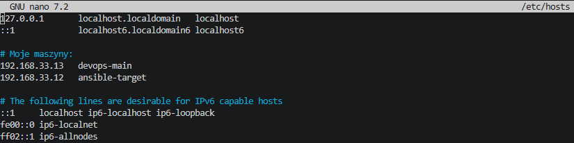

### 2. Połączenie SSH i konfiguracja uprawnień (Sudo)
Aby automatyzacja mogła przebiegać bez interwencji użytkownika, konieczne było zestawienie połączenia między maszynami oraz nadanie odpowiednich uprawnień. Zalogowałem się na serwer docelowy i edytowałem plik `sudoers` (za pomocą `visudo`), usuwając wymóg podawania hasła dla użytkownika wykonującego skrypty Ansible.

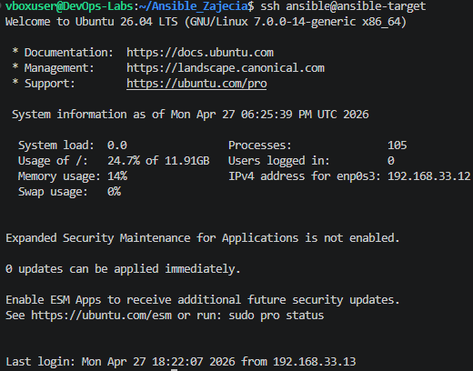

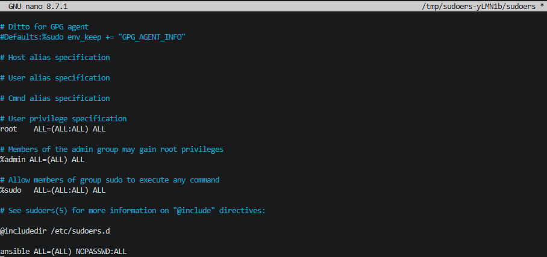

### 3. Weryfikacja łączności (Moduł Ping)
Po skonfigurowaniu kluczy SSH i uprawnień, wykonałem podstawowy test komunikacji za pomocą wbudowanego modułu `ping` (`ansible all -m ping`). Uzyskanie statusu `pong` od maszyn docelowych potwierdziło, że węzeł sterujący może poprawnie zarządzać infrastrukturą.

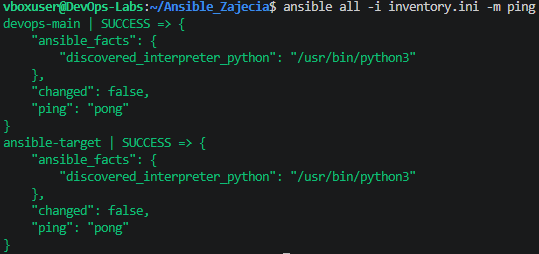

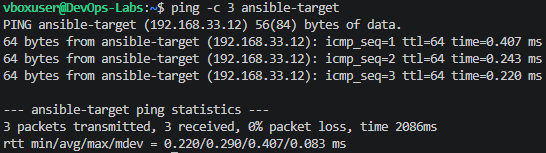

### 4. Konfiguracja wstępna i zadania ad-hoc
Przed właściwym wdrożeniem wykonałem podstawowe zadania administracyjne na serwerach, takie jak synchronizacja czasu. Zapewnia to spójność logów pomiędzy różnymi maszynami w infrastrukturze.

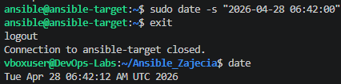

### 5. Wdrożenie artefaktu (Rola Ansible i Docker)
Głównym zadaniem było napisanie strukturalnej Roli Ansible (`deploy_calculator`), która instaluje Dockera i wdraża aplikację webową z Docker Hub. Ze względu na błędy systemowych bibliotek Pythona (`http+docker`), zaimplementowałem odporne na błędy podejście wykorzystujące moduł `shell` z weryfikacją `changed_when`. Playbook wdrożył kontener z aplikacją i przeszedł pozytywnie zautomatyzowany test HTTP (Sanity Check), kończąc się pełnym sukcesem.

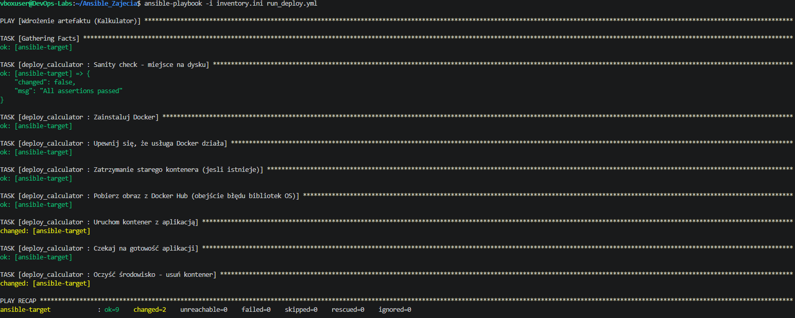

---

## Laboratorium 9: Nienadzorowana instalacja systemu i automatyzacja wdrożenia

### 1. Przygotowanie wzorcowego pliku odpowiedzi
Pracę rozpocząłem od przeprowadzenia instalacji systemu Fedora 44, aby wygenerować bazowy plik odpowiedzi `anaconda-ks.cfg`. Po zakończeniu konfiguracji, plik został przesłany na maszynę `devops-main` przy użyciu protokołu SCP. Stał się on fundamentem do dalszej automatyzacji procesu instalacji.

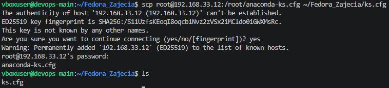

### 2. Modyfikacja pliku odpowiedzi (ks.cfg) pod instalację sieciową
Plik `ks.cfg` został zmodyfikowany zgodnie z wymaganiami instrukcji, aby zapewnić pełną automatyzację:
* **Repozytoria:** Dodano sekcje `url` oraz `repo` wskazujące na oficjalne serwery Fedory 44, co umożliwiło instalację typu Netinstall.
* **Hostname:** Skonfigurowano unikalną nazwę hosta `fedora-kalkulator`.
* **Automatyzacja dysku:** Zastosowano dyrektywę `clearpart --all --initlabel`, co pozwoliło na nienadzorowane czyszczenie dysku przed instalacją.
* **Pakiety:** Do sekcji `%packages` dopisano pakiet `docker` oraz `curl`.

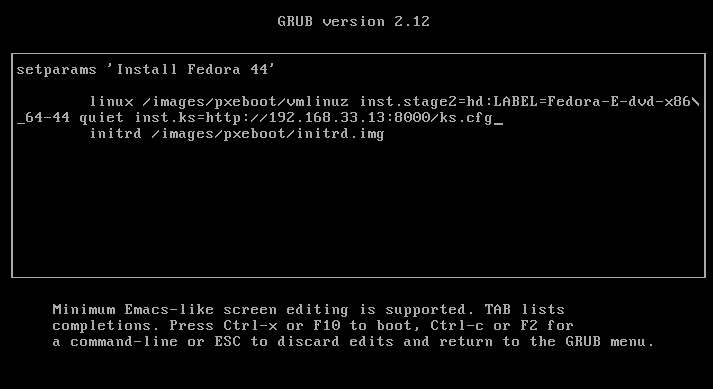

### 3. Realizacja instalacji nienadzorowanej
Plik odpowiedzi został udostępniony przez serwer HTTP na maszynie Ubuntu. Nowa maszyna wirtualna została uruchomiona z parametrem `inst.ks`, który wskazywał na przygotowaną konfigurację. Instalator samodzielnie przeprowadził partycjonowanie, konfigurację sieci oraz instalację oprogramowania.

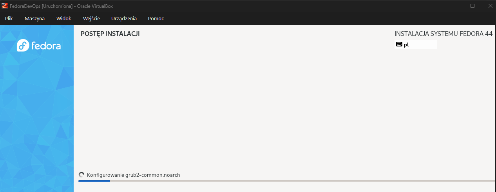

Po automatycznym restarcie system uruchomił się z poprawnie skonfigurowaną nazwą hosta, co potwierdziło poprawne przetworzenie pliku odpowiedzi.

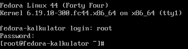

### 4. Automatyzacja wdrożenia kontenera (Post-install)
W sekcji `%post` zaimplementowałem mechanizm automatycznego pobrania i uruchomienia aplikacji. Ze względu na to, że usługa Docker nie jest aktywna podczas samej instalacji, stworzyłem skrypt `/usr/local/bin/deploy-app.sh` oraz usługę `systemd`. Mechanizm ten dba o to, by przy każdym starcie systemu stary kontener był usuwany (`docker rm -f`), a nowy uruchamiany na świeżo.

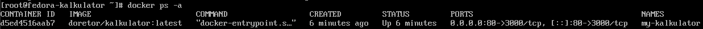

### 5. Weryfikacja końcowa i test działania
Poprawność wdrożenia zweryfikowałem poprzez dostęp do aplikacji z poziomu przeglądarki na maszynie hosta. Dzięki automatycznej konfiguracji zapory sieciowej (firewall-cmd) w skrypcie post-instalacyjnym, kalkulator stał się dostępny natychmiast po pierwszym uruchomieniu systemu. Potwierdzono poprawne działanie wszystkich funkcji aplikacji w środowisku produkcyjnym.

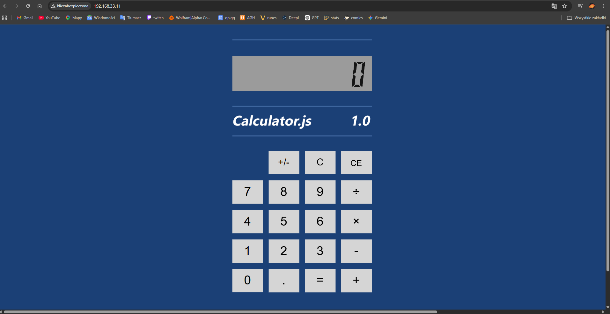

---

## Laboratorium 10: Wdrażanie na zarządzalne kontenery - Kubernetes (1)

### 1. Instalacja klastra Kubernetes i środowiska pracy
Zainstalowałem implementację klastra w oparciu o narzędzie Minikube. Instalację przeprowadziłem pobierając plik binarny protokołem HTTPS bezpośrednio z repozytorium Google. Przed uruchomieniem klastra przydzieliłem maszynie wirtualnej odpowiednie zasoby sprzętowe (2 vCPU i 4GB RAM), aby zmitygować ewentualne problemy z wydajnością. Skonfigurowałem również alias systemowy dla `kubectl`. Działanie środowiska zweryfikowałem uruchamiając Kubernetes Dashboard.

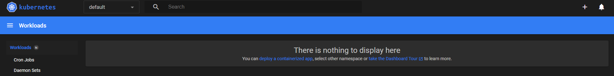

### 2. Ręczne wdrożenie aplikacji w klastrze
Jako aplikację wdrożeniową wybrałem artefakt z poprzednich laboratoriów – obraz `doretor/kalkulator:latest`. Podczas ręcznego wdrożenia za pomocą `kubectl run` wystąpił problem wyłączającego się natychmiast kontenera (status "Completed" oraz kolejne restarty Poda). Problem ten udało się zarzegnać, dodając do polecenia flagę `--command -- node server.js`, co zagwarantowało podtrzymanie pracy serwera aplikacji. 

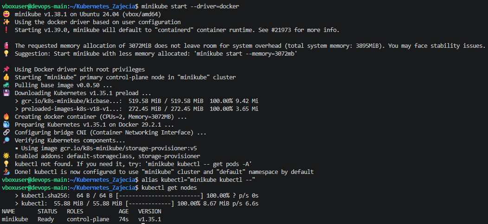

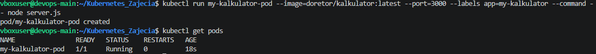

### 3. Eksponowanie funkcjonalności do środowiska zewnętrznego
Ponieważ klaster pracuje we własnej, odizolowanej podsieci, wyeksponowałem aplikację na zewnątrz wykorzystując mechanizm `port-forward`. Przekierowałem ruch z portu 8080 maszyny hosta bezpośrednio na port 3000 wewnątrz działającego Poda.

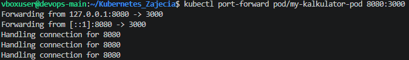

Połączenie powiodło się, a interfejs kalkulatora został poprawnie obsłużony i wyświetlony w przeglądarce pod adresem localhost.

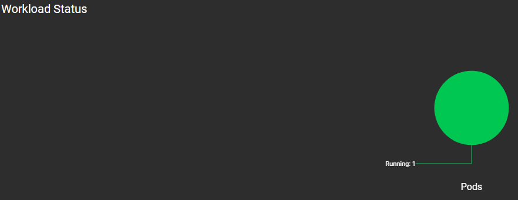

### 4. Przekucie wdrożenia manualnego w plik IaC (YAML)
Zastąpiłem ręczne wpisywanie poleceń plikiem konfiguracyjnym w formacie YAML. Plik został podzielony na zasób typu `Deployment` (zawierający definicję aplikacji) oraz `Service` (odpowiedzialny za rozkład ruchu i stały dostęp protów). Zgodnie z wytycznymi, w trakcie wdrożenia zdefiniowałem aż 4 niezależne repliki (pody) kalkulatora. 

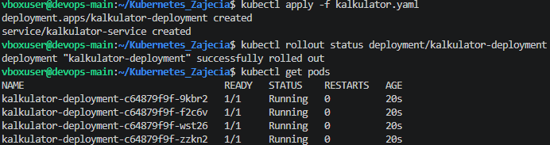

Postęp wdrożenia monitorowałem komendą `kubectl rollout status`, a po jego zakończeniu przekierowałem porty tym razem bezpośrednio do Serwisu. Cztery działające niezależnie i równolegle repliki są widoczne w interfejsie graficznym klastra, co ostatecznie potwierdza stabilność środowiska.

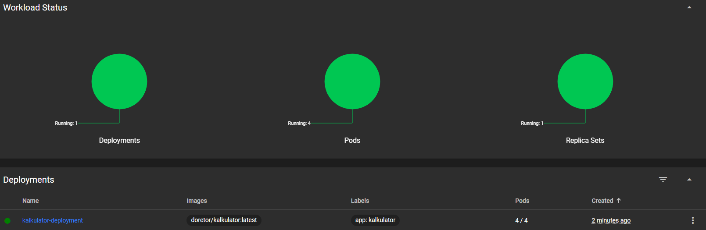

---

## Laboratorium 11: Wdrażanie na zarządzalne kontenery - Kubernetes (2)

### 1. Przygotowanie nowych obrazów
Na początku musiałem przygotować trzy wersje obrazu z kalkulatorem. Ponieważ nie miałem bezpośredniego dostępu do kodu, stworzyłem nowe pliki `Dockerfile` i nadpisałem bazowy obraz:
* **v1:** to po prostu skopiowany, działający obraz bazowy.
* **v2:** wersja, w której za pomocą polecenia `sed` podmieniłem tekst na stronie, żeby było widać różnicę po aktualizacji.
* **error:** wersja zepsuta – w `Dockerfile` wpisałem komendę uruchamiającą nieistniejący plik, przez co kontener od razu wyrzuca błąd po starcie.

### 2. Skalowanie replik
W tej części edytowałem plik `kalkulator.yaml`, zmieniając wartość `replicas`, a następnie aplikowałem zmiany poleceniem `kubectl apply`. Obserwowałem, jak Kubernetes dynamicznie dodaje lub usuwa pody.

Sprawdziłem zachowanie klastra dla 8 replik:

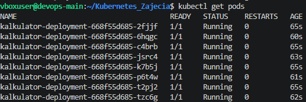

Dla 1 repliki:

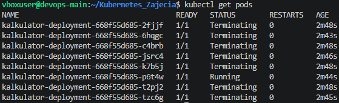

Oraz dla 0 replik (tak zwany "scale to zero" - pody zniknęły, ale sama konfiguracja wdrożenia została w systemie):

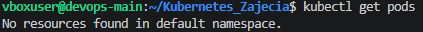

Po testach przywróciłem standardowe 4 repliki.

### 3. Aktualizacje, błędy i cofanie zmian
Zmieniałem wersję obrazu (tagi) w pliku YAML i sprawdzałem, jak zachowuje się klaster podczas aktualizacji. 

Najpierw zaktualizowałem aplikację do nowej wersji V2:

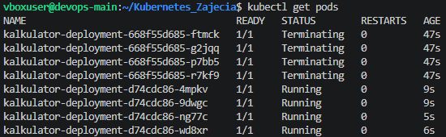

Następnie cofnąłem ją z powrotem do wersji V1:

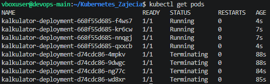

Potem celowo wdrożyłem wersję "error". Zauważyłem, że Kubernetes sam zorientował się, że nowe pody się psują (status `CrashLoopBackOff`) i automatycznie zatrzymał proces aktualizacji. Dzięki temu stare, działające pody wciąż obsługiwały ruch.

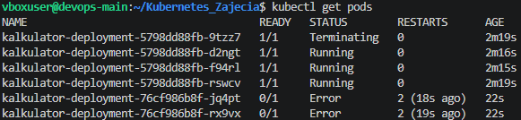

Sprawdziłem w konsoli zapisaną historię wdrożeń:

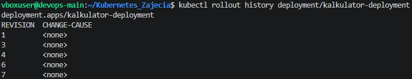

Na koniec cofnąłem tę wadliwą aktualizację komendą `kubectl rollout undo`. Zepsute pody od razu zostały usunięte, a system wrócił do działającej wersji.

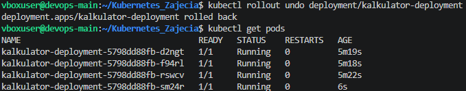

### 4. Skrypt testujący czas wdrożenia
Napisałem krótki skrypt w Bashu, który sprawdzał, czy wdrożenie nowej wersji zdąży się wykonać w 60 sekund (wykorzystałem komendę `minikube kubectl -- rollout status`). Jeśli pody nie wstałyby w tym czasie (np. przez wadliwy obraz), skrypt zwróciłby błąd.

### 5. Różne strategie wdrażania
Na sam koniec przetestowałem, jak można inaczej aktualizować aplikację, dodając odpowiednie wpisy do pliku YAML:

**Strategia Recreate:** Zauważyłem, że Kubernetes najpierw całkowicie usunął wszystkie stare pody, a dopiero potem zaczął tworzyć nowe. Oznacza to niestety chwilową przerwę w działaniu aplikacji.

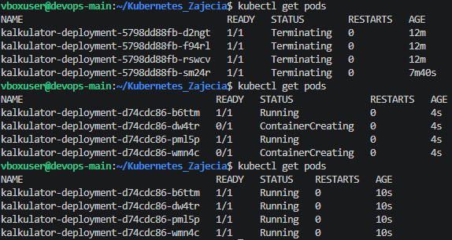

**Zaawansowany Rolling Update:** Zmieniłem parametry w YAML tak, żeby Kubernetes mógł jednorazowo usuwać i tworzyć więcej podów na raz. Proces podmieniania wersji poszedł znacznie szybciej.

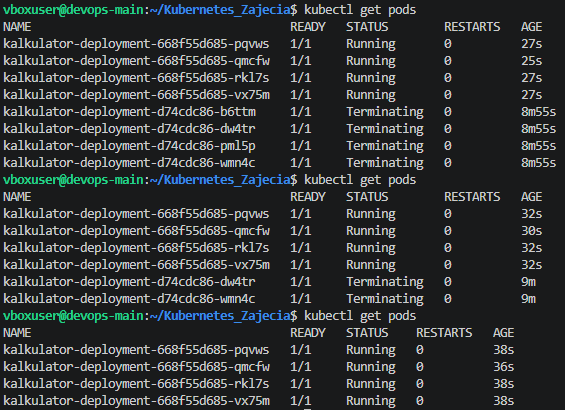

**Wdrożenie typu Canary (Kanarkowe):** Zamiast jednego, utworzyłem w pliku dwa osobne wdrożenia: stabilne (3 repliki) i nowe, kanarkowe (1 replika). Obie grupy podpiąłem pod ten sam Serwis za pomocą wspólnej etykiety `app: kalkulator`. W efekcie zauważyłem, że nowa, testowa wersja obsługiwała dokładnie 25% żądań, a reszta trafiała na wersję stabilną.

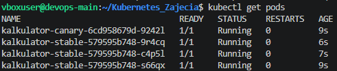

---

## Laboratorium 12: Wdrażanie na zarządzalne kontenery w chmurze (Azure)

### 1. Przygotowanie środowiska i problemy z limitami
Pracę rozpocząłem w środowisku Azure Cloud Shell od przygotowania grupy zasobów, która posłużyła jako logiczny kontener na usługi.

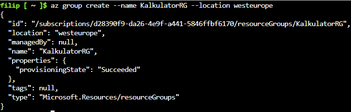
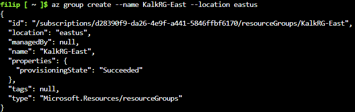

Podczas próby wdrożenia w domyślnych regionach napotkałem restrykcje nałożone na darmową subskrypcję studencką – chmura blokowała alokację ze względu na przeciążenie serwerowni (błąd `RequestDisallowedByAzure`). Wymusiło to na mnie poszukiwanie odblokowanego regionu, którym ostatecznie okazał się `polandcentral`.

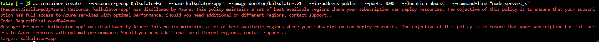

### 2. Wdrożenie kontenera z aplikacją
Po zlokalizowaniu właściwego regionu, wdrożyłem kontener z obrazem kalkulatora. Wymagało to dostosowania polecenia do limitów studenckich: obniżyłem przydział zasobów do absolutnego minimum (0.5 vCPU, 0.5 GiB RAM), wymusiłem typ systemu operacyjnego na Linuksa i wstrzyknąłem komendę startową chroniącą aplikację w Node.js przed wyłączeniem się po starcie.

```bash
az container create \
  --resource-group KalkulatorRG-polandcentral \
  --name kalkulator-app \
  --image doretor/kalkulator:v1 \
  --os-type Linux \
  --ip-address public \
  --ports 3000 \
  --location polandcentral \
  --cpu 0.5 \
  --memory 0.5 \
  --command-line "node server.js"