# Sprawozdanie Zajęcia 02

Mateusz Malaga Gr.2

MM416540

## Instalacja Dockera i logowanie

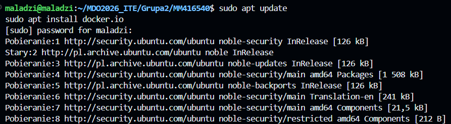
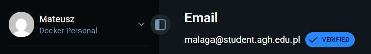
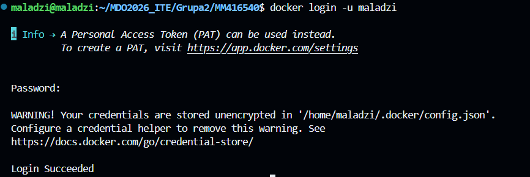

## zapoznanie się z obrazami i ich uruchomienie

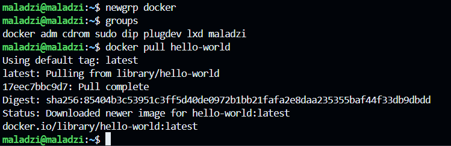
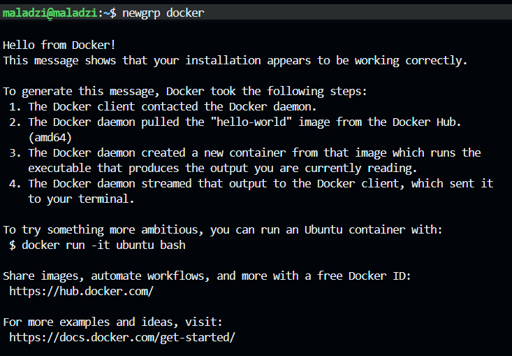

### hello-world
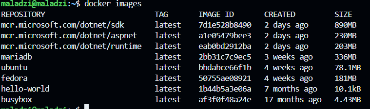

### Pobranie obrazów
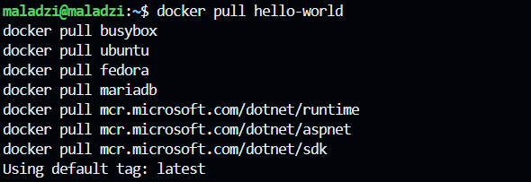

## Sprawdzenie rozmiarów

## Sprawdzenie kodów wyjścia 

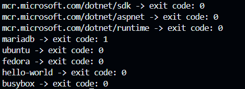

mariadb zakończyłsię code 1 bo został uruchomiony bez konfiguracji
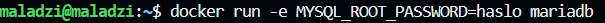
przy takim uruczomieniu kod powinien być 0

## Uruchomie kontenera busybox
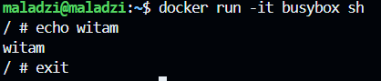
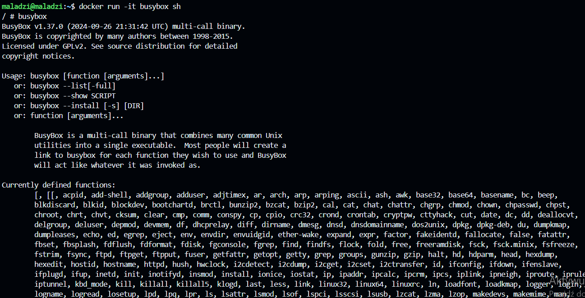

## Uruchomienie systemu w kontenerze, pokazanie PID1 na kontenerze
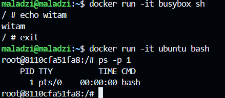
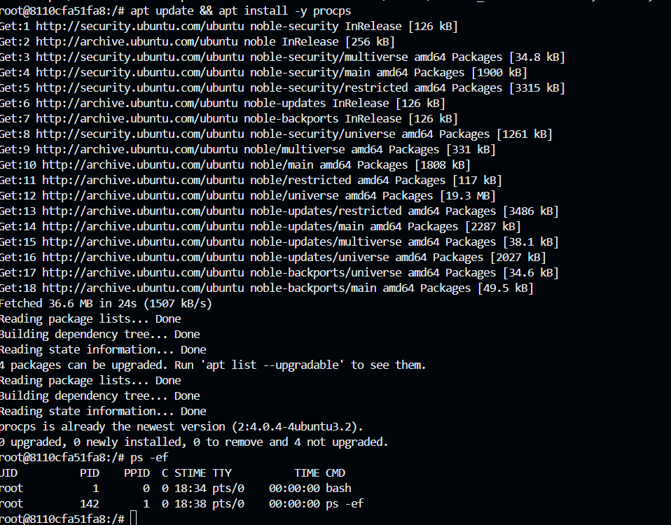

### procesy dockera na hoście
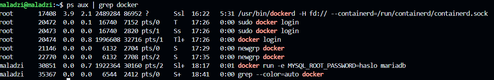

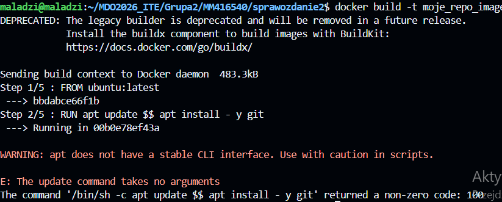