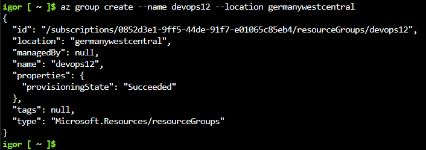
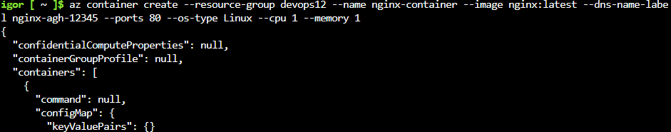
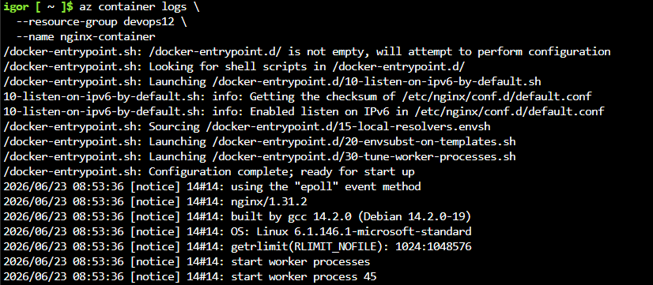
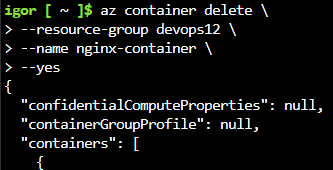
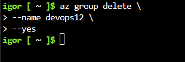

# Sprawozdanie – Wdrażanie na zarządzalne kontenery w chmurze (Azure)

# 1. Cel ćwiczenia

Celem ćwiczenia było wdrożenie kontenera Docker w środowisku Microsoft Azure, sprawdzenie jego działania, pobranie logów oraz usunięcie utworzonych zasobów po zakończeniu pracy

# 2. Przebieg realizacji zadania

# 2.1. Utworzenie grupy zasobów

`az group create --name devops12 --location germanywestcentral`



# 2.2. Wdrożenie kontenera z Docker Hub

Do zadania użyto oficjalnego obrazu nginx

```
az container create \
    --resource-group devops12 \
    --name nginx-container \
    --image nginx:latest \
    --os-type Linux \
    --cpu 1 \
    --memory 1 \
    --ip-address Public \
    --ports 80 \
    --dns-name-label nginx-agh-12345
```



# 2.3. Weryfikacja działania kontenera

Sprawdzenie stanu kontenera

```
az container show \
    --resource-group devops12 \ 
    --name nginx-container \
    --query instanceView.state
```


Sprawdzenie logów kontenera

```
az container logs \
    --resource-group devops12 \
    --name nginx-container
```



Sprawdzenie dostępu do usługi HTTP

```
az container show \
    --resource-group devops12 \
    --name nginx-container \
    --query ipAddress.fqdn \ 
    --output tsv
```


# 2.4. Usunięcie zasobów

Usunięcie kontenera

```
az container delete \
    --resource-group devops12 \
    --name nginx-container \
    --yes
```



Usunięcie grupy zasobów

```
az group delete \
    --name devops12 \
    --yes
```



# 3. Wnioski

Podczas ćwiczenia zapoznano się z usługą Azure Container Instances umożliwiającą uruchamianie kontenerów bez konieczności zarządzania maszynami wirtualnymi. Wdrożono kontener oparty na obrazie Nginx znajdującym się w Docker Hub, zweryfikowano jego działanie oraz sposób dostępu do usługi HTTP. Poznano również podstawowe polecenia Azure CLI służące do zarządzania kontenerami i grupami zasobów. Na zakończenie usunięto wszystkie utworzone zasoby w celu uniknięcia dodatkowych kosztów.