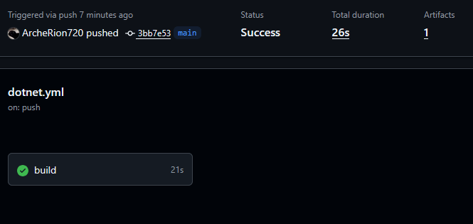
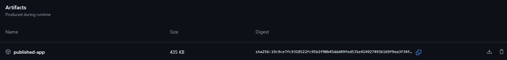

# Sprawozdanie – Github Actions

# 1. Cel ćwiczenia

Celem ćwiczenia było zapoznanie się z mechanizmem GitHub Actions oraz przygotowanie własnego procesu Continuous Integration (CI) uruchamianego automatycznie po wprowadzeniu zmian do dedykowanej gałęzi repozytorium.

# 2. Przebieg realizacji

# 2.1. Wybór repozytorium

Wybrano personalny projekt używający C#. Projekt nie zawierał żadnych workflows.

# 2.2. Utworzenie workflow GitHub Actions

`.gtihub/workflows/dotnet.yml`

Zastosowano trigger, aby workflow uruchamiał się po każdym pushu na gałęź main

```
on:
  push:
    branches: [ "main" ]
```

# 2.3. Konfiguracja procesu CI

Workflow realizuje następujące kroki:

1. Pobranie kodu źródłowego repozytorium.
2. Instalacja środowiska .NET 8.
3. Przywrócenie zależności projektu.
4. Kompilacja aplikacji.
5. Publikacja aplikacji.
6. Zapisanie wyników jako artefaktu.

```
jobs:
  build:

    runs-on: ubuntu-latest

    steps:
    - uses: actions/checkout@v4
    - name: Setup .NET
      uses: actions/setup-dotnet@v4
      with:
        dotnet-version: 8.0.x
    - name: Restore dependencies
      run: dotnet restore
    - name: Build
      run: dotnet build --no-restore
    - name: Publish application
      run: dotnet publish -c Release -o publish
    - name: Upload artifact
      uses: actions/upload-artifact@v4
      with:
        name: published-app
        path: publish/
```

# 2.4. Test działania

Po zpushowaniu pliku z workflow, natychmiast uruchomił się poprzez trigger.



Można zaobserwować:
- poprawne uruchomienie
- wykonanie wszystkich zadań
- zakończenie statusem Success

# 2.5. Generacja artefaktów

Po zakończeniu procesu CI wygenerowany został artefakt zawierający aplikację.



# 3. Wyniki i wnioski

Przygotowany workflow poprawnie reagował na zmiany w gałęzi main. Commit powodował automatyczne uruchomienie procesu budowania aplikacji, wykonanie testów oraz wygenerowanie artefaktu.

GitHub Actions umożliwia łatwą automatyzację procesów Continuous Integration bez konieczności instalowania dodatkowych narzędzi. Dzięki zastosowaniu triggera możliwe jest automatyczne sprawdzanie poprawności projektu po każdej zmianie. Mechanizm artefaktów pozwala natomiast na wygodne przechowywanie wyników procesu budowania aplikacji.