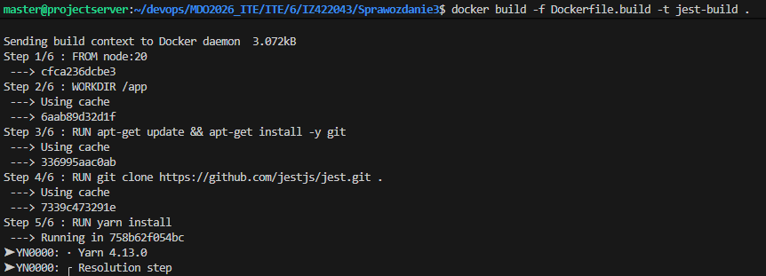
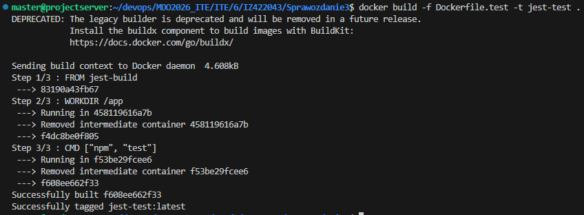
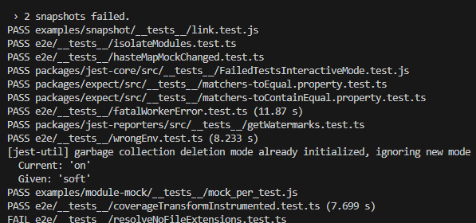
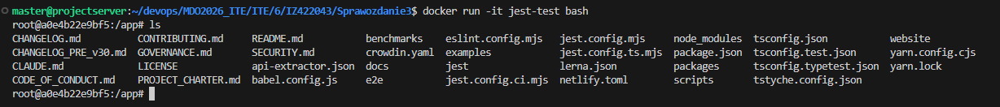

1. Wybór oprogramowania

Wybranym przeze mnie repozytorium jest JestJS - framework do testowania
https://github.com/jestjs/jest

2. Obraz - etap build

> Dockefile.build 
```Dockerfile
FROM node:20
WORKDIR /app
RUN apt-get update && apt-get install -y git
RUN git clone https://github.com/jestjs/jest.git .
RUN yarn install
RUN yarn run build
```

Zbudowanie obrazu: `docker build -f Dockerfile.build -t jest-build .`



3. Obraz - etap testów

> Dockefile.test  
```Dockerfile
FROM jest-build

WORKDIR /app

CMD ["npm", "test"]
```



4. Kontener z testami

Uruchomienie: `docker run jest-test`



5. Uruchomienie kontenera w trybie interaktywnym



Kontener jest-test ma sklonowane repozytorium, czyli poprawnie zależy od jest-build