# Sprawozdanie – Dodatkowa terminologia w konteneryzacji, instancja Jenkins

## Cel ćwiczenia

Celem ćwiczenia było poznanie mechanizmów przechowywania danych w Dockerze, komunikacji między kontenerami, uruchamiania usług systemowych oraz wdrożenia serwera Jenkins wraz z Docker-in-Docker.

---

# 1. Zachowywanie stanu między kontenerami

## 1.1. Utworzenie woluminów

Tworzymy dwa woluminy:

```bash
docker volume create input-vol
docker volume create output-vol
```

Sprawdzamy ich utworzenie:

```bash
docker volume ls
```

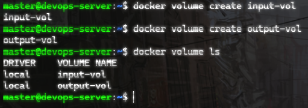

---

## 1.2. Klonowanie repozytorium do woluminu wejściowego

Wykorzystano kontener pomocniczy z Git.

```bash
docker run --rm \
-v input-vol:/repo \
alpine/git \
clone https://github.com/spring-guides/gs-spring-boot.git /repo
```

W ramach zadania repozytorium projektu zostało umieszczone w woluminie Dockera input-vol, który pełnił rolę trwałego magazynu kodu źródłowego wykorzystywanego przez kontener budujący. 

Zastosowano kontener pomocniczy, ponieważ kontener build nie posiadał Git i zgodnie z założeniami zadania nie powinien go zawierać. Takie podejście zapewnia separację odpowiedzialności oraz zgodność z dobrymi praktykami konteneryzacji.

Alternatywy, takie jak bind mount lub kopiowanie do /var/lib/docker, zostały odrzucone ze względu na mniejszą przenośność i brak zgodności z dobrymi praktykami.

Sprawdzenie zawartości:

```bash
docker run --rm \
-v input-vol:/repo \
ubuntu ls -la /repo
```

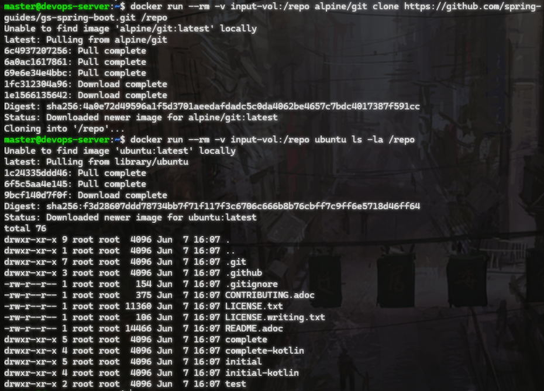

---

## 1.3. Uruchomienie kontenera budującego

Uruchamiamy kontener Maven:

```bash
docker run -it \
--name build-container \
-v input-vol:/input \
-v output-vol:/output \
maven:3.9-eclipse-temurin-21 bash
```

Przechodzimy do projektu:

```bash
cd /input/complete
```

Budujemy aplikację:

```bash
mvn package
```
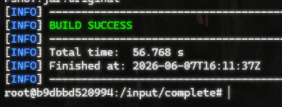


---

## 1.4. Zapis artefaktu do woluminu wyjściowego

Kopiujemy plik:

```bash
cp target/*.jar /output/
```

Wyjście z kontenera:

```bash
exit
```

Sprawdzamy zawartość woluminu:

```bash
docker run --rm \
-v output-vol:/out \
ubuntu ls -lh /out
```

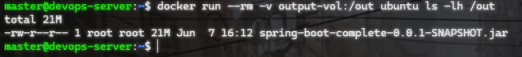

---

## 1.5. Klonowanie repozytorium wewnątrz kontenera

Uruchamiamy Ubuntu:

```bash
docker run -it \
-v input-vol:/input \
ubuntu:24.04 bash
```

Instalujemy Git:

```bash
apt update
apt install -y git
```

Klonujemy repozytorium:

```bash
git clone https://github.com/spring-guides/gs-spring-boot.git /input/repo2
```


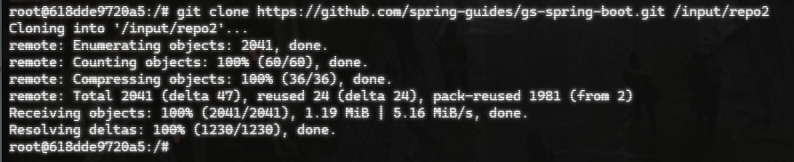

---

# 2. Eksponowanie portu i komunikacja między kontenerami

## 2.1. Uruchomienie serwera iperf3

Tworzymy serwer:

```bash
docker run -dit \
--name iperf-server \
ubuntu:24.04 bash
```

Wchodzimy do kontenera:

```bash
docker exec -it iperf-server bash
```

Instalujemy iperf3:

```bash
apt update
apt install -y iperf3
```

Uruchamiamy serwer:

```bash
iperf3 -s
```

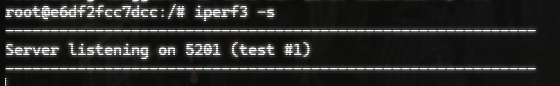


---

## 2.2. Uruchomienie klienta

Nowy terminal:

```bash
docker run -dit \
--name iperf-client \
ubuntu:24.04 bash
```

```bash
docker exec -it iperf-client bash
```

Instalacja:

```bash
apt update
apt install -y iperf3 iproute2
```

Na hoście sprawdzamy IP:

```bash
docker inspect -f '{{range.NetworkSettings.Networks}}{{.IPAddress}}{{end}}' iperf-server
```

Test:

```bash
iperf3 -c ip
```

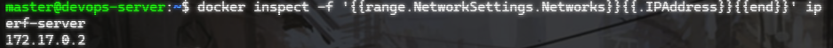

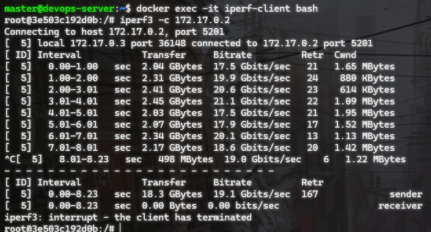

Wynik pomiaru wykazał średni transfer na poziomie 2.04 GB oraz przepustowość (bitrate) około 17.5 Gbits/sec. Oznacza to bardzo wysoką wydajność komunikacji, wynikającą z faktu, że ruch odbywa się w ramach wewnętrznej wirtualnej sieci Dockera i nie jest ograniczany przez fizyczne łącze sieciowe.

---

## 2.3. Własna sieć Docker

Tworzymy sieć:

```bash
docker network create lab-network
```

Usuwamy stare kontenery:

```bash
docker rm -f iperf-server iperf-client
```

Uruchamiamy ponownie:

```bash
docker run -dit \
--network lab-network \
--name iperf-server \
ubuntu:24.04 bash
```

```bash
docker run -dit \
--network lab-network \
--name iperf-client \
ubuntu:24.04 bash
```

W kliencie:

```bash
docker exec -it iperf-client bash
```

Test DNS:

```bash
ping iperf-server
```

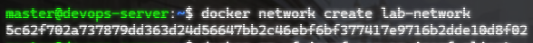

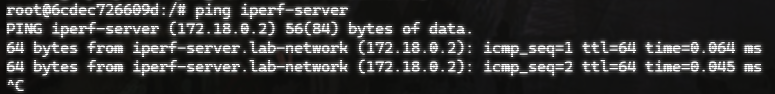

---

# 3. SSHD w kontenerze

Uruchamiamy kontener:

```bash
docker run -it \
-p 2222:22 \
--name ubuntu-ssh \
ubuntu:24.04 bash
```

Instalujemy SSH:

```bash
apt update
apt install -y openssh-server
```

Tworzymy katalog:

```bash
mkdir /run/sshd
```

Ustawiamy hasło:

```bash
passwd
```

Uruchamiamy SSHD:

```bash
/usr/sbin/sshd -D
```

Nowy terminal:

```bash
ssh root@localhost -p 2222
```

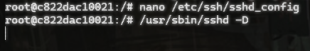

Konfiguracja została zmieniona, aby root mógł się połączyć

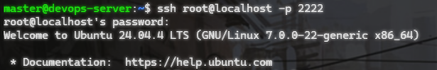

---

# 4. Instalacja Jenkins + Docker-in-Docker

## 4.1. Tworzenie sieci

```bash
docker network create jenkins
```

---

## 4.2. Uruchomienie Docker-in-Docker

```bash
docker run \
--name jenkins-docker \
--detach \
--privileged \
--network jenkins \
--network-alias docker \
-e DOCKER_TLS_CERTDIR=/certs \
-v jenkins-docker-certs:/certs/client \
-v jenkins-data:/var/jenkins_home \
docker:dind
```

---

## 4.3. Uruchomienie Jenkins

```bash
docker run \
--name jenkins \
--detach \
--network jenkins \
-p 8080:8080 \
-p 50000:50000 \
-v jenkins-data:/var/jenkins_home \
-v jenkins-docker-certs:/certs/client:ro \
-e DOCKER_HOST=tcp://docker:2376 \
-e DOCKER_CERT_PATH=/certs/client \
-e DOCKER_TLS_VERIFY=1 \
jenkins/jenkins:lts
```

Sprawdzamy:

```bash
docker ps
```

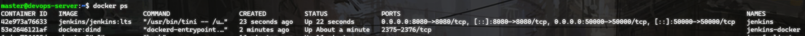

---

## 4.4. Pobranie hasła administratora

```bash
docker exec jenkins \
cat /var/jenkins_home/secrets/initialAdminPassword
```


---

## 4.5. Logowanie do Jenkins

Otwieramy:

```text
http://localhost:8080
```

Przechodzimy kreator konfiguracji.

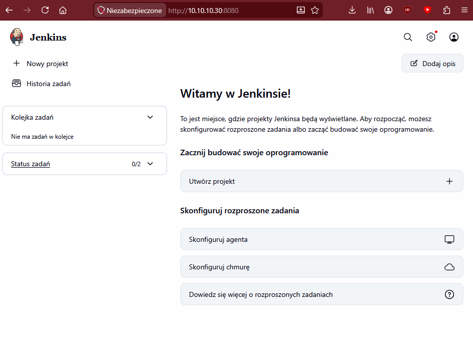
