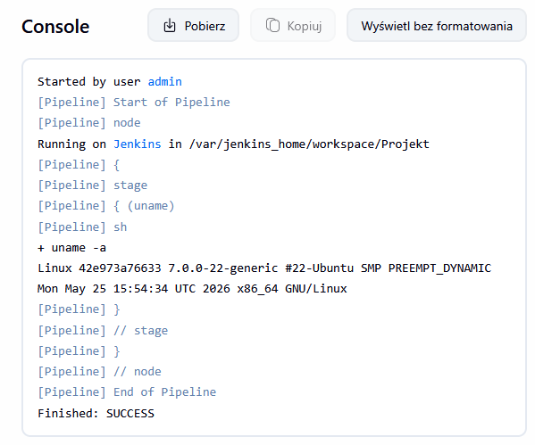
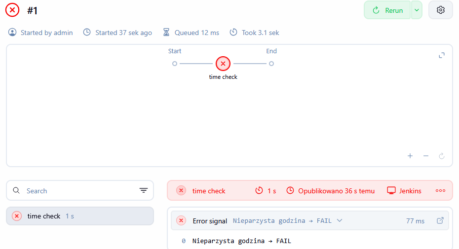
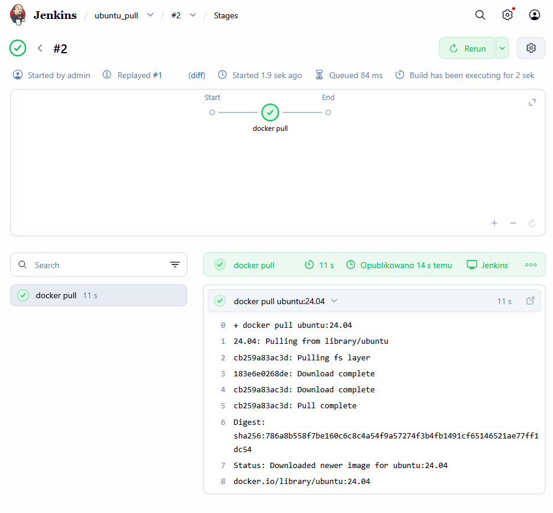
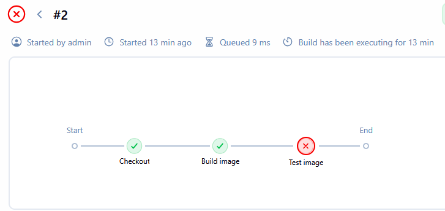
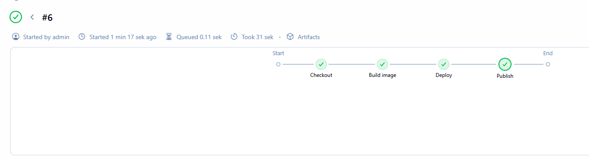

# Sprawozdanie – Jenkins Pipeline (build, test, deploy, publish)

Ćwiczenie zostało wykonane w oparciu o Dockerfile.build/test z zajęć nr.3

---

# 1. Pipeline testowe (wstępne)

Na początku wykonano proste pipeline testowe w Jenkins w celu weryfikacji działania środowiska.

---

## 1.1 uname

Pipeline sprawdzał podstawowe informacje o systemie:



---

## 1.2 Warunek: nieparzysta godzina

Pipeline sprawdzał aktualną godzinę i kończył się błędem, jeśli była nieparzysta:
(Pipeline został uruchomiony o 17:00)

Do tego został wykorzystany step `script`
```
steps {
    script {
        def hour = new Date().format('H') as int

        if (hour % 2 != 0) {
            error("Nieparzysta godzina → FAIL")
        }
    }
}
```



---

## 1.3 docker pull ubuntu

Pipeline pobierał obraz Ubuntu w celu sprawdzenia integracji Jenkins z Docker:



---

# 2. Przygotowanie projektu

W sklonowanym repozytorium na branchu IZ422043 znajdują się pliki dockerfile odpowiedzialne za proces CI:

`Dockerfile.build` – przygotowanie środowiska i budowa projektu 

`Dockerfile.test` – uruchomienie testów jednostkowych

# 2.1. Pipeline Jenkins – konfiguracja

Pipeline został utworzony bezpośrednio w Jenkins (definicja w UI, bez SCM). Wykorzystano istniejące środowisko Docker + DinD.

Pierwszy etap `Checkout` klonuje repozytorium. Następnie z `Dockerfile` znajdującego się w nim uruchamiany jest kontener budujący i testujący

# 2.1. Pipeline Jenkins - definicja etapów BUILD i TEST

Etapy zostały przygotowane następująco:

```
pipeline {
    agent any

    stages {

        stage('Checkout') {
            steps {
                git branch: 'IZ422043', url: 'https://github.com/InzynieriaOprogramowaniaAGH/MDO2026_ITE.git'
            }
        }

        stage('Build image') {
            steps {
                sh '''
                cd ITE/6/IZ422043/Sprawozdanie3
                docker build -f Dockerfile.build -t jest-build .
                '''
            }
        }

        stage('Test image') {
            steps {
                sh '''
                cd ITE/6/IZ422043/Sprawozdanie3
                docker build -f Dockerfile.test -t jest-test .
                docker run --rm jest-test
                '''
            }
        }
    }
}
```

Etapy uruchmiają się poprawnie



# 2.2. Pipeline Jenkins – DEPLOY i PUBLISH

Etap `DEPLOY` uruchamia kontener na podstawie obrazu z `BUILD`

Etap `PUBLISH` archwizuje artefakty pipeline'u

```
stage('Deploy') {
    steps {
        sh '''
        docker run -d --name jest-runtime -p 3000:3000 jest-build
        '''
    }
}

stage('Publish') {
    steps {
        archiveArtifacts artifacts: '**/*', fingerprint: true
    }
}
```



