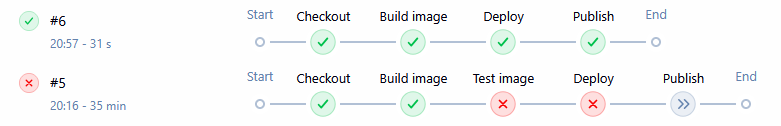
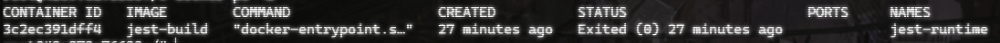

# Sprawozdanie – Pipeline: lista kontrolna

Sprawozdanie stanowi analizę i uporządkowanie dotychczas zbudowanego pipeline CI/CD w Jenkins oraz weryfikację jego zgodności ze ścieżką krytyczną:  
`commit → clone → build → test → deploy → publish`.

Projekt bazuje na kontenerach z zajęć nr 3, w którym wykorzystywany budowany jest framework **Jest**.

---

# 1. Ścieżka krytyczna pipeline

Zaimplementowany pipeline realizuje podstawową ścieżkę CI/CD:

- **commit** – uruchomienie pipeline ręcznie lub po zmianie w repozytorium  
- **clone** – pobranie repozytorium z GitHub  
- **build** – budowa programu i instalacja zależności
- **test** – wykonanie testów jednostkowych w kontenerze  
- **deploy** – uruchomienie aplikacji jako kontener  
- **publish** – archiwizacja artefaktów w Jenkins  



---

# 2. Wybór aplikacji i repozytorium

Wybrano projekt z zajęć nr 3, ponieważ:
- posiada strukturę CI/CD,
- zawiera projekt Node.js,
- zawiera testy jednostkowe
- jest zgodne licencyjnie do użycia edukacyjnego.

---

# 3. Konteneryzacja pipeline

## 3.1 Kontener bazowy (build)

Jako środowisko build wykorzystano kontener zdefiniowane przez `Dockerfile.build` z zajęć nr 3

---

## 4.2 Build w osobnym kontenerze

Build wykonywany jest w izolowanym kontenerze Docker poprzez Jenkins:

```
docker build -f Dockerfile.build -t jest-build .
```

## 4.3 Test w osobnym kontenerze

Testy wykonywane są w osobnym kontenerze:

```
docker build -f Dockerfile.test -t jest-test .
docker run --rm jest-test
```

---

# 5. Deploy w osobnym kontenerze

Deploy uruchamia kontener z gotową aplikacją

```
docker run -d --name jest-runtime -p 3000:3000 jest-build
```
Jest on środowiskiem runtime oddzielonym od build i testu

---

# 6. Weryfikacja działania

Sprawdzono działanie kontenera



---


# 7. Publish – artefakty

Publikowanym artefaktem jest wynik buildu (kontener jest-build)

## 7.1 Pochodzenie artefaktu

Każdy artefakt jest identyfikowalny poprzez:
- numer buildu Jenkins
- fingerprint artefaktu
- hash obrazu Docker

---

# 8. Pipeline jako kod (SCM)

Definicja pipeline została przeniesiona do repozytorium jako `Jenkinsfile`.

Dzięki temu:
- pipeline nie jest definiowany w UI Jenkins,
- definicja jest wersjonowana razem z kodem,
- każda zmiana pipeline jest śledzona w Git.

---

# 9. Aktualność kodu (clone / checkout)

Pipeline zawsze pobiera aktualną wersję kodu z repozytorium przy każdym uruchomieniu.

Oznacza to:
- brak cache lokalnego Jenkins,
- każdorazowe wykonanie `checkout SCM`,
- gwarancję pracy na najnowszym commitcie.


# 10. Etap BUILD

Etap `build` używa plików Dockerfile.build z repozytorium i tworzy obraz buildowy

---

# 11. Etap TEST

Etap `test` używa plików Dockerfile.test z repozytorium i przeprowadza testy na artefakcie etapu BUILD

---

# 12. Etap DEPLOY

Etap `deploy` używa artefaktu etapu BUILD i uruchamia aplikację w kontenerze