# Sprawozdanie 1-4

Przemysław Wrona 420474 ITE

## L1
Używam multipass do zarządzania VM, backend virtualbox, czyli to tak naprawdę przykrywka pod shell. Próbowałem żeby działało z hypervisorem windowsowym ale nie działało.
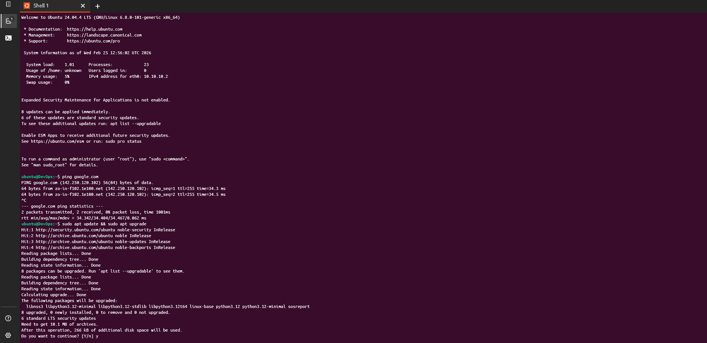
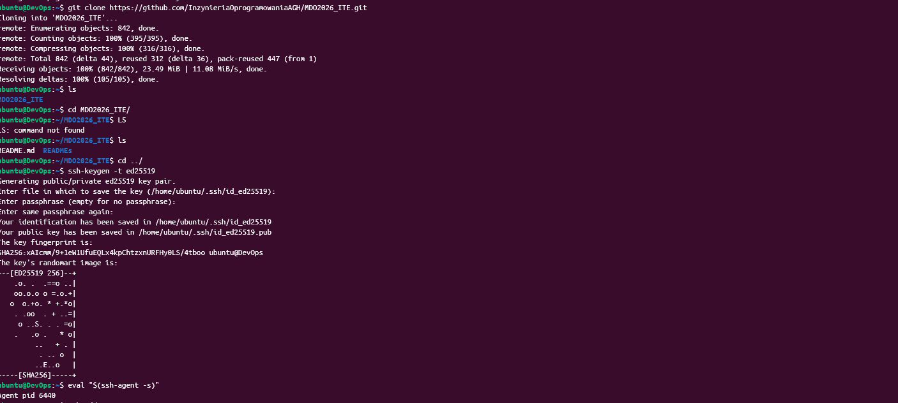
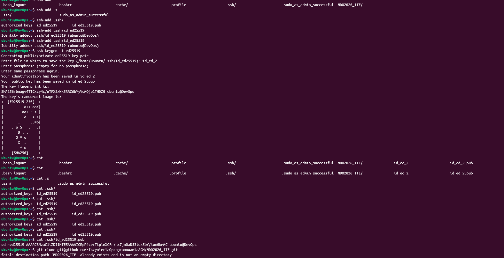
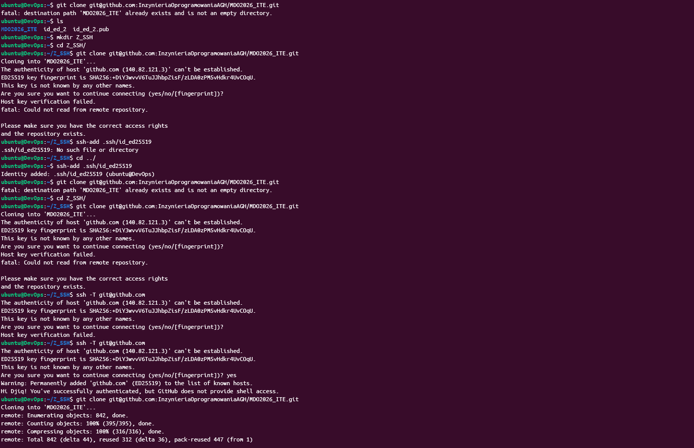
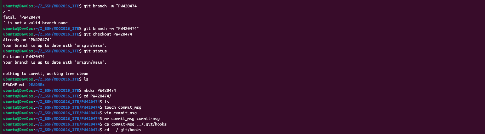
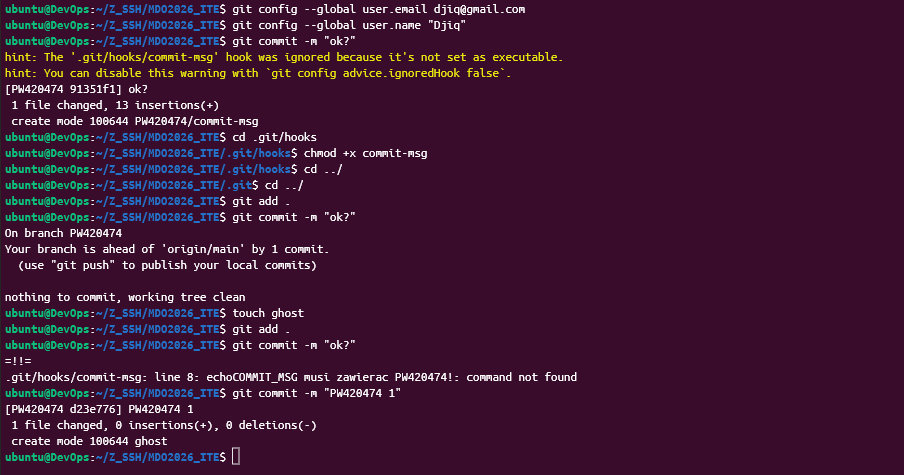
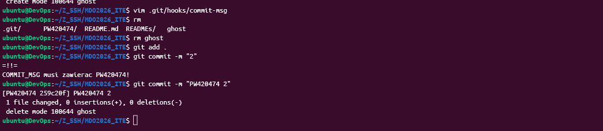
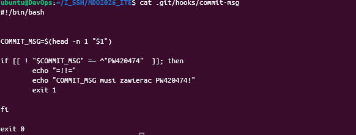
Zrobione troche pozniej \/ (Nie mam zdjęc jak ustawialem to bo to bylo dawno temu)
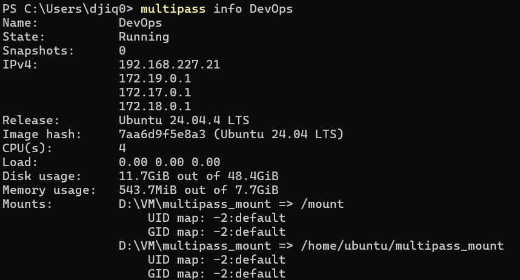

```bash
#!/bin/bash


COMMIT_MSG=$(head -n 1 "$1")

if [[ ! "$COMMIT_MSG" =~ ^"PW420474"  ]]; then
        echo "=!!="
        echo"COMMIT_MSG musi zawierac PW420474!"
        exit 1

fi

exit 0
```
```
FROM ubuntu:latest
RUN apt-get update && \
    apt-get install -y git curl && \
    apt-get clean && \
    rm -rf /var/lib/apt/lists/*
WORKDIR /workspace
RUN git clone https://github.com/InzynieriaOprogramowaniaAGH/MDO2026_ITE.git
CMD ["/bin/bash"]

```


## L2

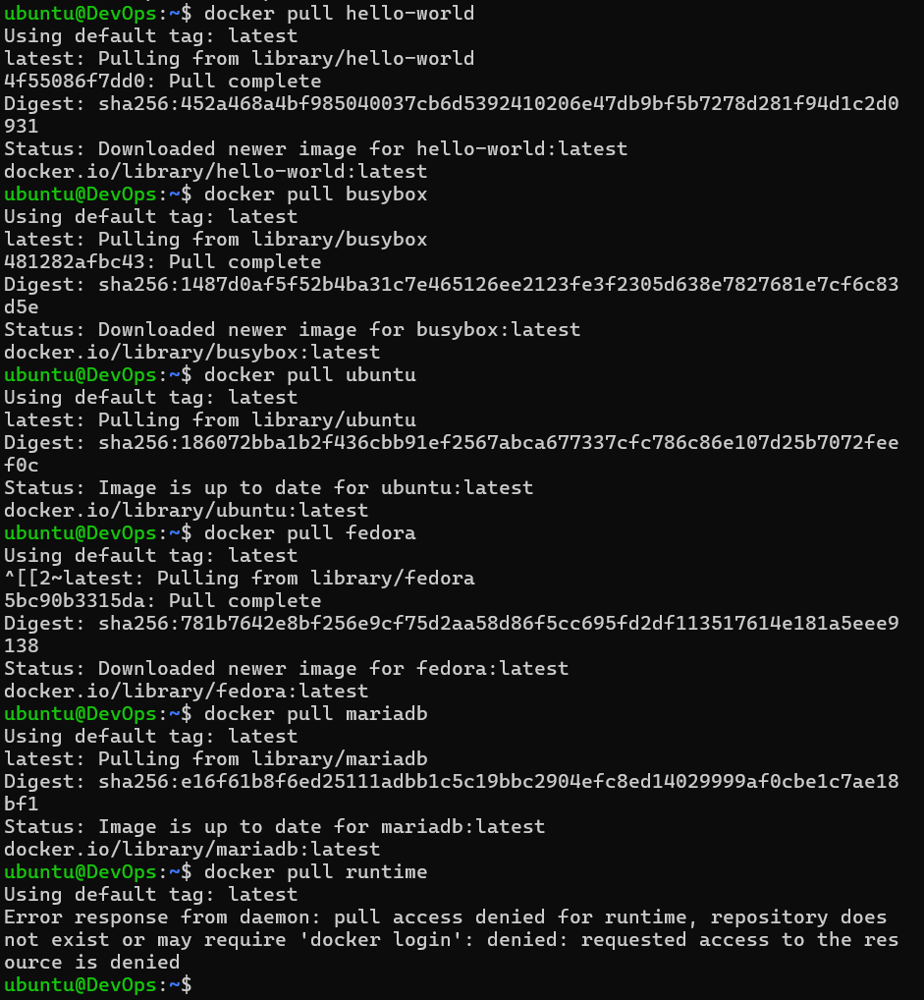
Tutaj male zamieszanie (pliki sdk,aspnet i runtime trzeba pobrac z mirrora microsoftowego)
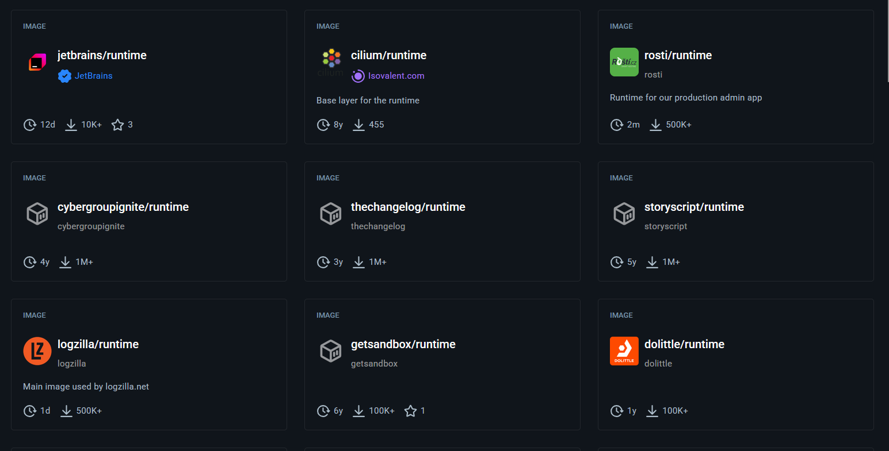
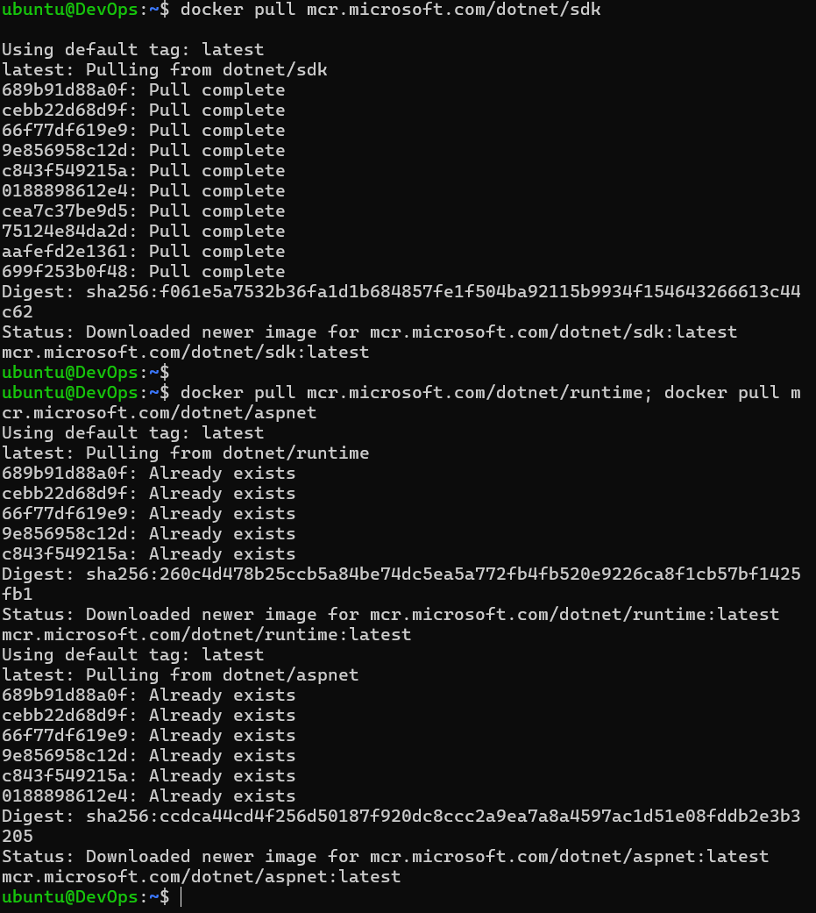
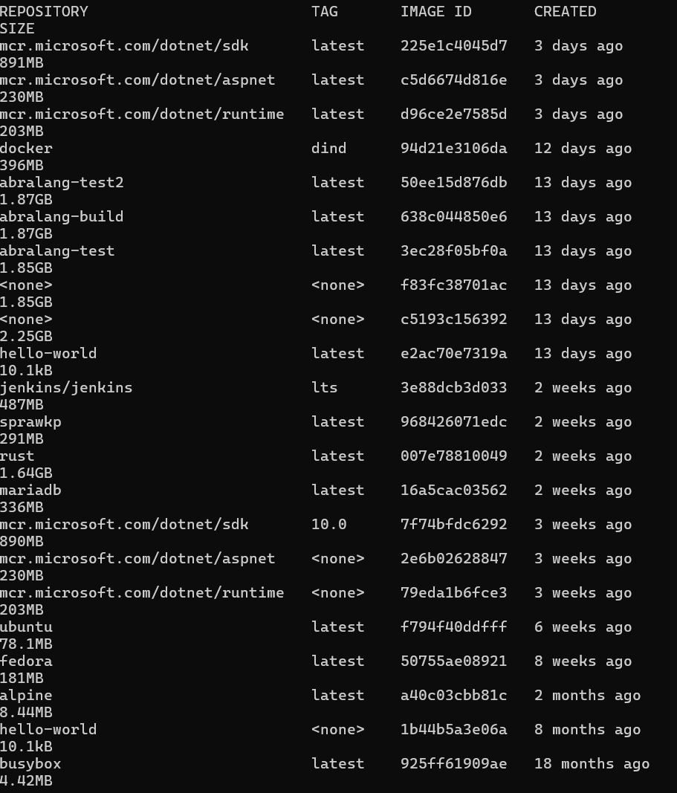
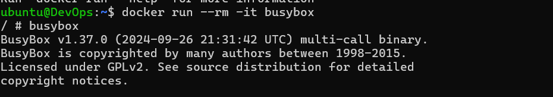
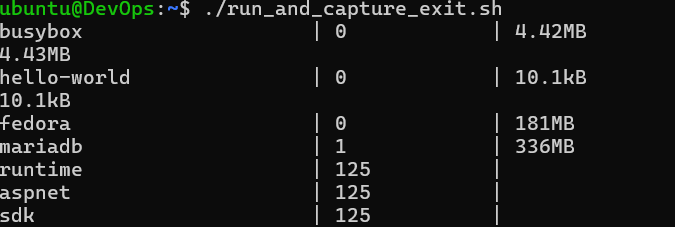
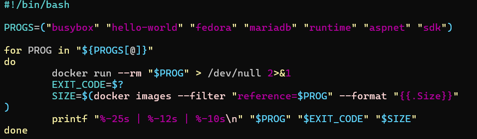
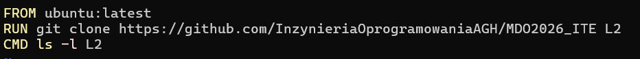
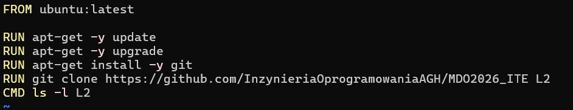
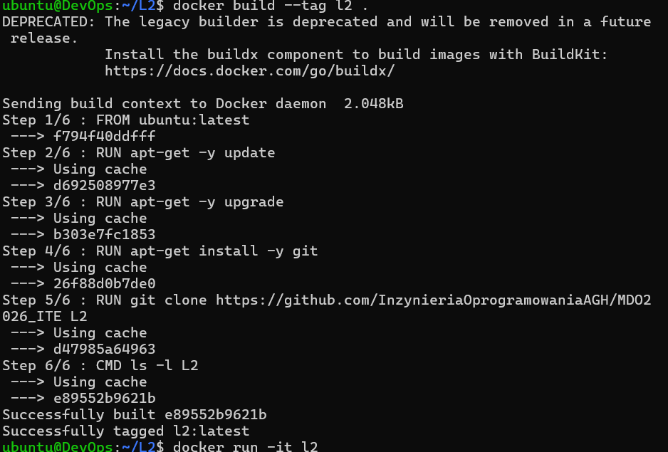
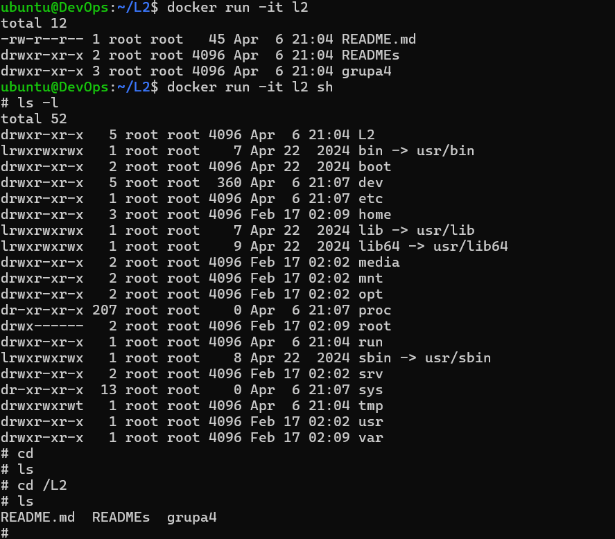

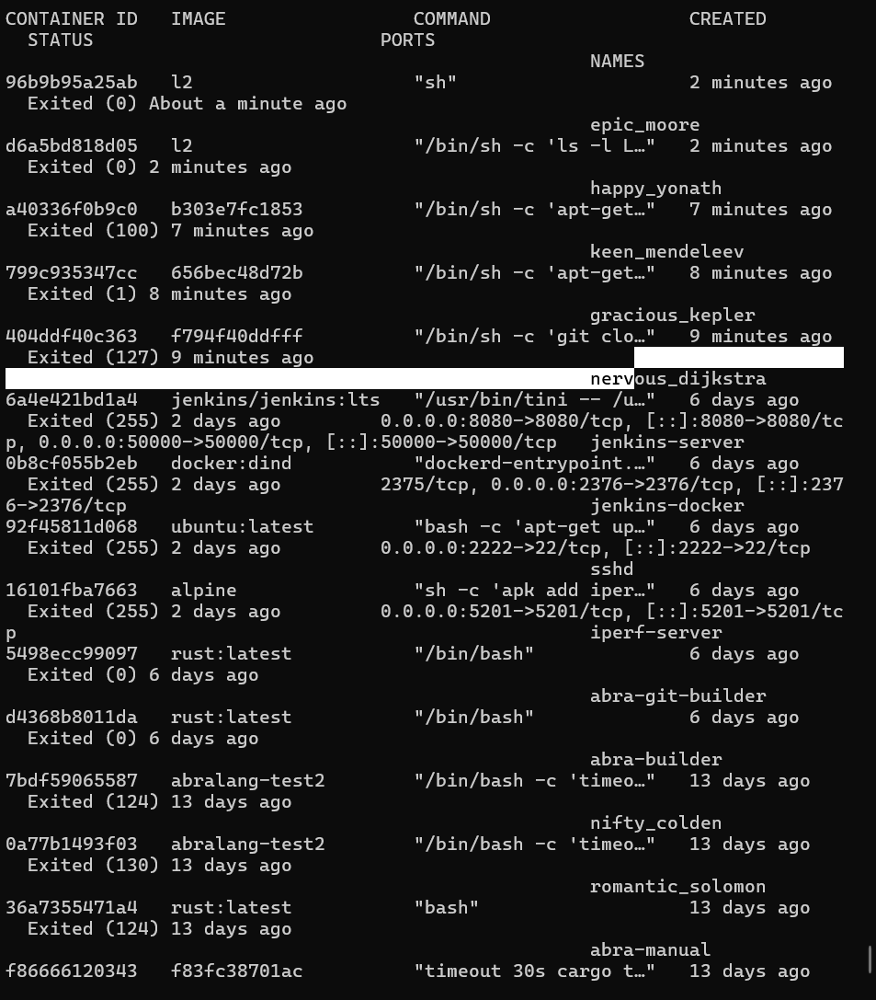

```bash
FROM ubuntu:latest

RUN apt-get -y update
RUN apt-get -y upgrade
RUN apt-get install -y git
RUN git clone https://github.com/InzynieriaOprogramowaniaAGH/MDO2026_ITE L2
CMD ls -l L2
```

## L3


 
 
 
 
 
 
 
 
 

 
 
 
 
 
 
 


### Dyskusja L3
 * "czy program nadaje się do wdrażania i publikowania jako kontener, czy taki sposób interakcji nadaje się tylko do builda?"
    * Abralang to kompilator więc może mieć zastosowanie w cyklu budowania innych skonteneryzowanych aplikacji, ale do lokalnej deweloperki lepiej zainstalować systemowo
 * "jeżeli program miałby być publikowany jako kontener - czy trzeba go oczyszczać z pozostałości po buildzie?"
    * Tak trzeba, jedyne co potrzebne w image'u jest binarka w tym przypadku.
 * "A może dedykowany *deploy-and-publish* byłby oddzielną ścieżką (inne Dockerfiles)?"
    * Tak to docelowo byłaby jedna z możliwości, przy każdym bumpie semver by CI/CD pipeline automatycznie uploadował artefakty na serwer włącznie z binarkami systemowymi (poza image'ami dockerowymi).
 * "Czy zbudowany program należałoby dystrybuować jako pakiet, np. JAR, DEB, RPM, EGG?"
    * Docelowo statyczny ELF i EXE, dystrybucje na linuxie - PKGBUILD, DEB, RPM i AppImage oraz wszech-dostępne buid-it-yourself. (dystrybucje poza "build it yourself" nie są na ten moment dostępne dla tego kompilatora jako że to projekt hobbystyczny :D )

 


## L4 


Czy sshd w dockerze ma sens? Tak ma niszowe zastosowanie, umiem sobie wyobrazić sytuację gdzie na przykład z jakiegoś powodu nie mogę usunąc kontenera (np.: jakiś serwer z danymi w ramie), ale jest problem z configiem. W takiej sytuacji zostaje nam ssh, lub docker attach, ale to jest nie dostępne jeżeli klucze do hosta ma tylko 1 osoba, a do serwera ma więcej osób, wtedy zostaje tylko ssh


