# L11

### Przygotowanie obrazów
* **Budowa i transfer (12-16):** Przygotowanie wersji `v3` oraz celowo wadliwego obrazu `err` opartego na `/bin/false`. Obrazy zostały załadowane do lokalnego rejestru minikube.
  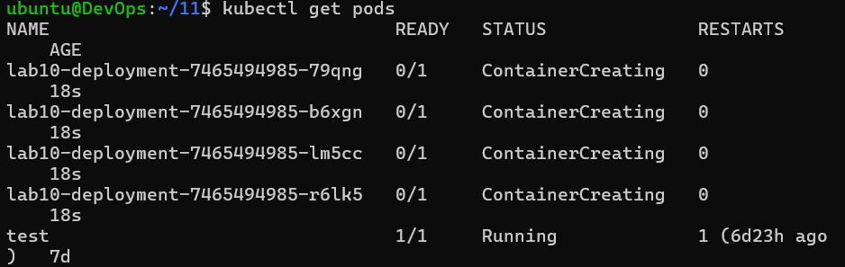 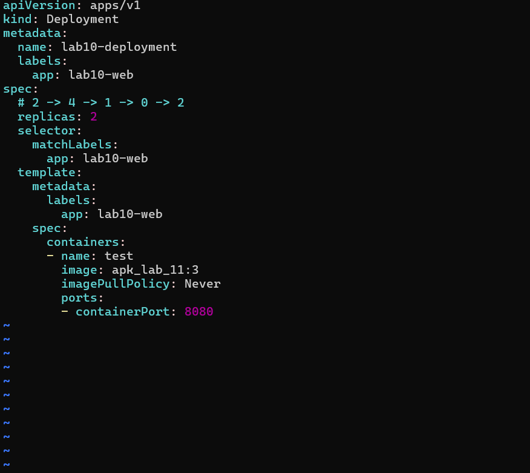 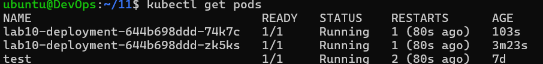

### Skalowanie i cykl życia wdrożenia
* **Zarządzanie replikami (1-2, 17-24):** Deklaratywne skalowanie deploymentu (zakres 0-6 replik) poprzez modyfikację pól `replicas` w pliku YAML.
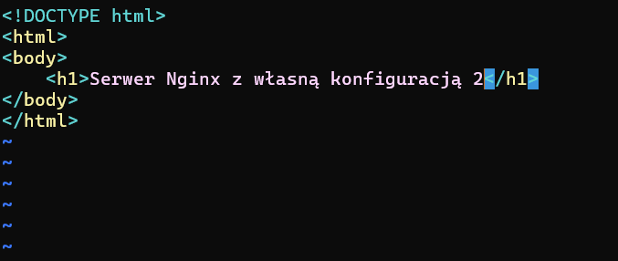  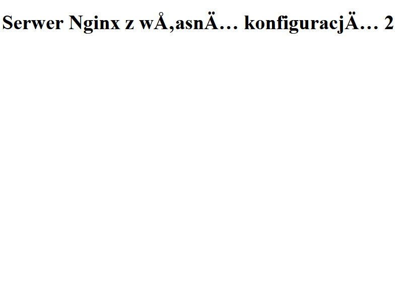  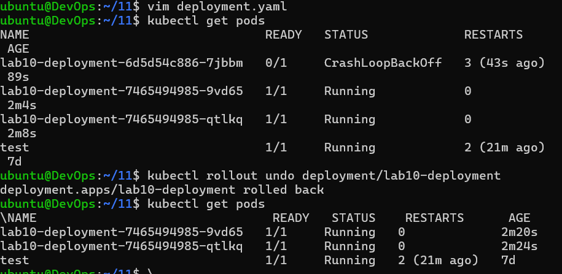  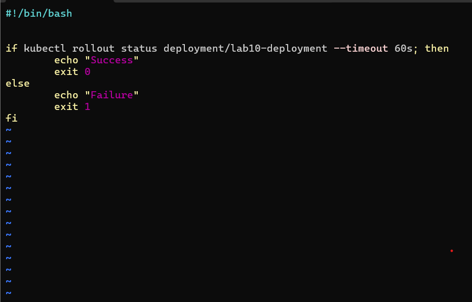   

### Weryfikacja i obsługa błędów
* **Działanie usługi (3):** Potwierdzenie poprawnej serwacji treści przez Nginx z customową konfiguracją.

* **Obsługa awarii (4, 25, 5):** Symulacja błędu wdrożenia (obraz `err`) skutkująca statusem `CrashLoopBackOff`, a następnie przywrócenie stabilnej wersji przez `rollout undo`.
  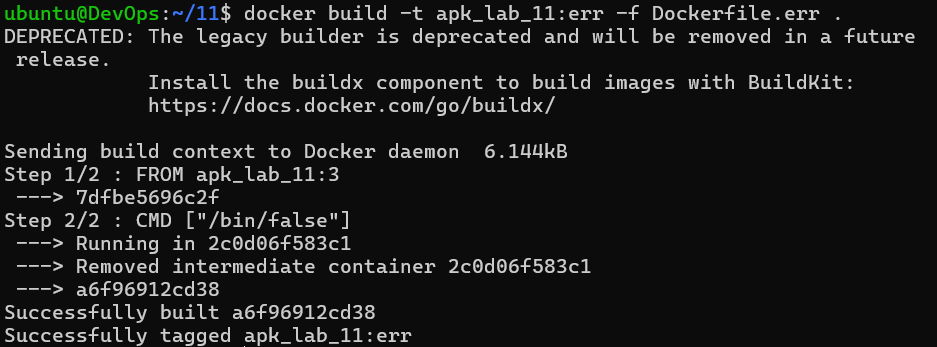

### Automatyzacja i strategie
* **Healthcheck (6-7):** Skrypt bash weryfikujący status wdrożenia w zadanym oknie czasowym (60s).
 
* **Strategie (8-10):** Implementacja strategii `Recreate` oraz `RollingUpdate` z limitami dostępności. Na koniec wdrożenie typu `Canary` z podziałem ruchu na wersje `stable` i `canary`.
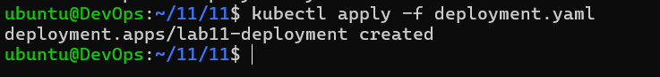 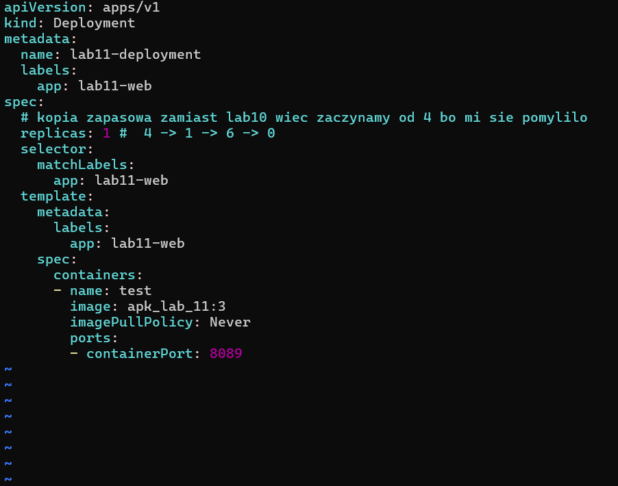 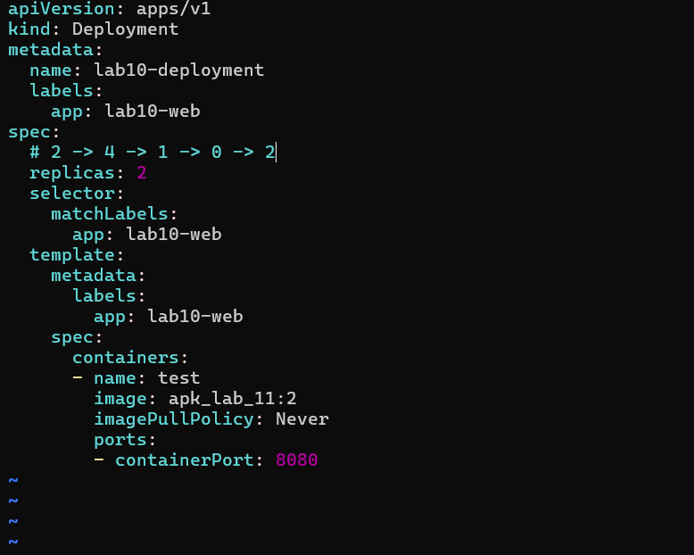

### Czemu serwis?

Ten serwis pozwala nam podzielić ruch pomiędzy różne pody, (balansowanie ruchu) oraz pozwala nam serwować eksperymentalne i nowe funkcjonalności bez wpływania na głowny ruch, co pozwala nam testować i eksperymentować z udziałem odbiorców naszego serwisu.
