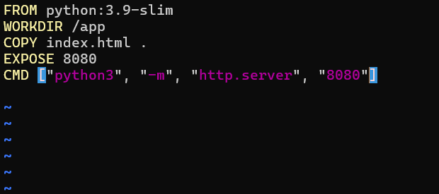
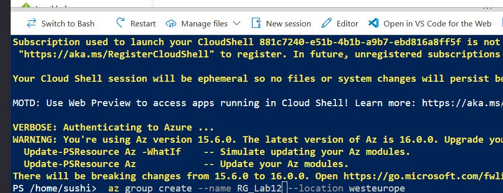
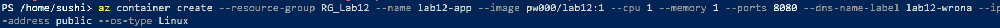
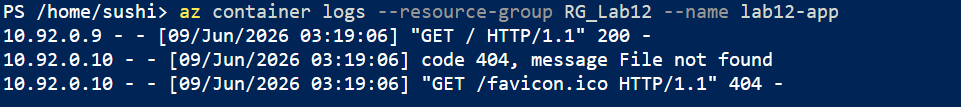
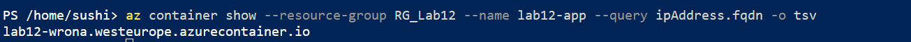
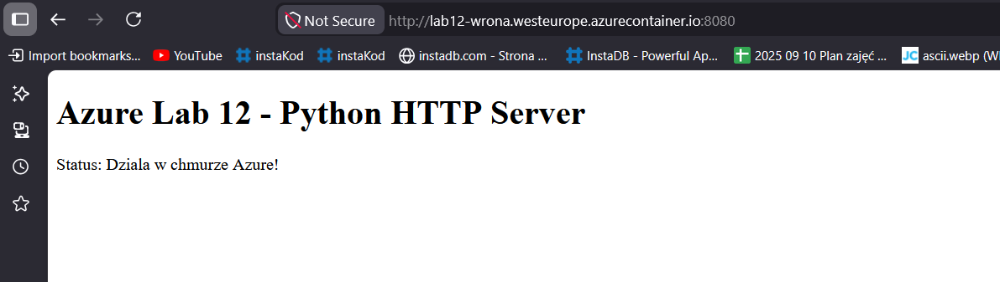

# L12
Przemysław Wrona ITE 420474

### Przygotowanie kontenera
* **Budowa obrazu (1-3):** Przygotowano własny obraz Docker oparty na `python:3.9-slim` serwujący prostą stronę HTML przez wbudowany serwer HTTP na porcie 8080. Obraz otagowano jako `pw000/lab12:1` i opublikowano na Docker Hub.

### Wdrożenie w Azure Container Instances
* **Tworzenie resource group i kontenera (4, 6):** Przez Azure Cloud Shell (PowerShell) utworzono resource group `RG_Lab12` w lokalizacji `westeurope`, a następnie wdrożono kontener `lab12-app` z obrazu `pw000/lab12:1` z publicznym adresem IP i etykietą DNS `lab12-wrona`.

### Weryfikacja działania
* **Dostęp HTTP i logi (5, 7, 8, 9):** Kontener osiągalny zarówno po publicznym IP (`20.4.183.1:8080`) jak i przez przydzieloną nazwę FQDN (`lab12-wrona.westeurope.azurecontainer.io:8080`). Logi potwierdziły odbieranie żądań HTTP GET.

### Sprzątanie zasobów
* **Usunięcie resource group (10):** Po zakończeniu ćwiczenia usunięto całą resource group `RG_Lab12` poleceniem `az group delete`, zwalniając wszystkie zasoby i zapobiegając naliczaniu kosztów.

