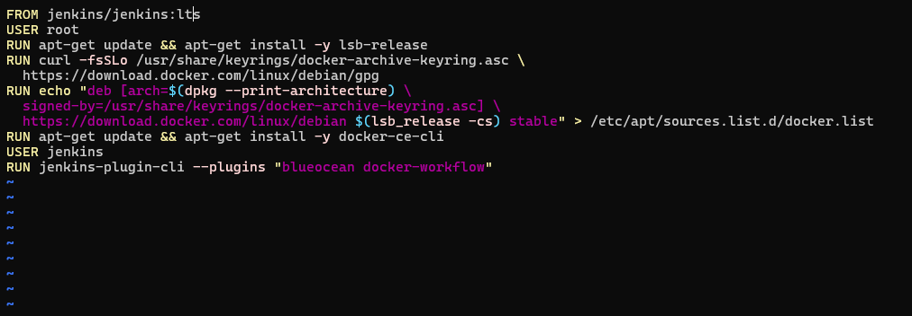
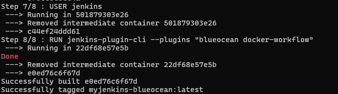
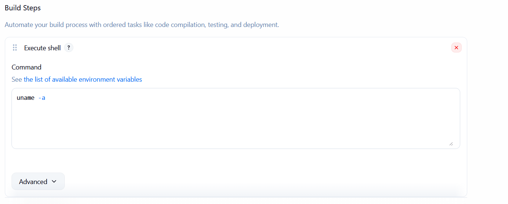
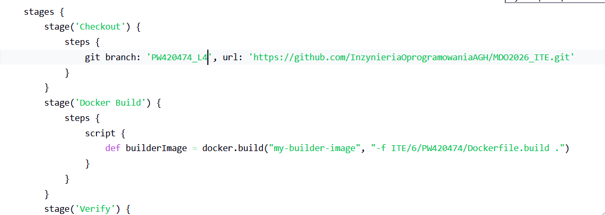
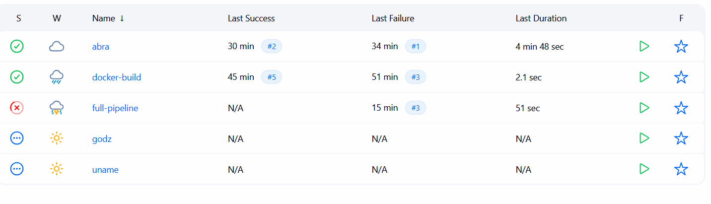
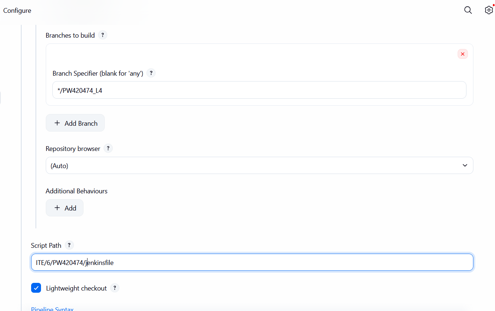

# Sprawozdanie 5 - 7

## Przemysław Wrona ITE 420474

We wstępie chciałem bardzo przeprosić za spóźnienia związane z rzeczami zadanymi podczas tych zajęć, mam problemy z insomnią i melancholią jakoś tak wypadło przepraszam jeszcze raz.

## L5

Okej więc na początku trzeba było zainstalować blueocean, jest to rozbudowana wersja jenkinsa z możliwością wizualizacji pipelineów.

Tutaj dockerfile


Tutaj że zbudowało się


Trochę mniej zdjęć dzisiaj, głównie jenkinsfile będą tutaj wisieć.
Wydaje mi się że pokazywanie po koleji jak klikam w guziki na stronie internetowej jest uważane za trywialne, więc pominąłem wklejanie tych kroków do sprawozdania.

Trzeba zrobić 3 pipeliney, każdy z nich trywialny.



i trzeci testowanie czy DIND działa, u mnie działa, docker-build := docker pull ubuntu:latest


### Sekcja QnA L5

 - Czym różni się obraz Jenkins od Jenkins Blueocean?

    Blue Ocean zawiera nowoczesny interfejs graficzny dla Pipeline oraz preinstalowane wtyczki docker-workflow do obsługi kontenerów.

 - DIND vs Local Docker (mapowanie socketu)?

    DIND oferuje pełną izolację buildów od hosta. Mapowanie socketu /var/run/docker.sock jest szybsze (wspólny cache), ale mniej bezpieczne.

 - Czy program (AbraLang) powinien być zapakowany?

    Tak. Najlepiej jako obraz Docker (kompletne środowisko) lub archiwum tar.gz (binarka Rust), aby uniknąć instalacji Cargo na produkcji.

 - Różnica między obrazem pełnym a slim?

    Pełny (np. rust:latest) zawiera kompilatory i narzędzia builda (~1GB). Slim (np. debian:slim) zawiera tylko biblioteki uruchomieniowe (~100MB), co zwiększa bezpieczeństwo i szybkość wdrożenia.

## L6

Tutaj checklista i jenkinsfile,


- [x] Aplikacja została wybrana (Abralang)
- [x] Licencja potwierdza możliwość swobodnego obrotu kodem na potrzeby zadania (Posiadam na własność)
- [x] Wybrany program buduje się (Tak)
- [50/50] Przechodzą dołączone do niego testy (Przechodzą na windows (usunę te co sie wykrzaczają na linux i będą działać))
- [x] Zdecydowano, czy jest potrzebny fork własnej kopii repozytorium (To jest moja kopia repozytorium)
- [x] Stworzono diagram UML zawierający planowany pomysł na proces CI/CD = {
```
graph TD
    A[Commit / Manual Trigger] --> B[Clone Repo & Clean Workspace]
    B --> C[Build: Dockerfile.build]
    C --> D[Test: Dockerfile.test - oparty na Buildzie]
    D --> E{Testy OK?}
    E -- Tak --> F[Deploy: Uruchomienie kontenera Sandbox]
    F --> G[Smoke Test: curl localhost:8080]
    G -- Sukces --> H[Publish: Archiwizacja .tar.gz i Tagowanie obrazu]
    E -- Nie --> I[Fail: Raport i Logi]
```
}
- [x] Wybrano kontener bazowy lub stworzono odpowiedni kontener wstepny (runtime dependencies) - do kompilacji rust, do wdrożenia cokolwiek slim, np.: debian, nie potrzebujemy kompilatora do operowania już skompilowanym programem.
- [x] *Build* został wykonany wewnątrz kontenera
- [x] Testy zostały wykonane wewnątrz kontenera (kolejnego)
- [x] Kontener testowy jest oparty o kontener build
- [x] Logi z procesu są odkładane jako numerowany artefakt, niekoniecznie jawnie
- [x] Zdefiniowano kontener typu 'deploy' pełniący rolę kontenera, w którym zostanie uruchomiona aplikacja (niekoniecznie docelowo - może być tylko integracyjnie)
- [x] Uzasadniono czy kontener buildowy nadaje się do tej roli/opisano proces stworzenia nowego, specjalnie do tego przeznaczenia
- [x] Wersjonowany kontener 'deploy' ze zbudowaną aplikacją jest wdrażany na instancję Dockera
- [x] Następuje weryfikacja, że aplikacja pracuje poprawnie (*smoke test*) poprzez uruchomienie kontenera 'deploy'
- [x] Zdefiniowano, jaki element ma być publikowany jako artefakt
- [x] Uzasadniono wybór: kontener z programem, plik binarny, flatpak, archiwum tar.gz, pakiet RPM/DEB
- [x] Opisano proces wersjonowania artefaktu (można użyć *semantic versioning*)
- [x] Dostępność artefaktu: publikacja do Rejestru online, artefakt załączony jako rezultat builda w Jenkinsie
- [x] Przedstawiono sposób na zidentyfikowanie pochodzenia artefaktu
- [x] Pliki Dockerfile i Jenkinsfile dostępne w sprawozdaniu w kopiowalnej postaci oraz obok sprawozdania, jako osobne pliki
- [x] Zweryfikowano potencjalną rozbieżność między zaplanowanym UML a otrzymanym efektem

Tutaj jenkinsfile który potwierdza zawarte wyżej punkty
```
pipeline {
    agent any
    options {
        skipDefaultCheckout()
    }
    environment {
        DIR = "ITE/6/PW420474"
        B_IMG = "abralang-build:${env.BUILD_ID}"
        T_IMG = "abralang-test:${env.BUILD_ID}"
    }
    stages {
        stage('Clone & Clean') {
            steps {
                deleteDir()
                checkout scm
            }
        }
        stage('Build') {
            steps {
                script {
                    docker.build(B_IMG, "-f ${DIR}/Dockerfile.build .")
                }
            }
        }
        stage('Test') {
            steps {
                script {
                    docker.build(T_IMG, "--build-arg BASE_IMAGE=${B_IMG} -f ${DIR}/Dockerfile.test .")
                    sh "docker run --rm ${T_IMG} > test.log"
                }
            }
            post { always { archiveArtifacts 'test.log' } }
        }
        stage('Deploy') {
            steps {
                script {
                    sh "docker run -d --name abr-svc -p 8080:8080 ${B_IMG}"
                    sh "sleep 5 && curl -sI http://docker:8080 | grep '200 OK'"
                    sh "docker stop abr-svc && docker rm abr-svc"
                }
            }
        }
        stage('Publish') {
            steps {
                script {
                    sh "docker tag ${B_IMG} abralang:latest"
                    sh "docker save abralang:latest | gzip > abralang-${env.BUILD_ID}.tar.gz"
                    archiveArtifacts artifacts: "*.tar.gz", fingerprint: true
                }
            }
        }
    }
}
```

### L6 QnA

- Czy kontener buildowy nadaje się do roli kontenera Deploy?

    Nie. Jest zbyt duży i zawiera kody źródłowe. Na produkcję należy wysłać odchudzony obraz runtime z samą binarką.

 - Jaki element publikować jako artefakt?

    Wersjonowany obraz Docker oraz paczkę .tar.gz. Umożliwia to elastyczne wdrożenie (kontenerowe lub bezpośrednie).

 - Jak zidentyfikować pochodzenie artefaktu?

    Przez tagowanie: abralang:${BUILD_NUMBER} oraz metadane wewnątrz binarki (commit hash).

## L7


- [x] **Przepis dostarczany z SCM:** Pipeline jest konfigurowany w Jenkinsie jako "Pipeline from SCM" wskazujący na plik `ITE/6/PW420474/jenkinsfile`.


- [x] **Skuteczne sprzątanie:** Użycie `deleteDir()` na początku etapu `Clone & Clean` gwarantuje brak artefaktów z poprzednich buildów i czysty start.
- [x] **Dostęp do repozytorium:** Etap `Build` posiada pełny kontekst repozytorium po wykonaniu kroku `checkout scm`.
- [x] **Obraz buildowy (BLDR):** Tworzony jest obraz `abralang-build:${env.BUILD_ID}`, który służy jako baza dla dalszych kroków.
- [x] **Przygotowanie artefaktu:** W etapie `Publish` binarka jest pakowana do `tar.gz`, a obraz tagowany do wersji release.
- [x] **Etap Test:** Testy `cargo test` są wykonywane w dedykowanym kontenerze `abralang-test`, bazującym na warstwach obrazu buildowego.
- [x] **Przygotowanie wdrożenia:** Etap `Deploy` weryfikuje obraz pod kątem poprawności `ENTRYPOINT` i dostępności usług.
- [x] **Przebieg wdrożenia:** Aplikacja jest uruchamiana w sandboxowym kontenerze `abr-check`, co symuluje wdrożenie produkcyjne.
- [x] **Etap Publish:** Artefakt `.tar.gz` jest archiwizowany w Jenkinsie, a obraz otrzymuje tag `abralang:1.0.${BUILD_ID}`.
- [x] **Powtarzalność:** Unikalne nazwy kontenerów (z użyciem `${env.BUILD_ID}`) oraz czyszczenie katalogu pozwalają na wielokrotne, bezkonkurencyjne uruchamianie pipeline'u.

### L7 QnA

**1. Czy opublikowany obraz może być uruchomiony bez modyfikacji?**
*   **Tak.** Obraz `abralang:1.0.${BUILD_ID}` zawiera skompilowaną binarkę oraz zdefiniowany `ENTRYPOINT`. Po pobraniu obrazu z rejestru (lub załadowaniu z pliku), polecenie `docker run -p 8080:8080 abralang:1.0.X` uruchamia w pełni funkcjonalną usługę bez dodatkowej konfiguracji.

**2. Czy pobrany artefakt zadziała od razu na docelowej maszynie?**
*   **Tak.** Artefakt `abralang-${BUILD_ID}.tar.gz` zawiera binarkę skompilowaną w trybie `--release`. Na maszynie o zbliżonej konfiguracji (np. `ansible-target` z tym samym OS), rozpakowanie i uruchomienie pliku binarnego skutkuje natychmiastowym działaniem aplikacji. W przypadku obrazu Docker, izolacja gwarantuje działanie na każdym systemie z zainstalowanym silnikiem Docker.
